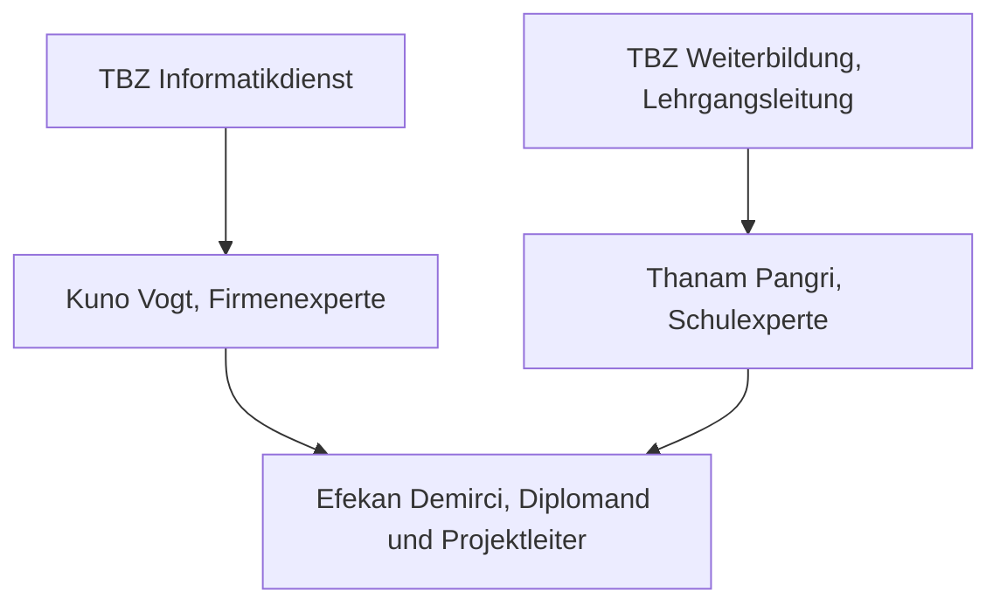
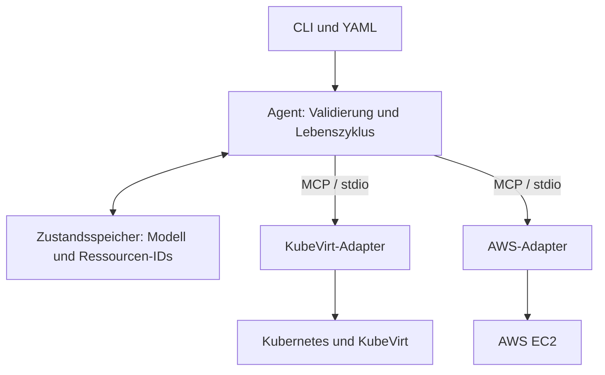

# Diplomarbeit: Agentenbasierte Hybrid-Cloud-Bereitstellung von Lernumgebungen mit Kubernetes, KubeVirt und MCP

!!! info "Lesehinweis"
    Arbeitsstand vom 18.09.2026. Die Infrastrukturaufnahme und erste Referenzversuche liegen vor. Agent, Adapter und formale Vergleichsmessungen sind noch offen. Planung und Entwürfe sind als solche gekennzeichnet.

| | |
| --- | --- |
| Diplomand | Efekan Demirci, ITCNE24, TBZ Höhere Fachschule |
| Auftraggeber | Technische Berufsschule Zürich, Informatikdienst |
| Firmenexperte | Kuno Vogt, Leiter Informatikdienst TBZ |
| Schulexperte | Thanam Pangri, HF-Lehrgangsleitung |
| Bewilligter Zeitraum | 11.09.2026 bis 18.12.2026 |
| Arbeitsplanung | 14.09.2026 bis 18.12.2026 |
| Version | 0.2, Arbeitsstand |
| Grundlage | Bewilligte Projektbeschreibung vom 10.09.2026; schulische Vorgaben gemäss gültigem Merkblatt |

---

## Management Summary

> Wird am Projektende verfasst und zusätzlich als separates Dokument mit unterschriebenem Ehrenwort abgegeben. Grundlage ist das Management Summary aus der bewilligten Projektbeschreibung vom 10.09.2026.

---

## 1 Einleitung

### 1.1 Ausgangslage

Die Technische Berufsschule Zürich stellt für den Unterricht digitale Übungsumgebungen bereit, in denen Lernende praktische technische Aufgaben durchführen. Diese Lernumgebungen werden heute auf einer lokalen Plattform mit MAAS, LernMAAS, Konfigurationsdateien und Shellskripten bereitgestellt. Das Verfahren ist im Betrieb etabliert und bleibt während der gesamten Diplomarbeit unverändert verfügbar.

Die fachliche Beschreibung einer Lernumgebung und ihre technische Bereitstellung sind dabei eng mit dieser Plattform verbunden. Soll dieselbe Lernumgebung auf einer anderen Infrastruktur entstehen, müssen Abläufe, Schnittstellen und Skripte separat angepasst oder neu entwickelt werden. Daraus ergeben sich zusätzlicher manueller Aufwand, eine stärkere Abhängigkeit von spezifischem Wissen einzelner Personen und eine eingeschränkte Wiederverwendbarkeit der bestehenden Beschreibungen.

### 1.2 Problemstellung

Es fehlt ein einheitliches Modell, mit dem eine Lernumgebung unabhängig von der gewählten Plattform beschrieben und über einen gemeinsamen Ablauf verwaltet werden kann. Ohne ein solches Modell bleibt die fachliche Beschreibung an eine einzelne technische Umsetzung gebunden.

Vor einer möglichen späteren Weiterentwicklung der lokalen Lernplattform soll deshalb geklärt werden, ob ein plattformübergreifender Ansatz technisch machbar ist und gegenüber dem heutigen Vorgehen einen nachvollziehbaren Mehrwert bietet.

### 1.3 Zielbild

Eine Lernumgebung wird einmal fachlich beschrieben und über denselben Lebenszyklus entweder lokal oder in der Public Cloud verwaltet. Die Bedienlogik bleibt auf beiden Zielplattformen gleich, während die plattformspezifische Umsetzung davon getrennt ist. Der Ablauf soll reproduzierbar und messbar sein und ohne manuelle technische Entscheidungen auskommen.

Der Proof of Concept liefert damit eine Entscheidungsgrundlage für eine mögliche spätere Weiterentwicklung, ohne die bestehende produktive Umgebung zu verändern.

### 1.4 Zielsetzungen und Erfolgskriterien

Die fünf Teilziele aus der bewilligten Projektbeschreibung bestimmen den Umfang. Im Review wird ihr Nachweisstand geprüft.

| ID | Ziel | Messkriterium | Zielwert | Nachweis | Status |
| --- | --- | --- | --- | --- | --- |
| Z1 | Plattformneutrales Modell für Lernumgebungen | Versioniertes YAML-Modell mit JSON-Schema, gültige Definition wird akzeptiert, ungültige abgewiesen | 1 Modell, 1 Schema, je 1 positiver und 1 negativer Testfall bestehen | Repository, Testprotokoll | Offen |
| Z2 | Zentraler Agent mit Zustandsführung | create, status, reset und delete laufen über festgelegte Zustandsübergänge, Zustand ist persistent | 4 Operationen funktionsfähig, reset erzeugt aus derselben Definition neu | Quellcode, Zustandsdiagramm, Testprotokoll | Offen |
| Z3 | On-Prem-Backend mit Kubernetes und KubeVirt | Test-Lernumgebung wird automatisiert bereitgestellt und vollständig entfernt | 3 vollständige Durchläufe ohne manuelle Korrektur | Laufprotokolle, Screenshots | Offen |
| Z4 | Bewertung der MCP-basierten Adapterarchitektur | Dieselbe Definition läuft lokal und auf genau einer Public Cloud, Bewertung gegen direkte API-Anbindung | 3 vollständige Durchläufe in der Cloud, Bewertung nach 5 Kriterien dokumentiert | Laufprotokolle, Bewertungstabelle | Offen |
| Z5 | Messbarer Vergleich mit dem heutigen Vorgehen | Bereitstellungszeit, manuelle Eingriffe, Reproduzierbarkeit, vollständiger Abbau | Vorher- und Nachher-Werte für denselben Testfall protokolliert | Messprotokoll, Vergleichstabelle | Offen |

Die vorhandenen Machbarkeitsversuche erfüllen diese Ziele noch nicht vollständig.

### 1.5 Erfolgskriterien des Proof of Concept

Der Proof of Concept gilt als erfolgreich, wenn die folgenden Kriterien des verbindlichen Kernumfangs nachgewiesen sind. Sie stammen unverändert aus der bewilligten Projektbeschreibung und bilden zugleich die projektweite Definition of Done.

- Das YAML-Modell und das zugehörige JSON-Schema sind versioniert. Das Modell deckt die ausgewählten Konfigurationsmerkmale der LernMAAS-Profile m239, m254 und m426 ab. Eine gültige Definition wird akzeptiert, eine bewusst ungültige wird abgewiesen, und die technisch reduzierte Test-Lernumgebung ist festgelegt.
- Der Agent validiert die Definition, speichert den Zustand persistent und führt create, status, reset und delete über festgelegte Zustandsübergänge aus. reset löscht die Umgebung und erstellt sie aus derselben Definition neu.
- Die gemeinsame Definition wird über die MCP-basierten Adapter lokal auf einem Kubernetes-Cluster mit KubeVirt und auf genau einer Public-Cloud-Plattform bereitgestellt. Auf beiden Zielplattformen erreicht die VM den festgelegten Zustand und der definierte Testdienst besteht den Readiness-Check.
- Auf jeder Zielplattform werden drei aufeinanderfolgende vollständige Durchläufe durchgeführt, insgesamt sechs. Alle Durchläufe funktionieren ohne manuelle Korrektur.
- Nach jedem delete sind keine dem Testlauf zugeordneten Ressourcen mehr vorhanden.
- Bereitstellungszeit und manuelle Eingriffe sind für das heutige Vorgehen und den Proof of Concept protokolliert. Der Vorher-Nachher-Vergleich sowie die Bewertung der MCP-basierten Architektur gegenüber einer direkten API-Anbindung sind dokumentiert.
- Die gewonnenen Erkenntnisse und die erarbeiteten technischen Komponenten sind hinsichtlich ihrer Übertragbarkeit auf eine mögliche zukünftige produktive Umgebung beurteilt und dokumentiert.

### 1.6 Abgrenzung

Der Umfang ist bewusst so festgelegt, dass der vollständige und messbare Nachweis innerhalb der verfügbaren Projektzeit möglich bleibt. Nicht Teil dieser Arbeit sind:

| Nicht im Umfang | Begründung |
| --- | --- |
| Migration oder Abschaltung der bestehenden MAAS-Umgebung | Die produktive Umgebung bleibt unverändert in Betrieb und dient als Vergleichsbasis |
| Produktiver Betrieb der neuen Infrastruktur | Der Nachweis erfolgt als Proof of Concept, nicht als Einführung |
| Vollständige Umsetzung aller Unterrichtsmodule | Eine technisch reduzierte Test-Lernumgebung genügt für den Nachweis des Lebenszyklus |
| Sprachmodellbasierte Entscheidungslogik | Der Agent arbeitet nach festgelegten Regeln, um Abläufe und Fehlerfälle eindeutig prüfen zu können |
| Bedienoberfläche | Der Nachweis erfolgt über die Kommandozeile, eine Oberfläche liefert für die Fragestellung keinen zusätzlichen Erkenntnisgewinn |
| Zweite Public Cloud | Eine Plattform genügt, um die Austauschbarkeit über die Adapterschicht zu zeigen |
| GitOps oder Argo CD | War Gegenstand der Semesterarbeit 5 und wird in dieser Arbeit nicht erneut behandelt |
| Hochverfügbarkeit, verteilter Storage, produktive Skalierung | Betriebsthemen, die erst bei einer produktiven Einführung relevant werden |
| Hardwarebeschaffung und betriebliche Netzwerkumstellungen | Es wird ausschliesslich vorhandene, freigegebene Hardware verwendet |

Diese Punkte werden im Ausblick behandelt.

### 1.7 Zielgruppe und Lesehinweise

Die Dokumentation richtet sich an die beiden Experten, an den Informatikdienst der TBZ und an die HF-Lehrgangsleitung. Sie ist so geschrieben, dass ein fachlich versierter Leser ohne Vorwissen über die TBZ-Umgebung folgen kann. Fachbegriffe werden beim ersten Vorkommen kurz erläutert und zusätzlich im Glossar am Ende der Arbeit erklärt.

### 1.8 Themenfeldabdeckung

Der Schwerpunkt liegt auf Cloud Engineering und Automatisierung. Das Fachmodell und die Adapterschicht betreffen das Schnittstellendesign, KubeVirt die cloud-native Virtualisierung. Projektführung, Wirtschaftlichkeit und Runbook ergänzen die technische Umsetzung. Die Bewertung verbindet diese Bereiche mit der Frage, ob sich der Ansatz für eine spätere Weiterentwicklung der Lernplattform eignet.

## 2 Projektmanagement

### 2.1 Vorgehensmodell

Ich arbeite in drei Iterationen, die in der Planung als Sprints bezeichnet werden. Am Ende steht jeweils ein vorführbarer Zwischenstand. Neue Erkenntnisse aus den Tests fliessen in den nächsten Sprint ein. Ziele, Abgabetermin und Kostenrahmen bleiben durch den bewilligten Antrag vorgegeben.

Das Vorgehen übernimmt Backlog, Review und Retrospektive aus Scrum. Es ist kein vollständiger Scrum-Prozess: Ich arbeite allein, die Abschnitte dauern vier beziehungsweise fünf Wochen, und die Abstimmung mit den Experten findet an vereinbarten Terminen statt. Der Scrum Guide sieht dagegen Sprints von höchstens einem Monat vor. [Scrum Guide](https://scrumguides.org/scrum-guide.html)

Bei Zeitdruck kürze ich zusätzliche Ausarbeitung und Grafiken. Die sechs PoC-Läufe, beide Plattformen, MCP-Bewertung und die vier Inhalte des Runbooks bleiben verbindlich. Änderungen an diesen Zusagen werden mit beiden Experten abgestimmt.

### 2.2 Organisation und Zusammenarbeit



<small><em>Abbildung 1: Projektorganisation und Berichtswege</em></small>

Ich übernehme Planung, Umsetzung, Tests und Dokumentation. Kuno Vogt vertritt den Auftraggeber und wird bei Priorisierung und betrieblichen Fragen einbezogen. Thanam Pangri begleitet die Arbeit als Schulexperte. Beide Experten beurteilen die Ergebnisse und werden bei Änderungen an Zielen oder Fokus einbezogen.

Kuno Vogt ist mein direkter Vorgesetzter im Informatikdienst. Dieses Verhältnis ist offengelegt. Die technische Umsetzung und die Begründung der Entscheidungen bleiben meine Aufgabe. Zu Thanam Pangri besteht das schulische Verhältnis. Weitere Verbindungen ausserhalb der Arbeit sind nicht angegeben.

Dozierende sind die späteren Nutzenden der Lernumgebungen, Lernende deren indirekte Nutzende. Ihr Interesse betrifft vor allem einen verständlichen Ablauf und eine zuverlässig nutzbare Umgebung. Der PoC liefert noch keine produktive Einführung.

Die laufende Abstimmung ist über den vereinbarten Teams-Kanal vorgesehen. Beschlüsse und Rückmeldungen werden mit Datum und Bezug zum betroffenen Issue dokumentiert. Ein geplanter Termin oder ein vorbereitetes Dokument gilt noch nicht als durchgeführtes Gespräch.

### 2.3 Termine und Meilensteine

Der bewilligte Projektzeitraum beginnt am 11.09.2026. Die operative Wochenplanung beginnt am Montag, 14.09.2026, und umfasst 14 Wochen bis zur Abgabe am 18.12.2026. Die Reviewwochen sind Plantermine; konkrete Uhrzeiten und der Kolloquiumstermin werden mit den Experten bestätigt.

| Abschnitt | Zeitraum | Ergebnis am Ende |
| --- | --- | --- |
| Sprint 1 | 14.09. bis 18.10.2026 | Ausgangsmessungen, lokaler Referenzlauf, AWS-Smoke-Test und Architekturentwurf |
| Sprint 2 | 19.10. bis 15.11.2026 | Modell und Agent, vollständiger lokaler Lebenszyklus sowie automatisiertes create, status und delete auf AWS |
| Sprint 3 | 16.11. bis 18.12.2026 | AWS-Reset und Wiederaufnahme, sechs formale PoC-Läufe, Bewertung und Abgabe |

| ID | Meilenstein | Plantermin | Erforderlicher Stand |
| --- | --- | --- | --- |
| M0 | Arbeitsbeginn und Kickoff-Vorbereitung | 14.09.2026 | Zugänge und Umfang geklärt; Durchführung des Kickoffs separat protokollieren |
| M1 | Erstes Review | Woche vom 19.10.2026 | Vergleichsbasis, lokale Machbarkeit, AWS-Smoke-Test und Architektur liegen vor |
| M2 | Zweites Review | Woche vom 16.11.2026 | Vollständiger lokaler Durchlauf und automatisierter AWS-Durchstich demonstrierbar |
| M3 | Scope-Freeze | 04.12.2026 | Kernfunktionen stehen; danach Fehlerkorrekturen, Messungen und Abschluss |
| M4 | Drittes Review | Woche vom 14.12.2026 | Sechs erfolgreiche PoC-Läufe und Bewertung dokumentiert |
| M5 | Abgabe | 18.12.2026 | Dokumentation, Management Summary, Ehrenwort und vereinbarte Abgabeunterlagen fertig |
| M6 | Kolloquium | Mit Schule bestätigen | Präsentation, kurze Demo und vorbereitete Ersatznachweise verfügbar |

Diese sieben Meilensteine sind Planung. Erreichte Termine werden erst mit einem Nachweis als abgeschlossen geführt. Die Abschlussphase ab 04.12.2026 ist für Tests und Dokumentation vorgesehen und daher kein freier Zeitpuffer.

### 2.4 Backlog und Prioritäten

Der Backlog enthält 39 Stories mit 113 Story Points. US25 wurde in den AWS-Durchstich US39 mit drei Punkten in Sprint 2 und die Vervollständigung US25 mit fünf Punkten in Sprint 3 geteilt. Der Gesamtaufwand bleibt dadurch unverändert. Readiness und Abbauprüfung entstehen bereits mit dem ersten lokalen Durchlauf; US26 und US29 prüfen sie später auf beiden Plattformen formal.

Die versionierte Quelle liegt in `scripts/backlog.json`. Die Skripte erstellen daraus Issue-Vorschläge. Ein abgeglichener lokaler Backlog bedeutet noch nicht, dass das öffentliche Board bereits aktualisiert ist. Die Zahlenfelder und Sprintfelder eines GitHub Projects werden separat gepflegt; ein Tabellenfeld im Issue setzt sie nicht automatisch.

Die Epics bündeln Initialisierung (E1), IST-Aufnahme (E2), lokale Plattform (E3), AWS-Vorbereitung (E4), Fachmodell (E5), Agent (E6), Adapter (E7), Validierung (E8), Bewertung (E9), Betrieb und Schulung (E10) sowie Architektur und Abschluss (E11).

#### Sprint 1

17 Stories, 40 Story Points.

| ID | Aufgabe | Epic | SP | Priorität |
| --- | --- | --- | --- | --- |
| US01 | Repository mit klarer Struktur | E1 | 2 | Must |
| US02 | Öffentlich einsehbares Project Board | E1 | 2 | Must |
| US03 | Vorlagen, Labels, Milestones und Regeln | E1 | 1 | Must |
| US04 | Dokumentation über GitHub Pages | E1 | 2 | Must |
| US05 | Wöchentlicher Statusbericht am Sonntag | E1 | 1 | Must |
| US06 | Kickoff mit den Experten | E1 | 2 | Must |
| US07 | IST-Analyse der heutigen Bereitstellung | E2 | 2 | Must |
| US08 | Test-Lernumgebung aus m239, m254 und m426 ableiten | E2 | 3 | Must |
| US09 | Messkonzept mit identischen Start- und Endkriterien | E2 | 3 | Must |
| US10 | Ausgangsmessung am heutigen Vorgehen | E2 | 5 | Must |
| US11 | Hardware betriebsbereit und dokumentiert | E3 | 2 | Must |
| US12 | Kubernetes-Cluster verifizieren und dokumentieren | E3 | 2 | Must |
| US13 | KubeVirt verifizieren und Storage klären | E3 | 2 | Must |
| US38 | Referenz-VM manuell erstellen und wieder abbauen | E3 | 3 | Must |
| US14 | AWS-Entscheid und Kontobedingungen begründen | E4 | 2 | Must |
| US15 | Cloud-Smoke-Test mit Budgetwarnung und Quotas | E4 | 3 | Must |
| US16 | Zielarchitektur, ADRs und Zwischenpräsentation 1 | E11 | 3 | Must |

#### Sprint 2

9 Stories, 35 Story Points.

| ID | Aufgabe | Epic | SP | Priorität |
| --- | --- | --- | --- | --- |
| US17 | Plattformneutrales YAML-Modell für Lernumgebungen | E5 | 5 | Must |
| US18 | JSON-Schema mit positiver und negativer Validierung | E5 | 3 | Must |
| US19 | Agent-Grundgerüst mit Kommandozeilenschnittstelle | E6 | 3 | Must |
| US20 | Persistenter Zustandsspeicher mit Zustandsübergängen | E6 | 5 | Must |
| US21 | create und status | E6 | 5 | Must |
| US22 | reset und delete | E6 | 3 | Must |
| US23 | Einheitliches Funktionsset über MCP | E7 | 3 | Must |
| US24 | MCP-Adapter für KubeVirt, erster End-to-End-Durchlauf | E7 | 5 | Must |
| US39 | Automatisierter AWS-Durchstich create, status und delete | E7 | 3 | Must |

#### Sprint 3

13 Stories, 38 Story Points.

| ID | Aufgabe | Epic | SP | Priorität |
| --- | --- | --- | --- | --- |
| US25 | AWS-Adapter um Reset und Wiederaufnahme vervollständigen | E7 | 5 | Must |
| US26 | Readiness auf beiden Plattformen validieren | E8 | 2 | Must |
| US27 | Drei vollständige Durchläufe auf der lokalen Plattform | E8 | 2 | Must |
| US28 | Drei vollständige Durchläufe in der Public Cloud | E8 | 3 | Must |
| US29 | Nachweis des vollständigen Abbaus | E8 | 3 | Must |
| US30 | Vorher-Nachher-Vergleich | E9 | 3 | Must |
| US31 | Bewertung der MCP-Architektur gegen eine direkte API-Anbindung | E9 | 3 | Must |
| US32 | Wirtschaftlichkeitsbetrachtung | E9 | 3 | Must |
| US33 | Beurteilung der Übertragbarkeit in den Produktivbetrieb | E9 | 3 | Must |
| US34 | Runbook für Aufbau, Bedienung, Fehleranalyse und Abbau | E10 | 2 | Must |
| US35 | Schulungsunterlage und Einführung | E10 | 3 | Should |
| US36 | Dokumentation finalisieren, Management Summary, Ehrenwort | E11 | 3 | Must |
| US37 | Kolloquiumspräsentation und Demo-Skript | E11 | 3 | Must |


Must bezeichnet die verbindlichen Ergebnisse und ihre notwendigen Arbeitsschritte. US35 ist als ergänzende Einführung ein Should. Das Runbook bleibt auch bei Zeitdruck vollständig und enthält Aufbau, Bedienung, Fehleranalyse und Abbau. Eine knappe Beurteilung der Produktivübertragbarkeit bleibt ebenfalls bestehen. Zusätzliche Workshops, doppelte Grafiken und ausführliche Wiederholungen werden zuerst gekürzt. Änderungen an verbindlichen Ergebnissen werden mit den Experten abgestimmt.

### 2.5 Aufwand und Kapazität

Die Planung nimmt etwa 14 Stunden pro Woche neben Beruf und Unterricht an. Über 14 Wochen ergeben sich rund 196 Stunden. Das ist eine Kapazitätsannahme, kein gemessener Aufwand. Story Points beschreiben relativ Aufwand und Unsicherheit; sie werden nicht fest in Stunden umgerechnet.

Als erste Orientierung dienen acht Story Points pro Woche. Sprint 2 umfasst den lokalen Lebenszyklus und den AWS-Durchstich und liegt mit 35 Story Points über dem Richtwert von 32.

| Sprint | Wochen | Orientierungsbudget | Backlog | Differenz |
| --- | --- | --- | --- | --- |
| 1 | 5 | 40 SP | 40 SP | 0 SP |
| 2 | 4 | 32 SP | 35 SP | +3 SP |
| 3 | 5 | 40 SP | 38 SP | -2 SP |
| Gesamt | 14 | 112 SP | 113 SP | +1 SP |

Sprint 2 ist überplant. Vor seinem Beginn wird anhand der tatsächlichen Ergebnisse entschieden, welche Vorbereitung vorgezogen werden kann. Priorität haben Modellvalidierung, der lokale Lebenszyklus und der AWS-Durchstich. Die zusätzliche Einführung aus US35 ist die erste verzichtbare Ausarbeitung. Die Schätzung wird anhand der Umsetzungserfahrungen überprüft.

Für die Schätzung verwende ich 1, 2, 3, 5 und 8 Punkte. US01 dient mit zwei Punkten als Bezug. Grössere Stories werden in überprüfbare Ergebnisse zerlegt. Nach jedem Sprint werden abgeschlossene Punkte und tatsächliche Stunden gegenübergestellt. Offene Stories zählen nicht anteilig als fertig. Bisher liegen keine abgeschlossenen Sprintwerte vor.

### 2.6 Arbeitsweise und Qualität

Zu Sprintbeginn werden Ziel, Abhängigkeiten und verfügbare Zeit geprüft. Höchstens zwei Issues stehen gleichzeitig auf In Progress. Änderungen laufen über einen Branch und einen Pull Request nach main. Auch im Einzelprojekt dient der Pull Request dazu, Änderungen, Prüfungen und Nachweise zusammenzuhalten.

Eine Story ist fertig, wenn ihre Akzeptanzkriterien erfüllt sind, die Änderung geprüft ist und der passende Nachweis vorliegt. Bei Infrastrukturarbeiten ist das ein Protokoll vom Zielsystem. Ein erfolgreicher Dokumentationsbuild beweist keine funktionierende Infrastruktur. Offene Nachweise werden ausdrücklich benannt.

Die Dokumentationspipeline prüft Pull Requests und baut MkDocs im strikten Modus mit festgeschriebenen direkten Abhängigkeiten. Die Veröffentlichung erfolgt nur vom Hauptbranch. Tests für Modell, Zustandsspeicher und Adapterverhalten werden mit der Implementierung ergänzt. Ein Testadapter kann Fehler reproduzierbar auslösen. Auch direkte SDK-Aufrufe lassen sich isoliert testen, beispielsweise mit Botocore Stubber. [Botocore Stubber](https://docs.aws.amazon.com/botocore/latest/reference/stubber.html)

Die sechs vollständigen Lebenszyklen werden auf den Zielplattformen durchgeführt und separat protokolliert. Im Review zeige ich einen kurzen ausgewählten Ablauf und erkläre, was die Tests belegen und was offen bleibt. Dauer und Ablauf der Präsentation richten sich nach dem bestätigten Zeitrahmen. Vor jedem Review ist eine Generalprobe vorgesehen.

Nach dem Review werden die Rückmeldungen und höchstens drei Verbesserungen für den nächsten Sprint festgehalten. Eine Retrospektive beschreibt konkrete Erfahrungen; ein leeres Schema ersetzt keine Reflexion.

### 2.7 Wöchentlicher Statusbericht

Jeden Sonntag erstelle ich einen kurzen [Statusbericht](#statusberichte). Darin halte ich fest, was ich in der vergangenen Woche erledigt habe und was ich in der nächsten Woche angehen werde. Ergebnisse verlinke ich bei Bedarf direkt. Probleme, Verzögerungen oder benötigte Rückmeldungen ergänze ich, wenn sie den weiteren Verlauf beeinflussen.

Die Berichte begleiten das Projekt ab KW38 und werden direkt in Kapitel 8 geführt. Dafür verwende ich eine gemeinsame [Vorlage](#statusvorlage).

### 2.8 Änderungen und Risiken

Technische Details und die Reihenfolge innerhalb des bewilligten Umfangs werden im Statusbericht oder als Architekturentscheid festgehalten. Ein geänderter Projektfokus oder der Wegfall eines zugesagten Ergebnisses wird mit Anlass, Auswirkungen und Alternativen beiden Experten vorgelegt. Ein Entscheid gilt erst nach tatsächlicher Rückmeldung als abgestimmt.

Die folgende Risikobewertung ist eine Planungseinschätzung. Eintrittswahrscheinlichkeit (EW) und Auswirkung (AW) liegen auf einer Skala von 1 bis 5; ihr Produkt hilft bei der Priorisierung. Die Werte sind keine gemessenen Wahrscheinlichkeiten. Hohe Werte ab 12 werden wöchentlich besonders geprüft.

| ID | Risiko | EW | AW | Wert | Strategie | Frühwarnindikator | Massnahme |
| --- | --- | --- | --- | --- | --- | --- | --- |
| R01 | Technische Komplexität der Kombination aus Kubernetes, KubeVirt, Zustandsführung, MCP und Public Cloud | 4 | 4 | 16 | Vermindern | Eine Story aus E6 oder E7 überschreitet ihre Schätzung um mehr als das Doppelte | Frühe Smoke-Tests auf beiden Zielplattformen, Verzicht auf optionale Erweiterungen zugunsten des vollständigen Lebenszyklus, Zeitbox von zwei Arbeitseinheiten pro Blockade mit anschliessendem Entscheid über einen Alternativweg |
| R02 | Cloud-Ressourcen und Kosten: ungenügende Quotas, eingeschränkte Dienstverfügbarkeit oder unerwartete Kosten | 3 | 3 | 9 | Vermindern | Quota-Fehlermeldung beim Smoke-Test, Budgetwarnung über 50 Prozent | Quotas und Dienste im Cloud-Smoke-Test in Sprint 1 prüfen, Budgetwarnungen bei CHF 25 und CHF 40, Ressourcen minimal halten, nach jedem Test sofort löschen |
| R03 | Zeitmanagement: der Umfang überschreitet die verfügbare Projektzeit | 4 | 5 | 20 | Vermindern | Kritischer Durchstich bleibt offen oder die nächste Meilensteinprognose verschiebt sich | Verbindlich begrenzter Kernumfang, eine technisch reduzierte Test-Lernumgebung, Scope-Freeze am 04.12.2026, festgelegte Reihenfolge der Umfangsreduktion, Abschlusszeit ab Scope-Freeze, deren tatsächliche Verfügbarkeit wöchentlich geprüft wird |
| R04 | Netzwerk und Berechtigungen: fehlende Freigaben verzögern die Anbindung der Zielplattformen | 2 | 4 | 8 | Vermindern | Eine benötigte Verbindung ist beim ersten Test nicht erreichbar | Zugang über WireGuard und lerncloud-Schlüssel in der ersten Projektwoche verifiziert. Änderungen an produktiven Netzwerken bleiben ausserhalb des Umfangs |
| R05 | Unvollständiger Teardown und Zustandsabweichungen: nach delete bleiben Ressourcen zurück oder der gespeicherte Zustand weicht vom tatsächlichen ab | 3 | 3 | 9 | Vermindern | Ein Lauf findet nach delete noch zugeordnete Ressourcen | Wiederholbare Operationen, Statusprüfung vor und nach jeder Aktion, Ressourceninventar mit IDs und ergänzender Laufkennzeichnung, automatisierter Cleanup-Test mit Warten auf den Endzustand |
| R06 | Hardwareausfall im HF-Labor | 2 | 3 | 6 | Vermindern | Ein Knoten erscheint nach einem Neustart nicht mehr | Clusteraufbau und Konfiguration reproduzierbar dokumentiert, kvcontrol als möglicher Ersatz; Referenztest vor Nutzung erforderlich |
| R07 | Verfügbarkeit der Experten: Termine für Zwischenpräsentationen lassen sich nicht rechtzeitig vereinbaren | 2 | 3 | 6 | Vermindern | Keine Terminbestätigung 10 Arbeitstage vor dem geplanten Termin | Alle drei Termine beim Kickoff fixieren und in die Kalender legen, Ersatztermin in derselben Woche vorschlagen |
| R08 | Dokumentationsrückstand: die Dokumentation wird erst am Projektende nachgezogen | 3 | 4 | 12 | Vermeiden | Ein Issue erreicht Done ohne zugehörigen Dokumentationsabschnitt | Dokumentationsabschnitt ist Teil der Definition of Done, Dokumentationsnachweise in der Qualitätsampel, Doku-Stand ist fester Punkt jeder Retrospektive |
| R09 | Reifegrad und Änderungen im MCP-Umfeld | 3 | 3 | 9 | Vermindern | Ein verwendetes Werkzeug meldet inkompatible Änderungen | Verwendete Versionen früh festschreiben, Adapterschnittstelle schmal halten, direkte API-Anbindung als Vergleich verwenden; ein Wegfall von MCP wäre eine Änderung des bewilligten Kerns |
| R10 | Persönliche Kapazität: Krankheit oder beruflicher Engpass reduziert die verfügbare Zeit | 3 | 4 | 12 | Vermindern | Zwei aufeinanderfolgende Wochen unter 8 Stunden Projektzeit | Verfügbare Wochenkapazität prüfen; bei Unterschreitung optionale Ausarbeitung kürzen, Planung aktualisieren und den Firmenexperten informieren |
| R11 | Verlust des Remote-Zugangs zu den Zielsystemen nach Neustart oder Netzwerkänderung | 3 | 4 | 12 | Vermeiden | Eine Maschine ist nach einem Neustart über WireGuard nicht mehr erreichbar | Keine Netzwerkänderungen und keine Neustarts der Zielsysteme ohne Absprache, Arbeiten bevorzugt am Labortag vor Ort, zweites System als Ausweichweg |

R04 wurde nach der Zugangsprüfung in der ersten Projektwoche mit 8 bewertet. Die Änderung lag innerhalb von Sprint 1. Der mögliche Ersatz auf kvcontrol senkt das Ausfallrisiko erst dann wirksam, wenn ein eigener Referenzlauf bestanden ist. Änderungen der Bewertung werden mit Datum und Anlass im Statusbericht geführt.

### 2.9 Wirtschaftlichkeit und frühere Erfahrungen

Die spätere Kosten-Nutzen-Betrachtung verwendet aktive Bedienzeit, Zahl manueller Handlungen, Cloud-Verbrauch und tatsächlich erfassten Projektaufwand. Wartezeit wird separat ausgewiesen. Eine Semesterhochrechnung nennt die angenommene Zahl von Umgebungen und bleibt ein Szenario, solange kein belegter Nutzungswert vorliegt. Aus dem Einzel-VM-PoC werden keine Energieeinsparung oder Produktivskalierung abgeleitet.

Aus den Semesterarbeiten übernehme ich vor allem drei Verbesserungen: Demos früh vorbereiten, Tests verständlich erklären und tatsächliche Rückmeldungen sichtbar verarbeiten. Dazu kommen ein früh zugängliches Board und eine laufende Dokumentation. Ob diese Massnahmen geholfen haben, wird am Projektende anhand des tatsächlichen Verlaufs beurteilt.

## 3 Analyse und Konzept

### 3.1 Ausgangslage der Infrastruktur

Vor der Umsetzung wurde erhoben, welche Infrastruktur tatsächlich zur Verfügung steht. Die Erhebung erfolgte am 14.09.2026, dem ersten Projekttag, mit einem rein lesenden Auditlauf über beide freigegebenen Systeme. Die verfügbaren Ausgaben liegen unter [Nachweise](#nachweise). Für die zusammenfassende MAAS-Aufnahme fehlen noch der vollständige Auditexport und ein Snapshot der ausgeführten Hilfsskripte.

#### 3.1.1 Freigegebene Hardware

Die Freigabe erfolgte am 14.09.2026 durch die HF-Lehrgangsleitung und umfasst den Server DL380-01, fünf HP-Rechner und einen eigenen Switch im Netz 10.0.26.0/24.

| System | Hostname | CPU | Arbeitsspeicher | Datenträger | Rolle im Projekt |
| --- | --- | --- | --- | --- | --- |
| HP DL380 | `dl380-01` | Intel Xeon E5-2620 v3, 24 logische Kerne | 125 GB, davon 121 GB frei | 1,7 TB, davon 1,6 TB frei | Zielplattform für die Umsetzung |
| HP Terra | `kvcontrol` | Intel Core i7-9700T, 8 Kerne | 15 GB, davon 12 GB frei | 238 GB NVMe, davon 184 GB frei | Zweitsystem und Ausweichumgebung |
| HP Terra, vier weitere | noch nicht in Betrieb genommen | | | | Reserve, im Proof of Concept nicht benötigt |

Beide Systeme liefen bei der Erhebung unter Ubuntu 24.04.4 LTS. Die Werte beschreiben diesen Zeitpunkt. Für die reduzierte einzelne VM sind die Ressourcen beider Systeme grundsätzlich plausibel; der praktische Nachweis erfolgt auf dl380-01.

#### 3.1.2 Zugang und Netzwerk

Der Zugriff erfolgt über eine WireGuard-Verbindung in das HF-Labor-Netz und anschliessend über SSH mit dem lerncloud-Schlüssel. Beide Systeme sind WireGuard-Clients mit je einem Peer, dem Gateway. Die drei Interfaces bilden die drei Klassennetze des HF-Labors ab.

```text
--- Netzwerk dl380-01 ---
eno1             UP             10.0.21.197/24
wg1.24           UNKNOWN        10.1.24.5/24
wg2.24           UNKNOWN        10.2.24.5/24
wg3.24           UNKNOWN        10.3.24.5/24
default via 10.0.21.1 dev eno1 proto dhcp src 10.0.21.197
```

Die Haupt-Netzwerkkarte hängt im allgemeinen Netz 10.0.21.0/24, die Verwaltung erfolgt über 10.1.24.5. Die Schnittstellen `eno2` bis `eno4` sind vorhanden, aber nicht aktiv. Der freigegebene Switch im Netz 10.0.26.0/24 ist zum Zeitpunkt der Erhebung noch nicht angebunden.

Daraus ergibt sich ein Risiko: Der Fernzugriff auf beide Systeme hängt an der WireGuard-Verbindung, die auf denselben Maschinen terminiert. Ein Neustart oder eine Änderung der Netzwerkkonfiguration kann den eigenen Zugang unterbrechen. Dieser Sachverhalt ist als Risiko R11 erfasst.

#### 3.1.3 Vorgefundener Zustand auf dl380-01

Auf dem Zielsystem lief bei Projektbeginn bereits eine vollständige Plattform.

```text
NAME       STATUS   ROLES                  AGE   VERSION   INTERNAL-IP    CONTAINER-RUNTIME
dl380-01   Ready    control-plane,master   20d   v1.35.6   10.0.21.197    containerd://2.1.6
```

| Komponente | Zustand |
| --- | --- |
| MicroK8s | v1.35.6, Einzelknoten, nicht hochverfügbar, eingerichtet am 25.08.2026 |
| Netzwerk im Cluster | Calico |
| Aktivierte Erweiterungen | dns, ha-cluster, helm, helm3, hostpath-storage, metrics-server, rbac, cert-manager |
| KubeVirt | v1.9.0, Zustand `Deployed`, inklusive Export-Proxy und Vorlagenverwaltung |
| CDI, Containerized Data Importer | vorhanden, vier Komponenten aktiv |
| Kommandozeilenwerkzeug | `virtctl` unter `/usr/local/bin/virtctl` |
| Virtualisierung auf dem Host | `vmx` vorhanden, Kernelmodul `kvm_intel` geladen, keine aktive Nutzung |
| Laufende virtuelle Maschinen | keine |
| Fachliche Arbeitslasten | keine Test-VMs; die bestehende PVC `default/data-claim` mit PV `rwm-volume` gehört zur Basis und wird nicht entfernt |

```text
--- KubeVirt Phase ---
Deployed  Version: v1.9.0

--- StorageClasses ---
NAME                          PROVISIONER                    RECLAIMPOLICY   VOLUMEBINDINGMODE
local-storage                 kubernetes.io/no-provisioner   Delete          Immediate
microk8s-hostpath (default)   microk8s.io/hostpath           Delete          WaitForFirstConsumer
```

Nicht vorhanden sind ein Ingress-Controller und ein Load-Balancer. Die Erreichbarkeit von Diensten muss deshalb über andere Mechanismen gelöst werden, siehe ADR-002.

#### 3.1.4 Zweitsystem kvcontrol

Auf `kvcontrol` läuft ein eigenständiges, vom Zielsystem getrenntes MicroK8s derselben Version, eingerichtet am 28.07.2026, ebenfalls mit KubeVirt und CDI, jedoch ohne cert-manager, Export-Proxy und Vorlagenverwaltung. Es wurden keine Test-VMs erfasst. Vorhandene Infrastrukturressourcen sind dadurch nicht ausgeschlossen.

Der Name des Hosts legt nahe, dass er ursprünglich als Steuerknoten für eine KubeVirt-Umgebung vorgesehen war. Für diese Arbeit ist er als möglicher Ersatz vorgesehen. Vor einer Nutzung muss derselbe Referenzlauf einschliesslich Abbau bestanden werden. Ein fertiger Ausweichweg ist bisher nicht nachgewiesen.

#### 3.1.5 Einordnung der übernommenen Vorarbeit

Der Kubernetes-Cluster und die KubeVirt-Installation auf beiden Systemen waren bei Projektbeginn bereits vorhanden und sind nicht Eigenleistung dieser Arbeit. Die Einrichtungsdaten, 28.07.2026 und 25.08.2026, liegen vor dem Projektstart am 14.09.2026 und sind im Cluster nachvollziehbar.

Die bewilligte Projektbeschreibung verlangt, dass übernommene Vorarbeiten nachvollziehbar dokumentiert werden. Diese Kennzeichnung erfüllt diese Anforderung.

Die Eigenleistung dieser Arbeit beginnt oberhalb dieser Plattform und umfasst:

- die Verifikation und Dokumentation des vorgefundenen Zustands
- das plattformneutrale Fachmodell und dessen Validierung
- den Agenten mit Zustandsführung
- die MCP-basierte Adapterschicht für beide Zielplattformen
- die Messung, den Vergleich und die Bewertung

Der Umstand, dass die Plattform bereitstand, verändert den Umfang der Arbeit gegenüber der bewilligten Projektbeschreibung nicht. Er verschiebt lediglich Aufwand von der Einrichtung zur Verifikation. Die betroffenen User Stories US12 und US13 wurden entsprechend von fünf und drei auf je zwei Story Points reduziert, die frei gewordene Kapazität floss in US38 und in die Messvorbereitung.

#### 3.1.6 Architekturentscheide aus der Erhebung

Aus dem vorgefundenen Zustand ergeben sich drei Entscheide, die vor der Umsetzung getroffen werden mussten.

**ADR-001: dl380-01 als Zielplattform**

| | |
| --- | --- |
| Status | Entschieden am 14.09.2026 |
| Kontext | Zwei gleichwertig eingerichtete KubeVirt-Umgebungen stehen zur Verfügung |
| Entscheid | Die Umsetzung erfolgt auf `dl380-01`, `kvcontrol` dient als Ausweichumgebung |

Begründung: Auf dl380-01 steht die benötigte Plattform bereits bereit und der erste VM-Versuch wurde dort durchgeführt. Die vorhandenen Reserven sind ausreichend. Die sechs PoC-Läufe erfolgen nacheinander mit vollständigem Abbau; ihr Speicherbedarf summiert sich deshalb nicht über alle Läufe. Für die Auswahl ist kein Mehrmaschinenbetrieb erforderlich.

Verworfene Alternative: Zusammenschluss beider Systeme zu einem Cluster mit zwei Knoten. Ein Mehrknoten-Cluster ist in der bewilligten Projektbeschreibung ausdrücklich dem Ausblick zugeordnet und nicht Teil des Umfangs. Zudem würde der Zusammenschluss Eingriffe in die Netzwerkkonfiguration erfordern, die den Fernzugriff gefährden.

**ADR-002: NodePort für die Erreichbarkeit des Testdienstes**

| | |
| --- | --- |
| Status | Entschieden am 14.09.2026 |
| Kontext | Der Readiness-Check muss den Testdienst in der virtuellen Maschine automatisiert erreichen. Auf dem Cluster sind weder ein Ingress-Controller noch ein Load-Balancer vorhanden |
| Entscheid | Der Testdienst wird über einen Service vom Typ NodePort erreichbar gemacht |

Geprüfte Alternativen:

| Weg | Bewertung |
| --- | --- |
| NodePort | Gewählt. Standardmittel von Kubernetes, keine Änderung an der Plattform nötig, aus dem Verwaltungsnetz direkt erreichbar, vom Adapter mit wenigen Zeilen erzeugbar |
| Weiterleitung über `virtctl port-forward` | Verworfen. Für manuelle Arbeit geeignet, für einen automatisierten Check jedoch umständlich, weil der Agent einen Prozess offen halten müsste |
| Multus mit Netzwerkbrücke, Maschine erhält eine Adresse im Labornetz | Verworfen für den Proof of Concept. Am nächsten an einer produktiven Lernumgebung, erfordert aber Eingriffe in die Netzwerkkonfiguration des Systems, das den Fernzugriff trägt. Wird im Ausblick als produktionsnaher Weg behandelt |

**ADR-003: microk8s-hostpath als Speicherklasse**

| | |
| --- | --- |
| Status | Entschieden am 14.09.2026 |
| Kontext | Zwei Speicherklassen stehen zur Verfügung |
| Entscheid | Virtuelle Maschinen verwenden `microk8s-hostpath` |

Begründung: `local-storage` verwendet den Provisioner `kubernetes.io/no-provisioner` und legt keine Datenträger selbst an. Jede virtuelle Maschine würde damit ein von Hand erstelltes PersistentVolume benötigen. Solche manuellen Schritte sollen durch diese Arbeit entfallen. `microk8s-hostpath` ist die Standardklasse des Clusters, legt Datenträger bei Bedarf an. Die beobachtete Speicherklasse hat die Reclaim Policy Delete; ob der zugehörige PV tatsächlich entfernt wird, muss nach jedem Lauf geprüft werden.

Einschränkung, die bewusst in Kauf genommen wird: `microk8s-hostpath` bindet Daten an einen einzelnen Knoten. Auch im Einzelknotenbetrieb bleiben Hostausfall und lokaler Datenverlust relevant. In einem Mehrknotenbetrieb wäre lokaler Storage weiterhin möglich, würde aber Platzierung und Ausfallsicherheit begrenzen. Ein verteilter Speicher wäre eine mögliche spätere Lösung.

#### 3.1.7 Umgebung der Ausgangsmessung

Die heutige Bereitstellung über LernMAAS läuft nicht auf `dl380-01`, sondern auf einer eigenen, davon vollständig getrennten Anlage. Diese wurde am 14.09.2026 lesend erhoben.

**Aufbau der Anlage**

Fünf Racks, je ein eigenes Netz und ein eigener MAAS-Controller:

| Rack | Netz | MAAS-Controller | KVM-Hosts |
| --- | --- | --- | --- |
| rack-au-01 | 10.0.41.0/24 | `cloud-au-2` | `cloud-au-03` bis `cloud-au-08` |
| rack-au-02 | 10.0.42.0/24 | `cloud-au-09` | `cloud-au-10` bis `cloud-au-15` |
| rack-au-03 | 10.0.43.0/24 | `cloud-au-16` | `cloud-au-17` bis `cloud-au-22` |
| rack-au-04 | 10.0.44.0/24 | `cloud-au-23` | `cloud-au-24` bis `cloud-au-29` |
| rack-au-05 | 10.0.45.0/24 | `cloud-au-30` | `cloud-au-31` bis `cloud-au-36` |

Je Rack sieben Maschinen, ein Controller und sechs Virtualisierungshosts. Die Controller-Namen wurden auf allen fünf Racks direkt abgefragt, die Zuordnung der Hosts ist für Rack 5 geprüft und für die übrigen aus dem durchgehenden Siebenerabstand abgeleitet.

Insgesamt bestehen damit fünf eigenständige MAAS-Installationen, 30 Virtualisierungshosts und 20 VPN-Umgebungen. In der Aufnahme wurde keine übergeordnete Steuerung über die Racks dokumentiert.

**Hardware**

Stellvertretend `cloud-au-31`:

| Merkmal | Wert |
| --- | --- |
| Modell | HP ProDesk 600 G1 SFF |
| CPU | Intel Core i7-4790, 8 logische Kerne |
| Arbeitsspeicher | 32 GiB |
| Datenträger | 1 TB, ein Datenträger |
| Betriebssystem | Ubuntu 22.04 LTS |
| Firmware | L01 v02.77 vom 17.04.2019, Boot-Modus PXE |
| Stromsteuerung in MAAS | Manual |

Der letzte Punkt ist für die Bewertung des heutigen Verfahrens wesentlich: MAAS kann diese Maschinen nicht selbst ein- und ausschalten. Für die virtuellen Maschinen gilt das nicht, sie werden über `Virsh` gesteuert. Automatisiert steuerbar sind damit die virtuellen Maschinen, nicht aber die physischen Systeme, auf denen sie laufen.

**Netz- und Zonenmodell**

Je Rack existiert in MAAS genau ein Subnetz, für Rack 5 also `10.0.45.0/24` mit MAAS-eigenem DHCP und 62 Prozent freien Adressen. Die vier VPN-Umgebungen eines Racks sind keine eigenen Subnetze, sondern Availability Zones nach dem Namensschema `10-<VPN>-<Rack>-0`. Alle Maschinen liegen im selben Subnetz; die Trennung nach VPN erfolgt ausserhalb von MAAS auf dem Gateway.

Belegung in Rack 5 zum Erhebungszeitpunkt:

| Zone | Maschinen |
| --- | --- |
| `10-1-45-0` | 0 |
| `10-2-45-0` | 0 |
| `10-3-45-0` | 0 |
| `10-4-45-0` | 24 |
| `default` | 6 Hosts, 1 Controller |

Für die Ausgangsmessung ist die Zone `10-1-45-0` vorgesehen. Bei der Aufnahme war sie ohne Testmaschinen. Vor jedem neuen Lauf wird der Bestand erneut geprüft und die Zuordnung der eigenen Ressourcen gesichert.

**Abweichung zwischen Reservationsliste und Systemzustand**

Die zentrale Reservationsliste weist für Rack 5 alle vier Umgebungen als frei aus. In MAAS stehen jedoch 24 bereitgestellte Maschinen des Moduls m437 mit dem Merkmal `m437-ICT23d` in der Zone `10-4-45-0`, die meisten davon eingeschaltet, mit Ubuntu 24.04 LTS und Adressen von 10.0.45.75 aufwärts.

Ob diese Umgebung derzeit im Unterricht verwendet wird, ist für diesen Befund nicht massgeblich. Massgeblich ist, dass die Liste sie in keinem der beiden Fälle führt: weder als belegt noch als abgeräumt. Die Belegung der Umgebungen wird damit ausserhalb des Systems geführt, und der geführte Stand weicht vom tatsächlichen ab. Die vollständige Aufnahme ist vor der abschliessenden Bewertung als Rohbeleg zu ergänzen.

**Umgang mit Zugangsdaten**

Die WireGuard-Konfigurationen der Umgebungen liegen als base64-kodiertes Archiv im Beschreibungsfeld der jeweiligen Availability Zone und enthalten private Schlüssel. Diese Dokumentation beschreibt den Mechanismus, gibt aber keine Inhalte wieder. Gleiches gilt für Anmeldedaten der Oberfläche und für die Klartextangaben in den cloud-init-Vorlagen des öffentlichen lerncloud-Projekts.

**Gegenüberstellung**

| Merkmal | LernMAAS-Umgebung | Zielplattform dieser Arbeit |
| --- | --- | --- |
| Hardware | HP ProDesk 600 G1, i7-4790, 8 logische Kerne, 32 GiB | HP DL380, Xeon E5-2620 v3, 24 Kerne, 125 GB |
| Bereitstellung | MAAS mit `createvms`, Konfigurationsdatei, Shellskripte, Oberfläche | Kubernetes mit KubeVirt |
| Steuerung | fünf getrennte Controller | ein Cluster |
| Netzzuordnung | Availability Zones je VPN | Namensraum und Label |

Der Unterschied in der Hardware ist erheblich und begründet die Trennung der Messgrössen im Messkonzept.

### 3.2 IST-Analyse der heutigen Bereitstellung

#### 3.2.1 Beteiligte Komponenten

| Komponente | Aufgabe |
| --- | --- |
| MAAS | Verwaltung der Maschinen, DHCP, PXE, Installation des Betriebssystems |
| `config.yaml` | Zentrale Beschreibung aller Modulprofile, Grösse und Dienste der virtuellen Maschinen |
| `createvms` | Legt Resource Pool und virtuelle Maschinen anhand eines Profils an |
| `updateaz` | Erzeugt WireGuard-Schlüssel und legt sie in der Availability Zone ab |
| cloud-init | Erstkonfiguration beim ersten Start, bindet Dienste und Modul-Repositories ein |
| Modul-Repositories | Je Modul ein eigenes Repository mit Installationsskripten und Anleitung |
| Reservationsliste | Tabelle, in der die Belegung der VPN-Umgebungen von Hand geführt wird |

#### 3.2.2 Die zentrale Konfigurationsdatei

Laut Analyse beschreibt die `config.yaml` 28 Modulprofile. Der zugehörige Originalsnapshot ist noch zu ergänzen. Sie ist die fachliche Beschreibung der heutigen Lernumgebungen und wird laut ihrem eigenen Kopfkommentar sowohl von cloud-init als auch von allen Hilfsskripten verwendet.

Die drei für diese Arbeit massgeblichen Profile:

| Feld | m239 | m254 | m426 |
| --- | --- | --- | --- |
| `vm.storage` | 8 | 12 | 8 |
| `vm.memory` | 2048 | 2048 | 3584 |
| `vm.cores` | 2 | 2 | 2 |
| `vm.count` | 24 | 20 | 6 |
| `services.nfs` | true | true | true |
| `services.docker` | false | false | true |
| `services.k8s` | leer | k3s | minimal |
| `services.wireguard` | use | use | use |
| `services.ssh` | generate | generate | generate |
| `services.samba` | true | false | false |
| `services.firewall` | false | false | false |
| `repositories` | tbz-it/M239 | tbz-it/M254 | tbz-it/M426 |

Daraus lässt sich die fachliche Struktur der heutigen Beschreibung ablesen: Grösse der Maschine, Anzahl, ein Satz von Diensten als Schalter und ein Verweis auf ein Modul-Repository.

Für die Einordnung ist wesentlich, dass eine deklarative Beschreibung der Lernumgebungen heute bereits existiert. Die vorliegende Arbeit erfindet sie nicht, sondern setzt an ihren Grenzen an. Diese sind:

| Merkmal | heutige `config.yaml`, vorläufige Analyse | Fachmodell, geplant |
| --- | --- | --- |
| Deklarativ | ja | ja |
| Schema-Validierung | In den vorliegenden Läufen nicht nachgewiesen; Skriptstand noch sichern | JSON Schema |
| Plattformneutral | nein, die Felder zielen auf `maas pod compose` | ja |
| Dienste | boolesche Schalter, umgesetzt in Shellskripten | fachlich beschriebener Zielzustand mit prüfbarem Readiness-Kriterium |
| Gemeinsamer Lebenszyklus | Im beobachteten Hilfsskript nicht vollständig enthalten; MAAS besitzt eigene Maschinenzustände | create, status, reset, delete über festgelegte Zustandsübergänge |
| Abbau | nicht Teil der Beschreibung | Teil des Lebenszyklus, mit Nachweis |

#### 3.2.3 Verteilung der Konfiguration

Laut Aufnahme liegt die `config.yaml` auf fünf Controllern in getrennten Git-Arbeitsverzeichnissen. Notiert wurden dieselbe gekürzte Prüfsumme `965e401d…` und der Commit `1f105a7` vom 31.12.2025. Der vollständige Vergleichsoutput liegt im Repository nicht vor und muss vor einer endgültigen Aussage ergänzt werden.

Mehrere lokale Kopien erfordern einen geregelten Aktualisierungsablauf. Aus unterschiedlichen Dateizeitstempeln allein lässt sich jedoch weder eine inhaltliche Abweichung noch das Fehlen jeglicher zentraler Steuerung beweisen.

#### 3.2.4 Das Skript `createvms`

Der beobachtete Aufruf lautet `createvms <config.yaml> <Modul> <Anzahl> <Suffix> <Offset>`. Er legt Maschinen anhand eines Profils an. In den vorhandenen Läufen folgten Commissioning und anschliessend eine getrennte Bereitstellung über die MAAS-Oberfläche. Ein erfolgreicher Skriptaufruf bedeutete somit noch keine nutzbare Lernumgebung.

Die genaue Verteilung der angeforderten Maschinen auf die Hosts ist noch zu prüfen. Dafür wird ein Snapshot der tatsächlich ausgeführten Skriptversion benötigt. Die vorhandenen Laufprotokolle allein erklären die Verteilungslogik nicht.

Der Teilfehler im Parallelversuch zeigt dagegen unmittelbar, warum eine zusammenfassende Ergebnisprüfung nötig ist: Von zwei angeforderten Maschinen entstand nur eine. Der neue Agent soll angeforderte und tatsächlich erzeugte Ressourcen abgleichen und einen Teilaufbau als Fehler ausweisen.

#### 3.2.5 Ablauf und Zählung der manuellen Schritte

Die folgende Aufstellung ist nicht aus der Anleitung abgeleitet, sondern an einem vollständigen Durchlauf beobachtet. Dieser Lernlauf wurde am 16.09.2026 auf `cloud-au-30` in der Zone `10-1-45-0` durchgeführt, mit dem Profil m254 und einer Maschine. Er diente ausdrücklich der Ermittlung des Ablaufs und ist nicht Teil der Ausgangsmessung. Das Protokoll liegt als `docs/nachweise/lernlauf-lernmaas-00-20260916.txt` im Repository.

| Nr | Schritt | Art |
| --- | --- | --- |
| 1 | WireGuard-Verbindung zum Rack aufbauen | manuell |
| 2 | Per SSH auf den MAAS-Controller verbinden | manuell |
| 3 | `createvms` mit Profil und Anzahl aufrufen | manuell |
| 4 | Commissioning abwarten | automatisch |
| 5 | Zone in der Oberfläche setzen | manuell |
| 6 | Deploy-Dialog öffnen | manuell |
| 7 | Betriebssystem wählen | manuell |
| 8 | Erstkonfiguration in das Textfeld einfügen | manuell |
| 9 | Bereitstellung bestätigen | manuell |
| 10 | Bereitstellung abwarten | automatisch |
| 11 | Adresse der Maschine ermitteln | manuell |
| 12 | Testdienst prüfen | manuell |
| 13 | Maschine freigeben | manuell |
| 14 | Maschine löschen | manuell |
| 15 | Resource Pool löschen | manuell |

Die Liste enthält zehn manuelle Schritte für Zugang, Aufbau und Prüfung sowie drei für den Abbau. Zwei technische Wartephasen sind keine Bedienhandlungen. Die Aufstellung umfasst auch VPN und SSH. Im Plattformvergleich gelten diese beiden Schritte als vorbereiteter Zugang und liegen ausserhalb der Messgrenze. Für den Vergleich werden die Bedienhandlungen innerhalb derselben Phasen gezählt.

Im Lernlauf vergingen 569 Sekunden vom Start von `createvms` bis zum MAAS-Zustand `Deployed`. Für die erste erfolgreiche HTTP-Antwort fehlt ein Zeitstempel. Die aktive Bedienzeit wurde in diesem Lernlauf nicht separat erfasst. Sie lässt sich weder aus der Befehlsdauer noch aus der verstrichenen Zeit in der Oberfläche ableiten.

Drei Beobachtungen aus diesem Lauf waren in der Anleitung nicht beschrieben:

Das Commissioning läuft nach `createvms` selbsttätig an und dauerte 157 Sekunden. Der Zustand `Ready` wird also nicht unmittelbar erreicht, und die Bereitstellung kann erst danach ausgelöst werden.

Die Adresse der Maschine wechselt. Während des Commissionings lautete sie `10.0.45.250`, nach der Bereitstellung `10.0.45.56`. Eine automatisierte Prüfung darf die Adresse deshalb nicht annehmen, sondern muss sie aus der Plattform auslesen.

Die Erstkonfiguration wird bei jedem Lauf von Hand eingefügt. Der Bereitstellungsdialog enthält ein Textfeld für cloud-init. Der im beobachteten Dialog eingefügte Inhalt wird dadurch nicht automatisch zusammen mit dem Modulprofil versioniert oder geprüft. Ein Tippfehler wird deshalb erst erkennbar, wenn die Maschine später nicht das erwartete Verhalten zeigt.

Der Lauf belegt zugleich, dass sich über dieses Textfeld derselbe prüfbare Dienst einrichten lässt wie auf der Zielplattform dieser Arbeit. Damit ist das einheitliche Endkriterium des Messkonzepts auf beiden Seiten herstellbar. Die Prüfung ergab die erwartete Antwort des Testdienstes über Port 8080. Für die Vergleichsläufe ist `lernumgebung bereit` als gemeinsamer Antwortinhalt festgelegt. Der KubeVirt-Referenzversuch verwendete `testvm bereit`.

#### 3.2.6 Abbau

Ein dem Aufbau entsprechender Abbaubefehl existiert nicht. Der Abbau wurde im selben Lauf beobachtet und besteht aus drei getrennten Vorgängen.

| Vorgang | Wirkung | Dauer |
| --- | --- | --- |
| Freigeben | Die Maschine wechselt zurück nach `Ready`. Sie bleibt bestehen | 5 s |
| Maschine löschen | Die Maschine verschwindet, die Ressourcen des Hosts werden freigegeben | 6 s |
| Resource Pool löschen | Der beim Aufbau angelegte Pool wird entfernt | eigener Vorgang |

Der wesentliche Befund lautet, dass das Freigeben keinen Abbau darstellt. Nach dem Freigeben war die Maschine weiterhin vorhanden, die Gesamtzahl unverändert bei 31, und der beim Aufbau angelegte Resource Pool `m254-da01` bestand weiter. Erst das Löschen der Maschine gab die Ressourcen des Virtualisierungshosts zurück, nachweisbar an den Werten von 10 auf 8 Kernen, von 10240 auf 8192 MB und von 60 auf 48 GB. Der Resource Pool blieb auch danach bestehen und musste getrennt entfernt werden.

Im protokollierten Ablauf wurde der Abbau über getrennte Aktionen vorgenommen. Ein abschliessender automatisierter Ressourcenabgleich ist darin nicht nachgewiesen.

Eine weitere Beobachtung betrifft die Nachweisführung selbst: Die Ereignisabfrage von MAAS löst über den Hostnamen auf. Nach dem Löschen der Maschine lieferte sie keine Daten mehr. Nachweise müssen deshalb erhoben werden, solange die Objekte bestehen. Diese Regel wurde in die Messprotokollvorlage übernommen.

#### 3.2.7 Zusammenfassung der Befunde

| Befund | Grundlage | Konsequenz für den PoC |
| --- | --- | --- |
| Eine deklarative Profilbeschreibung besteht bereits | Analysierte `config.yaml`; Originalsnapshot noch zu ergänzen | Ausgewählte Felder übernehmen und formal validieren |
| Zwischen Maschinenanlage und nutzbarem Dienst liegen weitere Schritte | Lernlauf und mess01 | Lebenszyklus bis zur tatsächlichen Readiness steuern |
| Die IP-Adresse kann sich zwischen Commissioning und Deployment ändern | Lernlauf | Endpunkt von der Plattform auslesen |
| Freigeben, Maschine löschen und Pool löschen sind getrennte Schritte | Lernlauf | Abbau vollständig ausführen und prüfen |
| Eine Umgebung kann teilweise entstehen | parallel01 | Ressourcen sofort erfassen und Teilfehler bereinigbar halten |
| Die manuelle Reservationsliste und der erfasste Bestand wichen voneinander ab | Eigene Aufnahme, vollständiger Auditexport offen | Grenzen der bestehenden Organisation benennen |

Die Aussagen zur Eingabevalidierung und zur Verteilung auf Hosts bleiben bis zur Sicherung der ausgeführten Skriptversion offen. Ein Infrastrukturfehler belegt keine fehlende Eingabevalidierung.

#### 3.2.8 Quellen und Umgang mit internen Unterlagen

| Quelle | Art | Verwendung |
| --- | --- | --- |
| `mc-b/lernmaas`, insbesondere `helper/README.md` und `config.yaml` | öffentlich, GitHub | Ablauf, Aufrufsyntax, Einschränkungen der Hilfsskripte |
| `mc-b/lerncloud` | öffentlich, GitHub | Dienste und Erstkonfiguration der Lernumgebungen |
| Kurzanleitung TBZ-Cloud, Marcel Bernet, V1.0 | intern | Aufbau der Netze und des WireGuard-Zugangs |
| Erhebung auf den fünf MAAS-Controllern am 14.09.2026 | eigene Aufnahme | Zustand, Profile, Prüfsummen, Zonenbelegung |
| Reservationsliste LernMAAS TBZ | intern | Belegung der VPN-Umgebungen |
| Betriebsunterlagen in Teams, SharePoint und dem internen GitLab | intern | Hintergrund zu Betrieb und Upgrade-Planung |

Die Nutzung der Umgebung und die Veröffentlichung der Erhebung sind über die bewilligte Projektbeschreibung vom 10.09.2026 abgedeckt, die von beiden Experten geprüft wurde. Die Freigabe der LernMAAS-Umgebung für diese Arbeit erfolgte durch deren Betreiber.

Zur Einordnung dieser Befunde: Das heutige Verfahren ist seit Jahren im Einsatz und erfüllt den Zweck, für den es gebaut wurde, nämlich die wiederkehrende Bereitstellung von Übungsumgebungen auf einer bekannten Anlage durch Personen, die diese Anlage kennen. Die Befunde beschreiben Grenzen dieses Verfahrens gemessen an einer anderen Anforderung, der plattformübergreifenden und nachvollziehbaren Bereitstellung, und nicht Mängel in dessen Umsetzung.

Für interne Unterlagen gilt in dieser Arbeit eine feste Regel: Sie werden benannt und mit Ablageort referenziert, aber nicht wiedergegeben. Weder Bildschirmfotos ihrer Inhalte noch kopierte Adress- oder Schlüsseltabellen sind Teil dieser Dokumentation. Grund ist, dass das Repository dieser Arbeit öffentlich ist. Aussagen aus internen Quellen werden in eigenen Worten formuliert und, wo möglich, durch eine eigene Erhebung belegt.

### 3.3 Ableitung der Test-Lernumgebung

Die Testumgebung übernimmt ausgewählte Merkmale aus m239, m254 und m426. Sie bildet keine vollständigen Unterrichtsmodule nach. Eine einzelne VM genügt, um den gemeinsamen Lebenszyklus auf beiden Plattformen zu prüfen.

| Merkmal | Festlegung für neue Läufe | Herleitung und Grenze |
| --- | --- | --- |
| Anzahl und Rolle | 1 Server | Gemeinsamer reduzierter Testfall |
| CPU | mindestens 2 vCPU | An den zwei Kernen der drei Profile orientiert |
| Arbeitsspeicher | mindestens 2048 MiB | Explizite Einheit; Profilwerte ohne Einheit werden nicht stillschweigend umgedeutet |
| Systemdatenträger | mindestens 12 GiB | Bewusst vereinheitlichte Zielgrösse; MAAS-Eingabe in Bytes beziehungsweise GB passend aufrunden und tatsächliche Grösse protokollieren |
| Betriebssystem | Ubuntu 24.04, x86_64 | Konkrete Abbildversion, URL beziehungsweise AMI-ID je Plattform festhalten |
| Zugang | SSH mit öffentlichem Schlüssel | Anmeldung getrennt vom HTTP-Check nachweisen |
| Dienst | HTTP, Gastport 8080 | Status 200 und Antwort `lernumgebung bereit`, abschliessender Zeilenumbruch zulässig |
| Nutzbarkeit | VM läuft und Dienstprüfung erfolgreich | Externe Adresse und Port sind plattformspezifisch |

Der KubeVirt-Referenzversuch verwendete 2 GiB RAM und 10 GiB Datenträger. Die Vergleichsläufe verwenden den festgelegten Systemdatenträger von 12 GiB. Bei EC2 sind CPU und RAM an Instanztypen gebunden. Der Adapter ordnet die Mindestanforderung einem unterstützten Typ zu und protokolliert dessen tatsächliche Kapazitäten. Für MAAS werden die Einheiten des verwendeten API-Aufrufs vor der Messung geprüft. Ungültige oder nicht unterstützte Anforderungen werden vor der Bereitstellung abgewiesen.

NFS, Samba, Docker, Kubernetes innerhalb der Gast-VM und die Modul-Repositories werden nicht übernommen. Ihre bestehende Einbindung würde zusätzlichen Konfigurationsaufwand erzeugen, der für den Lebenszyklusnachweis nicht nötig ist. Diese Dienste wären grundsätzlich auch in der Cloud möglich.

Die Spezifikation ist vor den neuen Basisläufen mit dem Firmenexperten abzugleichen und danach für die Messserie festzuschreiben. Eine noch ausstehende Rückmeldung wird nicht als Zustimmung geführt.

### 3.4 Messkonzept

Das Messkonzept legt die gemeinsamen Bedingungen für den Plattformvergleich fest. Der [Messplan](#messplan) beschreibt Vorbereitung, Ablauf und erforderliche Nachweise.

#### 3.4.1 Vergleich und Messgrenzen

LernMAAS, KubeVirt und AWS verwenden unterschiedliche Hardware und teilweise unterschiedliche Abbildwege. Verglichen werden deshalb vor allem die notwendigen Bedienhandlungen und die aktive Bedienzeit. Gesamtdauer, technische Wartezeit, Fehler und Ressourcenreste werden zusätzlich ausgewiesen. Laufzeiten erlauben keine isolierte Aussage über den Nutzen der Automatisierung.

Vor einem Lauf sind Zugang, Werkzeuge, Berechtigungen und die dokumentierte Basisinfrastruktur vorbereitet. Die nötige Reservation ist erledigt. Einmaliger Einrichtungsaufwand und Reservation werden separat erfasst und auf keiner Seite in die Laufzeit eingerechnet. Es bestehen noch keine Ressourcen der konkreten Lernumgebung. Abbildcache und Hintergrundlast werden notiert und während einer Serie möglichst gleich gehalten.

Die Zeitnahme beginnt unmittelbar vor der ersten wiederkehrenden Bedienhandlung zur Bereitstellung, also gegebenenfalls bereits vor dem Eingeben des Befehls. Sie endet bei der ersten automatisch protokollierten erfolgreichen Dienstprüfung. Der Beobachter prüft alle zwei Sekunden; Verbindungs- und HTTP-Timeouts sind begrenzt. Erfasst wird der Zeitpunkt der Antwort. Tatsächliche Dienstbereitschaft kann bis zum nächsten Prüfversuch früher eingetreten sein.

Gastport 8080 und erreichbarer Endpunkt werden getrennt geführt. KubeVirt kann beispielsweise NodePort 30080 verwenden. Gleich ist das fachliche Endkriterium: Die VM läuft, HTTP liefert Status 200 und den vereinbarten Inhalt.

#### 3.4.2 Bedienhandlungen und Zeit

Eine Bedienhandlung ist eine bewusste Aktion der Person: einen vollständigen Befehl eingeben und ausführen, einen Dialog öffnen, ein Feld beziehungsweise zusammengehörige Werte setzen, eine Auswahl bestätigen oder eine manuelle Prüfung starten. Automatische API-Aufrufe, Polling und interne Skriptschritte zählen nicht als menschliche Handlungen. Ein Befehlsblock wird nicht künstlich in einzelne Tastendrücke zerlegt. Zusammengefasste GUI-Aktionen werden nach derselben Regel gezählt.

Jede Handlung erhält Beginn, Ende, Zweck und Lifecycle-Phase. Aktive Bedienzeit wird mit einem eigenen Zeitmesser oder anhand einer zeitgestempelten Aufzeichnung erfasst. Warten nach einem Befehl zählt nicht als aktive Arbeit. Überlappende technische Phasen werden nicht addiert. Aufbau, Reset und Abbau werden getrennt ausgewertet. Zusätzliche Eingriffe zur Fehlerkorrektur erhalten eine eigene Kennzeichnung.

Die Handlungsliste ist weitgehend unabhängig von der Rechenleistung. Erfolg, Readiness und Abbau können durch Hardware, Netzwerk und Berechtigungen beeinflusst werden. Diese Einflüsse werden als Kontext erfasst.

#### 3.4.3 Umfang der Serien

Geplant sind drei LernMAAS-Basisläufe mit Aufbau, Dienstprüfung und vollständigem Abbau. Hinzu kommen die sechs im Antrag geforderten PoC-Läufe: drei auf KubeVirt und drei auf AWS. Ein PoC-Lauf umfasst create, status, Readiness, reset, status, erneute Readiness, delete und Ressourcenprüfung. Reset enthält einen vollständigen Abbau und eine Neuerstellung aus demselben gespeicherten Modell.

Die drei aufeinanderfolgenden PoC-Läufe pro Plattform müssen ohne korrigierenden manuellen Eingriff bestehen. Ein fehlgeschlagener Versuch bleibt dokumentiert. Nach einer Fehlerkorrektur beginnt die Serie für die betroffene Plattform erneut; Fehlversuche werden nicht gelöscht. Smoke-Tests, Referenzversuche und Lernläufe zählen nicht zu diesen neun Vergleichsläufen.

Für den Vorher-Nachher-Vergleich werden die gemeinsamen Phasen Aufbau bis Readiness und endgültiger Abbau verwendet. Der PoC-Reset wird zusätzlich als Funktionsnachweis ausgewertet und nicht mit einer fehlenden MAAS-Reset-Messung verrechnet. Bei drei Läufen sind Minimum, Median und Maximum sinnvoll. Allgemeine Zuverlässigkeit oder statistische Signifikanz lassen sich daraus nicht ableiten.

#### 3.4.4 Vollständiger Abbau

Vor dem Löschen wird ein Inventar der erzeugten Ressourcen gesichert. Es enthält Typ, Name oder ID, Plattform, Laufkennung, Besitz und gegebenenfalls abhängige Ressourcen. Gemeinsame Basisressourcen werden ausdrücklich getrennt ausgewiesen.

Auf KubeVirt werden VM, VMI, DataVolume, PVC, Service und laufbezogene Folgeobjekte geprüft. Der Name des gebundenen PV wird vor dem PVC-Abbau aus `spec.volumeName` gesichert. PVs sind clusterweit und brauchen eine getrennte Abfrage. `kubectl get all` und eine Labelabfrage erfassen nicht automatisch alles. [Kubernetes Persistent Volumes](https://kubernetes.io/docs/concepts/storage/persistent-volumes/)

Auf AWS werden alle im Lauf erzeugten Ressourcentypen über die gespeicherten IDs und ergänzende Suchabfragen geprüft. Eine terminierte EC2-Instanz kann noch in API-Antworten erscheinen; der dokumentierte Endzustand ist dort `terminated`. Zugeordnete laufbezogene Volumes, Adressen und weitere erzeugte Objekte müssen entfernt beziehungsweise freigegeben sein. Tags helfen bei der Zuordnung, ersetzen das Inventar aber nicht. Die Tagging API erfasst keine ungetaggten Ressourcen. [AWS GetResources](https://docs.aws.amazon.com/resourcegroupstagging/latest/APIReference/API_GetResources.html)

Auf MAAS werden Maschine und laufbezogener Resource Pool geprüft. Bei allen Plattformen gilt: Eine fehlgeschlagene Abfrage, fehlende Berechtigung oder ein Timeout ist kein Nachweis für Abwesenheit. Die konkrete Zeitgrenze wird vor der Messserie festgelegt. Nach Überschreitung werden Restressourcen protokolliert und der Lauf als fehlgeschlagen gewertet.

### 3.5 Ausgangsaufnahme des heutigen Verfahrens

Die vorhandenen Protokolle dienen der Ablaufanalyse. Für einen Zeitvergleich fehlen durchgängige HTTP-Prüfungen, separat erfasste Bedienzeiten und vollständige Abbaunachweise.

| Versuch | Was belegt ist | Was fehlt |
| --- | --- | --- |
| LernMAAS `lernmaas-00`, 16.09.2026 | Ablauf und 569 Sekunden bis `Deployed` | Zeitstempel der ersten HTTP-Bereitschaft, gemessene aktive Arbeit, vollständiger Ressourcenabschluss |
| LernMAAS `mess01`, 16.09.2026 | 673 Sekunden bis `Deployed`; erfolgreiche HTTP-Prüfung nach 797 Sekunden dokumentiert | Laufendes Polling; damit kein genauer Zeitpunkt der ersten Bereitschaft, aktive Bedienzeit und vollständiger Abbaunachweis |
| LernMAAS `parallel01`, 16.09.2026 | Teilaufbau: eine von zwei Maschinen, I/O-Fehler auf cloud-au-36 | Abschliessendes Ressourceninventar und Bereinigungsnachweis |
| KubeVirt `testlauf-01`, 14.09.2026 | Laufende VM und erreichbarer HTTP-Dienst | Eindeutige Zeitgrenzen, unveränderte Laufdefinition, SSH-Nachweis und vollständiger Abbaunachweis |

Bei `mess01` liegt der Start bei 14:52:11, `Deployed` bei 15:03:24 und die protokollierte HTTP-Prüfung bei 15:05:28. Die 797 Sekunden bezeichnen den Abstand bis zu dieser Prüfung. Der Dienst kann früher bereit gewesen sein. Beim Lernlauf fehlt der entsprechende HTTP-Zeitstempel ganz.

Die Dauer von `createvms` ist keine aktive Bedienzeit. Commissioning begann in beiden Versuchen vor dem Ende des Befehls, weshalb eine Summe der technischen Phasen die Gesamtdauer überschreitet. Die Phasen lassen sich deshalb nicht als unabhängige Anteile der Gesamtdauer auswerten. Aus den einzelnen Versuchen lässt sich auch keine stabile Laufzeit ableiten.

Der Parallelversuch zeigt einen teilweise erfolgreichen Aufbau. Im Protokoll steht beim zweiten Host ein I/O-Fehler während der Anlage eines Datenträgers. Daraus folgt die Anforderung, Teilressourcen zu erfassen, einen Fehler zurückzugeben und einen erneuten Abbau zu ermöglichen. Der Versuch belegt weder einen Fehler der Eingabevalidierung noch eine erfolgreiche Bereinigung.

Eine unveränderte Zahl manueller Schritte bei 24 Maschinen ist bisher nur eine Vermutung aus dem Sammelablauf. Einzelprüfungen und Teilfehler können zusätzlichen Aufwand verursachen. Ein Klassengrössenversuch wird für den vereinbarten Einzel-VM-PoC nicht zusätzlich eingeplant.

Die Rohprotokolle dokumentieren die beobachteten Versuche. Ihre Aussagegrenzen sind im [Nachweisverzeichnis](#nachweise) und im [Messplan](#messplan) festgehalten.

### 3.6 Auswahl der Public-Cloud-Plattform

#### 3.6.1 Entscheid für AWS

AWS ist die zweite Zielplattform. Ausschlaggebend sind die vorhandenen Kenntnisse aus dem Lehrgang und der vorgesehene Zugang. Der Adapter soll EC2 über Boto3 ansprechen. Der erste praktische Test muss zeigen, dass der konkrete Account die nötigen Operationen, Quotas und Ressourcen erlaubt.

**ADR-004: AWS als zweite Zielplattform**

| Aspekt | Entscheidungsgrundlage | Noch zu prüfen |
| --- | --- | --- |
| Technische Umsetzung | EC2-Adapter mit Boto3, gleicher Modellinput und Lebenszyklus | Unterstützter Instanztyp, Abbild und benötigte API-Berechtigungen |
| Einarbeitung | Eigene AWS-Vorkenntnisse | Tatsächlicher Aufwand des Durchstichs |
| Kosten | Höchstens CHF 50 privat, keine Kosten für die TBZ | Kontoplan, Budgetwährung, Guthabenlaufzeit und erwartete Bruttokosten |
| Vollständiger Abbau | Ressourceninventar und typspezifische API-Prüfungen | Endzustände und Abhängigkeiten im Smoke-Test |

Der Antrag sieht einen Student-Account vor. Beim Smoke-Test werden das tatsächlich verwendete AWS-Angebot, dessen Berechtigungen und Kostenbedingungen dokumentiert. Eine allfällige Abweichung vom Antrag wird mit den Experten geklärt.

#### 3.6.2 Kostenkontrolle und Smoke-Test

Vor dem ersten Aufbau werden Region, Kontoplan, Quotas, API-Rechte, Instanztyp, AMI-ID, Datenträger und Netzwerkressourcen protokolliert. Die geschätzten Kosten enthalten alle geplanten kostenpflichtigen Bestandteile, beispielsweise auch öffentliche IPv4-Adressen. Preise und Umrechnung werden zum Testdatum festgehalten; pauschale Gratisannahmen reichen nicht.

Warnschwellen sollen bei einem Gegenwert von CHF 25 und CHF 40 liegen. Eine Warnung ist keine harte Kostensperre. AWS unterscheidet Free- und Paid-Pläne mit unterschiedlichen Bedingungen bei erschöpftem Guthaben. Massgeblich ist der tatsächliche Kontoplan. Verbrauch vor Anrechnung von Credits und effektiv belastete Kosten werden getrennt ausgewiesen. [AWS Free Tier FAQ](https://aws.amazon.com/free/free-tier-faqs/)

Der Smoke-Test erzeugt eine einzelne VM, prüft SSH und HTTP und entfernt anschliessend sämtliche erzeugten Ressourcen. Das Inventar enthält auch Nebenressourcen wie eigene Security Groups, Volumes oder Adressen, soweit sie tatsächlich angelegt wurden. Geteilte Basisressourcen bleiben dokumentiert bestehen. Der Smoke-Test ist noch offen und ersetzt weder den automatisierten Durchstich in Sprint 2 noch die drei formalen AWS-Läufe.

### 3.7 Zielarchitektur

Der folgende Entwurf konkretisiert die geplante Umsetzung. Im aktuellen Repository sind Agent, JSON-Schema und Adapter noch nicht implementiert.



<small><em>Abbildung 2: Geplanter Aufbau von CLI, Agent und Adaptern</em></small>

Die CLI nimmt eine versionierte YAML-Definition und die Zielplattform entgegen. Der Agent validiert das Modell, erzeugt eine Laufkennung und speichert einen unveränderlichen Snapshot mit Hash. Er steuert create, status, reset und delete. Der Adapter übersetzt die gemeinsamen Operationen in die Aufrufe seiner Plattform.

Für den PoC sind Python und eine lokale SQLite-Datei als überschaubarer Entwurf vorgesehen. Pro Umgebung ist nur eine schreibende Operation gleichzeitig erlaubt. Eine Operationskennung unterscheidet die Wiederaufnahme nach einem Abbruch von einem neuen Auftrag. Nach jedem erfolgreichen API-Schritt werden IDs gespeichert. Für das Fenster zwischen API-Erfolg und lokalem Speichern muss der Adapter Ressourcen über eine vorher festgelegte Kennung wiederfinden können.

| Zustand | Bedeutung | Nächster Schritt |
| --- | --- | --- |
| Nicht vorhanden | Keine laufbezogenen Ressourcen vorhanden | create |
| Wird erstellt | Aufbau begonnen, Readiness noch nicht erreicht | status, fortsetzen oder delete |
| Bereit | Plattformzustand und Dienstprüfung erfolgreich | status, reset oder delete |
| Wird gelöscht | Abbau begonnen, Ressourcenprüfung noch offen | status oder Abbau fortsetzen |
| Fehler | Aufbau, Readiness oder Abbau fehlgeschlagen | Ursache und Restressourcen anzeigen, gezielt fortsetzen oder löschen |

create darf bei Wiederholung keine zweite Umgebung erzeugen. delete auf einer bereits entfernten Umgebung bleibt erfolgreich ohne weitere Wirkung. reset verwendet denselben gespeicherten Modell-Snapshot und besteht aus vollständigem Löschen und erneutem Erstellen. Scheitert der Abbau, wird die Neuerstellung nicht begonnen.

Für lokal gestartete MCP-Adapter ist stdio vorgesehen. Protokollnachrichten gehen über stdout, Diagnoseausgaben über stderr. Der genaue SDK- und Protokollstand wird mit dem ersten Durchstich festgeschrieben. [MCP-Transporte](https://modelcontextprotocol.io/specification/2025-06-18/basic/transports)

Die spätere MCP-Bewertung vergleicht denselben Provider-Code einmal über eine direkte Schnittstelle und einmal über MCP. Untersucht werden Kopplung, Aufwand, Testbarkeit, Fehlerbehandlung und Erweiterbarkeit. Die Adaptertrennung allein wird nicht als Protokollvorteil gezählt. Für diesen kleinen PoC kann der zusätzliche MCP-Aufwand den Nutzen überwiegen; die Bewertung bleibt ergebnisoffen.

## 4 Umsetzung

### 4.1 Referenz-Lernumgebung auf KubeVirt

Am 14.09.2026 wurde auf dl380-01 eine Referenz-VM mit der Kennung `testlauf-01` aufgebaut. Der [Konsolenbeleg](nachweise/nachweis-testvm-20260914.txt) zeigt eine laufende VM und eine erfolgreiche HTTP-Antwort über `10.1.24.5:30080`. Damit ist die grundlegende lokale Machbarkeit beobachtet.

Das [archivierte Manifest](nachweise/testvm.yaml) beschreibt Namespace, VM mit DataVolume-Vorlage, cloud-init und NodePort-Service. Es enthält 2 GiB RAM und 10 GiB Datenträger. Ein öffentlicher SSH-Schlüssel ist darin nicht hinterlegt; das Passwortfeld wurde entfernt. Das Manifest dokumentiert den Referenzaufbau. Für die Vergleichsläufe werden Abbild, SSH-Zugang und Dienstinhalt in einer versionierten Laufdefinition festgelegt. Im Protokoll steht `testvm bereit`, im Manifest inzwischen `lernumgebung bereit`.

Das Protokoll enthält keine eindeutigen Zeitgrenzen für die Bereitstellungsdauer. Auch das Entfernen des zugehörigen PersistentVolume ist nicht protokolliert. Dienstbereitschaft, SSH-Zugang und vollständiger Abbau werden in den Vergleichsläufen gesondert nachgewiesen.

Im Manifest tragen nicht alle Ressourcen ein Lauf-Label. Service, Namespace und DataVolume-Vorlage sind nicht durchgängig gekennzeichnet. Zudem liegen PVs ausserhalb des Namespace. Der vollständige Referenztest muss deshalb vor dem Abbau alle IDs erfassen und anschliessend die Ressourcen gezielt prüfen. Ein Label oder das Löschen des Namespace allein schliesst den Nachweis nicht ab.

Für das Fachmodell bleibt die Trennung brauchbar: Name, VM-Rolle, Mindestkapazitäten, Betriebssystem, Testdienst und öffentliche Zugangsschlüssel sind fachliche Angaben. Abbild-URL, StorageClass, NodePort, Namespace und Provider-IDs entstehen im Adapter. Die Laufkennung erzeugt der Agent; sie muss nicht von einer Lehrperson eingegeben werden.

Die Referenzspezifikation enthält eine Modellversion, eindeutige Einheiten und den erwarteten Dienstinhalt. Das ausführbare Manifest benötigt einen geprüften Abbildstand und den tatsächlich verwendeten öffentlichen Schlüssel. Die Arbeitsschritte dafür stehen im [Messplan](#messplan).

### 4.2 Plattformneutrales Fachmodell

Noch offen, US17 und US18. Zu erstellen sind versioniertes YAML-Modell, JSON-Schema und gültige sowie ungültige Testdefinitionen. Das Modell enthält eindeutige Grösseneinheiten und das fachliche Readiness-Kriterium. Abweichende Providerkapazitäten werden im Adapter ausgewiesen.

### 4.3 Agent mit Zustandsführung

Noch offen, US19 bis US22. Umzusetzen sind CLI, persistenter Modell-Snapshot, Zustandsübergänge, erste Readiness-Prüfung, Reset, Abbau und Wiederaufnahme. Der Architekturentwurf beschreibt das geplante Verhalten; ein Funktionsnachweis liegt noch nicht vor.

### 4.4 MCP-Schnittstelle

Noch offen, US23. Zu erstellen sind gemeinsamer Werkzeugvertrag, Fehlerantworten und ein Testadapter für kontrollierte Erfolgs- und Fehlerfälle. Die Schnittstelle muss Ressourcen-IDs und erreichte Zustände nachvollziehbar zurückgeben.

### 4.5 Adapter für KubeVirt

Noch offen, US24. Der Adapter setzt das Modell auf der bestehenden Plattform um. Zum ersten vollständigen Durchlauf gehören bereits Readiness, Reset und inventargestützter Abbau.

### 4.6 Adapter für die Public Cloud

Noch offen, US39 in Sprint 2 und US25 in Sprint 3. Zuerst wird der automatisierte AWS-Durchstich für create, status und delete umgesetzt. Danach folgen Reset, Fehlerbehandlung und Wiederaufnahme für die formalen Messläufe.

### 4.7 Protokollierung und Nachvollziehbarkeit

Noch offen als Bestandteil von US20 bis US25 sowie US39. Protokolle müssen Zeitstempel, Lauf- und Operationskennung, Plattform, aufgerufene Operation, Ergebnis und bekannte Ressourcen enthalten. Geheimnisse gehören nicht in die Ausgabe. US27 und US28 liefern später die tatsächlichen Laufprotokolle.

## 5 Tests und Messungen

Die formalen Tests sind noch nicht durchgeführt. Der [Messplan](#messplan) legt Reihenfolge, Voraussetzungen und Abnahmekriterien fest. Für jeden Versuch wird die [Messprotokollvorlage](#messprotokollvorlage) unter [Messläufe](#messlaeufe) ausgefüllt und mit Rohdaten belegt.

Zuerst werden gültige und ungültige Modelle sowie Zustandsübergänge isoliert geprüft. Danach folgen Fehlerfälle wie nicht erreichbarer Dienst, falscher Antwortinhalt, unterbrochener Aufbau und verbleibende Ressource beim Abbau. Die sechs erfolgreichen PoC-Läufe erfolgen erst auf einer festgeschriebenen Version. Ergebnisse werden hier nachgetragen, sobald die entsprechenden Protokolle vorliegen.

### 5.1 Messplan {#messplan}

Der Messplan beschreibt die Vorbereitung und Durchführung der Vergleichsläufe auf LernMAAS, KubeVirt und AWS. Die aufgeführten Schritte sind geplant; Ergebnisse werden im jeweiligen Laufprotokoll erfasst.

#### Reihenfolge

| Reihenfolge | Aufgabe | Warum nötig | Fertig, wenn |
| --- | --- | --- | --- |
| 1 | Referenzspezifikation und Skriptstand sichern | Einheitliche Kapazitäten, Einheiten und Dienstprüfungen ermöglichen einen nachvollziehbaren Vergleich | Spezifikation bestätigt, Originalprofile und tatsächlich ausgeführtes `createvms` mit vollständigem Commit und SHA-256 archiviert |
| 2 | KubeVirt-Referenztest durchführen, US38 | SSH, Zeitgrenzen und vollständiger Abbau sind bisher nicht durchgängig belegt | Aufbau, HTTP- und SSH-Prüfung sowie Inventar vor und nach Abbau vorhanden |
| 3 | AWS-Smoke-Test, US15 | Konto, Rechte, Quotas, Kosten und technische Eignung sind noch nicht nachgewiesen | Eine passende VM erreichbar, Kontobedingungen dokumentiert, alle erzeugten Ressourcen entfernt |
| 4 | Drei LernMAAS-Basisläufe, US10 | Aufbaudauer bis zur HTTP-Bereitschaft und aktive Bedienzeit getrennt erfassen | Drei Protokolle mit derselben Messgrenze, HTTP-Polling und Ressourcenabschluss |
| 5 | Lokalen Lebenszyklus und AWS-Durchstich entwickeln, Sprint 2 | Früher Nachweis der Architektur und der Cloud-Anbindung | Lokal create/status/reset/status/delete mit Readiness; AWS automatisiert create/status/delete |
| 6 | Fehlerfälle und AWS-Reset ergänzen | Eine erfolgreiche Bereitstellung belegt keine Wiederaufnahme | Fehler, Timeouts, erneutes create/delete und abgebrochener Reset nachvollziehbar behandelt |
| 7 | Drei PoC-Läufe je Plattform | Verbindliches Erfolgskriterium des Antrags | Je drei aufeinanderfolgende vollständige Läufe ohne manuelle Korrektur |
| 8 | Auswerten | Erst jetzt sind die Werte vergleichbar | Gemeinsame Phasen getrennt von Reset, Aussagegrenzen und Rohdaten verlinkt |

Es sind neun Vergleichsläufe geplant: drei LernMAAS-Basisläufe und sechs PoC-Läufe. Smoke-Tests, Referenztests und Fehlversuche kommen als Entwicklungsschritte hinzu und werden nicht auf diese Zahl angerechnet. Nach einer Korrektur beginnt die Serie der betroffenen PoC-Plattform erneut. Fehlversuche bleiben erhalten.

#### Vor jeder Serie

1. Neue Laufkennung vergeben, zum Beispiel `maas-b01`, `kv-p01` oder `aws-p01`. Die [Protokollvorlage](#messprotokollvorlage) pro Versuch unter [Messläufe](#messlaeufe) in dieser Datei ausfüllen. Rohdateien im zugehörigen Verzeichnis unter `docs/messungen/laeufe/` ablegen.
2. Modell, cloud-init, Adaptercode und Werkzeuge versionieren. Vollständigen Git-Commit und SHA-256 der Eingabedateien notieren. Rohprotokolle unter `docs/nachweise/` pro Versuch unverändert aufbewahren.
3. Mindestkapazitäten prüfen: eine x86_64-VM, zwei vCPU, 2048 MiB RAM und 12 GiB Systemdatenträger. Tatsächlich zugeteilte Kapazitäten notieren. MAAS-Einheiten vorab prüfen und passend aufrunden. Einen unterstützten EC2-Typ dokumentieren.
4. Konkrete Ubuntu-Abbilder festhalten. Für eine ganze Serie denselben Abbildstand verwenden; `current` ohne Datum oder Prüfsumme reicht nicht. Cachezustand und Last notieren.
5. HTTP-Antwort auf `lernumgebung bereit` festlegen. Gastport ist 8080; den tatsächlichen externen Endpunkt separat notieren. SSH nutzt einen eigenen öffentlichen Schlüssel. Private Schlüssel gehören nicht ins Repository.
6. Zugang, Reservation und Werkzeuge vorab vorbereiten. Einmaligen Einrichtungsaufwand separat erfassen. Die Ressourcen der konkreten Lernumgebung dürfen noch nicht vorhanden sein.
7. Aufzeichnungsrechner auf korrekte Uhrzeit prüfen. Zeitstempel in UTC mit Zeitzone verwenden. Zeitgrenzen vor dem Lauf festlegen, zum Beispiel 900 Sekunden für Readiness und 300 Sekunden für Abbau. Diese Werte sind Startvorschläge und vor der formalen Serie anhand der Smoke-Tests festzuschreiben.
8. Vorhandene Ressourcen inventarisieren und auf Reste früherer eigener Versuche prüfen, insbesondere `parallel01`. Nur eindeutig zugeordnete eigene Testressourcen entfernen und den Endzustand protokollieren.

#### Zeitmessung

Der Beobachter startet vor der ersten Bedienhandlung. Er zählt nicht als Teil des bereitstellenden Systems. Sobald der Endpunkt bekannt ist, wird er übergeben. Wird er erst spät ausgelesen, ist die erste erfolgreiche Antwort nur eine obere Grenze für die tatsächliche Dienstbereitschaft; diese Verzögerung wird protokolliert.

Für einen bereits bekannten Endpunkt kann das mitgelieferte Hilfsskript laufen:

```bash
python3 scripts/probe-http.py http://HOST:PORT/ \
  --run-id kv-p01 --output docs/messungen/laeufe/kv-p01/http-create.jsonl \
  --timeout 900 --interval 2
```

`HOST:PORT` durch den tatsächlich freigegebenen Prüfendpunkt ersetzen. Das Skript prüft HTTP-Status und Inhalt, protokolliert jeden Versuch und überschreibt keine vorhandene Ausgabe. Seine interne Dauer ist die Beobachtungsdauer, nicht automatisch die Bereitstellungsdauer. Der Start der ersten Bedienhandlung wird separat mit UTC-Zeitstempel notiert. Die Differenz bis zur erfolgreichen HTTP-Antwort bildet die beobachtete Aufbaudauer.

Beginn und Ende jeder aktiven Bedienphase werden separat erfasst. Befehlslaufzeit und Wartezeit dürfen nicht als aktive Arbeit gelten. Der Beobachter fragt nur ab; er führt keine Bereitstellung oder Löschung aus. Für die formalen Agentenläufe muss der Agent ebenfalls einen automatisierten Readiness-Check besitzen. Dieses Hilfsskript ersetzt ihn nicht.

#### Ressourcen vor dem Abbau sichern

| Plattform | Inventar | Endprüfung |
| --- | --- | --- |
| KubeVirt | Namespace, VM, VMI, DataVolume, PVC, Service, laufbezogene Pods; zu jedem PVC das `spec.volumeName` vor dem Löschen sichern | Namespaced Objekte gezielt abfragen; PV anhand des gespeicherten Namens clusterweit prüfen; zusätzliche Suche nach Laufkennung und OwnerReferences |
| AWS | Instanz-ID und alle tatsächlich erzeugten Volumes, Adressen, Netzwerkobjekte und sonstigen Ressourcen; gemeinsam genutzte Basis ausweisen | Instanz terminal `terminated`; laufbezogene abhängige Ressourcen entfernt oder freigegeben; typspezifische Suchabfragen mit Pagination ergänzen |
| LernMAAS | Maschinen-ID, Name, Host, Resource Pool und weitere vom Lauf erzeugte Objekte | Maschine nicht mehr vorhanden, Pool entfernt und zugeordnete Ressourcen des Hosts freigegeben |

Beispiel für die Sicherung einer PV-Zuordnung, mit tatsächlichem Namespace und PVC-Namen ausführen:

```bash
kubectl get pvc PVC_NAME -n NAMESPACE -o json
kubectl get pv PV_NAME -o json
```

Beide Ausgaben gehören vor dem Löschen ins Laufverzeichnis. Dieselben IDs werden danach erneut abgefragt. `kubectl get all`, eine leere Namespace-Liste oder eine reine Tag-/Labelsuche reichen nicht aus. Bei API-Fehler oder fehlender Berechtigung lautet das Ergebnis offen beziehungsweise fehlgeschlagen, niemals automatisch sauber.

#### Abbruch und Fehler

Bei Timeout Rohdaten sichern, bekannte Restressourcen auflisten und den Versuch als fehlgeschlagen markieren. Erforderliche manuelle Korrekturen erfassen. Beim Reset keine neue VM erstellen, solange der vorherige Abbau nicht vollständig ist. Erst nach dokumentierter Bereinigung einen neuen Versuch beginnen.

#### Auswertung

Für Aufbau und endgültigen Abbau pro Plattform Minimum, Median und Maximum der beobachteten Dauer und der aktiven Bedienzeit nennen. Bedienhandlungen und korrigierende Eingriffe getrennt ausweisen. Reset separat bewerten. Unterschiede bei Hardware, Abbildimport und Cache benennen. Einsparungen nur aus vergleichbaren Messwerten berechnen. Drei erfolgreiche Läufe belegen die Wiederholbarkeit im Testumfang, aber keine allgemeine Zuverlässigkeit.

### 5.2 Messprotokollvorlage {#messprotokollvorlage}

Status: vorbereitet, noch nicht durchgeführt. Leere Felder sind keine Ergebnisse. Die Vorlage je Versuch unter [Messläufe](#messlaeufe) in dieser Datei übernehmen, auch für Fehlversuche.

**Laufkennung:** LAUFKENNUNG

#### Identität und Voraussetzungen

| Feld | Wert |
| --- | --- |
| Laufkennung, Plattform, Person | |
| Datum und Zeitzone | UTC |
| Zweck | LernMAAS-Basislauf / KubeVirt-PoC / AWS-PoC / Referenz / Smoke-Test |
| Seriennummer und Wiederholungsnummer | |
| Git-Commit, uncommittete Änderungen | |
| Definition und SHA-256 | |
| Skript-/Agent-/Adapter-/SDK-Versionen | |
| Abbild-ID beziehungsweise URL, Version und Prüfsumme | |
| Tatsächliche vCPU, RAM in MiB, Speicher in GiB | |
| Standort, Host beziehungsweise AWS-Region/Instanztyp | |
| Reservierte Basisressourcen | |
| Bestätigung: keine Ressourcen dieses Laufs vorhanden | Nachweisdatei: |
| Vorbereiteter Zugang, Werkzeuge und Reservation | |
| Einmaliger Einrichtungsaufwand, separat | |
| Abbildcache und Hintergrundlast | |
| HTTP-Endpunkt und erwarteter Inhalt | `lernumgebung bereit`, HTTP 200 |
| Readiness-Intervall / Request-Timeout / Gesamtlimit | 2 s / 2 s / vor Serie festlegen |
| Abbau-Zeitgrenze | vor Serie festlegen |
| Zeitpunkt Endpunkt bekannt / Polling gestartet | |
| SSH-Prüfung und Nachweis | |

#### Ereignisse des Aufbaus

| Ereignis | UTC-Zeitstempel mit Zeitzone | Ergebnis / Rohdatei |
| --- | --- | --- |
| Erste wiederkehrende Bedienhandlung, Messbeginn | | |
| create angefordert | | |
| create zurückgekehrt | | |
| status und Plattformzustand | | |
| Erste erfolgreiche HTTP-Antwort | | |
| Aufbauprüfung abgeschlossen | | |

Die Aufbaudauer reicht von der ersten Bedienhandlung bis zur erfolgreichen HTTP-Antwort. Spät gestartetes Polling begrenzt die Aussage zur tatsächlichen Bereitschaft. Technische Phasen können sich überlappen.

#### Reset, nur PoC

Bei LernMAAS-Basisläufen ausdrücklich «nicht Teil dieses Laufs» eintragen.

| Ereignis | UTC-Zeitstempel | Ergebnis / Rohdatei |
| --- | --- | --- |
| Reset angefordert, Operationskennung | | |
| Hash des gespeicherten Modell-Snapshots vor Reset | | |
| Inventar vor internem Abbau gesichert | | |
| Interner Abbau vollständig geprüft | | |
| Neuerstellung begonnen | | |
| status nach Neuerstellung | | |
| Erste erfolgreiche HTTP-Antwort nach Reset | | |
| Hash nach Reset, identisch mit vorher | | |

#### Endgültiger Abbau

| Ereignis | UTC-Zeitstempel | Ergebnis / Rohdatei |
| --- | --- | --- |
| Inventar einschliesslich PV-Zuordnung gesichert | | |
| Erste Bedienhandlung für Abbau | | |
| delete angefordert | | |
| delete zurückgekehrt | | |
| Ressourcen-Endprüfung erfolgreich oder Timeout | | |

#### Ressourceninventar

Für die erste Erstellung und die Neuerstellung nach Reset getrennt führen. IDs vor dem Löschen sichern.

| Generation | Typ | Name/ID | Laufbezogen oder gemeinsam | Abhängigkeit/PV | Soll-Endzustand | Ergebnis und Nachweis |
| --- | --- | --- | --- | --- | --- | --- |
| | | | | | | |

Zusätzliche typspezifische Suchabfragen, Zeitstempel und Ausgaben verlinken. API-Fehler sind keine leere Ergebnismenge.

#### Aktive Bedienhandlungen

| Nr. | Phase | Handlung | Beginn UTC | Ende UTC | Aktive Sekunden | Korrigierender Eingriff? |
| --- | --- | --- | --- | --- | --- | --- |
| | | | | | | |

Automatische Prüfungen zählen nicht als menschliche Handlungen. Bedienzeit mit eigener Aufzeichnung messen, nicht aus Befehlsdauer schätzen. Historische Schätzungen nicht hier eintragen.

#### Ergebnis

| Messgrösse | Aufbau | Reset | Endgültiger Abbau |
| --- | --- | --- | --- |
| Verstrichene Dauer in Sekunden | | | |
| Aktive Bedienzeit in Sekunden | | | |
| Anzahl regulärer Bedienhandlungen | | | |
| Korrigierende Eingriffe | | | |
| Fachliches Endkriterium erfüllt? | | | |

Cloud-Verbrauch vor Credits, effektive Kosten, Währung, Preisstand und Umrechnung: noch offen beziehungsweise nicht zutreffend.

Gesamtergebnis: offen / bestanden / fehlgeschlagen.

Fehler, Restressourcen, Abweichungen und notwendige Wiederholung:

Verlinkte Rohdaten und unabhängiger Nachvollzug:

### 5.3 Messläufe

Die Vergleichsläufe sind noch offen. Für jeden Versuch wird hier ein eigener Abschnitt mit ausgefülltem Messprotokoll und Links zu den Rohdaten ergänzt.

## 6 Bewertung und Vergleich

Noch offen. Die Bewertung verwendet die Messwerte der festgelegten Vergleichsläufe. Ausgewertet werden Bedienhandlungen, aktive Arbeit und verstrichene Zeit für gemeinsame Phasen, ergänzt um Reset, Fehlerverhalten und Abbauvollständigkeit. Die MCP-Bewertung und Wirtschaftlichkeitsbetrachtung folgen den oben festgelegten Grenzen. Die Referenzversuche liefern Anforderungen, aber keine fertige Einsparungsrechnung.

## 7 Betrieb und Schulung

Noch offen, Sprint 3. Verbindlich ist das Runbook für Aufbau, Bedienung, Fehleranalyse und vollständigen Abbau. Eine zusätzliche Schulungsunterlage und durchgeführte Einführung sind als ergänzende Ausarbeitung vorgesehen, soweit die Kapazität reicht.

## 8 Projektverlauf

Hier werden die tatsächlich durchgeführten Sprintplanungen, Reviews und Retrospektiven dokumentiert. Zu jedem Review gehören Datum, gezeigter Stand, Rückmeldungen und daraus abgeleitete Aufgaben. Bisher liegen in diesem Arbeitsstand keine abgeschlossenen Reviews vor. Wöchentliche Entwicklung: [Statusberichte](#statusberichte).

### 8.1 Wöchentliche Statusberichte {#statusberichte}

Jeden Sonntag halte ich fest, was ich in der vergangenen Woche erledigt habe und was ich für die nächste Woche plane. Offene Probleme oder benötigte Rückmeldungen ergänze ich bei Bedarf. Die Wochenberichte werden direkt in diesem Kapitel ergänzt. Für jeden Bericht verwende ich die [Vorlage](#statusvorlage).

| Kalenderwoche | Bericht |
| --- | --- |
| KW38 | Noch nicht erstellt |
| KW39 | Noch nicht erstellt |
| KW40 | Noch nicht erstellt |
| KW41 | Noch nicht erstellt |
| KW42 | Noch nicht erstellt |
| KW43 | Noch nicht erstellt |
| KW44 | Noch nicht erstellt |
| KW45 | Noch nicht erstellt |
| KW46 | Noch nicht erstellt |
| KW47 | Noch nicht erstellt |
| KW48 | Noch nicht erstellt |
| KW49 | Noch nicht erstellt |
| KW50 | Noch nicht erstellt |
| KW51 | Noch nicht erstellt |

### 8.2 Vorlage für den Statusbericht {#statusvorlage}

**Kalenderwoche:** KWXX

**Datum:** TT.MM.JJJJ (Sonntag)  
**Berichtszeitraum:** TT.MM. bis TT.MM.JJJJ

#### Vergangene Woche

- Erledigte Arbeiten und erreichte Ergebnisse
- Bei Bedarf: Link zum Ergebnis oder Nachweis

#### Nächste Woche

- Geplante Arbeiten und nächste Schritte

#### Offene Punkte (bei Bedarf)

- Probleme, Verzögerungen oder benötigte Rückmeldungen

## 9 Reflexion

> Wird am Projektende verfasst. Gliederung: fachliche Reflexion, methodische Reflexion zur Projektführung, persönliche Reflexion, Lessons Learned.

## 10 Fazit und Ausblick

> Wird am Projektende verfasst. Enthält: Zielerreichung im Detail gegen die Zieltabelle, Gesamtfazit, Ausblick auf mögliche Weiterentwicklungen.

---

## Anhang: Dokumentation und Hilfswerkzeuge

### Dokumentation lokal prüfen {#lokale-pruefung}

```bash
python3 -m venv .venv
source .venv/bin/activate
python -m pip install -r requirements-docs.txt
python scripts/check-repository.py
python -m unittest discover -s tests -v
mkdocs build --strict
mkdocs serve
```

Die Prüfungen bestätigen Dateien, Hilfsskripte und den Dokumentationsbuild. Sie führen keine Tests auf der Laborinfrastruktur oder in AWS durch.

### Backlog und Issue-Skripte {#issue-skripte}

`scripts/backlog.json` enthält 39 Stories mit 113 Story Points. Der AWS-Durchstich steht als US39 in Sprint 2; US25 vervollständigt den Adapter in Sprint 3. GitHub-Project-Felder müssen separat gepflegt werden.

```bash
# Nur lesen und geplante Änderungen anzeigen:
bash scripts/create-issues.sh Cancani/diplomarbeit
bash scripts/update-issues.sh Cancani/diplomarbeit

# Erst nach Prüfung der Vorschau tatsächlich auf GitHub schreiben:
bash scripts/create-issues.sh Cancani/diplomarbeit --apply
bash scripts/update-issues.sh Cancani/diplomarbeit --apply
```

Die Skripte benötigen Python 3 und eine angemeldete GitHub CLI. Labels und die drei Sprint-Milestones müssen bereits bestehen. Unbekannte Änderungen in bestehenden Issue-Beschreibungen werden nicht überschrieben. Abgehakte Kriterien werden nur bei unverändertem Wortlaut übernommen; entfallene erledigte Kriterien bleiben als historische Liste erhalten. Vorschläge und Diffs werden lokal unter `issue-preview/` abgelegt. Geschlossene Issues werden nur zum Prüfen vorgeschlagen, nicht automatisch aktualisiert oder wieder geöffnet.

### Ordner

`docs/dokumentation.md` enthält die gesamte Projektdokumentation. Rohdaten liegen unter `docs/messungen/` und `docs/nachweise/`. `scripts/` enthält die lokalen Hilfswerkzeuge, `tests/` deren isolierte Prüfungen. Laufzeitcode für den Agenten entsteht erst mit der Umsetzung. Rohprotokolle werden pro Lauf aufbewahrt. Weitere Läufe erhalten eigene Kennungen unter `docs/messungen/laeufe/`.

Diagramme werden als Mermaid-Code direkt in dieser Datei gepflegt. Die Darstellung nutzt die [Mermaid-Unterstützung von Material for MkDocs](https://squidfunk.github.io/mkdocs-material/reference/diagrams/).

## Verzeichnisse

### Glossar

| Begriff | Bedeutung |
| --- | --- |
| KubeVirt | Erweiterung für Kubernetes, die den Betrieb virtueller Maschinen als Kubernetes-Ressourcen ermöglicht |
| MCP | Model Context Protocol, hier als einheitliches Kommunikationsprotokoll zwischen Agent und plattformspezifischen Adaptern eingesetzt |
| MAAS | Metal as a Service, Grundlage der heutigen Bereitstellung von Lernumgebungen an der TBZ |
| LernMAAS | Die TBZ-eigene Umsetzung der Lernumgebungen auf Basis von MAAS |
| Readiness-Check | Automatisierte Prüfung, ob die virtuelle Maschine läuft und der festgelegte Testdienst erreichbar ist |
| Teardown | Vollständiges Entfernen aller einem Testlauf zugeordneten Ressourcen |
| Story Point | Relative Schätzgrösse für Aufwand, Komplexität und Unsicherheit einer User Story |
| Velocity | Anzahl der in einem Sprint tatsächlich abgeschlossenen Story Points |

### Quellenverzeichnis

| Quelle | Verwendung und Stand |
| --- | --- |
| Bewilligte Projektbeschreibung, Efekan Demirci, 10.09.2026 | Verbindlicher Umfang, Ziele, Lieferobjekte und Budget; als separate Originaldatei bereitgestellt |
| TBZ, Experteninformation 2026 | Hinweise zur Begleitung und Abgabe; konkrete Termine und gültiges Merkblatt mit der Schule abgleichen |
| Bewertungsblatt Semesterarbeit 5 | Rückmeldungen zu Demo, Testerklärung und Nachweisführung |
| [LernMAAS](https://github.com/mc-b/lernmaas) | Profilstruktur und Hilfsskripte; ausgeführten Snapshot für die neuen Läufe noch sichern |
| [Lerncloud](https://github.com/mc-b/lerncloud) | Bestehende Erstkonfiguration und Dienste |
| [Kubernetes: Persistent Volumes](https://kubernetes.io/docs/concepts/storage/persistent-volumes/) | Clusterweiter PV und Reclaim-Verhalten; geprüft am 18.09.2026 |
| [Botocore Stubber](https://docs.aws.amazon.com/botocore/latest/reference/stubber.html) | Isolierte Tests direkter API-Clients; geprüft am 18.09.2026 |
| [MCP: Transports, Version 2025-06-18](https://modelcontextprotocol.io/specification/2025-06-18/basic/transports) | stdio und Trennung von Protokoll und Diagnose; geprüft am 18.09.2026 |
| [AWS Free Tier FAQ](https://aws.amazon.com/free/free-tier-faqs/) | Unterschiedliche Kontopläne; konkrete Kontobedingungen beim Smoke-Test prüfen |
| [AWS: GetResources](https://docs.aws.amazon.com/resourcegroupstagging/latest/APIReference/API_GetResources.html) | Grenze der Tagging-Abfragen; geprüft am 18.09.2026 |
| [Scrum Guide](https://scrumguides.org/scrum-guide.html) | Abgrenzung des angepassten Vorgehens; geprüft am 18.09.2026 |

Interne Betriebsunterlagen und die Reservationsliste sind in der IST-Analyse benannt. Die Rohprotokolle sind eigene Erhebungen des Diplomanden. In diesem Arbeitsstand wurde KI-Unterstützung für Textüberarbeitung, Konsistenzprüfung und Hilfsskripte verwendet. Fachliche Entscheidungen, Implementierung und Live-Nachweise müssen vom Diplomanden geprüft und verantwortet werden. Die endgültige Hilfsmitteldeklaration richtet sich nach den schulischen Vorgaben.

### Nachweise und Aussagegrenzen {#nachweise}

Die Dateien dokumentieren die Infrastrukturaufnahme und die Referenzversuche vom 14. und 16.09.2026. Die Tabelle ordnet ein, welche Aussagen die jeweiligen Belege stützen und welche Nachweise noch fehlen.

| Datei | Nutzbarer Inhalt | Grenze |
| --- | --- | --- |
| [Lernlauf](nachweise/lernlauf-lernmaas-00-20260916.txt) | Heutiger Ablauf, Commissioning, IP-Wechsel, einzelne Abbauaktionen | Kein Zeitstempel der ersten HTTP-Bereitschaft; aktive Zeiten sind nicht belastbar gemessen |
| [mess01](messungen/messprotokoll-mess01.txt) | Zeitpunkte bis Deployed und späterer HTTP-Check | 673 s endet bei Deployed, 797 s bei beobachtetem HTTP-Erfolg; kein lückenloser Vollnachweis |
| [parallel01](messungen/messprotokoll-parallel01.txt) | Teilaufbau und I/O-Fehler | Kein abschliessender Bereinigungsnachweis; keine Evidenz für fehlende Eingabevalidierung |
| [KubeVirt-Test](nachweise/nachweis-testvm-20260914.txt) | Laufende VM, Antwort `testvm bereit` | 324 s nicht eindeutig rekonstruierbar; Released/entfernter PV nicht protokolliert |
| [Manifest des Referenzversuchs](nachweise/testvm.yaml) | Aufbau des damaligen Referenzversuchs | Bearbeitet, Passwort entfernt, HTTP-Inhalt inzwischen geändert; kein durchgängiges Labeling und kein SSH-Schlüssel |
| [dl380-01](nachweise/recon-dl380-01-20260914.txt), [kvcontrol](nachweise/recon-kvcontrol-20260914.txt) | Systemaufnahme vom 14.09.2026 | Zustand zum Zeitpunkt der Aufnahme |
| [Kubernetes](nachweise/recon-k8s-20260914.txt), [Details](nachweise/recon-detail-20260914.txt), [Cluster](nachweise/recon-cluster-20260914.txt) | Vorgefundene Plattform | Übernommene Vorarbeit; bestehende Infrastrukturressourcen nicht als Testreste behandeln |
| [cloud-init des Referenzversuchs](messungen/cloud-init-messlauf.yaml) | Minimaler HTTP-Dienst | Kein vollständiges SSH-Setup, keine festgeschriebene Abbildversion; nicht allein als neue Laufdefinition verwenden |

Die Prüfsummen in [SHA256SUMS](nachweise/SHA256SUMS) dienen der Integritätsprüfung der Rohdateien. Für jeden Vergleichslauf werden eigene Dateien gemäss [Messplan](#messplan) angelegt.

### Abbildungsverzeichnis

| Nr. | Abbildung | Stand |
| --- | --- | --- |
| 1 | Projektorganisation und Berichtswege | Vorhanden |
| 2 | Geplanter Aufbau von CLI, Agent und Adaptern | Entwurf, noch keine implementierte Architektur |

Geplante Screenshots werden erst aufgenommen und nummeriert, wenn ein tatsächlicher Nachweis vorliegt.

## Ehrenwort

> Wird unterschrieben dem Management Summary beigelegt.

## Kontakt

Efekan Demirci, ITCNE24, TBZ Höhere Fachschule
efekan.demirci@tbz.ch
