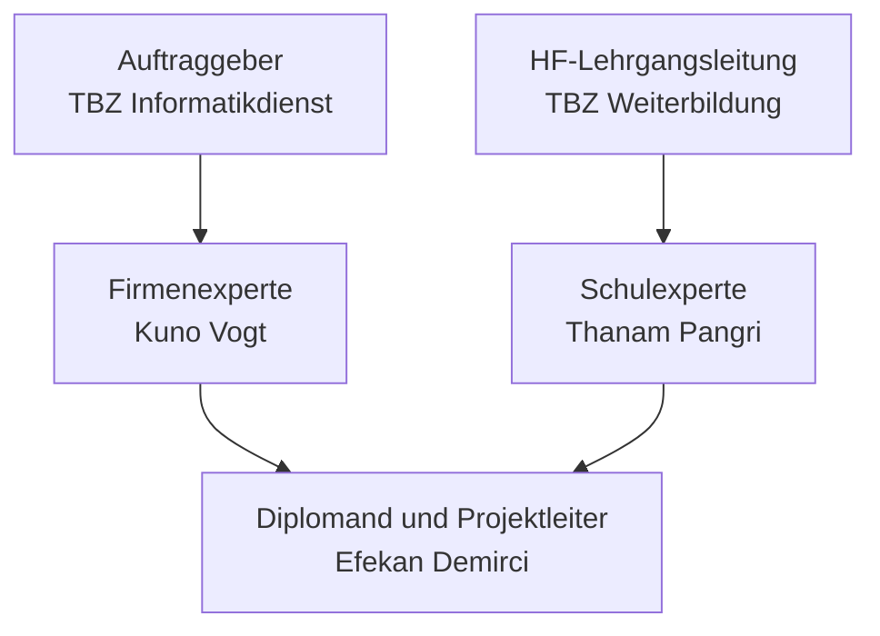
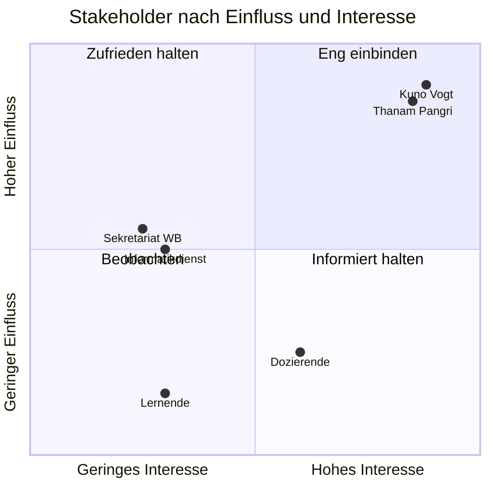
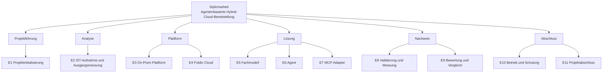
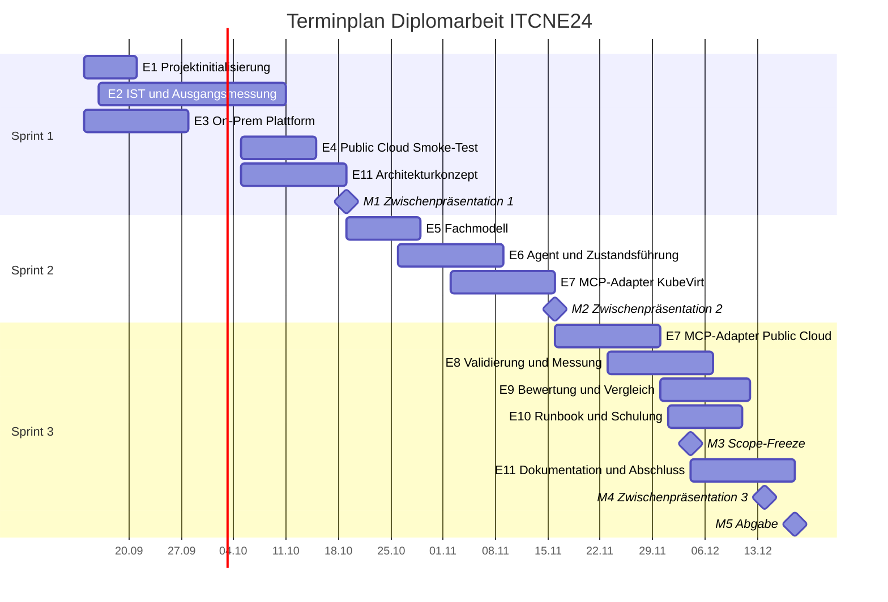

# Diplomarbeit: Agentenbasierte Hybrid-Cloud-Bereitstellung von Lernumgebungen mit Kubernetes, KubeVirt und MCP

!!! info "Lesehinweis"
    Diese Dokumentation entsteht laufend während der Projektlaufzeit vom 14.09.2026 bis 18.12.2026. Sie ist sequentiell lesbar aufgebaut: Kapitel 1 ordnet das Problem ein, Kapitel 2 beschreibt, wie das Projekt geführt wird, die Kapitel 3 bis 7 folgen dem fachlichen Weg von der Analyse über die Umsetzung bis zur Bewertung, die Kapitel 8 bis 10 schliessen die Arbeit ab. Wöchentliche Statusberichte und das Projektjournal liegen in eigenen Bereichen und werden aus Kapitel 2 heraus verlinkt.

| | |
| --- | --- |
| Diplomand | Efekan Demirci, ITCNE24, TBZ Höhere Fachschule |
| Auftraggeber | Technische Berufsschule Zürich, Informatikdienst |
| Firmenexperte | Kuno Vogt, Leiter Informatikdienst TBZ |
| Schulexperte | Thanam Pangri, HF-Lehrgangsleitung |
| Laufzeit | 14.09.2026 bis 18.12.2026 |
| Version | 0.1, Projektstart |
| Grundlage | Bewilligte Projektbeschreibung vom 10.09.2026, Merkblatt A Stand Juni 2026 |

---

## Management Summary

> Wird am Projektende verfasst und zusätzlich als separates Dokument mit unterschriebenem Ehrenwort abgegeben. Grundlage ist das Management Summary aus der bewilligten Projektbeschreibung vom 10.09.2026.

---

## 1 Einleitung

### 1.1 Ausgangslage

Die Technische Berufsschule Zürich stellt für den Unterricht digitale Übungsumgebungen bereit, in denen Lernende praktische technische Aufgaben durchführen. Diese Lernumgebungen werden heute auf einer lokalen Plattform mit MAAS, LernMAAS, Konfigurationsdateien und Shellskripten bereitgestellt. Das Verfahren ist im Betrieb etabliert und bleibt während der gesamten Diplomarbeit unverändert verfügbar.

Die fachliche Beschreibung einer Lernumgebung und ihre technische Bereitstellung sind dabei eng mit dieser Plattform verbunden. Für eine andere Infrastruktur müssten Abläufe, Schnittstellen und Skripte separat angepasst oder neu entwickelt werden. Daraus entstehen zusätzlicher manueller Aufwand, eine stärkere Abhängigkeit von spezifischem Wissen einzelner Personen und eine eingeschränkte Wiederverwendbarkeit.

> Die detaillierte IST-Analyse folgt aus Sprint 1, User Story US07. Sie ergänzt diesen Abschnitt um den konkreten Ablauf, die beteiligten Komponenten und die manuellen Schritte des heutigen Vorgehens.

### 1.2 Problemstellung

Es fehlt ein einheitliches Modell, mit dem eine Lernumgebung unabhängig von der gewählten Plattform beschrieben und über einen gemeinsamen Ablauf verwaltet werden kann.

Vor einer möglichen späteren Weiterentwicklung der lokalen Lernplattform soll deshalb geklärt werden, ob ein plattformübergreifender Ansatz technisch machbar ist und gegenüber dem heutigen Vorgehen einen nachvollziehbaren Mehrwert bietet.

### 1.3 Zielbild

Eine Lernumgebung wird einmal fachlich beschrieben und über denselben Lebenszyklus entweder lokal oder in der Public Cloud verwaltet. Die Bedienlogik bleibt auf beiden Zielplattformen gleich, während die plattformspezifische Umsetzung klar davon getrennt ist. Der Ablauf soll reproduzierbar, messbar und ohne manuelle technische Entscheidungen funktionieren.

Der Proof of Concept schafft damit eine sachliche Entscheidungsgrundlage für eine mögliche spätere Weiterentwicklung, ohne die bestehende produktive Umgebung zu verändern.

### 1.4 Zielsetzungen und Erfolgskriterien

Die fünf Teilziele aus der bewilligten Projektbeschreibung werden als SMART-Ziele mit prüfbaren Erfolgskriterien geführt. Jedes Ziel wird in jedem Sprint Review gegen diese Tabelle abgeglichen, die Spalte Status wird dabei nachgeführt.

| ID | Ziel | Messkriterium | Zielwert | Nachweis | Status |
| --- | --- | --- | --- | --- | --- |
| Z1 | Plattformneutrales Modell für Lernumgebungen | Versioniertes YAML-Modell mit JSON-Schema, gültige Definition wird akzeptiert, ungültige abgewiesen | 1 Modell, 1 Schema, je 1 positiver und 1 negativer Testfall bestehen | Repository, Testprotokoll | Offen |
| Z2 | Zentraler Agent mit Zustandsführung | create, status, reset und delete laufen über festgelegte Zustandsübergänge, Zustand ist persistent | 4 Operationen funktionsfähig, reset erzeugt aus derselben Definition neu | Quellcode, Zustandsdiagramm, Testprotokoll | Offen |
| Z3 | On-Prem-Backend mit Kubernetes und KubeVirt | Test-Lernumgebung wird automatisiert bereitgestellt und vollständig entfernt | 3 vollständige Durchläufe ohne manuelle Korrektur | Laufprotokolle, Screenshots | Offen |
| Z4 | Bewertung der MCP-basierten Adapterarchitektur | Dieselbe Definition läuft lokal und auf genau einer Public Cloud, Bewertung gegen direkte API-Anbindung | 3 vollständige Durchläufe in der Cloud, Bewertung nach 5 Kriterien dokumentiert | Laufprotokolle, Bewertungstabelle | Offen |
| Z5 | Messbarer Vergleich mit dem heutigen Vorgehen | Bereitstellungszeit, manuelle Eingriffe, Reproduzierbarkeit, vollständiger Abbau | Vorher- und Nachher-Werte für denselben Testfall protokolliert | Messprotokoll, Vergleichstabelle | Offen |

### 1.5 Erfolgskriterien des Proof of Concept

Der Proof of Concept gilt als erfolgreich, wenn die folgenden Kriterien des verbindlichen Kernumfangs nachgewiesen sind. Sie stammen unverändert aus der bewilligten Projektbeschreibung und bilden zugleich die projektweite Definition of Done.

- [ ] Das YAML-Modell und das zugehörige JSON-Schema sind versioniert. Das Modell deckt die ausgewählten Konfigurationsmerkmale der LernMAAS-Profile m239, m254 und m426 ab. Eine gültige Definition wird akzeptiert, eine bewusst ungültige wird abgewiesen, und die technisch reduzierte Test-Lernumgebung ist festgelegt.
- [ ] Der Agent validiert die Definition, speichert den Zustand persistent und führt create, status, reset und delete über festgelegte Zustandsübergänge aus. reset löscht die Umgebung und erstellt sie aus derselben Definition neu.
- [ ] Die gemeinsame Definition wird über die MCP-basierten Adapter lokal auf einem Kubernetes-Cluster mit KubeVirt und auf genau einer Public-Cloud-Plattform bereitgestellt. Auf beiden Zielplattformen erreicht die VM den festgelegten Zustand und der definierte Testdienst besteht den Readiness-Check.
- [ ] Auf jeder Zielplattform werden drei aufeinanderfolgende vollständige Durchläufe durchgeführt, insgesamt sechs. Alle Durchläufe funktionieren ohne manuelle Korrektur.
- [ ] Nach jedem delete sind keine dem Testlauf zugeordneten Ressourcen mehr vorhanden.
- [ ] Bereitstellungszeit und manuelle Eingriffe sind für das heutige Vorgehen und den Proof of Concept protokolliert. Der Vorher-Nachher-Vergleich sowie die Bewertung der MCP-basierten Architektur gegenüber einer direkten API-Anbindung sind dokumentiert.
- [ ] Die gewonnenen Erkenntnisse und die erarbeiteten technischen Komponenten sind hinsichtlich ihrer Übertragbarkeit auf eine mögliche zukünftige produktive Umgebung beurteilt und dokumentiert.

### 1.6 Abgrenzung

Der Umfang ist bewusst so festgelegt, dass der vollständige und messbare Nachweis innerhalb der verfügbaren Projektzeit möglich bleibt. Nicht Teil dieser Arbeit sind:

| Nicht im Umfang | Begründung |
| --- | --- |
| Migration oder Abschaltung der bestehenden MAAS-Umgebung | Die produktive Umgebung bleibt unverändert in Betrieb und dient als Vergleichsbasis |
| Produktiver Betrieb der neuen Infrastruktur | Der Nachweis erfolgt als Proof of Concept, nicht als Einführung |
| Vollständige Umsetzung aller Unterrichtsmodule | Eine technisch reduzierte Test-Lernumgebung genügt für den Nachweis des Lebenszyklus |
| Sprachmodellbasierte Entscheidungslogik | Der Agent arbeitet nach festgelegten Regeln, das ist für die Reproduzierbarkeit zwingend |
| Bedienoberfläche | Der Nachweis erfolgt über die Kommandozeile, eine Oberfläche bringt keinen zusätzlichen Erkenntnisgewinn |
| Zweite Public Cloud | Eine Plattform genügt, um die Austauschbarkeit über die Adapterschicht zu zeigen |
| GitOps oder Argo CD | War Gegenstand der Semesterarbeit 5 und ist hier bewusst nicht Thema |
| Hochverfügbarkeit, verteilter Storage, produktive Skalierung | Betriebsthemen, die erst bei einer produktiven Einführung relevant werden |
| Hardwarebeschaffung und betriebliche Netzwerkumstellungen | Es wird ausschliesslich vorhandene, freigegebene Hardware verwendet |

Diese Punkte werden im Ausblick in Kapitel 10 behandelt.

### 1.7 Zielgruppe und Lesehinweise

Die Dokumentation richtet sich an die beiden Experten, an den Informatikdienst der TBZ und an die HF-Lehrgangsleitung. Sie ist so geschrieben, dass ein fachlich versierter Leser ohne Vorwissen über die TBZ-Umgebung folgen kann. Fachbegriffe werden im Glossar am Ende erklärt.

### 1.8 Themenfeldabdeckung

| Themenfeld | Bezug in dieser Arbeit | Kapitel |
| --- | --- | --- |
| Cloud Engineering | Entwurf und Beurteilung einer Lösung für lokale und Public-Cloud-Infrastruktur | 3, 4, 6 |
| DevOps und Automatisierung | Reproduzierbare Bereitstellung, Zustandsführung, Tests, vollständiger Abbau | 4, 5 |
| Cloud-native Virtualisierung | Betrieb virtueller Maschinen auf Kubernetes mit KubeVirt | 4 |
| Schnittstellen- und Architekturdesign | Trennung zwischen Fachmodell, zentraler Steuerung und plattformspezifischen Adaptern | 3, 4 |
| Projektmanagement | Hybrides Vorgehen mit Sprints innerhalb fixer Meilensteine | 2 |
| Wirtschaftlichkeit | Kosten-Nutzen-Betrachtung auf Basis erhobener Messwerte | 6 |
| Betrieb und Schulung | Runbook und Einführung für Nutzende | 7 |

---

## 2 Projektmanagement

Dieses Kapitel beschreibt, wie das Projekt geführt, gesteuert und kontrolliert wird. Es steht bewusst vor der fachlichen Umsetzung, weil die Projektführung die Rahmenbedingungen für alle folgenden Kapitel setzt.

### 2.1 Theoretische Grundlagen und Bezug zum Modul PRJ

#### 2.1.1 Das magische Dreieck als Ausgangspunkt

Jedes Projekt bewegt sich im Spannungsfeld von Leistung, Zeit und Kosten. Bei dieser Diplomarbeit sind zwei der drei Grössen von aussen fixiert:

| Dimension | Status | Begründung |
| --- | --- | --- |
| Zeit | Fix | Abgabe am 18.12.2026, Termine aus Merkblatt A, keine Verschiebung möglich |
| Kosten | Fix | Vorhandene Hardware der TBZ, maximal CHF 50 Cloud-Guthaben des Diplomanden, keine Beschaffung |
| Leistung | Variabel | Der Funktionsumfang ist die einzige echte Stellgrösse |

Daraus folgt die zentrale Steuerungsregel dieses Projekts: **Bei Abweichungen wird der Umfang reduziert, nicht der Termin verschoben und nicht die Qualität gesenkt.**

Die Trennung zwischen verbindlichem Kernumfang und optionalen Erweiterungen erfolgt über die MoSCoW-Priorisierung in Kapitel 2.10. Zusätzlich ist in Kapitel 2.8 festgehalten, in welcher Reihenfolge bei Verzug reduziert wird, damit diese Entscheidung nicht unter Zeitdruck getroffen werden muss.

#### 2.1.2 Wahl des Vorgehensmodells

Für die Wahl des Vorgehensmodells wurden drei Ansätze gegeneinander abgewogen.

| Kriterium | Klassisch phasenorientiert | Rein agil nach Scrum | Gewählt: hybrid |
| --- | --- | --- | --- |
| Anforderungsklarheit | Setzt stabile Anforderungen voraus | Erlaubt Lernen während der Umsetzung | Ziele und Erfolgskriterien sind durch die bewilligte Projektbeschreibung fix, der Lösungsweg ist offen |
| Technische Unsicherheit | Hoch riskant bei neuer Technologie | Kurze Feedbackschleifen federn Unsicherheit ab | KubeVirt und MCP sind für den Diplomanden neu, iteratives Vorgehen ist nötig |
| Termine | Meilensteine klar planbar | Sprintenden sind flexibel | Die Zwischenpräsentationen sind fixe Meilensteine, die Sprints richten sich danach |
| Teamgrösse | Rollen setzen ein Team voraus | Rollen setzen ein Team voraus | Einzelprojekt, die Rollen werden angepasst |
| Nachweisführung | Phasenfreigaben | Increment und Review | Beides kombiniert |

**Entscheid:** Ein hybrides Vorgehen. Die äussere Struktur ist phasenorientiert und folgt den fixen Meilensteinen aus Merkblatt A. Innerhalb dieser Struktur wird iterativ in drei Sprints gearbeitet, mit Sprint Planning, Sprint Review, Retrospektive und einem gepflegten Product Backlog.

Dieses Vorgehen entspricht der Realität vieler Infrastrukturprojekte: Der Auftrag und der Termin sind vertraglich fixiert, der Lösungsweg wird iterativ erarbeitet.

#### 2.1.3 Angewandte Scrum-Elemente und bewusste Abweichungen

Scrum ist für ein Team von drei bis neun Personen konzipiert. Diese Arbeit ist ein Einzelprojekt. Die Elemente werden deshalb angepasst übernommen. Die Abweichungen werden hier offengelegt, damit nicht der Eindruck entsteht, es werde ein Rollenmodell behauptet, das faktisch nicht existiert.

| Scrum-Element | Anwendung in dieser Arbeit | Abweichung und Begründung |
| --- | --- | --- |
| Product Owner | Der Firmenexperte nimmt die Priorisierungsrolle wahr, der Diplomand schlägt vor | Keine tägliche Verfügbarkeit, Abstimmung an den Reviews und bei Bedarf im Teams-Kanal |
| Scrum Master | Entfällt als eigene Rolle | Der Diplomand moderiert seinen eigenen Prozess, die Retrospektive ersetzt die externe Prozessbeobachtung |
| Development Team | Der Diplomand allein | Einzelprojekt gemäss Merkblatt A, die Arbeit muss selbständig durchgeführt werden |
| Product Backlog | Vollständig geführt als GitHub Issues, siehe Kapitel 2.8 | Keine |
| Sprint Backlog | Sprintzuordnung im Project Board über das Feld Sprint und über Milestones | Keine |
| Sprint Planning | Zu Sprintbeginn, Ergebnis ist ein dokumentiertes Sprintziel mit Story-Point-Budget | Keine |
| Daily Scrum | Ersetzt durch einen Journaleintrag pro Arbeitseinheit | Ein Daily mit sich selbst ist ein Ritual ohne Nutzen, der Journaleintrag erfüllt denselben Zweck der Transparenz |
| Sprint Review | Die Zwischenpräsentationen mit den Experten sind die Sprint Reviews | Keine, dies ist in der Projektbeschreibung so vereinbart |
| Sprint Retrospektive | Nach jedem Sprint mit dem Starfish-Modell | Keine |
| Increment | Am Ende jedes Sprints existiert ein demonstrierbarer Stand | Keine |
| Velocity | Wird pro Sprint erhoben und für die Planung des Folgesprints verwendet | Basiswert aus der Erstschätzung, ab Sprint 2 aus Ist-Werten |

#### 2.1.4 Theorie-Praxis-Landkarte

Die folgende Tabelle verbindet die im Modul Projektmanagement behandelten Instrumente mit ihrer konkreten Anwendung in dieser Arbeit und mit dem Ort, an dem das Ergebnis nachweisbar ist.

| Instrument aus dem Modul PRJ | Anwendung in dieser Arbeit | Nachweis |
| --- | --- | --- |
| Magisches Dreieck | Zeit und Kosten fix, Umfang als Stellgrösse, daraus abgeleitete Steuerungsregel | Kapitel 2.1.1 |
| Projektauftrag und Zielvereinbarung | Bewilligte Projektbeschreibung vom 10.09.2026, unterzeichnet durch den Auftraggeber | Kapitel 1, Anhang |
| SMART-Ziele | Fünf Teilziele mit Messkriterium, Zielwert und Nachweis | Kapitel 1.4 |
| Projektorganisation und RACI | Zuordnung von Verantwortung und Entscheid zwischen Diplomand, Firmenexperte und Schulexperte | Kapitel 2.2 |
| Stakeholderanalyse | Einfluss-Interesse-Portfolio mit abgeleiteter Kommunikationsstrategie | Kapitel 2.3 |
| Kommunikationsplan | Wer erhält was, wann, über welchen Kanal | Kapitel 2.4 |
| Projektstrukturplan | Zerlegung in elf Epics als Arbeitspakete | Kapitel 2.5 |
| Meilensteinplanung | Sechs Meilensteine mit Freigabekriterium | Kapitel 2.6 |
| Aufwandschätzung mit relativer Schätzung | Story Points mit Referenzstory und definierter Skala | Kapitel 2.9 |
| Velocity und Kapazitätsplanung | Geplante gegen tatsächliche Story Points pro Sprint | Kapitel 2.9 und Sprint Reviews |
| Priorisierung nach MoSCoW | Einteilung des Backlogs in Must, Should, Could und Won't | Kapitel 2.10 |
| Definition of Ready und Definition of Done | Qualitätsschranken vor und nach der Umsetzung | Kapitel 2.11 |
| Qualitätssicherung und Teststrategie | Zweiteilige Teststrategie, automatisiert und manuell, mit Begründung | Kapitel 2.12 |
| Risikomanagement nach Identifikation, Bewertung, Steuerung, Überwachung | Elf Risiken mit Bewertung, Strategie, Frühwarnindikator und Massnahme | Kapitel 2.15 |
| Risikomatrix | Eintrittswahrscheinlichkeit mal Auswirkung, Neubewertung an jedem Sprintende | Kapitel 2.15 |
| Meilensteintrendanalyse | Verfolgung der Meilensteintermine über die Berichtswochen | Kapitel 2.13 |
| Projektcontrolling mit Ampelsystem | Wöchentlicher Statusbericht mit Ampel für Termin, Umfang, Qualität und Risiko | Kapitel 2.13, Statusberichte |
| Änderungsmanagement | Formalisierter Change Request mit Zustimmung beider Experten | Kapitel 2.14 |
| Nutzwertanalyse | Auswahl der Public-Cloud-Plattform und Bewertung MCP gegen direkte API-Anbindung | Kapitel 3 und 6 |
| Wirtschaftlichkeitsbetrachtung | Kosten-Nutzen-Betrachtung auf Basis der erhobenen Messwerte | Kapitel 2.16 und 6 |
| SWOT-Analyse | Bewertung des Lösungsansatzes gegenüber dem heutigen Vorgehen | Kapitel 6 |
| Lessons Learned und Retrospektive | Starfish-Retrospektive pro Sprint, Lessons Learned im Abschlusskapitel | Kapitel 8 und 9 |
| Projektjournal | Fortlaufende Aufzeichnung von Ereignissen, Entscheiden und Beobachtungen | Kapitel 2.17, Journal |

### 2.2 Projektorganisation und Rollen



**RACI-Matrix**

R steht für durchführend, A für rechenschaftspflichtig, C für konsultiert, I für informiert.

| Aufgabe | Diplomand | Firmenexperte | Schulexperte | Auftraggeber |
| --- | --- | --- | --- | --- |
| Projektplanung und Steuerung | R, A | C | C | I |
| Priorisierung des Backlogs | R | A | C | I |
| Technische Entscheide und Architektur | R, A | C | C | I |
| Umsetzung und Tests | R, A | I | I | I |
| Änderung von Zielen oder Fokus | R | A | A | C |
| Freigabe der Sprintergebnisse | R | A | A | I |
| Bewertung der Arbeit | I | R, A | R, A | I |
| Bereitstellung von Hardware und Zugängen | C | C | I | A |
| Dokumentation und Abgabe | R, A | I | I | I |

Die Zeile Änderung von Zielen oder Fokus hat zwei Träger von A. Das ist bewusst so: Merkblatt A verlangt für grössere Projektänderungen die Zustimmung beider Experten. Der Prozess dazu steht in Kapitel 2.14.

**Deklaration von Abhängigkeiten**

Merkblatt A verlangt die Deklaration von Abhängigkeiten und Verbindungen zwischen Diplomand und Experten, auch ausserhalb der Arbeitszeit.

| Beziehung | Art | Umgang |
| --- | --- | --- |
| Diplomand und Kuno Vogt | Direktes Vorgesetztenverhältnis im Informatikdienst der TBZ | Offengelegt. Die Bewertung erfolgt gemeinsam mit dem Schulexperten, technische Entscheide und Umsetzung liegen beim Diplomanden |
| Diplomand und Thanam Pangri | Ausschliesslich schulisches Verhältnis als Dozent und Lehrgangsleitung | Keine besondere Massnahme nötig |
| Ausserhalb der Arbeitszeit | Keine Verbindungen zwischen Diplomand und Experten | Keine |

### 2.3 Stakeholder

#### Stakeholderliste

| Stakeholder | Rolle im Projekt | Interesse | Einfluss | Erwartung | Mögliche Konfliktlinie |
| --- | --- | --- | --- | --- | --- |
| Kuno Vogt, Leiter Informatikdienst TBZ | Firmenexperte, Auftraggebervertreter, direkter Vorgesetzter | Hoch | Hoch | Belastbare Entscheidungsgrundlage, kein Eingriff in den produktiven Betrieb | Die Projektarbeit darf das Tagesgeschäft nicht belasten |
| Thanam Pangri, HF-Lehrgangsleitung | Schulexperte, Bewertung | Hoch | Hoch | Methodisch sauberes Vorgehen, nachvollziehbare Dokumentation, klar herausgearbeiteter Mehrwert von MCP | Technische Tiefe gegen methodische Vollständigkeit |
| Dozierende der Module m239, m254 und m426 | Fachliche Auskunft, spätere Nutzende | Mittel | Niedrig | Lernumgebungen müssen fachlich das Gleiche leisten wie heute | Eine reduzierte Test-Lernumgebung könnte als Abwertung ihrer Module gelesen werden |
| Informatikdienst TBZ, Team | Betroffen durch die Hardwarenutzung im HF-Labor | Niedrig | Mittel | Keine Beeinträchtigung bestehender Systeme und Netze | Hardware- und Netzbelegung im HF-Labor |
| Lernende der TBZ | Endnutzende der Lernumgebungen | Niedrig | Niedrig | Funktionierende Übungsumgebungen | Keine, das bestehende System bleibt unverändert in Betrieb |
| TBZ Weiterbildung, Sekretariat | Organisation von Abgabe und Kolloquium | Niedrig | Mittel | Fristgerechte Abgabe, rechtzeitige Raumreservation | Terminkollisionen bei der Raumreservation |

#### Einfluss-Interesse-Portfolio



#### Abgeleitete Umgangsstrategie

| Gruppe | Strategie | Konkrete Massnahme |
| --- | --- | --- |
| Eng einbinden: Kuno Vogt, Thanam Pangri | Aktiv einbeziehen, Entscheide gemeinsam absichern | Drei Zwischenpräsentationen als Sprint Reviews, wöchentlicher Statusbericht, Change Requests mit Zustimmung beider Experten. Die Abgrenzung des Umfangs wird beim Kickoff ausdrücklich bestätigt |
| Zufrieden halten: Sekretariat Weiterbildung, Team Informatikdienst | Frühzeitig informieren, keine Überraschungen | Raumreservation für das Kolloquium bis Ende November, Hardwarenutzung im HF-Labor vorab angekündigt |
| Informiert halten: Dozierende der Module | Fachlich konsultieren, Erwartungen klären | Bei der Ableitung der Test-Lernumgebung in US08 konsultieren, Abgrenzung des Proof of Concept aktiv erklären |
| Beobachten: Lernende | Keine aktive Kommunikation nötig | Das bestehende System bleibt während der gesamten Laufzeit unverändert in Betrieb |

#### Eskalationsweg

1. Fachliche oder organisatorische Blockade wird erkannt und im Journal festgehalten
2. Innerhalb von 24 Stunden Information an den Firmenexperten über den Teams-Kanal, bei Dringlichkeit telefonisch
3. Bleibt eine Antwort länger als zwei Arbeitstage aus, wird der Schulexperte einbezogen
4. Bei Blockaden mit Auswirkung auf einen Meilenstein wird die Ampel im Statusbericht auf Rot gesetzt und eine Umfangsreduktion vorgeschlagen

### 2.4 Kommunikationsplan

| Was | An wen | Wann | Kanal | Zweck |
| --- | --- | --- | --- | --- |
| Wöchentlicher Statusbericht | Beide Experten | Jeden Freitag bis 18:00 | Markdown im Repository, veröffentlicht über GitHub Pages, zusätzlich kurzer Post mit Link im Teams-Kanal | Fortschritt, Abweichungen, nächste Schritte |
| Projektjournal | Jederzeit einsehbar | Laufend, mindestens pro Arbeitseinheit | Repository und GitHub Pages | Nachvollziehbarkeit von Ereignissen und Entscheiden |
| Einladung zu Meilensteinen | Beide Experten | Mindestens 10 Arbeitstage vorher | Outlook-Termin mit Teams-Link | Terminsicherung |
| Zwischenpräsentation und Sprint Review | Beide Experten | Wochen vom 19.10., 16.11. und 14.12.2026 | Online-Meeting, Präsentation und Demo | Abnahme des Sprintergebnisses, Steuerungsfeedback |
| Change Request | Beide Experten | Bei Bedarf, spätestens 5 Arbeitstage vor Wirksamkeit | Teams-Kanal, dokumentiert in Kapitel 2.14 | Zustimmung zu Änderungen an Zielen oder Fokus |
| Kurze Fachfrage | Firmenexperte | Bei Bedarf | Teams-Chat | Klärung, Antwort innerhalb von zwei Arbeitstagen erwartet |
| Eskalation bei Blockade | Firmenexperte, bei Ausbleiben Schulexperte | Innerhalb von 24 Stunden nach Erkennen | Teams-Chat, bei Dringlichkeit Telefon | Auflösung von Blockaden bei Hardware, Zugriff oder Netzwerk |
| Abgabebestätigung | admin.wb@tbz.zh.ch | Nach Abgabe, spätestens 18.12.2026 | E-Mail | Bestätigung gemäss Merkblatt A |
| Dokumentationsstand | Beide Experten | Laufend, kein Push ohne aktualisierte Dokumentation | GitHub Pages | Jederzeitiger Zugriff auf den aktuellen Entwicklungsstand |

Repository, Dokumentation und Project Board sind öffentlich. Die drei Links werden beim Kickoff versendet. Die öffentliche Erreichbarkeit des Boards wird in Sprint 1 aus einem abgemeldeten Browser verifiziert und im Statusbericht der Kalenderwoche 38 bestätigt.

### 2.5 Projektstrukturplan

Das Projekt ist in elf Arbeitspakete zerlegt, im Folgenden Epics genannt. Jedes Epic bündelt fachlich zusammengehörende User Stories.



Die Zuordnung der Epics zu Sprints, Stories und Story Points steht in Kapitel 2.8.

### 2.6 Termin- und Meilensteinplan

Das Projekt läuft über 14 Kalenderwochen, von KW38 bis KW51 2026. Die Sprintgrenzen sind an die drei fixen Zwischenpräsentationstermine aus Merkblatt A gekoppelt.

| Sprint | Zeitraum | Kalenderwochen | Dauer | Sprintziel in einem Satz |
| --- | --- | --- | --- | --- |
| Sprint 1 | 14.09.2026 bis 18.10.2026 | KW38 bis KW42 | 5 Wochen | Die Ausgangslage ist gemessen, beide Zielplattformen sind nutzbar, die Architektur ist entschieden |
| Sprint 2 | 19.10.2026 bis 15.11.2026 | KW43 bis KW46 | 4 Wochen | Fachmodell, Agent und der erste vollständige End-to-End-Durchlauf lokal stehen |
| Sprint 3 | 16.11.2026 bis 18.12.2026 | KW47 bis KW51 | 5 Wochen | Beide Plattformen sind validiert, Vergleich und Bewertung sind abgeschlossen, die Abgabe ist erfolgt |

**Meilensteine**

| ID | Meilenstein | Termin | Freigabekriterium | Beteiligte |
| --- | --- | --- | --- | --- |
| M0 | Projektstart und Kickoff | 14.09.2026 | Zugänge geklärt, Hardware freigegeben, Board und Repository für die Experten erreichbar, Abgrenzung bestätigt | Diplomand, beide Experten |
| M1 | Zwischenpräsentation 1, Sprint 1 Review | Woche vom 19.10.2026 | Ausgangsmessung vorliegend, lokale Plattform nutzbar, Cloud-Smoke-Test bestanden, Architektur entschieden | Diplomand, beide Experten |
| M2 | Zwischenpräsentation 2, Sprint 2 Review | Woche vom 16.11.2026 | Modell, Schema und Agent funktionsfähig, ein vollständiger Durchlauf lokal demonstriert | Diplomand, beide Experten |
| M3 | Scope-Freeze | 04.12.2026 | Keine neuen Funktionen mehr, ab hier nur noch Tests, Messungen, Dokumentation und Korrekturen | Diplomand |
| M4 | Zwischenpräsentation 3, Sprint 3 Review | Woche vom 14.12.2026 | Sechs Durchläufe protokolliert, Vergleich und Bewertung vorliegend, Dokumentation abgabefertig | Diplomand, beide Experten |
| M5 | Abgabe der Diplomarbeit | 18.12.2026 | Dokumentation über GitHub Pages bereitgestellt, Management Summary mit unterschriebenem Ehrenwort abgelegt, Experten informiert, Bestätigungsmail versendet | Diplomand |
| M6 | Kolloquium | Woche vom 04.01.2027 | Raum reserviert, Präsentation und Demo inklusive Backup-Plan bereit | Diplomand, beide Experten |



#### 2.6.1 Begründung der unterschiedlichen Sprintlängen

Die drei Sprints sind mit fünf, vier und fünf Wochen unterschiedlich lang. Das ist eine bewusste Entscheidung und keine Nachlässigkeit in der Planung.

Die drei Zwischenpräsentationen sind in Merkblatt A auf die Wochen vom 19.10., 16.11. und 14.12.2026 festgelegt und in der bewilligten Projektbeschreibung als Sprint Reviews vereinbart. Ein Sprint Review gehört an das Sprintende. Die Abstände zwischen diesen fixen Terminen betragen vier bis fünf Wochen und sind nicht gleich lang. Es gibt damit zwei Möglichkeiten:

1. Gleich lange Sprints von zwei Wochen. Dann fallen die Reviews mitten in einen Sprint und die wichtigsten Steuerungstermine des Projekts sind von den Sprintgrenzen entkoppelt.
2. Sprints entlang der fixen Termine. Dann sind die Sprints unterschiedlich lang, dafür ist jeder Review ein echter Sprintabschluss mit einem demonstrierbaren Increment.

Gewählt wurde Variante 2, weil der Nutzen eines Reviews mit Steuerungswirkung höher ist als die formale Gleichmässigkeit der Sprintlänge. Die Vergleichbarkeit wird auf anderem Weg sichergestellt: Die Planung erfolgt nicht pro Sprint pauschal, sondern über ein konstantes Story-Point-Budget pro Woche, siehe Kapitel 2.9. Ein fünfwöchiger Sprint erhält fünf Wochenbudgets, ein vierwöchiger vier. Die Velocity bleibt so über die Sprints hinweg vergleichbar.

Zusätzlich wird in den längeren Sprints nach der Hälfte der Laufzeit ein Zwischenabgleich durchgeführt, dokumentiert im jeweiligen Statusbericht. Damit bleibt auch in einem Fünfwochensprint die Kontrolldichte hoch.

### 2.7 Sprintstruktur und Events

**Sprint Planning, am ersten Tag des Sprints**

- Sprintziel als ein Satz Outcome formulieren
- Story-Point-Budget aus der Wochenkapazität berechnen
- User Stories aus dem priorisierten Backlog ziehen, bis das Budget erreicht ist
- Definition of Ready für jede gezogene Story prüfen
- Sprint-Feld und Milestone im Project Board setzen
- Sprintplanung im Repository ablegen

**Sprint Execution, laufend**

- Work in Progress Limit: maximal zwei Issues gleichzeitig in der Spalte In Progress
- Journaleintrag pro Arbeitseinheit
- Nachweise entstehen mit der Umsetzung, nicht nachträglich
- Wöchentlicher Statusbericht jeden Freitag
- Arbeitsweise und Branching siehe Kapitel 2.12

**Sprint Review, am Sprintende, zugleich Zwischenpräsentation**

Ablauf, 45 bis 60 Minuten:

1. Sprintziel und was daraus wurde, 5 Minuten
2. Abgleich gegen die Zieltabelle aus Kapitel 1.4, 5 Minuten
3. Demo des lauffähigen Standes, 15 Minuten
4. Herausforderungen, Entscheide und Abweichungen, 10 Minuten
5. Risikolage und Ausblick auf den nächsten Sprint, 5 Minuten
6. Fragen und Rückmeldung der Experten, 15 Minuten

Die Rückmeldungen der Experten werden im Reviewdokument protokolliert und als Issues in den Backlog aufgenommen. Damit ist nachweisbar, dass Feedback nicht nur entgegengenommen, sondern umgesetzt wurde.

**Sprint Retrospektive, direkt nach dem Review**

Reflexion mit dem Starfish-Modell: Keep, Stop, Start, More of, Less of. Aus der Retrospektive werden höchstens drei konkrete Massnahmen für den Folgesprint abgeleitet. Die Umsetzung dieser Massnahmen wird in der nächsten Retrospektive überprüft.

### 2.8 Anforderungsmanagement und Product Backlog

Jede Anforderung wird als GitHub Issue nach dem Schema `Als <Rolle> möchte ich <Ziel>, damit <Nutzen>` erfasst und im öffentlichen Project Board gesteuert. Der Backlog umfasst **38 User Stories** mit insgesamt **113 Story Points**, verteilt auf elf Epics und drei Sprints.

#### Verteilung über die Sprints

| Sprint | Zeitraum | Dauer | Stories | Story Points | Sprintziel |
| --- | --- | --- | --- | --- | --- |
| **Sprint 1** | 14.09.2026 bis 18.10.2026 | 5 Wochen | 17 | 40 | Die Ausgangslage ist gemessen, beide Zielplattformen sind nutzbar und die Architektur ist entschieden. |
| **Sprint 2** | 19.10.2026 bis 15.11.2026 | 4 Wochen | 8 | 32 | Fachmodell, Agent und der erste vollständige End-to-End-Durchlauf auf der lokalen Plattform stehen. |
| **Sprint 3** | 16.11.2026 bis 18.12.2026 | 5 Wochen | 13 | 41 | Beide Zielplattformen sind validiert, Vergleich und Bewertung sind abgeschlossen, die Arbeit ist abgegeben. |
| **Total** | 14.09. bis 18.12.2026 | 14 Wochen | **38** | **113** | |

#### Verteilung über die Epics

| Epic | Thema | Stories | Story Points | Sprint |
| --- | --- | --- | --- | --- |
| E1 | Projektinitialisierung | 6 | 10 | 1 |
| E2 | IST-Aufnahme und Ausgangsmessung | 4 | 13 | 1 |
| E3 | On-Prem Plattform | 4 | 9 | 1 |
| E4 | Public Cloud | 2 | 5 | 1 |
| E5 | Fachmodell | 2 | 8 | 2 |
| E6 | Agent | 4 | 16 | 2 |
| E7 | MCP-Adapter | 3 | 16 | 2, 3 |
| E8 | Validierung und Messung | 4 | 10 | 3 |
| E9 | Bewertung und Vergleich | 4 | 12 | 3 |
| E10 | Betrieb und Schulung | 2 | 5 | 3 |
| E11 | Projektabschluss | 3 | 9 | 1, 3 |

#### Standards pro Issue

- User Story im genannten Schema
- Epic, Story Points und Priorität nach MoSCoW
- Definition of Ready als Checkbox-Liste
- Prüfbare Akzeptanzkriterien als Checkbox-Liste
- Definition of Done als Checkbox-Liste

Nachweise werden grundsätzlich in der Dokumentation platziert, an der Stelle, die sie belegen. Wo ein besonderer Nachweis nötig ist, etwa ein Mess-, Lauf- oder Kostenprotokoll, ist er im jeweiligen Akzeptanzkriterium ausdrücklich verlangt.

---

#### Sprint 1: 14.09.2026 bis 18.10.2026

**Sprintziel:** Die Ausgangslage ist gemessen, beide Zielplattformen sind nutzbar und die Architektur ist entschieden.

**Umfang:** 17 User Stories, 40 Story Points, 5 Wochen

| ID | Titel | Epic | SP | Prio |
| --- | --- | --- | --- | --- |
| US01 | Repository mit klarer Struktur | E1 | 2 | Must |
| US02 | Öffentlich einsehbares Project Board | E1 | 2 | Must |
| US03 | Vorlagen, Labels, Milestones und Regeln | E1 | 1 | Must |
| US04 | Dokumentation über GitHub Pages | E1 | 2 | Must |
| US05 | Journal und Statusbericht als feste Routine | E1 | 1 | Must |
| US06 | Kickoff mit den Experten | E1 | 2 | Must |
| US07 | IST-Analyse der heutigen Bereitstellung | E2 | 2 | Must |
| US08 | Test-Lernumgebung aus m239, m254 und m426 ableiten | E2 | 3 | Must |
| US09 | Messkonzept mit identischen Start- und Endkriterien | E2 | 3 | Must |
| US10 | Ausgangsmessung am heutigen Vorgehen | E2 | 5 | Must |
| US11 | Hardware betriebsbereit und dokumentiert | E3 | 2 | Must |
| US12 | Kubernetes-Cluster verifizieren und dokumentieren | E3 | 2 | Must |
| US13 | KubeVirt verifizieren und Storage klären | E3 | 2 | Must |
| US38 | Referenz-VM manuell erstellen und wieder abbauen | E3 | 3 | Must |
| US14 | Auswahl der Public Cloud als Nutzwertanalyse | E4 | 2 | Must |
| US15 | Cloud-Smoke-Test mit Budgetwarnung und Quotas | E4 | 3 | Must |
| US16 | Zielarchitektur, ADRs und Zwischenpräsentation 1 | E11 | 3 | Must |

##### US01: Repository mit klarer Struktur

> Als **Diplomand** möchte ich ein Repository mit klarer Struktur, damit Code, Dokumentation und Nachweise von Beginn weg am selben Ort liegen.

| Epic | Story Points | Priorität | Sprint |
| --- | --- | --- | --- |
| E1 Projektinitialisierung | 2 | Must | 1 |

**Akzeptanzkriterien**

- [ ] Die Ordnerstruktur für Dokumentation, Skripte, Agent, Adapter, Modell und Infrastruktur ist angelegt
- [ ] Das README nennt Diplomand, Auftraggeber, beide Experten, Laufzeit und den Link zur Dokumentation
- [ ] Die .gitignore schliesst Build-Artefakte und Geheimnisse aus
- [ ] Der erste Commit liegt auf main


##### US02: Öffentlich einsehbares Project Board

> Als **Experte** möchte ich ein öffentlich einsehbares Project Board, damit ich den Projektstand jederzeit ohne Rückfrage sehe.

| Epic | Story Points | Priorität | Sprint |
| --- | --- | --- | --- |
| E1 Projektinitialisierung | 2 | Must | 1 |

**Akzeptanzkriterien**

- [ ] Das Board existiert und ist auf Public gestellt
- [ ] Die Felder Status, Priority, Sprint, Epic und Story Points sind vorhanden, Story Points als Zahlenfeld
- [ ] Der Workflow Auto-add für Issues des Repositories ist aktiv
- [ ] Der Zugriff wurde aus einem abgemeldeten Browser geprüft und im Statusbericht KW38 bestätigt


##### US03: Vorlagen, Labels, Milestones und Regeln

> Als **Diplomand** möchte ich einheitliche Vorlagen und Schutzregeln, damit jedes Ticket denselben Qualitätsstandard erfüllt.

| Epic | Story Points | Priorität | Sprint |
| --- | --- | --- | --- |
| E1 Projektinitialisierung | 1 | Must | 1 |

**Akzeptanzkriterien**

- [ ] Drei Issue-Vorlagen sind aktiv, leere Issues sind deaktiviert
- [ ] Die Pull-Request-Vorlage ist aktiv
- [ ] 19 Labels und drei Milestones sind angelegt
- [ ] Das Ruleset auf main ist aktiv und blockiert Force Pushes


##### US04: Dokumentation über GitHub Pages

> Als **Experte** möchte ich die Dokumentation über eine öffentliche Seite lesen, damit ich den Stand ohne Repository-Navigation verfolgen kann.

| Epic | Story Points | Priorität | Sprint |
| --- | --- | --- | --- |
| E1 Projektinitialisierung | 2 | Must | 1 |

**Akzeptanzkriterien**

- [ ] Der Workflow baut die Dokumentation bei jedem Push auf main mit strikter Prüfung
- [ ] Die Seite ist öffentlich erreichbar
- [ ] Der Link wurde an beide Experten versendet
- [ ] Ein fehlerhafter Link oder eine fehlende Datei lässt den Build scheitern


##### US05: Journal und Statusbericht als feste Routine

> Als **Diplomand** möchte ich Journal und Statusbericht als feste Routine, damit der Projektverlauf lückenlos nachvollziehbar bleibt.

| Epic | Story Points | Priorität | Sprint |
| --- | --- | --- | --- |
| E1 Projektinitialisierung | 1 | Must | 1 |

**Akzeptanzkriterien**

- [ ] Die Vorlagen für Statusbericht und Journaleintrag liegen im Repository
- [ ] Der erste Journaleintrag ist veröffentlicht
- [ ] Der erste Statusbericht KW38 ist veröffentlicht und im Teams-Kanal verlinkt
- [ ] Die Übersichtstabelle über alle 14 Kalenderwochen ist angelegt


##### US06: Kickoff mit den Experten

> Als **Diplomand** möchte ich einen Kickoff mit den Experten, damit Erwartungen, Kommunikationswege und Termine verbindlich geklärt sind.

| Epic | Story Points | Priorität | Sprint |
| --- | --- | --- | --- |
| E1 Projektinitialisierung | 2 | Must | 1 |

**Akzeptanzkriterien**

- [ ] Der Kickoff wurde mit beiden Experten durchgeführt
- [ ] Die Abgrenzung ist bestätigt: genau eine Public Cloud, kein Sprachmodell in der Entscheidungslogik
- [ ] Die drei Zwischenpräsentationstermine stehen in den Kalendern aller Beteiligten
- [ ] Das Protokoll liegt im Repository, Rückmeldungen sind als Issues erfasst


##### US07: IST-Analyse der heutigen Bereitstellung

> Als **Auftraggeber** möchte ich die heutige Bereitstellung dokumentiert sehen, damit der Vergleich eine belastbare Grundlage hat.

| Epic | Story Points | Priorität | Sprint |
| --- | --- | --- | --- |
| E2 IST-Aufnahme und Ausgangsmessung | 2 | Must | 1 |

**Akzeptanzkriterien**

- [ ] Der Ablauf über LernMAAS ist beschrieben, von createvms bis zur nutzbaren VM
- [ ] Die beteiligten Komponenten und Schnittstellen sind benannt
- [ ] Die manuellen Schritte sind einzeln aufgelistet und gezählt
- [ ] Quellenangaben auf mc-b/lernmaas und die Kurzanleitung TBZ-Cloud sind gesetzt


##### US08: Test-Lernumgebung aus m239, m254 und m426 ableiten

> Als **Diplomand** möchte ich eine technisch reduzierte Test-Lernumgebung ableiten, damit der Lebenszyklus vollständig prüfbar bleibt.

| Epic | Story Points | Priorität | Sprint |
| --- | --- | --- | --- |
| E2 IST-Aufnahme und Ausgangsmessung | 3 | Must | 1 |

**Akzeptanzkriterien**

- [ ] Die Konfigurationsmerkmale der drei Profile sind tabellarisch erfasst
- [ ] Die Auswahl der übernommenen Merkmale ist begründet
- [ ] Die Test-Lernumgebung ist vollständig spezifiziert: Anzahl VMs, CPU, RAM, Disk, Betriebssystem, Testdienst
- [ ] Die Spezifikation ist mit dem Firmenexperten abgestimmt


##### US09: Messkonzept mit identischen Start- und Endkriterien

> Als **Experte** möchte ich ein Messkonzept mit identischen Start- und Endkriterien, damit der Vorher-Nachher-Vergleich aussagekräftig ist.

| Epic | Story Points | Priorität | Sprint |
| --- | --- | --- | --- |
| E2 IST-Aufnahme und Ausgangsmessung | 3 | Must | 1 |

**Akzeptanzkriterien**

- [ ] Start- und Endkriterium sind für beide Vorgehensweisen identisch definiert
- [ ] Die Messgrössen sind festgelegt: Bereitstellungszeit, Anzahl manueller Eingriffe, Reproduzierbarkeit, vollständiger Abbau
- [ ] Das Endkriterium des Abbaus ist das nachgewiesene Verschwinden aller Ressourcen inklusive PersistentVolume, nicht der abgesetzte Befehl
- [ ] Der Umgang mit dem Image-Import ist geregelt, damit nicht die Internetanbindung gemessen wird
- [ ] Die unterschiedliche Hardware beider Umgebungen ist als Einschränkung erklärt, die tragende Messgrösse ist hardwareunabhängig
- [ ] Die Zeit ist in Bearbeitungszeit der Person und Wartezeit des Systems aufgeteilt
- [ ] Die Messprotokollvorlage liegt im Repository


##### US10: Ausgangsmessung am heutigen Vorgehen

> Als **Auftraggeber** möchte ich eine Ausgangsmessung am heutigen Vorgehen, damit der Nutzen später beziffert werden kann.

| Epic | Story Points | Priorität | Sprint |
| --- | --- | --- | --- |
| E2 IST-Aufnahme und Ausgangsmessung | 5 | Must | 1 |

**Akzeptanzkriterien**

- [ ] Eine freie VPN-Umgebung ist reserviert und in der Reservationsliste eingetragen, kein laufender Unterricht ist betroffen
- [ ] Mindestens ein vollständiger Durchlauf nach Messkonzept ist protokolliert
- [ ] Bereitstellungszeit und Anzahl manueller Eingriffe sind erfasst, die manuellen Schritte sind einzeln aufgeführt
- [ ] Infrastrukturelle Unterschiede zum Proof of Concept sind separat ausgewiesen
- [ ] Keine Zugangsdaten, insbesondere keine privaten WireGuard-Schlüssel, sind in der Dokumentation abgebildet
- [ ] Das Messprotokoll liegt im Repository


##### US11: Hardware betriebsbereit und dokumentiert

> Als **Diplomand** möchte ich die freigegebene Hardware betriebsbereit und dokumentiert haben, damit die Umsetzung nicht an der Grundkonfiguration scheitert.

| Epic | Story Points | Priorität | Sprint |
| --- | --- | --- | --- |
| E3 On-Prem Plattform | 2 | Must | 1 |

**Akzeptanzkriterien**

- [ ] dl380-01 und die fünf HP-Rechner sind erreichbar und in einer Tabelle dokumentiert
- [ ] Virtualisierungsunterstützung ist geprüft, vmx vorhanden und kvm geladen
- [ ] Die Netzwerkanbindung ist dokumentiert, inklusive Switch 10.0.26.0/24
- [ ] Die bestehende Nutzung ist geprüft, es gibt keine Kollision mit dem Unterricht


##### US12: Kubernetes-Cluster verifizieren und dokumentieren

> Als **Diplomand** möchte ich den Zustand des Kubernetes-Clusters kennen und dokumentiert haben, damit die On-Prem-Zielplattform als Ausgangspunkt feststeht.

| Epic | Story Points | Priorität | Sprint |
| --- | --- | --- | --- |
| E3 On-Prem Plattform | 2 | Must | 1 |

**Akzeptanzkriterien**

- [ ] Der Ist-Zustand ist dokumentiert: MicroK8s-Version, Addons, Storage-Klassen, CNI
- [ ] Der Cluster ist als übernommene Vorarbeit gekennzeichnet, mit Datum der Ersteinrichtung
- [ ] Die Verifikation ist dokumentiert: Knoten im Zustand Ready, API erreichbar
- [ ] Der Entscheid für dl380-01 als Zielplattform ist als ADR begründet


##### US13: KubeVirt verifizieren und Storage klären

> Als **Diplomand** möchte ich KubeVirt als nutzbare Virtualisierungsschicht bestätigt haben, damit virtuelle Maschinen als Kubernetes-Ressourcen verwaltet werden können.

| Epic | Story Points | Priorität | Sprint |
| --- | --- | --- | --- |
| E3 On-Prem Plattform | 2 | Must | 1 |

**Akzeptanzkriterien**

- [ ] KubeVirt im Zustand Deployed ist nachgewiesen, CDI ist vorhanden, virtctl ist verfügbar
- [ ] Die verfügbaren Storage-Klassen sind dokumentiert und die Wahl ist begründet
- [ ] Die Netzanbindung der VMs ist dokumentiert
- [ ] Der Bestand ist als übernommene Vorarbeit gekennzeichnet


##### US38: Referenz-VM manuell erstellen und wieder abbauen

> Als **Diplomand** möchte ich eine Referenz-VM von Hand durch den vollständigen Lebenszyklus führen, damit ich weiss, welche Ressourcen mein Adapter später erzeugen muss.

| Epic | Story Points | Priorität | Sprint |
| --- | --- | --- | --- |
| E3 On-Prem Plattform | 3 | Must | 1 |

**Akzeptanzkriterien**

- [ ] Die VM ist über ein KubeVirt-Manifest erstellt, gestartet und erreichbar
- [ ] Der Testdienst antwortet über den definierten Zugriffsweg
- [ ] Die Bereitstellungszeit ist gemessen und protokolliert
- [ ] Der vollständige Abbau ist durchgeführt und die Restfreiheit ist geprüft
- [ ] Die fachlichen und die technischen Felder des Manifests sind getrennt aufgelistet


##### US14: Auswahl der Public Cloud als Nutzwertanalyse

> Als **Diplomand** möchte ich die Public-Cloud-Plattform anhand nachvollziehbarer Kriterien auswählen, damit der Entscheid begründet und nicht zufällig ist.

| Epic | Story Points | Priorität | Sprint |
| --- | --- | --- | --- |
| E4 Public Cloud | 2 | Must | 1 |

**Akzeptanzkriterien**

- [ ] Die Bewertungskriterien sind vorab festgelegt und gewichtet
- [ ] Mindestens zwei Plattformen sind bewertet
- [ ] Der Entscheid ist als ADR dokumentiert, inklusive Begründung der Gewichtung


##### US15: Cloud-Smoke-Test mit Budgetwarnung und Quotas

> Als **Diplomand** möchte ich einen minimalen Cloud-Smoke-Test durchführen, damit Quotas, Dienstverfügbarkeit und Kostenkontrolle früh geklärt sind.

| Epic | Story Points | Priorität | Sprint |
| --- | --- | --- | --- |
| E4 Public Cloud | 3 | Must | 1 |

**Akzeptanzkriterien**

- [ ] Das Konto ist eingerichtet und der Zugang funktioniert
- [ ] Budgetwarnungen bei CHF 25 und CHF 40 sind gesetzt
- [ ] Quotas und Dienstverfügbarkeit sind geprüft
- [ ] Eine minimale VM ist erstellt, erreicht und sofort wieder gelöscht, die Kosten sind protokolliert


##### US16: Zielarchitektur, ADRs und Zwischenpräsentation 1

> Als **Experte** möchte ich die Zielarchitektur und die zentralen Entscheide präsentiert bekommen, damit ich die Richtung vor der Umsetzung beurteilen kann.

| Epic | Story Points | Priorität | Sprint |
| --- | --- | --- | --- |
| E11 Projektabschluss | 3 | Must | 1 |

**Akzeptanzkriterien**

- [ ] Die Architektur ist mit Systemkontext und Komponentensicht dokumentiert
- [ ] Mindestens drei Architekturentscheide sind als ADR festgehalten
- [ ] Die Zwischenpräsentation 1 ist durchgeführt
- [ ] Die Rückmeldungen sind protokolliert und als Issues erfasst


---

#### Sprint 2: 19.10.2026 bis 15.11.2026

**Sprintziel:** Fachmodell, Agent und der erste vollständige End-to-End-Durchlauf auf der lokalen Plattform stehen.

**Umfang:** 8 User Stories, 32 Story Points, 4 Wochen

| ID | Titel | Epic | SP | Prio |
| --- | --- | --- | --- | --- |
| US17 | Plattformneutrales YAML-Modell für Lernumgebungen | E5 | 5 | Must |
| US18 | JSON-Schema mit positiver und negativer Validierung | E5 | 3 | Must |
| US19 | Agent-Grundgerüst mit Kommandozeilenschnittstelle | E6 | 3 | Must |
| US20 | Persistenter Zustandsspeicher mit Zustandsübergängen | E6 | 5 | Must |
| US21 | create und status | E6 | 5 | Must |
| US22 | reset und delete | E6 | 3 | Must |
| US23 | Einheitliches Funktionsset über MCP | E7 | 3 | Must |
| US24 | MCP-Adapter für KubeVirt, erster End-to-End-Durchlauf | E7 | 5 | Must |

##### US17: Plattformneutrales YAML-Modell für Lernumgebungen

> Als **Dozent** möchte ich eine Lernumgebung einmal fachlich beschreiben, damit ich sie nicht pro Plattform neu definieren muss.

| Epic | Story Points | Priorität | Sprint |
| --- | --- | --- | --- |
| E5 Fachmodell | 5 | Must | 2 |

**Akzeptanzkriterien**

- [ ] Das Modell beschreibt die benötigten VMs und den zu prüfenden Testdienst plattformunabhängig
- [ ] Die Modellversion ist in der Datei geführt
- [ ] Alle in US38 ermittelten fachlichen Felder sind abgedeckt
- [ ] Mindestens eine vollständige Beispieldefinition liegt vor
- [ ] Das Modell enthält keine plattformspezifischen Begriffe


##### US18: JSON-Schema mit positiver und negativer Validierung

> Als **Diplomand** möchte ich fehlerhafte Definitionen automatisch abweisen, damit fachliche Fehler nicht erst in der Infrastruktur auffallen.

| Epic | Story Points | Priorität | Sprint |
| --- | --- | --- | --- |
| E5 Fachmodell | 3 | Must | 2 |

**Akzeptanzkriterien**

- [ ] Das Schema ist versioniert und passt zum Modell
- [ ] Eine gültige Definition wird akzeptiert
- [ ] Eine bewusst ungültige Definition wird mit verständlicher Fehlermeldung abgewiesen
- [ ] Beide Fälle laufen als automatisierter Test


##### US19: Agent-Grundgerüst mit Kommandozeilenschnittstelle

> Als **Diplomand** möchte ich ein Agent-Grundgerüst mit Kommandozeilenschnittstelle, damit alle Operationen einheitlich aufgerufen werden.

| Epic | Story Points | Priorität | Sprint |
| --- | --- | --- | --- |
| E6 Agent | 3 | Must | 2 |

**Akzeptanzkriterien**

- [ ] create, status, reset und delete sind aufrufbar
- [ ] Die Konfiguration liegt ausserhalb des Codes, es sind keine Geheimnisse im Repository
- [ ] Hilfe- und Fehlerausgaben sind verständlich
- [ ] Das Grundgerüst ist durch Tests abgedeckt


##### US20: Persistenter Zustandsspeicher mit Zustandsübergängen

> Als **Diplomand** möchte ich einen persistenten Zustandsspeicher mit definierten Zustandsübergängen, damit gleiche Eingaben zur gleichen nächsten Aktion führen.

| Epic | Story Points | Priorität | Sprint |
| --- | --- | --- | --- |
| E6 Agent | 5 | Must | 2 |

**Akzeptanzkriterien**

- [ ] Das Zustandsdiagramm ist dokumentiert
- [ ] Der Zustand überlebt einen Neustart des Agenten
- [ ] Unzulässige Zustandsübergänge werden abgewiesen
- [ ] Gleiche gültige Eingabe und gleicher Zustand führen zur gleichen nächsten Aktion
- [ ] Das Warten auf den Endzustand mit Zeitbegrenzung ist implementiert


##### US21: create und status

> Als **Dozent** möchte ich eine Lernumgebung mit einem Befehl erstellen und ihren Zustand abfragen, damit ich keine technischen Einzelschritte ausführen muss.

| Epic | Story Points | Priorität | Sprint |
| --- | --- | --- | --- |
| E6 Agent | 5 | Must | 2 |

**Akzeptanzkriterien**

- [ ] create erzeugt die Umgebung aus der Definition
- [ ] Alle erzeugten Ressourcen tragen eine eindeutige Laufkennzeichnung
- [ ] status liest den tatsächlichen Zustand von der Plattform statt ihn anzunehmen
- [ ] Ein wiederholtes create im gleichen Zustand erzeugt keine Dubletten


##### US22: reset und delete

> Als **Dozent** möchte ich eine Lernumgebung zurücksetzen und vollständig entfernen, damit keine Reste zurückbleiben.

| Epic | Story Points | Priorität | Sprint |
| --- | --- | --- | --- |
| E6 Agent | 3 | Must | 2 |

**Akzeptanzkriterien**

- [ ] delete entfernt alle dem Lauf zugeordneten Ressourcen
- [ ] reset löscht die Umgebung und erstellt sie aus derselben Definition neu
- [ ] Beide Operationen sind wiederholbar


##### US23: Einheitliches Funktionsset über MCP

> Als **Diplomand** möchte ich ein einheitliches Funktionsset über MCP definieren, damit Zielplattformen austauschbar bleiben.

| Epic | Story Points | Priorität | Sprint |
| --- | --- | --- | --- |
| E7 MCP-Adapter | 3 | Must | 2 |

**Akzeptanzkriterien**

- [ ] Die gemeinsamen Funktionen und ihre Signaturen sind dokumentiert
- [ ] Die Fehlerfälle sind Teil des Vertrags
- [ ] Die Trennung zwischen Agent und Adapter ist im Code sichtbar
- [ ] Ein Fake-Adapter implementiert den Vertrag und ermöglicht Tests ohne Infrastruktur


##### US24: MCP-Adapter für KubeVirt, erster End-to-End-Durchlauf

> Als **Diplomand** möchte ich einen MCP-Adapter für KubeVirt, damit die Test-Lernumgebung lokal aus der gemeinsamen Definition entsteht.

| Epic | Story Points | Priorität | Sprint |
| --- | --- | --- | --- |
| E7 MCP-Adapter | 5 | Must | 2 |

**Akzeptanzkriterien**

- [ ] Der Adapter erzeugt aus der Modelldefinition die benötigten KubeVirt-Ressourcen
- [ ] Ein vollständiger Durchlauf läuft lokal ohne manuellen Eingriff
- [ ] Die Readiness wird geprüft
- [ ] Der Abbau ist vollständig


---

#### Sprint 3: 16.11.2026 bis 18.12.2026

**Sprintziel:** Beide Zielplattformen sind validiert, Vergleich und Bewertung sind abgeschlossen, die Arbeit ist abgegeben.

**Umfang:** 13 User Stories, 41 Story Points, 5 Wochen

| ID | Titel | Epic | SP | Prio |
| --- | --- | --- | --- | --- |
| US25 | MCP-Adapter für die Public Cloud | E7 | 8 | Must |
| US26 | Automatisierter Readiness-Check | E8 | 2 | Must |
| US27 | Drei vollständige Durchläufe auf der lokalen Plattform | E8 | 2 | Must |
| US28 | Drei vollständige Durchläufe in der Public Cloud | E8 | 3 | Must |
| US29 | Nachweis des vollständigen Abbaus | E8 | 3 | Must |
| US30 | Vorher-Nachher-Vergleich | E9 | 3 | Must |
| US31 | Bewertung der MCP-Architektur gegen eine direkte API-Anbindung | E9 | 3 | Must |
| US32 | Wirtschaftlichkeitsbetrachtung | E9 | 3 | Must |
| US33 | Beurteilung der Übertragbarkeit in den Produktivbetrieb | E9 | 3 | Must |
| US34 | Runbook für Aufbau, Bedienung, Fehleranalyse und Abbau | E10 | 2 | Must |
| US35 | Schulungsunterlage und Einführung | E10 | 3 | Must |
| US36 | Dokumentation finalisieren, Management Summary, Ehrenwort | E11 | 3 | Must |
| US37 | Kolloquiumspräsentation und Demo-Skript | E11 | 3 | Must |

##### US25: MCP-Adapter für die Public Cloud

> Als **Auftraggeber** möchte ich dieselbe Definition auch in der Public Cloud ausführen lassen, damit die Plattformunabhängigkeit belegt ist.

| Epic | Story Points | Priorität | Sprint |
| --- | --- | --- | --- |
| E7 MCP-Adapter | 8 | Must | 3 |

**Akzeptanzkriterien**

- [ ] Das benötigte Netzwerk in der Cloud ist angelegt oder ausgewählt, der Testdienst ist erreichbar
- [ ] Der Adapter erzeugt aus derselben Modelldefinition die Cloud-Ressourcen
- [ ] Ein vollständiger Durchlauf mit create, status, reset und delete läuft ohne manuellen Eingriff
- [ ] Die Kosten pro Durchlauf sind protokolliert


##### US26: Automatisierter Readiness-Check

> Als **Diplomand** möchte ich einen automatisierten Readiness-Check, damit der Erfolg eines Laufs nicht von einer Sichtprüfung abhängt.

| Epic | Story Points | Priorität | Sprint |
| --- | --- | --- | --- |
| E8 Validierung und Messung | 2 | Must | 3 |

**Akzeptanzkriterien**

- [ ] Der Check prüft automatisiert, ob die VM läuft und der Testdienst antwortet
- [ ] Das Ergebnis ist maschinenlesbar protokolliert
- [ ] Der Check funktioniert auf beiden Zielplattformen
- [ ] Zeitbegrenzung und Wiederholung sind definiert


##### US27: Drei vollständige Durchläufe auf der lokalen Plattform

> Als **Experte** möchte ich drei aufeinanderfolgende vollständige Durchläufe lokal sehen, damit die Reproduzierbarkeit belegt ist.

| Epic | Story Points | Priorität | Sprint |
| --- | --- | --- | --- |
| E8 Validierung und Messung | 2 | Must | 3 |

**Akzeptanzkriterien**

- [ ] Drei Durchläufe laufen ohne manuelle Korrektur
- [ ] Zeiten und manuelle Eingriffe sind je Durchlauf protokolliert
- [ ] Die Laufprotokolle liegen im Repository


##### US28: Drei vollständige Durchläufe in der Public Cloud

> Als **Experte** möchte ich dieselben drei Durchläufe in der Public Cloud sehen, damit der Nachweis auf beiden Plattformen gleichwertig ist.

| Epic | Story Points | Priorität | Sprint |
| --- | --- | --- | --- |
| E8 Validierung und Messung | 3 | Must | 3 |

**Akzeptanzkriterien**

- [ ] Drei Durchläufe laufen ohne manuelle Korrektur
- [ ] Zeiten, manuelle Eingriffe und Kosten sind je Durchlauf protokolliert
- [ ] Die Laufprotokolle liegen im Repository


##### US29: Nachweis des vollständigen Abbaus

> Als **Auftraggeber** möchte ich den vollständigen Abbau nachgewiesen sehen, damit keine Kosten und keine Altlasten zurückbleiben.

| Epic | Story Points | Priorität | Sprint |
| --- | --- | --- | --- |
| E8 Validierung und Messung | 3 | Must | 3 |

**Akzeptanzkriterien**

- [ ] Nach jedem delete sind keine dem Lauf zugeordneten Ressourcen mehr auffindbar
- [ ] Die Prüfung läuft automatisiert und wartet auf den Endzustand
- [ ] Auch verzögert entfernte Ressourcen wie PersistentVolumes sind erfasst
- [ ] Das Ergebnis ist je Durchlauf protokolliert


##### US30: Vorher-Nachher-Vergleich

> Als **Auftraggeber** möchte ich den Vergleich zum heutigen Vorgehen in Zahlen, damit ich den Nutzen beurteilen kann.

| Epic | Story Points | Priorität | Sprint |
| --- | --- | --- | --- |
| E9 Bewertung und Vergleich | 3 | Must | 3 |

**Akzeptanzkriterien**

- [ ] Vorher- und Nachher-Werte sind für denselben Testfall gegenübergestellt
- [ ] Infrastrukturelle Unterschiede sind separat ausgewiesen
- [ ] Die Aussagegrenzen des Vergleichs sind benannt


##### US31: Bewertung der MCP-Architektur gegen eine direkte API-Anbindung

> Als **Experte** möchte ich die MCP-Adapterarchitektur gegen eine direkte API-Anbindung bewertet sehen, damit der architektonische Mehrwert belegt ist.

| Epic | Story Points | Priorität | Sprint |
| --- | --- | --- | --- |
| E9 Bewertung und Vergleich | 3 | Must | 3 |

**Akzeptanzkriterien**

- [ ] Die Bewertung erfolgt als Nutzwertanalyse über Kopplung, Aufwand, Testbarkeit, Fehlerbehandlung und Erweiterbarkeit
- [ ] Die Gewichtung ist vor der Bewertung festgelegt und begründet
- [ ] Jedes Kriterium ist mit einem Beispiel aus der Umsetzung belegt


##### US32: Wirtschaftlichkeitsbetrachtung

> Als **Auftraggeber** möchte ich eine Wirtschaftlichkeitsbetrachtung, damit ich über eine Weiterentwicklung entscheiden kann.

| Epic | Story Points | Priorität | Sprint |
| --- | --- | --- | --- |
| E9 Bewertung und Vergleich | 3 | Must | 3 |

**Akzeptanzkriterien**

- [ ] Kosten und Nutzen sind auf Basis der erhobenen Messwerte gegenübergestellt
- [ ] Ressourcen, Nachhaltigkeit und Skalierbarkeit sind bewertet
- [ ] Der Einmalaufwand ist aus der Zeiterfassung des Journals abgeleitet


##### US33: Beurteilung der Übertragbarkeit in den Produktivbetrieb

> Als **Auftraggeber** möchte ich wissen, was von diesem Proof of Concept übertragbar wäre, damit die Entscheidungsgrundlage vollständig ist.

| Epic | Story Points | Priorität | Sprint |
| --- | --- | --- | --- |
| E9 Bewertung und Vergleich | 3 | Must | 3 |

**Akzeptanzkriterien**

- [ ] Jede Komponente ist hinsichtlich Übertragbarkeit beurteilt
- [ ] Offene Punkte für Sicherheit, Berechtigungen, Monitoring, Skalierbarkeit und Betriebsprozesse sind benannt
- [ ] Die Zuständigkeitsmatrix aus Kapitel 2.2.1 ist mit einem begründeten Vorschlag gefüllt
- [ ] Der Vorschlag ist mit beiden Experten abgestimmt


##### US34: Runbook für Aufbau, Bedienung, Fehleranalyse und Abbau

> Als **Betreiber** möchte ich ein Runbook, damit ich die Umgebung ohne den Diplomanden betreiben kann.

| Epic | Story Points | Priorität | Sprint |
| --- | --- | --- | --- |
| E10 Betrieb und Schulung | 2 | Must | 3 |

**Akzeptanzkriterien**

- [ ] Das Runbook deckt Aufbau, Bedienung, Fehleranalyse und vollständigen Abbau ab
- [ ] Die Schritte wurden einmal von Anfang bis Ende nachvollzogen
- [ ] Typische Fehlerbilder sind mit Ursache und Behebung erfasst


##### US35: Schulungsunterlage und Einführung

> Als **Dozent** möchte ich eine kurze Einführung und Unterlage, damit ich die Lösung ohne Vorwissen benutzen kann.

| Epic | Story Points | Priorität | Sprint |
| --- | --- | --- | --- |
| E10 Betrieb und Schulung | 3 | Must | 3 |

**Akzeptanzkriterien**

- [ ] Die Schulungsunterlage beschreibt den Ablauf und die typischen Fehler
- [ ] Eine Einführung wurde mit mindestens einer Person durchgeführt
- [ ] Die Rückmeldung ist eingearbeitet


##### US36: Dokumentation finalisieren, Management Summary, Ehrenwort

> Als **Experte** möchte ich eine vollständige, sequentiell lesbare Dokumentation, damit ich die Arbeit ohne Medienbrüche beurteilen kann.

| Epic | Story Points | Priorität | Sprint |
| --- | --- | --- | --- |
| E11 Projektabschluss | 3 | Must | 3 |

**Akzeptanzkriterien**

- [ ] Alle Kapitel sind gefüllt, es gibt keine Platzhalter mehr
- [ ] Das Management Summary ist verfasst
- [ ] Das unterschriebene Ehrenwort liegt bei
- [ ] Quellen-, Abbildungs- und Glossarverzeichnis sind vollständig
- [ ] Die Abgabebestätigung ist an admin.wb@tbz.zh.ch versendet


##### US37: Kolloquiumspräsentation und Demo-Skript

> Als **Experte** möchte ich eine vorbereitete Präsentation mit funktionierender Demo, damit das Kolloquium ohne Störungen abläuft.

| Epic | Story Points | Priorität | Sprint |
| --- | --- | --- | --- |
| E11 Projektabschluss | 3 | Must | 3 |

**Akzeptanzkriterien**

- [ ] Der Foliensatz ist fertig und hell gestaltet
- [ ] Das Demo-Skript liegt vor, jeder Befehl ist ausgeschrieben
- [ ] Ein Backup-Plan mit aufgezeichnetem Durchlauf existiert
- [ ] Die Generalprobe wurde durchgeführt und die Demo passt in 15 Minuten
- [ ] Raum und Termin sind im Sekretariat reserviert


---

#### Nicht eingeplant, bewusst ausserhalb des Umfangs

| Thema | Einstufung |
| --- | --- |
| Migration oder Abschaltung der bestehenden MAAS-Umgebung | Won't |
| Vollständige Umsetzung aller Unterrichtsmodule | Won't |
| Sprachmodellbasierte Entscheidungslogik | Won't |
| Bedienoberfläche | Won't |
| Zweite Public Cloud | Won't |
| GitOps oder Argo CD | Won't |
| Mehrknoten-Cluster und Hochverfügbarkeit | Won't |
| Verteilter Storage und produktive Skalierung | Won't |
| Hardwarebeschaffung und betriebliche Netzwerkumstellungen | Won't |

Diese Punkte sind im bewilligten Antrag abgegrenzt und werden im Ausblick in Kapitel 10 behandelt.

#### Umgang mit Puffern und Umfangsreduktion

Das Budget orientiert sich an der geplanten Kapazität von acht Story Points pro Woche. Sprint 3 liegt mit 41 Punkten einen Punkt über diesem Budget. Die Abweichung entstand, als die Klärung der künftigen Zuständigkeiten nach Kapitel 2.2.1 nachträglich in US33 aufgenommen wurde. Sie wird bewusst in Kauf genommen und im Statusbericht mitgeführt, statt die Story kleiner zu schätzen, als sie ist.

Ein Zeitpuffer entsteht nicht durch freie Wochen, sondern durch die Steuerungsregel aus Kapitel 2.1.1: Bei Verzug wird der Umfang reduziert, nicht der Termin verschoben.

Die Reihenfolge der Reduktion ist vorab festgelegt und mit dem Firmenexperten abgestimmt:

1. US35 wird auf eine schriftliche Schulungsunterlage ohne durchgeführte Einführung reduziert
2. US33 wird auf eine qualitative Kurzbeurteilung reduziert
3. US34 wird auf die Kernabläufe Aufbau und Abbau beschränkt

Die übrigen Must-Stories des verbindlichen Kernumfangs bleiben in jedem Fall bestehen.

### 2.9 Aufwandschätzung, Kapazität und Velocity

**Warum Story Points und nicht Stunden**

Geschätzt wird relativ in Story Points. Eine Schätzung in Stunden würde bei Aufgaben mit hohem Lern- und Analyseanteil, etwa der erstmaligen Anbindung einer Public-Cloud-API, eine Scheingenauigkeit erzeugen. Story Points bewerten stattdessen Aufwand, Komplexität, Unsicherheit und Risiko gemeinsam.

**Schätzskala und Referenzstory**

Geschätzt wird auf einer angepassten Fibonacci-Skala. Als Referenz dient US01, die Einrichtung des Repositories mit Grundstruktur, bewertet mit 2 Story Points. Alle weiteren Stories werden im Verhältnis dazu eingeordnet.

| Story Points | Bedeutung | Beispiel aus diesem Projekt |
| --- | --- | --- |
| 1 | Sehr klein, klar abgegrenzt, kein Risiko | US03 Labels, Milestones und Regeln anlegen |
| 2 | Klein, bekannte Technik, überschaubarer Aufwand | US01 Repository mit Grundstruktur, Referenzstory |
| 3 | Mittel, mehrere Schritte oder eine Abhängigkeit | US09 Messkonzept definieren |
| 5 | Komplex, neue Technologie, erhöhter Analyse- und Debuggingaufwand | US20 Zustandsspeicher mit Zustandsübergängen |
| 8 | Sehr komplex, viele Unbekannte, hohes Risiko | US25 MCP-Adapter für die Public Cloud |
| 13 | Zu gross, muss zerlegt werden | Wird nicht in einen Sprint gezogen |

Eine Story mit 13 Punkten gilt als nicht planbar und wird vor der Sprintaufnahme zerlegt. Eine Story mit 8 Punkten wird geprüft, ob sich ein kleinerer, eigenständig nutzbarer Teil abtrennen lässt. US25 ist die einzige Story mit 8 Punkten und wurde bewusst nicht zerlegt, weil der Nachweis der Plattformunabhängigkeit nur als Ganzes aussagekräftig ist.

**Kapazität**

| Grösse | Wert | Herleitung |
| --- | --- | --- |
| Verfügbare Zeit pro Woche | ca. 14 Stunden | Zeit anstelle des Unterrichts plus Selbststudium |
| Arbeitsrhythmus | Abende unter der Woche, Mittwoch als freier Tag, Wochenende | Der Diplomand arbeitet 80 Prozent, der Mittwoch dient als Labortag für Arbeiten an der Hardware |
| Geplante Velocity pro Woche | 8 Story Points | Erstschätzung aus der Referenzstory, ab Sprint 2 durch Ist-Werte ersetzt |
| Sprint 1, 5 Wochen | 40 Story Points | 5 mal 8 |
| Sprint 2, 4 Wochen | 32 Story Points | 4 mal 8 |
| Sprint 3, 5 Wochen | 40 Story Points | 5 mal 8 |
| Gesamtbudget | 112 Story Points | Entspricht dem Umfang des Product Backlogs |

Für die Diplomarbeit steht während der Arbeitszeit bei der TBZ keine Zeit zur Verfügung. Die Arbeit erfolgt ausserhalb der Arbeitszeit und an den Schultagen des Lehrgangs.

**Velocity-Verfolgung**

| Sprint | Geplant | Abgeschlossen | Velocity pro Woche | Abweichung | Konsequenz für die Folgeplanung |
| --- | --- | --- | --- | --- | --- |
| Sprint 1 | 40 | | | | |
| Sprint 2 | 32 | | | | |
| Sprint 3 | 40 | | | | |

Die Tabelle wird an jedem Sprintende ausgefüllt. Weicht die tatsächliche Velocity um mehr als 20 Prozent von der geplanten ab, wird das Budget des Folgesprints angepasst und die Anpassung im Statusbericht begründet.

Die Summenbildung erfolgt über das Feld Story Points im Project Board, das als Zahlenfeld angelegt ist und die Gruppierung nach Sprint mit Summe erlaubt.

### 2.10 Priorisierung

Priorisiert wird nach MoSCoW. Die Priorität wird pro Issue im Board gesetzt und bleibt über die Sprints hinweg sichtbar.

| Priorität | Bedeutung |
| --- | --- |
| Must | Gehört zum verbindlichen Kernumfang der Projektbeschreibung. Ohne diese Story gilt der Proof of Concept als nicht erfolgreich |
| Should | Wichtig für Qualität und Nachvollziehbarkeit, der Kernumfang bleibt ohne sie aber nachweisbar |
| Could | Verbesserung, wird nur bei freier Kapazität umgesetzt |
| Won't | Bewusst ausserhalb des Umfangs, wird im Ausblick behandelt |

Alle 38 User Stories des Backlogs sind als Must eingestuft. Das ist eine Konsequenz aus der Abgrenzung: Der Umfang wurde bereits im Antrag so eng gefasst, dass jede verbleibende Story ein Erfolgskriterium belegt. Die Flexibilität liegt deshalb nicht in der Priorisierung, sondern in der in Kapitel 2.8 festgelegten Reihenfolge der Umfangsreduktion.

Ergänzend zur MoSCoW-Einstufung entscheiden bei gleicher Priorität folgende Kriterien über die Reihenfolge:

1. Technische Abhängigkeit, blockierende Stories zuerst
2. Risikoreduktion, Stories die ein hoch bewertetes Risiko entschärfen zuerst
3. Nachweisrelevanz, Stories die ein Erfolgskriterium der Projektbeschreibung belegen
4. Rückmeldungen der Experten aus dem letzten Review

### 2.11 Definition of Ready und Definition of Done

**Definition of Ready, Eingangsschranke vor der Umsetzung**

Eine User Story darf erst in einen Sprint gezogen werden, wenn:

- Nutzen und Ziel formuliert sind
- die Akzeptanzkriterien prüfbar sind, also eine Aussage über bestanden oder nicht bestanden zulassen
- Abhängigkeiten und Vorbedingungen benannt sind
- Story Points geschätzt, Epic und Priorität gesetzt sind
- klar ist, welcher Nachweis am Ende vorliegen muss

**Definition of Done pro User Story**

- Akzeptanzkriterien erfüllt
- Änderungen sind auf main
- Der zugehörige Dokumentationsabschnitt ist geschrieben oder aktualisiert
- Der Nachweis ist in der Dokumentation platziert, an der Stelle, die er belegt
- Wiederholbarkeit: Der Schritt lässt sich allein anhand der Dokumentation ein zweites Mal ausführen
- Keine Zugangsdaten oder Geheimnisse im Repository
- Das Issue ist im Board auf Done

**Projektweite Definition of Done**

Die projektweite Definition of Done entspricht den sieben Erfolgskriterien des Proof of Concept in Kapitel 1.5. Sie werden an jedem Sprintende überprüft und der Erfüllungsgrad im Statusbericht ausgewiesen.

### 2.12 Arbeitsweise, Branching und Teststrategie

#### Versionsverwaltung

Das Projekt nutzt einen einzigen dauerhaften Branch, `main`. Force Pushes sind blockiert. Auf ein verpflichtendes Pull-Request-Verfahren wird bewusst verzichtet.

| Art der Änderung | Vorgehen | Begründung |
| --- | --- | --- |
| Dokumentation, Statusberichte, Journal, Nachweise | Direkt auf `main` | Rund zwei Drittel des Aufwands entfallen auf Dokumentation und Analyse. Ein Pull Request pro Journaleintrag erzeugt Zeremonie ohne Erkenntnisgewinn |
| Infrastrukturkonfiguration, die auf den Zielsystemen erarbeitet wurde | Direkt auf `main` | Das Ergebnis steht bereits auf der Maschine, der Commit dokumentiert es |
| Agent, Adapter, Fachmodell, Schema | Kurzlebiger Feature Branch, Merge nach `main` erst wenn die Tests grün sind | Hier kann ein halbfertiger Stand den lauffähigen Zustand auf `main` zerstören |

Branchnamen folgen dem Schema `<typ>/<US-Nummer>-<kurz>`, zum Beispiel `feat/US21-create-status`. Die Story-Nummer verbindet Branch, Issue und Commit zu einer durchgehenden Nachweiskette. Lebt ein Branch länger als drei Arbeitstage, gilt die Story als zu gross geschnitten.

Commit Messages folgen den Conventional Commits und sind auf Englisch verfasst, die Dokumentation auf Deutsch. Ein Commit, der eine Story abschliesst, enthält `Closes #<Nummer>`. Damit bleibt die Verbindung zwischen Issue, Änderung und Dokumentationsabschnitt auch ohne Pull Request vollständig.

Nach jeder Zwischenpräsentation wird der präsentierte Stand mit einem Git-Tag markiert, `zp1`, `zp2`, `zp3`, dazu `scope-freeze` und `abgabe`. Damit ist jeder gezeigte Stand später reproduzierbar.

#### Warum kein GitOps

Die bewilligte Projektbeschreibung schliesst GitOps und Argo CD ausdrücklich aus. Dafür gibt es neben der formalen auch eine fachliche Begründung, die im Kolloquium tragen muss.

GitOps ist ein pull-basierter Reconciliation-Loop: Ein Controller im Cluster vergleicht laufend den Ist-Zustand mit dem in Git beschriebenen Soll-Zustand und gleicht Abweichungen selbsttätig aus. Der Agent dieser Arbeit arbeitet dagegen imperativ und befehlsgesteuert. Die Operationen create, status, reset und delete laufen dann, wenn sie aufgerufen werden, und der Zustand liegt im Zustandsspeicher des Agenten.

Das ist keine Schwäche, sondern eine Anforderung. Eine Lernumgebung soll für eine Lektion entstehen und danach vollständig verschwinden. Ein Reconciliation-Loop würde sie nach jedem delete wieder aufbauen. Kurz gefasst: Git ist hier Quelle der Definition, nicht Quelle des Laufzeitzustands.

#### Teststrategie

Das Repository ist bewusst nicht mit den Zielsystemen verbunden. Der CI-Runner läuft bei einem externen Anbieter und hat keinen Zugang zum Labornetz der TBZ. Daraus ergibt sich eine zweiteilige Teststrategie.

**Ebene 1, automatisiert in der Pipeline bei jedem Push auf einen Feature Branch**

| Test | Was geprüft wird | Infrastruktur nötig |
| --- | --- | --- |
| Lint | Codeformat und offensichtliche Fehler | nein |
| Schemavalidierung | Eine gültige Definition wird akzeptiert, eine ungültige abgewiesen | nein |
| Zustandsmaschine | Erlaubte und unerlaubte Zustandsübergänge, Idempotenz | nein |
| Adapter-Contract-Tests | Der Agent ruft die richtigen Funktionen in der richtigen Reihenfolge auf, geprüft gegen einen Fake-Adapter | nein |
| Dokumentationsbau | Die Dokumentation baut im strikten Modus, keine toten Verweise | nein |

Der Fake-Adapter ist dabei mehr als ein Testhilfsmittel. Er ist eine dritte Implementierung derselben MCP-Schnittstelle und belegt damit unmittelbar das Kriterium Testbarkeit in der Bewertung der Adapterarchitektur in Kapitel 6. Mit direkten API-Aufrufen im Agenten wäre eine Prüfung der Steuerungslogik ohne echte Infrastruktur nicht möglich.

**Ebene 2, manuell auf der Zielinfrastruktur**

Die sechs vollständigen Durchläufe werden auf dem lokalen Cluster und in der Public Cloud von Hand angestossen und protokolliert. Nachweis ist das Laufprotokoll, nicht ein grüner Pipeline-Status. Das entspricht den Erfolgskriterien der Projektbeschreibung, die ausdrücklich Durchläufe auf den Zielplattformen verlangen.

**Geprüft und verworfen:** Ein selbst gehosteter CI-Runner auf der Laborhardware würde der Pipeline Zugang zum Labornetz verschaffen. Bei einem öffentlichen Repository wird davon abgeraten, weil über einen Fork fremder Code auf der eigenen Maschine ausgeführt werden könnte. Für ein Schulnetz ist dieses Risiko nicht vertretbar. Stattdessen werden die Integrationstests manuell durchgeführt und protokolliert.

### 2.13 Qualitätssicherung, Nachweisführung und Controlling

#### Nachweisstandard

Jede Aussage über einen erreichten Zustand ist durch einen Nachweis belegt. **Der Nachweis steht grundsätzlich in der Dokumentation selbst**, an der Stelle, die er belegt. Konsolenausgaben werden als Codeblock eingefügt, Screenshots als Abbildung eingebunden. Der Leser soll den Beleg dort finden, wo die Aussage steht, und nicht in einem Anhang suchen müssen.

Eine separate Ablage gibt es nur, wo sie fachlich nötig ist:

| Ausnahme | Warum separat | Ablage |
| --- | --- | --- |
| Bilddateien der Screenshots | Markdown bindet Bilder als Datei ein, der Screenshot selbst wird im Text angezeigt | `docs/img/` |
| Mess- und Laufprotokolle | Sechs Durchläufe mit Rohwerten, die in der Auswertung nur zusammengefasst erscheinen | `docs/messungen/`, ein File pro Lauf mit Lauf-Kennung |
| Umfangreiche Systemausgaben | Vollständige Auditausgaben, von denen im Text nur der relevante Ausschnitt steht | `docs/nachweise/` |

Alles andere, also Ergebnisse, Verifikationen, Fehlermeldungen und Zwischenstände, wird direkt in den zugehörigen Abschnitt geschrieben.

**Regel gegen Dokumentationsrückstand:** Ein Issue gilt nicht als erledigt, solange der zugehörige Dokumentationsabschnitt fehlt. Der Fortschritt der Dokumentation wird im wöchentlichen Statusbericht als eigene Ampel geführt.

#### Wöchentlicher Statusbericht

Jeden Freitag wird ein Statusbericht erstellt und unter `docs/status/` abgelegt, veröffentlicht über GitHub Pages. Zusätzlich wird im Teams-Kanal ein kurzer Post mit dem Link abgesetzt. Die Berichte sind nach Kalenderwoche nummeriert, von KW38 bis KW51, insgesamt vierzehn.

Fester Aufbau pro Bericht:

1. Ampel für Termin, Umfang, Qualität und Risiko
2. Sprintziel und Fortschritt in Story Points
3. Was diese Woche erreicht wurde, mit Issue-Nummern
4. Abweichungen vom Plan mit Ursache und Massnahme
5. Blockaden und was zu deren Auflösung nötig ist
6. Nächste Schritte in der Folgewoche
7. Änderungen in der Risikolage
8. Meilensteintrend

#### Ampeldefinition

| Farbe | Bedeutung | Handlung |
| --- | --- | --- |
| Grün | Im Plan, Abweichung unter 10 Prozent | Keine |
| Gelb | Abweichung zwischen 10 und 25 Prozent | Massnahme im Bericht benennen, im Folgesprint korrigieren |
| Rot | Abweichung über 25 Prozent oder Meilenstein gefährdet | Sofortige Information an den Firmenexperten, Umfangsreduktion prüfen |

#### Meilensteintrendanalyse

Für jeden Meilenstein wird wöchentlich der aktuell erwartete Termin erfasst. Eine waagrechte Linie über die Berichtswochen bedeutet, dass der Termin stabil ist. Eine steigende Linie zeigt eine drohende Verspätung früh an, lange bevor der Termin tatsächlich verstreicht.

| Meilenstein | Plantermin | KW38 | KW40 | KW42 | KW44 | KW46 | KW48 | KW50 |
| --- | --- | --- | --- | --- | --- | --- | --- | --- |
| M1 Zwischenpräsentation 1 | 19.10.2026 | | | | | | | |
| M2 Zwischenpräsentation 2 | 16.11.2026 | | | | | | | |
| M3 Scope-Freeze | 04.12.2026 | | | | | | | |
| M4 Zwischenpräsentation 3 | 14.12.2026 | | | | | | | |
| M5 Abgabe | 18.12.2026 | | | | | | | |

#### Fortschrittsmessung

Gemessen wird am Verhältnis abgeschlossener zu geplanter Story Points im laufenden Sprint. Teilweise erledigte Stories zählen nicht, eine Story ist erledigt oder nicht. Zusätzlich wird pro Sprint der Anteil erfüllter Erfolgskriterien aus Kapitel 1.5 ausgewiesen, damit Fortschritt nicht nur als Aktivität, sondern als Zielerreichung sichtbar wird.

### 2.14 Änderungsmanagement

Merkblatt A verlangt für grössere Projektänderungen, etwa neue Ziele oder einen neuen Fokus, die Zustimmung beider Experten. Dafür gilt folgender Ablauf:

1. Der Änderungsbedarf wird im Projektjournal mit Datum und Anlass festgehalten
2. Ein Change Request wird erstellt mit Anlass, betroffenem Ziel, Auswirkung auf Umfang, Termine und Aufwand, geprüften Alternativen und Empfehlung
3. Der Change Request geht an beide Experten, mit einer Frist von fünf Arbeitstagen vor dem gewünschten Wirksamwerden
4. Die Zustimmung beider Experten wird schriftlich im Teams-Kanal eingeholt
5. Der Entscheid wird in der folgenden Tabelle und im Statusbericht der laufenden Woche dokumentiert
6. Backlog, Terminplan und die Zieltabelle in Kapitel 1.4 werden nachgeführt

| ID | Datum | Anlass | Änderung | Auswirkung | Entscheid | Zustimmung |
| --- | --- | --- | --- | --- | --- | --- |
| CR-01 | | | | | | |

Nicht jede Anpassung ist ein Change Request. Die Priorisierung innerhalb des bewilligten Umfangs, das Verschieben einer Story zwischen Sprints und technische Detailentscheide liegen in der Verantwortung des Diplomanden und werden im Journal beziehungsweise als Architekturentscheid dokumentiert.

### 2.15 Risikomanagement

Das Risikomanagement folgt dem Zyklus Identifikation, Bewertung, Steuerung und Überwachung. Bewertet wird mit Eintrittswahrscheinlichkeit und Auswirkung auf einer Skala von 1 bis 5. Der Risikowert ist das Produkt beider Grössen.

#### Bewertungsskalen

| Stufe | Eintrittswahrscheinlichkeit | Auswirkung auf das Projekt |
| --- | --- | --- |
| 1 | Sehr unwahrscheinlich, kein Anhaltspunkt | Vernachlässigbar, kein Einfluss auf Ziele oder Termine |
| 2 | Unwahrscheinlich, in Einzelfällen denkbar | Gering, interne Umplanung genügt |
| 3 | Möglich, schon einmal vorgekommen | Spürbar, ein Sprintziel ist gefährdet |
| 4 | Wahrscheinlich, mit Aufwand vermeidbar | Schwer, ein Meilenstein ist gefährdet |
| 5 | Sehr wahrscheinlich, tritt ohne Gegenmassnahme ein | Kritisch, ein Erfolgskriterium ist gefährdet |

| Risikowert | Einstufung | Handlung |
| --- | --- | --- |
| 1 bis 5 | Gering | Akzeptieren, im Statusbericht beobachten |
| 6 bis 11 | Mittel | Massnahme definieren und umsetzen |
| 12 bis 25 | Hoch | Massnahme sofort umsetzen, Firmenexperte informieren, wöchentlich überprüfen |

#### Risikoregister

Die Risiken R01 bis R05 stammen aus der bewilligten Projektbeschreibung. R06 bis R11 wurden bei der Projektinitialisierung ergänzt.

| ID | Risiko | EW | AW | Wert | Strategie | Frühwarnindikator | Massnahme |
| --- | --- | --- | --- | --- | --- | --- | --- |
| R01 | Technische Komplexität der Kombination aus Kubernetes, KubeVirt, Zustandsführung, MCP und Public Cloud | 4 | 4 | 16 | Vermindern | Eine Story aus E6 oder E7 überschreitet ihre Schätzung um mehr als das Doppelte | Frühe Smoke-Tests auf beiden Zielplattformen, Verzicht auf optionale Erweiterungen zugunsten des vollständigen Lebenszyklus, Zeitbox von zwei Arbeitseinheiten pro Blockade mit anschliessendem Entscheid über einen Alternativweg |
| R02 | Cloud-Ressourcen und Kosten: ungenügende Quotas, eingeschränkte Dienstverfügbarkeit oder unerwartete Kosten | 3 | 3 | 9 | Vermindern | Quota-Fehlermeldung beim Smoke-Test, Budgetwarnung über 50 Prozent | Quotas und Dienste im Cloud-Smoke-Test in Sprint 1 prüfen, Budgetwarnungen bei CHF 25 und CHF 40, Ressourcen minimal halten, nach jedem Test sofort löschen |
| R03 | Zeitmanagement: der Umfang überschreitet die verfügbare Projektzeit | 4 | 5 | 20 | Vermindern | Velocity liegt in zwei aufeinanderfolgenden Wochen mehr als 25 Prozent unter Plan | Verbindlich begrenzter Kernumfang, eine technisch reduzierte Test-Lernumgebung, Scope-Freeze am 04.12.2026, festgelegte Reihenfolge der Umfangsreduktion, reservierte Abschlusszeit |
| R04 | Netzwerk und Berechtigungen: fehlende Freigaben verzögern die Anbindung der Zielplattformen | 2 | 4 | 8 | Vermindern | Eine benötigte Verbindung ist beim ersten Test nicht erreichbar | Zugang über WireGuard und lerncloud-Schlüssel in der ersten Projektwoche verifiziert. Änderungen an produktiven Netzwerken bleiben ausserhalb des Umfangs |
| R05 | Unvollständiger Teardown und Zustandsabweichungen: nach delete bleiben Ressourcen zurück oder der gespeicherte Zustand weicht vom tatsächlichen ab | 3 | 3 | 9 | Vermindern | Ein Lauf findet nach delete noch zugeordnete Ressourcen | Wiederholbare Operationen, Statusprüfung vor und nach jeder Aktion, eindeutige Laufkennzeichnung aller Ressourcen, automatisierter Cleanup-Test mit Warten auf den Endzustand |
| R06 | Hardwareausfall im HF-Labor | 2 | 3 | 6 | Vermindern | Ein Knoten erscheint nach einem Neustart nicht mehr | Clusteraufbau und Konfiguration reproduzierbar dokumentiert, zweites KubeVirt-System auf kvcontrol als Ausweichumgebung |
| R07 | Verfügbarkeit der Experten: Termine für Zwischenpräsentationen lassen sich nicht rechtzeitig vereinbaren | 2 | 3 | 6 | Vermindern | Keine Terminbestätigung 10 Arbeitstage vor dem geplanten Termin | Alle drei Termine beim Kickoff fixieren und in die Kalender legen, Ersatztermin in derselben Woche vorschlagen |
| R08 | Dokumentationsrückstand: die Dokumentation wird erst am Projektende nachgezogen | 3 | 4 | 12 | Vermeiden | Ein Issue erreicht Done ohne zugehörigen Dokumentationsabschnitt | Dokumentationsabschnitt ist Teil der Definition of Done, eigene Doku-Ampel im Statusbericht, Doku-Stand ist fester Punkt jeder Retrospektive |
| R09 | Reifegrad und Änderungen im MCP-Umfeld | 3 | 3 | 9 | Vermindern | Ein verwendetes Werkzeug meldet inkompatible Änderungen | Verwendete Versionen früh festschreiben, Adapterschnittstelle schmal halten, Rückfallweg über direkte API-Aufrufe vorsehen und als Erkenntnis dokumentieren |
| R10 | Persönliche Kapazität: Krankheit oder beruflicher Engpass reduziert die verfügbare Zeit | 3 | 4 | 12 | Vermindern | Zwei aufeinanderfolgende Wochen unter 8 Stunden Projektzeit | Wochenkapazität im Journal erfassen, bei Unterschreitung sofort Umfangsreduktion einleiten und den Firmenexperten informieren |
| R11 | Verlust des Remote-Zugangs zu den Zielsystemen nach Neustart oder Netzwerkänderung | 3 | 4 | 12 | Vermeiden | Eine Maschine ist nach einem Neustart über WireGuard nicht mehr erreichbar | Keine Netzwerkänderungen und keine Neustarts der Zielsysteme ohne Absprache, Arbeiten bevorzugt am Labortag vor Ort, zweites System als Ausweichweg |

#### Risikomatrix

Die Zahlen bezeichnen die Risiko-IDs.

| Auswirkung / Eintrittswahrscheinlichkeit | 1 | 2 | 3 | 4 | 5 |
| --- | --- | --- | --- | --- | --- |
| **5 kritisch** | | | | R03 | |
| **4 schwer** | | R04 | R08, R10, R11 | R01 | |
| **3 spürbar** | | R06, R07 | R02, R05, R09 | | |
| **2 gering** | | | | | |
| **1 vernachlässigbar** | | | | | |

| Einstufung | Risiken |
| --- | --- |
| Hoch, Wert 12 bis 25 | R01, R03, R08, R10, R11 |
| Mittel, Wert 6 bis 11 | R02, R04, R05, R06, R07, R09 |
| Gering, Wert 1 bis 5 | Keine |

Fünf der elf Risiken sind hoch eingestuft. Auffällig ist, dass die drei höchstbewerteten Risiken R03, R01 und R10 auf dieselbe Ursache zurückgehen: die knappe Zeit im Verhältnis zur technischen Unsicherheit. Sie werden deshalb mit derselben Gegenmassnahme gesteuert, nämlich einem verbindlich begrenzten Kernumfang mit vorab festgelegter Reihenfolge der Umfangsreduktion.

#### Verlauf der Risikobewertung

Die Bewertung wird an jedem Sprintende überprüft. Veränderungen werden hier und im Statusbericht der betreffenden Woche ausgewiesen.

| Risiko | Start | Ende Sprint 1 | Ende Sprint 2 | Ende Sprint 3 | Bemerkung |
| --- | --- | --- | --- | --- | --- |
| R01 | 16 | | | | |
| R02 | 9 | | | | |
| R03 | 20 | | | | |
| R04 | 8 | | | | Bereits in Woche 1 von 12 auf 8 gesenkt, da der Zugang verifiziert ist |
| R05 | 9 | | | | |
| R06 | 6 | | | | |
| R07 | 6 | | | | |
| R08 | 12 | | | | |
| R09 | 9 | | | | |
| R10 | 12 | | | | |
| R11 | 12 | | | | |

#### Eingetretene Risiken

| ID | Datum | Was ist eingetreten | Wirkung | Reaktion | Ergebnis |
| --- | --- | --- | --- | --- | --- |
| | | | | | |

### 2.16 Wirtschaftlichkeitsbetrachtung

Merkblatt A verlangt eine Bewertung des Projekts hinsichtlich Kosten-Nutzen, Ressourcen, Nachhaltigkeit und Skalierbarkeit. Die Betrachtung selbst erfolgt in Kapitel 6. Die Methode wird hier festgelegt, damit die dafür nötigen Daten von Beginn weg erhoben werden.

| Betrachtungsfeld | Datenquelle | Erhebung ab |
| --- | --- | --- |
| Aufwand heutiges Vorgehen | Ausgangsmessung, Bereitstellungszeit und manuelle Eingriffe pro Lernumgebung | Sprint 1, US10 |
| Aufwand Proof of Concept | Messprotokolle der sechs Durchläufe | Sprint 3, US27 und US28 |
| Einmalaufwand | Erfasste Projektstunden für Aufbau und Entwicklung | Laufend über das Journal |
| Direkte Kosten | Cloud-Verbrauch, maximal CHF 50, keine Beschaffung | Sprint 1, Budgetwarnung |
| Nutzen, quantitativ | Eingesparte Bereitstellungszeit pro Lernumgebung, hochgerechnet auf die Zahl der Umgebungen pro Semester | Sprint 3 |
| Nutzen, qualitativ | Reduzierte Personenabhängigkeit, Reproduzierbarkeit, Wiederverwendbarkeit | Sprint 3 |
| Nachhaltigkeit | Ressourcenverbrauch, vollständiger Abbau nach Nutzung statt dauerhaft laufender Umgebungen | Sprint 3 |
| Skalierbarkeit | Aufwand für eine zusätzliche Lernumgebung und für eine zusätzliche Zielplattform | Sprint 3, qualitativ begründet |

Die Bewertung der MCP-basierten Adapterarchitektur gegenüber einer direkten API-Anbindung erfolgt als Nutzwertanalyse über die fünf in der Projektbeschreibung festgelegten Kriterien: Kopplung, Aufwand, Testbarkeit, Fehlerbehandlung und Erweiterbarkeit. Die Gewichtung der Kriterien wird vor der Bewertung festgelegt und begründet, damit das Ergebnis nicht im Nachhinein passend gemacht werden kann.

### 2.17 Projektjournal

Das Projektjournal wird fortlaufend geführt und hält zentrale Ereignisse, Entscheide, Beobachtungen und Reflexionen fest. Es liegt unter `docs/journal/`, ein File pro Monat, und ist über GitHub Pages jederzeit einsehbar.

Ein Journaleintrag entsteht pro Arbeitseinheit und enthält Datum, Dauer, bearbeitete Issues, wesentliche Beobachtungen, getroffene Entscheide und offene Punkte. Das Journal ersetzt in diesem Einzelprojekt das Daily Scrum und dient zugleich als Grundlage für die Aufwandserfassung in der Wirtschaftlichkeitsbetrachtung.

Sackgassen und Fehlversuche werden bewusst festgehalten. Sie sind Teil der Lösungsfindung und liefern das Material für die Reflexion in Kapitel 9.

### 2.18 Lehren aus den Semesterarbeiten 4 und 5

Die Projektführung dieser Arbeit baut auf den Rückmeldungen der Bewertungen der Semesterarbeiten 4 und 5 auf. Die folgende Tabelle macht die Übernahme explizit.

| Rückmeldung aus der Bewertung | Konsequenz in dieser Arbeit | Wo verankert |
| --- | --- | --- |
| Viele Änderungen kamen auf den letzten Drücker | Scope-Freeze am 04.12.2026, ab da nur noch Tests, Messungen und Dokumentation | Meilenstein M3, Kapitel 2.6 |
| Das Project Board war auf privat gestellt und nicht zugänglich | Board und Repository öffentlich, Zugriff in Sprint 1 verifiziert und im Statusbericht KW38 bestätigt | Kapitel 2.4, US02 |
| Die Dozenten hatten lange keine Information über den Projektstand | Wöchentlicher Statusbericht ab KW38, Ampelsystem, Standblock auf der Startseite | Kapitel 2.13 |
| Sprints waren unterschiedlich lang | Sprintlängen folgen den fixen Reviewterminen, die Ungleichheit ist begründet, die Planung erfolgt über ein konstantes Wochenbudget | Kapitel 2.6.1 und 2.9 |
| Sprintziele waren verbesserungswürdig | Sprintziel als ein Satz Outcome, mit Abgleich gegen die Zieltabelle im Review | Kapitel 2.7 |
| Die Schätzung der Tasks war zu Beginn unklar | Schätzskala mit Referenzstory US01, Wochenbudget, Velocity-Verfolgung | Kapitel 2.9 |
| Die Dokumentation war lange mager und bestand vor allem aus Tabellen | Dokumentation laufend, Fliesstext mit Begründung statt reiner Tabellen, Doku-Ampel im Statusbericht | Kapitel 2.13 |
| Demo und Use Case waren nicht optimal vorbereitet | Demo-Skript mit Backup-Plan, Generalprobe am Vortag jeder Zwischenpräsentation | US37, Kapitel 2.7 |
| Tests und Lint wurden in einer Zwischenpräsentation nicht nachvollziehbar erklärt | Für jeden Präsentationsblock wird vorab eine Erklärung in drei Sätzen vorbereitet, die Teststrategie ist schriftlich begründet | Kapitel 2.12 |
| Zusammenarbeit und Fremdfeedback waren im Repository nur begrenzt sichtbar | Reviewprotokolle mit Expertenrückmeldungen und deren Umsetzung als Issues | Kapitel 2.7 und 8 |
| Abzug für schwarzen Folienhintergrund | Heller Foliensatz, an das TBZ-Layout angelehnt | US37 |

## 3 Analyse und Konzept

### 3.1 Ausgangslage der Infrastruktur

Vor jeder Umsetzung wurde erhoben, was an Infrastruktur tatsächlich zur Verfügung steht. Die Erhebung erfolgte am 14.09.2026, dem ersten Projekttag, mit einem rein lesenden Auditlauf über beide freigegebenen Systeme. Die vollständigen Ausgaben liegen unter `docs/nachweise/`.

#### 3.1.1 Freigegebene Hardware

Die Freigabe erfolgte am 14.09.2026 durch die HF-Lehrgangsleitung und umfasst den Server DL380-01, fünf HP-Rechner und einen eigenen Switch im Netz 10.0.26.0/24.

| System | Hostname | CPU | Arbeitsspeicher | Datenträger | Rolle im Projekt |
| --- | --- | --- | --- | --- | --- |
| HP DL380 | `dl380-01` | Intel Xeon E5-2620 v3, 24 logische Kerne | 125 GB, davon 121 GB frei | 1,7 TB, davon 1,6 TB frei | Zielplattform für die Umsetzung |
| HP Terra | `kvcontrol` | Intel Core i7-9700T, 8 Kerne | 15 GB, davon 12 GB frei | 238 GB NVMe, davon 184 GB frei | Zweitsystem und Ausweichumgebung |
| HP Terra, vier weitere | noch nicht in Betrieb genommen | | | | Reserve, im Proof of Concept nicht benötigt |

Beide Systeme laufen unter Ubuntu 24.04.4 LTS. Der Unterschied im Arbeitsspeicher ist für dieses Projekt entscheidend und wird in ADR-001 zum Ausschlag gebenden Kriterium.

#### 3.1.2 Zugang und Netzwerk

Der Zugriff erfolgt über eine WireGuard-Verbindung in das HF-Labor-Netz und anschliessend über SSH mit dem lerncloud-Schlüssel. Beide Systeme sind WireGuard-Clients mit je einem Peer, dem Gateway. Die drei Interfaces bilden die drei Klassennetze des HF-Labors ab.

```text
--- Netzwerk dl380-01 ---
eno1             UP             10.0.21.197/24
wg1.24           UNKNOWN        10.1.24.5/24
wg2.24           UNKNOWN        10.2.24.5/24
wg3.24           UNKNOWN        10.3.24.5/24
default via 10.0.21.1 dev eno1 proto dhcp src 10.0.21.197
```

Die Haupt-Netzwerkkarte hängt im allgemeinen Netz 10.0.21.0/24, die Verwaltung erfolgt über 10.1.24.5. Die Schnittstellen `eno2` bis `eno4` sind vorhanden, aber nicht aktiv. Der freigegebene Switch im Netz 10.0.26.0/24 ist zum Zeitpunkt der Erhebung noch nicht angebunden.

**Daraus abgeleitetes Risiko:** Der Fernzugriff auf beide Systeme hängt an der WireGuard-Verbindung, die auf denselben Maschinen terminiert. Ein Neustart oder eine Änderung der Netzwerkkonfiguration kann den eigenen Zugang unterbrechen. Das ist als Risiko R11 in Kapitel 2.15 erfasst.

#### 3.1.3 Vorgefundener Zustand auf dl380-01

Auf dem Zielsystem lief bei Projektbeginn bereits eine vollständige Plattform.

```text
NAME       STATUS   ROLES                  AGE   VERSION   INTERNAL-IP    CONTAINER-RUNTIME
dl380-01   Ready    control-plane,master   20d   v1.35.6   10.0.21.197    containerd://2.1.6
```

| Komponente | Zustand |
| --- | --- |
| MicroK8s | v1.35.6, Einzelknoten, nicht hochverfügbar, eingerichtet am 25.08.2026 |
| Netzwerk im Cluster | Calico |
| Aktivierte Erweiterungen | dns, ha-cluster, helm, helm3, hostpath-storage, metrics-server, rbac, cert-manager |
| KubeVirt | v1.9.0, Zustand `Deployed`, inklusive Export-Proxy und Vorlagenverwaltung |
| CDI, Containerized Data Importer | vorhanden, vier Komponenten aktiv |
| Kommandozeilenwerkzeug | `virtctl` unter `/usr/local/bin/virtctl` |
| Virtualisierung auf dem Host | `vmx` vorhanden, Kernelmodul `kvm_intel` geladen, keine aktive Nutzung |
| Laufende virtuelle Maschinen | keine |
| Fachliche Arbeitslasten | keine |

```text
--- KubeVirt Phase ---
Deployed  Version: v1.9.0

--- StorageClasses ---
NAME                          PROVISIONER                    RECLAIMPOLICY   VOLUMEBINDINGMODE
local-storage                 kubernetes.io/no-provisioner   Delete          Immediate
microk8s-hostpath (default)   microk8s.io/hostpath           Delete          WaitForFirstConsumer
```

Nicht vorhanden sind ein Ingress-Controller und ein Load-Balancer. Die Erreichbarkeit von Diensten muss deshalb über andere Mechanismen gelöst werden, siehe ADR-002.

#### 3.1.4 Zweitsystem kvcontrol

Auf `kvcontrol` läuft ein eigenständiges, vom Zielsystem getrenntes MicroK8s derselben Version, eingerichtet am 28.07.2026, ebenfalls mit KubeVirt und CDI, jedoch ohne cert-manager, Export-Proxy und Vorlagenverwaltung. Auch dieses System ist leer.

Der Name des Hosts legt nahe, dass er ursprünglich als Steuerknoten für eine KubeVirt-Umgebung gedacht war. Für diese Arbeit dient er als Ausweichumgebung, falls das Zielsystem ausfällt oder durch einen Fehler unbrauchbar wird. Damit ist Risiko R06 abgedeckt, ohne dass zusätzliche Hardware in Betrieb genommen werden muss.

#### 3.1.5 Einordnung der übernommenen Vorarbeit

Der Kubernetes-Cluster und die KubeVirt-Installation auf beiden Systemen waren bei Projektbeginn bereits vorhanden und sind **nicht Eigenleistung dieser Arbeit**. Die Einrichtungsdaten, 28.07.2026 und 25.08.2026, liegen vor dem Projektstart am 14.09.2026 und sind im Cluster nachvollziehbar.

Die bewilligte Projektbeschreibung verlangt, dass übernommene Vorarbeiten nachvollziehbar dokumentiert werden. Diese Kennzeichnung erfüllt diese Anforderung.

Die Eigenleistung dieser Arbeit beginnt oberhalb dieser Plattform und umfasst:

- die Verifikation und Dokumentation des vorgefundenen Zustands
- das plattformneutrale Fachmodell und dessen Validierung
- den Agenten mit Zustandsführung
- die MCP-basierte Adapterschicht für beide Zielplattformen
- die Messung, den Vergleich und die Bewertung

Der Umstand, dass die Plattform bereitstand, verändert den Umfang der Arbeit gegenüber der bewilligten Projektbeschreibung nicht. Er verschiebt lediglich Aufwand von der Einrichtung zur Verifikation. Die betroffenen User Stories US12 und US13 wurden entsprechend von fünf und drei auf je zwei Story Points reduziert, die frei gewordene Kapazität floss in US38 und in die Messvorbereitung.

#### 3.1.6 Architekturentscheide aus der Erhebung

Aus dem vorgefundenen Zustand ergeben sich drei Entscheide, die vor der Umsetzung getroffen werden mussten.

**ADR-001: dl380-01 als Zielplattform**

| | |
| --- | --- |
| Status | Entschieden am 14.09.2026 |
| Kontext | Zwei gleichwertig eingerichtete KubeVirt-Umgebungen stehen zur Verfügung |
| Entscheid | Die Umsetzung erfolgt auf `dl380-01`, `kvcontrol` dient als Ausweichumgebung |

Begründung:

| Kriterium | dl380-01 | kvcontrol | Gewicht |
| --- | --- | --- | --- |
| Freier Arbeitsspeicher | 121 GB | 12 GB | Hoch. Virtuelle Maschinen belegen Arbeitsspeicher exklusiv. Die Test-Lernumgebung leitet sich aus Modulprofilen mit mehreren Maschinen ab |
| Freier Speicherplatz | 1,6 TB | 184 GB | Hoch. Jede importierte Maschine belegt mehrere Gigabyte, sechs Durchläufe summieren sich |
| Logische Kerne | 24 | 8 | Mittel |
| Vollständigkeit der Installation | Export-Proxy, Vorlagen, cert-manager | Grundinstallation | Niedrig |

Verworfene Alternative: Zusammenschluss beider Systeme zu einem Cluster mit zwei Knoten. Ein Mehrknoten-Cluster ist in der bewilligten Projektbeschreibung ausdrücklich dem Ausblick zugeordnet und nicht Teil des Umfangs. Zudem würde der Zusammenschluss Eingriffe in die Netzwerkkonfiguration erfordern, die den Fernzugriff gefährden.

**ADR-002: NodePort für die Erreichbarkeit des Testdienstes**

| | |
| --- | --- |
| Status | Entschieden am 14.09.2026 |
| Kontext | Der Readiness-Check muss den Testdienst in der virtuellen Maschine automatisiert erreichen. Auf dem Cluster sind weder ein Ingress-Controller noch ein Load-Balancer vorhanden |
| Entscheid | Der Testdienst wird über einen Service vom Typ NodePort erreichbar gemacht |

Geprüfte Alternativen:

| Weg | Bewertung |
| --- | --- |
| **NodePort** | Gewählt. Standardmittel von Kubernetes, keine Änderung an der Plattform nötig, aus dem Verwaltungsnetz direkt erreichbar, vom Adapter mit wenigen Zeilen erzeugbar |
| Weiterleitung über `virtctl port-forward` | Verworfen. Für manuelle Arbeit geeignet, für einen automatisierten Check jedoch umständlich, weil der Agent einen Prozess offen halten müsste |
| Multus mit Netzwerkbrücke, Maschine erhält eine Adresse im Labornetz | Verworfen für den Proof of Concept. Am nächsten an einer produktiven Lernumgebung, erfordert aber Eingriffe in die Netzwerkkonfiguration des Systems, das den Fernzugriff trägt. Wird im Ausblick in Kapitel 10 als produktionsnaher Weg behandelt |

**ADR-003: microk8s-hostpath als Speicherklasse**

| | |
| --- | --- |
| Status | Entschieden am 14.09.2026 |
| Kontext | Zwei Speicherklassen stehen zur Verfügung |
| Entscheid | Virtuelle Maschinen verwenden `microk8s-hostpath` |

Begründung: `local-storage` verwendet den Provisioner `kubernetes.io/no-provisioner` und legt keine Datenträger selbst an. Jede virtuelle Maschine würde damit ein von Hand erstelltes PersistentVolume benötigen. Genau solche manuellen Schritte sollen durch diese Arbeit entfallen. `microk8s-hostpath` ist die Standardklasse des Clusters, legt Datenträger bei Bedarf an und entfernt sie beim Löschen wieder.

Einschränkung, die bewusst in Kauf genommen wird: `microk8s-hostpath` bindet Daten an einen einzelnen Knoten. Für einen Einzelknoten-Cluster ist das folgenlos, für einen späteren Mehrknoten-Betrieb wäre verteilter Speicher nötig. Das ist in Kapitel 10 vermerkt.

#### 3.1.7 Umgebung der Ausgangsmessung

Die heutige Bereitstellung über LernMAAS läuft **nicht** auf `dl380-01`, sondern auf einer eigenen, davon vollständig getrennten Anlage. Diese wurde am 14.09.2026 lesend erhoben.

**Aufbau der Anlage**

Fünf Racks, je ein eigenes Netz und ein eigener MAAS-Controller:

| Rack | Netz | MAAS-Controller | KVM-Hosts |
| --- | --- | --- | --- |
| rack-au-01 | 10.0.41.0/24 | `cloud-au-2` | `cloud-au-03` bis `cloud-au-08` |
| rack-au-02 | 10.0.42.0/24 | `cloud-au-09` | `cloud-au-10` bis `cloud-au-15` |
| rack-au-03 | 10.0.43.0/24 | `cloud-au-16` | `cloud-au-17` bis `cloud-au-22` |
| rack-au-04 | 10.0.44.0/24 | `cloud-au-23` | `cloud-au-24` bis `cloud-au-29` |
| rack-au-05 | 10.0.45.0/24 | `cloud-au-30` | `cloud-au-31` bis `cloud-au-36` |

Je Rack sieben Maschinen, ein Controller und sechs Virtualisierungshosts. Die Controller-Namen wurden auf allen fünf Racks direkt abgefragt, die Zuordnung der Hosts ist für Rack 5 geprüft und für die übrigen aus dem durchgehenden Siebenerabstand abgeleitet.

Insgesamt also **fünf eigenständige MAAS-Installationen, 30 Virtualisierungshosts und 20 VPN-Umgebungen**. Es gibt keine übergeordnete Steuerung; jedes Rack ist eine Insel.

**Hardware**

Stellvertretend `cloud-au-31`:

| Merkmal | Wert |
| --- | --- |
| Modell | HP ProDesk 600 G1 SFF |
| CPU | Intel Core i7-4790, 8 Kerne |
| Arbeitsspeicher | 32 GiB |
| Datenträger | 1 TB, ein Datenträger |
| Betriebssystem | Ubuntu 22.04 LTS |
| Firmware | L01 v02.77 vom 17.04.2019, Boot-Modus PXE |
| Stromsteuerung in MAAS | **Manual** |

Der letzte Punkt ist für die Bewertung des heutigen Verfahrens wesentlich: MAAS kann diese Maschinen nicht selbst ein- und ausschalten. Für die virtuellen Maschinen gilt das nicht, sie werden über `Virsh` gesteuert. **Virtuelle Maschinen sind automatisiert steuerbar, das Blech darunter nicht.**

**Netz- und Zonenmodell**

Je Rack existiert in MAAS genau ein Subnetz, für Rack 5 also `10.0.45.0/24` mit MAAS-eigenem DHCP und 62 Prozent freien Adressen. Die vier VPN-Umgebungen eines Racks sind **keine** eigenen Subnetze, sondern Availability Zones nach dem Namensschema `10-<VPN>-<Rack>-0`. Alle Maschinen liegen im selben Subnetz; die Trennung nach VPN erfolgt ausserhalb von MAAS auf dem Gateway.

Belegung in Rack 5 zum Erhebungszeitpunkt:

| Zone | Maschinen |
| --- | --- |
| `10-1-45-0` | 0 |
| `10-2-45-0` | 0 |
| `10-3-45-0` | 0 |
| `10-4-45-0` | 24 |
| `default` | 6 Hosts, 1 Controller |

Für die Ausgangsmessung wird die Zone `10-1-45-0` verwendet. Sie ist nachweislich leer, und die Zuordnung macht jederzeit unterscheidbar, welche Objekte aus dieser Arbeit stammen.

**Offener Punkt**

Die zentrale Reservationsliste weist für Rack 5 alle vier Umgebungen als frei aus. In MAAS stehen jedoch 24 Maschinen mit dem Merkmal `m437-ICT23d` in der Zone `10-4-45-0`. Ob es sich um eine genutzte, aber nicht eingetragene Umgebung oder um Überbleibsel einer abgeschlossenen Klasse handelt, ist mit dem Firmenexperten zu klären. Beide Fälle sind für diese Arbeit aufschlussreich und werden in Kapitel 3.2 aufgegriffen.

**Umgang mit Zugangsdaten**

Die WireGuard-Konfigurationen der Umgebungen liegen als base64-kodiertes Archiv im Beschreibungsfeld der jeweiligen Availability Zone und enthalten private Schlüssel. Diese Dokumentation beschreibt den Mechanismus, gibt aber keine Inhalte wieder. Gleiches gilt für Anmeldedaten der Oberfläche und für die Klartextangaben in den cloud-init-Vorlagen des öffentlichen lerncloud-Projekts.

**Gegenüberstellung**

| Merkmal | LernMAAS-Umgebung | Zielplattform dieser Arbeit |
| --- | --- | --- |
| Hardware | HP ProDesk 600 G1, i7-4790, 8 Kerne, 32 GiB | HP DL380, Xeon E5-2620 v3, 24 Kerne, 125 GB |
| Bereitstellung | MAAS mit `createvms`, Konfigurationsdatei, Shellskripte, Oberfläche | Kubernetes mit KubeVirt |
| Steuerung | fünf getrennte Controller | ein Cluster |
| Netzzuordnung | Availability Zones je VPN | Namensraum und Label |

Der Unterschied in der Hardware ist erheblich. Er ist der Grund für die Trennung der Messgrössen in Kapitel 3.4.

### 3.2 IST-Analyse der heutigen Bereitstellung

#### 3.2.1 Beteiligte Komponenten

| Komponente | Aufgabe |
| --- | --- |
| MAAS | Verwaltung der Maschinen, DHCP, PXE, Installation des Betriebssystems |
| `config.yaml` | Zentrale Beschreibung aller Modulprofile, Grösse und Dienste der virtuellen Maschinen |
| `createvms` | Legt Resource Pool und virtuelle Maschinen anhand eines Profils an |
| `updateaz` | Erzeugt WireGuard-Schlüssel und legt sie in der Availability Zone ab |
| cloud-init | Erstkonfiguration beim ersten Start, bindet Dienste und Modul-Repositories ein |
| Modul-Repositories | Je Modul ein eigenes Repository mit Installationsskripten und Anleitung |
| Reservationsliste | Tabelle, in der die Belegung der VPN-Umgebungen von Hand geführt wird |

#### 3.2.2 Die zentrale Konfigurationsdatei

Die `config.yaml` beschreibt 28 Modulprofile. Sie ist die fachliche Beschreibung der heutigen Lernumgebungen und wird laut ihrem eigenen Kopfkommentar sowohl von cloud-init als auch von allen Hilfsskripten verwendet.

Die drei für diese Arbeit massgeblichen Profile:

| Feld | m239 | m254 | m426 |
| --- | --- | --- | --- |
| `vm.storage` | 8 | 12 | 8 |
| `vm.memory` | 2048 | 2048 | 3584 |
| `vm.cores` | 2 | 2 | 2 |
| `vm.count` | 24 | 20 | 6 |
| `services.nfs` | true | true | true |
| `services.docker` | false | false | true |
| `services.k8s` | leer | k3s | minimal |
| `services.wireguard` | use | use | use |
| `services.ssh` | generate | generate | generate |
| `services.samba` | true | false | false |
| `services.firewall` | false | false | false |
| `repositories` | tbz-it/M239 | tbz-it/M254 | tbz-it/M426 |

Daraus lässt sich die fachliche Struktur der heutigen Beschreibung ablesen: Grösse der Maschine, Anzahl, ein Satz von Diensten als Schalter und ein Verweis auf ein Modul-Repository.

**Wichtige Einordnung:** Eine deklarative Beschreibung der Lernumgebungen existiert heute bereits. Die vorliegende Arbeit erfindet sie nicht, sondern setzt an ihren Grenzen an. Diese sind:

| Merkmal | heutige `config.yaml` | Fachmodell dieser Arbeit |
| --- | --- | --- |
| Deklarativ | ja | ja |
| Gegen ein Schema prüfbar | nein, Auswertung über einen Textparser im Skript | ja, JSON Schema |
| Plattformneutral | nein, die Felder zielen auf `maas pod compose` | ja |
| Dienste | boolesche Schalter, umgesetzt in Shellskripten | fachlich beschriebener Zielzustand mit prüfbarem Readiness-Kriterium |
| Zustandsführung | keine | create, status, reset, delete über festgelegte Zustandsübergänge |
| Abbau | nicht Teil der Beschreibung | Teil des Lebenszyklus, mit Nachweis |

#### 3.2.3 Verteilung der Konfiguration

Jeder der fünf Controller hält eine eigene Kopie der `config.yaml` in einem lokalen Git-Arbeitsverzeichnis. Eine Prüfung über alle fünf Racks ergab dieselbe Prüfsumme `965e401d…` und denselben Commit `1f105a7` vom 31.12.2025.

Die Kopien sind damit inhaltsgleich. Zugleich zeigen unterschiedliche Änderungszeitpunkte der Dateien, dass sie zu verschiedenen Zeiten einzeln nachgezogen wurden. Der Befund lautet deshalb nicht, dass die Konfigurationen auseinanderlaufen, sondern: **die Übereinstimmung beruht auf Disziplin, nicht auf einem Mechanismus.** Eine Änderung an einem Modulprofil muss auf fünf Maschinen einzeln wirksam gemacht werden, und nichts im System stellt fest, ob das geschehen ist.

#### 3.2.4 Das Skript `createvms`

Der Aufruf lautet `createvms <config.yaml> <Modul> <Anzahl> <Suffix> <Offset>`. Das Skript liest das Profil, legt bei Bedarf einen Resource Pool an und erzeugt über `maas pod compose` virtuelle Maschinen, gleichmässig auf die Virtualisierungshosts verteilt.

Drei Eigenschaften sind für diese Arbeit wesentlich:

**Es entsteht keine nutzbare Lernumgebung.** Nach dem Lauf stehen die Maschinen im Zustand `Ready`. Das Betriebssystem wird in einem getrennten Schritt über die Oberfläche eingespielt. Der Befehl deckt also nur einen Teil des Ablaufs ab.

**Es findet keine Prüfung der Eingaben statt.** Die Anzahl der gewünschten Maschinen wird ganzzahlig durch die Anzahl der Hosts geteilt. Bei sechs Hosts und der Anforderung von zehn Maschinen entstehen sechs. Diese Einschränkung ist in der Anleitung des Projekts ausdrücklich beschrieben, wird vom Skript aber nicht durchgesetzt: eine unzulässige Eingabe führt nicht zu einem Fehler, sondern stillschweigend zu einem anderen Ergebnis als bestellt. Bemerkenswert ist, dass das Profil m254 mit `count: 20` bei sechs Hosts selbst gegen diese Regel verstösst.

**Es gibt keine Rückmeldung über den Erfolg.** Das Skript wartet nicht, prüft nichts nach und meldet keinen Zustand. Ob die Maschinen später nutzbar sind, zeigt sich erst in der Oberfläche.

Genau diese drei Punkte, fehlende Vollständigkeit, fehlende Validierung und fehlende Zustandsführung, sind die Ansatzpunkte des in Kapitel 4.3 beschriebenen Agenten.

#### 3.2.5 Ablauf und Zählung der manuellen Schritte

> Die folgende Aufstellung ist aus der Anleitung des Projekts, dem Skript selbst und der Erhebung vom 14.09.2026 abgeleitet. Sie ist mit dem Firmenexperten zu bestätigen.

| Nr | Schritt | Art | Nur bei Ersteinrichtung |
| --- | --- | --- | --- |
| 1 | WireGuard-Verbindung zum Rack aufbauen | manuell | |
| 2 | Per SSH auf den MAAS-Controller verbinden | manuell | |
| 3 | MAAS-Anmeldung und Umgebungsvariable `PROFILE` setzen | manuell | |
| 4 | Availability Zone anlegen, da die Kommandozeile dies nicht unterstützt | manuell | ja |
| 5 | WireGuard-Schlüssel mit `updateaz` erzeugen | manuell | ja |
| 6 | Erzeugtes Archiv base64-kodiert in der Zonenbeschreibung ablegen | manuell | ja |
| 7 | `createvms` mit Profil und Anzahl aufrufen | manuell | |
| 8 | Maschinen in der Oberfläche der Zone zuordnen | manuell | |
| 9 | Maschinen markieren und Deploy auslösen | manuell | |
| 10 | Betriebssystem wählen und bestätigen | manuell | |
| 11 | Warten, bis die Maschinen bereitgestellt sind | automatisch | |
| 12 | Client-Liste in der Tabellenkalkulation um die Lernenden ergänzen | manuell | ja |
| 13 | Zugangsdateien an die Lernenden verteilen | manuell | ja |
| 14 | Reservationsliste nachführen | manuell | ja |

Daraus ergeben sich **13 manuelle Schritte bei der Ersteinrichtung einer Umgebung** und **sieben manuelle Schritte für eine weitere Bereitstellung in einer bestehenden Umgebung**. Sechs dieser Schritte laufen in einer grafischen Oberfläche und sind damit weder skriptfähig noch protokollierbar.

#### 3.2.6 Abbau

Ein dem Aufbau entsprechender Abbaubefehl existiert nicht. Maschinen werden in der Oberfläche freigegeben und gelöscht. Ob danach Reste zurückbleiben, etwa Resource Pools, Zoneneinträge oder Einträge in der Reservationsliste, wird nicht geprüft. Die 24 Maschinen in der als frei geführten Zone `10-4-45-0` sind ein möglicher Beleg dafür, siehe den offenen Punkt in Kapitel 3.1.7.

#### 3.2.7 Zusammenfassung der Befunde

| Nr | Befund | Beleg |
| --- | --- | --- |
| B1 | Eine deklarative Beschreibung existiert, ist aber an MAAS und KVM gebunden | `config.yaml`, Felder für `maas pod compose` |
| B2 | Die Beschreibung wird nicht gegen ein Schema geprüft | Textparser im Skript, keine Validierung |
| B3 | Eine dokumentierte Einschränkung wird nicht durchgesetzt | Ganzzahldivision in `createvms`, `count: 20` bei sechs Hosts |
| B4 | Der Befehl erzeugt keine nutzbare Umgebung, der Rest läuft in der Oberfläche | Zustand `Ready` nach dem Lauf, sechs Schritte in der Oberfläche |
| B5 | Es gibt keine Zustandsführung und keine Erfolgsmeldung | Skript wartet nicht und prüft nicht nach |
| B6 | Es gibt keinen definierten Abbau und keinen Nachweis der Vollständigkeit | kein Gegenstück zu `createvms` |
| B7 | Die Konfiguration liegt in fünf unabhängigen Kopien | gleiche Prüfsumme auf fünf Controllern, einzeln nachgezogen |
| B8 | Die Belegung wird ausserhalb des Systems von Hand geführt | Reservationsliste, Abweichung zur Zone `10-4-45-0` |
| B9 | Virtuelle Maschinen sind steuerbar, die Hosts darunter nicht | Stromsteuerung `Manual` auf den Bare-Metal-Maschinen |

Die Befunde B2, B3, B5 und B6 adressiert diese Arbeit unmittelbar. B1 und B7 werden im Ausblick aufgegriffen. B9 bleibt ausserhalb des Umfangs, weil er die Hardware betrifft.

#### 3.2.8 Quellen und Umgang mit internen Unterlagen

| Quelle | Art | Verwendung |
| --- | --- | --- |
| `mc-b/lernmaas`, insbesondere `helper/README.md` und `config.yaml` | öffentlich, GitHub | Ablauf, Aufrufsyntax, Einschränkungen der Hilfsskripte |
| `mc-b/lerncloud` | öffentlich, GitHub | Dienste und Erstkonfiguration der Lernumgebungen |
| Kurzanleitung TBZ-Cloud, Marcel Bernet, V1.0 | intern | Aufbau der Netze und des WireGuard-Zugangs |
| Erhebung auf den fünf MAAS-Controllern am 14.09.2026 | eigene Aufnahme | Zustand, Profile, Prüfsummen, Zonenbelegung |
| Reservationsliste LernMAAS TBZ | intern | Belegung der VPN-Umgebungen |
| Betriebsunterlagen in Teams, SharePoint und dem internen GitLab | intern | Hintergrund zu Betrieb und Upgrade-Planung |

Für interne Unterlagen gilt in dieser Arbeit eine feste Regel: Sie werden **benannt und mit Ablageort referenziert, aber nicht wiedergegeben**. Weder Bildschirmfotos ihrer Inhalte noch kopierte Adress- oder Schlüsseltabellen sind Teil dieser Dokumentation. Grund ist, dass das Repository dieser Arbeit öffentlich ist. Aussagen aus internen Quellen werden in eigenen Worten formuliert und, wo möglich, durch eine eigene Erhebung belegt.

### 3.3 Ableitung der Test-Lernumgebung

Der Proof of Concept verwendet eine einzige, technisch reduzierte Lernumgebung. Sie muss zwei Bedingungen erfüllen: sie muss sich nachvollziehbar aus den bestehenden Modulprofilen ableiten, und sie muss auf beiden Zielplattformen gleichwertig herstellbar sein.

#### 3.3.1 Übernommene Merkmale

| Merkmal | Wert | Begründung |
| --- | --- | --- |
| Anzahl Maschinen | 1 | Der vollständige Lebenszyklus lässt sich an einer Maschine prüfen. Die Anzahl ist ein Vervielfältiger, kein zusätzlicher Erkenntnisgewinn |
| Kerne | 2 | Alle drei Profile verwenden zwei Kerne |
| Arbeitsspeicher | 2048 MB | Wert von m239 und m254. Der höhere Wert von m426 ist auf Docker und Kubernetes zurückzuführen, die nicht übernommen werden |
| Datenträger | 12 GB | Wert von m254, zugleich der Wert der im Betrieb vorgefundenen Lern-Maschinen |
| Betriebssystem | Ubuntu 24.04 LTS | Auf den bereitgestellten Lern-Maschinen vorgefunden |
| Zugang | SSH mit hinterlegtem öffentlichem Schlüssel | Entspricht `services.ssh: generate`, ohne die heutige Passworterzeugung |
| Prüfbarer Dienst | ein Dienst über einen festgelegten Port | Ersetzt die profilabhängigen Dienste durch ein einziges, maschinell prüfbares Merkmal |

#### 3.3.2 Bewusst nicht übernommene Merkmale

| Merkmal | Begründung des Ausschlusses |
| --- | --- |
| `services.nfs`, `samba` | Binden die Umgebung an die örtliche Infrastruktur und sind in der Public Cloud nicht gleichwertig herstellbar |
| `services.docker`, `k8s` | Verlängern die Bereitstellung erheblich und unterscheiden sich je Profil. Für den Nachweis des Lebenszyklus ohne Bedeutung |
| `services.wireguard` | Der Zugang über das Labor-VPN ist plattformgebunden. An seine Stelle tritt die Erreichbarkeit des Dienstes über einen festgelegten Port |
| `services.firewall` | In allen drei Profilen ausgeschaltet |
| `repositories` | Die Modulinhalte sind für die technische Machbarkeit ohne Bedeutung |
| `vm.count` | Wird in der Test-Lernumgebung auf eins gesetzt, siehe oben |

#### 3.3.3 Festlegung

| Feld | Wert |
| --- | --- |
| Anzahl Maschinen | 1 |
| Rolle | Server |
| Betriebssystem | ubuntu-24.04 |
| Kerne | 2 |
| Arbeitsspeicher | 2048 MB |
| Datenträger | 12 GB |
| Zugang | SSH, öffentlicher Schlüssel |
| Prüfbarer Dienst | HTTP auf Port 8080, Antwort mit festgelegtem Inhalt |
| Endzustand | Die Umgebung gilt als bereit, wenn der Dienst antwortet |

Diese Festlegung deckt sich weitgehend mit der in Kapitel 4.1 aufgebauten Referenz-Lernumgebung, die mit zwei Kernen, 2 GB und 10 GB betrieben wurde. Der Datenträger wird von 10 auf 12 GB angehoben, damit er dem im Betrieb vorgefundenen Wert entspricht.

Die Spezifikation ist mit dem Firmenexperten abzustimmen.

### 3.4 Messkonzept

Das Messkonzept legt fest, was verglichen wird, wie gemessen wird und welche Aussagen die Messwerte tragen. Es wird vor der Ausgangsmessung festgeschrieben, damit die Messgrössen nicht nachträglich zum Ergebnis passend gewählt werden können.

#### 3.4.1 Grundsatz des Vergleichs

Verglichen wird **das Verfahren, nicht die Hardware**. Diese Unterscheidung ist zwingend, weil die beiden Vorgehensweisen nachweislich auf unterschiedlichen Systemen laufen: das heutige Vorgehen auf den älteren HP-Rechnern der LernMAAS-Umgebung, der Proof of Concept auf `dl380-01`. Ein direkter Vergleich roher Laufzeiten wäre damit nicht aussagekräftig.

Die Messgrössen sind deshalb so gewählt, dass die Hauptaussage von der eingesetzten Hardware unabhängig ist.

| Rang | Messgrösse | Hardwareabhängig | Begründung |
| --- | --- | --- | --- |
| 1 | Anzahl manueller Schritte einer Person, von der Anforderung bis zur nutzbaren Lernumgebung | Nein | Ein Schritt bleibt ein Schritt, unabhängig davon, wie schnell die Maschine rechnet. Das ist die zentrale Aussage der Arbeit |
| 2 | Bearbeitungszeit der Person, also die Zeit, in der jemand tatsächlich etwas tut | Gering | Wird durch die Hardware nur geringfügig beeinflusst |
| 3 | Reproduzierbarkeit, gemessen als Anzahl Durchläufe ohne manuelle Korrektur | Nein | Prüft, ob das Verfahren verlässlich ist |
| 4 | Vollständigkeit des Abbaus | Nein | Prüft, ob nach dem Abbau Reste zurückbleiben |
| 5 | Wartezeit des Systems, also die Zeit, in der die Person nichts tut | **Ja** | Wird ausgewiesen, aber nicht als Beleg für den Nutzen verwendet |

Die Gesamtdauer ergibt sich aus Bearbeitungszeit und Wartezeit und wird ebenfalls protokolliert. Sie wird jedoch immer zusammen mit dem Hinweis auf die unterschiedliche Hardware ausgewiesen. Damit bleibt die Aussage der Arbeit belastbar, auch wenn die neue Plattform die stärkere Maschine ist.

#### 3.4.2 Identische Start- und Endkriterien

Beide Vorgehensweisen werden am selben Punkt gestartet und am selben Punkt als fertig betrachtet.

| | Kriterium |
| --- | --- |
| **Start** | Die Anforderung einer Lernumgebung liegt vor, die Zielumgebung ist leer, keine Vorarbeit ist geleistet |
| **Ende Aufbau** | Der in der Test-Lernumgebung definierte Testdienst antwortet über das Netz. Nicht: die Maschine läuft, nicht: der Befehl ist abgesetzt |
| **Ende Abbau** | Keine dem Lauf zugeordnete Ressource ist mehr vorhanden, einschliesslich des PersistentVolume. Nicht: der Löschbefehl ist abgesetzt |

Das Endkriterium des Abbaus ist bewusst so streng formuliert. Der Referenzlauf in Kapitel 4.1.3 hat gezeigt, dass zwischen dem abgesetzten Befehl und dem tatsächlichen Verschwinden aller Ressourcen Zeit vergeht. Wer den Befehl misst, misst zu kurz.

#### 3.4.3 Umgang mit dem Abbildimport

Der Referenzlauf hat gezeigt, dass der Import des Betriebssystemabbilds den grössten Teil der Gesamtdauer ausmacht. Wird dieser Anteil ungleich behandelt, misst der Vergleich vor allem die Internetanbindung der jeweiligen Umgebung.

Regel: Das Betriebssystemabbild liegt bei beiden Vorgehensweisen zu Beginn der Messung **lokal vor**. Der Import aus dem Internet wird einmalig vorbereitet und ist nicht Teil der Messung. Ist das auf einer der beiden Seiten technisch nicht möglich, wird der Importanteil getrennt ausgewiesen und aus dem Vergleich herausgerechnet, und dieser Umstand wird im Messprotokoll vermerkt.

#### 3.4.4 Durchführung

- Je Vorgehensweise werden drei vollständige Durchläufe protokolliert, Aufbau und Abbau.
- Gemessen wird mit derselben Test-Lernumgebung nach Kapitel 3.3.
- Die Zeitnahme erfolgt mit Zeitstempeln, nicht nach Gefühl. Jeder Schritt wird mit Beginn und Ende erfasst.
- Manuelle Schritte werden einzeln aufgeführt, nicht nur gezählt. Nur so ist nachvollziehbar, welche Schritte durch die neue Lösung tatsächlich entfallen.
- Auch vorbereitende manuelle Schritte zählen, etwa die Reservation einer VPN-Umgebung oder das Eintragen in eine Liste.

#### 3.4.5 Messprotokollvorlage

Die Vorlage liegt als `docs/messungen/vorlage-messprotokoll.md` im Repository und enthält je Durchlauf:

| Feld | Inhalt |
| --- | --- |
| Kennung des Laufs | eindeutig, etwa `lernmaas-01` oder `poc-kubevirt-02` |
| Vorgehensweise | heutiges Vorgehen oder Proof of Concept |
| Umgebung | System, Netz, Hardware |
| Datum und ausführende Person | |
| Schrittliste | je Schritt: Beschreibung, Beginn, Ende, manuell oder automatisch |
| Bearbeitungszeit, Wartezeit, Gesamtdauer | in Sekunden |
| Anzahl manueller Schritte | |
| Manuelle Korrekturen | Anzahl und Beschreibung |
| Abbau | Endzustand, Zeitpunkt des Verschwindens der letzten Ressource |
| Bemerkungen und Auffälligkeiten | |

#### 3.4.6 Erklärte Einschränkungen

Diese Einschränkungen werden offen ausgewiesen und bei der Bewertung in Kapitel 6 berücksichtigt:

1. **Unterschiedliche Hardware.** Die beiden Vorgehensweisen laufen nicht auf denselben Maschinen. Deshalb ist die Anzahl manueller Schritte und nicht die Gesamtdauer die tragende Messgrösse.
2. **Kleine Stichprobe.** Drei Durchläufe je Vorgehensweise erlauben keine statistische Auswertung. Sie genügen, um einen Unterschied in der Grössenordnung zu belegen, nicht um kleine Unterschiede nachzuweisen.
3. **Dieselbe ausführende Person.** Alle Durchläufe werden von derselben Person ausgeführt, die das heutige Verfahren kennt. Ein Einarbeitungseffekt zugunsten der neuen Lösung ist damit weitgehend ausgeschlossen, ein Routineeffekt zugunsten des heutigen Verfahrens besteht dagegen.
4. **Reduzierte Test-Lernumgebung.** Gemessen wird nicht eine vollständige Unterrichtsumgebung, sondern die reduzierte Umgebung nach Kapitel 3.3.

### 3.5 Ausgangsmessung am heutigen Vorgehen

> Wird in Sprint 1 erarbeitet, User Story US10.

### 3.6 Auswahl der Public-Cloud-Plattform

> Wird in Sprint 1 erarbeitet, User Stories US14 und US15. Inhalt: Nutzwertanalyse mit vorab gewichteten Kriterien, Entscheid als ADR-004, Ergebnis des Smoke-Tests inklusive Kostenkontrolle.

### 3.7 Zielarchitektur

> Wird in Sprint 1 erarbeitet, User Story US16. Inhalt: Systemkontext, Komponentensicht, Trennung zwischen Fachmodell, Agent und Adaptern.

## 4 Umsetzung

### 4.1 Referenz-Lernumgebung auf KubeVirt

Bevor ein Fachmodell entworfen werden kann, muss feststehen, welche Felder eine Lernumgebung auf der Zielplattform überhaupt benötigt. Diese Felder wurden nicht aus der Dokumentation von KubeVirt abgeleitet, sondern aus einer von Hand aufgebauten, lauffähigen Referenz-Lernumgebung. Der Lauf dient drei Zwecken: er belegt die Machbarkeit auf der gewählten Plattform, er liefert die Ausgangsgrössen für die spätere Messung, und er ist die Quelle für die Feldtrennung, auf der das Fachmodell in Kapitel 4.2 aufbaut.

Der Lauf trägt die Kennung `testlauf-01` und wurde am 14.09.2026 auf `dl380-01` durchgeführt. Das vollständige Manifest liegt als `docs/nachweise/testvm.yaml` im Repository, die Konsolenausgaben unter `docs/nachweise/`.

#### 4.1.1 Aufbau der Referenzumgebung

Die Umgebung besteht aus vier Bausteinen, die zusammen in einer einzigen Manifestdatei beschrieben sind.

| Baustein | Zweck |
| --- | --- |
| Namensraum `diplomarbeit` | Klammert alle Objekte eines Laufs und erlaubt später den Abbau über eine einzige Grenze |
| `DataVolume` als Vorlage in der VM | Lädt das Ubuntu-Abbild herunter und legt daraus den Datenträger der Maschine an |
| `VirtualMachine` | Beschreibt die Maschine selbst: Kerne, Arbeitsspeicher, Datenträger, Netzwerk, Erstkonfiguration |
| `Service` vom Typ NodePort | Macht den Testdienst in der Maschine von aussen prüfbar, siehe ADR-002 |

Die wesentlichen Teile des Manifests im Überblick:

```yaml
apiVersion: kubevirt.io/v1
kind: VirtualMachine
metadata:
  name: testvm
  namespace: diplomarbeit
  labels:
    lauf: testlauf-01
spec:
  runStrategy: Always
  dataVolumeTemplates:
    - metadata:
        name: testvm-volume
      spec:
        storage:
          accessModes: [ReadWriteOnce]
          resources:
            requests:
              storage: 10Gi
          storageClassName: microk8s-hostpath
        source:
          http:
            url: https://cloud-images.ubuntu.com/noble/current/noble-server-cloudimg-amd64.img
  template:
    metadata:
      labels:
        kubevirt.io/domain: testvm
        lauf: testlauf-01
    spec:
      domain:
        cpu:
          cores: 2
        resources:
          requests:
            memory: 2Gi
        devices:
          disks:
            - name: rootdisk
              disk:
                bus: virtio
            - name: cloudinit
              disk:
                bus: virtio
          interfaces:
            - name: standard
              masquerade: {}
      networks:
        - name: standard
          pod: {}
```

Drei Punkte daran sind für das weitere Vorgehen wichtig.

**Die Erstkonfiguration erfolgt über cloud-init.** Die Maschine erhält beim ersten Start ein Benutzerkonto mit hinterlegtem öffentlichem Schlüssel und legt einen Dienst `testdienst.service` an, der einen einfachen Webserver auf Port 8080 betreibt. Damit gibt es einen eindeutigen, maschinell prüfbaren Endzustand: die Lernumgebung gilt erst dann als bereit, wenn dieser Dienst antwortet. Ohne einen solchen Endzustand wäre jede Messung angreifbar, weil unklar bliebe, wann die Zeitmessung endet.

**Das Netzwerk läuft über `masquerade` am Pod-Netz.** Die Maschine erhält keine Adresse im Labornetz, sondern erscheint nach aussen unter der Adresse ihres Pods. Zusammen mit dem NodePort-Service ist der Testdienst damit aus dem Verwaltungsnetz unter `10.1.24.5:30080` erreichbar, ohne dass am Netzwerk des Hosts etwas geändert werden muss. Das ist die praktische Umsetzung von ADR-002 und zugleich die Begründung, warum der Fernzugriff nicht gefährdet wird.

**Alle Objekte eines Laufs tragen das Label `lauf: testlauf-01`.** Dieses Label ist die spätere Grundlage für den vollständigen Abbau und für die Zuordnung von Objekten zu einem Lauf. Es wird ins Fachmodell übernommen.

#### 4.1.2 Ablauf und Messwerte des Referenzlaufs

Der Lauf wurde mit einem einzigen `apply` gestartet und anschliessend beobachtet, bis der Testdienst antwortete.

| Grösse | Wert |
| --- | --- |
| Zeit von `apply` bis antwortender Testdienst | 324 Sekunden |
| Davon Abbildimport durch CDI | überwiegender Anteil |
| Manuelle Schritte während des Laufs | keine, nach dem Absetzen des Befehls |
| Zustandsfolge `DataVolume` | `Pending`, `ImportScheduled`, `ImportInProgress`, `Succeeded` |
| Zustandsfolge `VirtualMachineInstance` | `Scheduling`, `Scheduled`, `Running` |
| Prüfung des Endzustands | HTTP-Antwort des Testdienstes über NodePort |

Die 324 Sekunden sind kein Zielwert, sondern ein Ausgangswert. Sie werden im Messkonzept in Kapitel 3.4 als Bezugsgrösse aufgenommen. Wichtig für den späteren Vergleich ist, dass der Abbildimport den grössten Teil dieser Zeit ausmacht. Das Messkonzept muss deshalb festlegen, ob der Import bei jedem Durchlauf neu erfolgt oder ob ein zwischengespeichertes Abbild verwendet wird. Beide Vorgehensweisen sind vertretbar, sie müssen nur bei beiden verglichenen Verfahren gleich gehandhabt werden, sonst ist der Vergleich wertlos.

Die beobachtete Zustandsfolge ist zugleich der erste Entwurf der Zustandsführung des Agenten. Der Agent muss nicht raten, ob eine Umgebung bereit ist; er kann denselben Zustandsübergängen folgen, die die Plattform ohnehin meldet, und erst am Ende den fachlichen Readiness-Check durchführen.

#### 4.1.3 Abbau und ein Befund mit Folgen für den Entwurf

Nach dem Lauf wurde die Umgebung vollständig abgebaut. Der Abbau war vollständig, aber **verzögert**: unmittelbar nach dem Löschen zeigte das zugehörige PersistentVolume noch den Zustand `Released`, erst bei einer späteren Prüfung war es verschwunden.

Dieser Befund ist harmlos, aber lehrreich, und er hat unmittelbare Folgen für den Entwurf des Agenten:

- Ein Abbau darf **nicht** als erfolgreich gemeldet werden, sobald der Löschbefehl abgesetzt ist. Das wäre der bequeme, aber falsche Weg.
- Der Agent muss auf den tatsächlichen Endzustand warten, also auf das Verschwinden aller Objekte des Laufs, und dieses Warten muss mit einer Zeitgrenze versehen sein.
- Läuft die Zeitgrenze ab, ist das Ergebnis ein klar benannter Fehlerzustand mit Angabe der verbliebenen Objekte, nicht ein stiller Erfolg.

Diese Anforderung ist in die User Stories US20, Abbau über den Agenten, und US29, Nachweis des vollständigen Abbaus, eingeflossen und dort als Akzeptanzkriterium festgehalten. Der Befund ist damit ein Beispiel dafür, wie eine Erhebung im ersten Sprint eine Entwurfsentscheidung im zweiten Sprint bestimmt.

Ein zweiter Punkt betrifft die Prüfung selbst: Der Nachweis des vollständigen Abbaus wird über das Label `lauf` geführt. Abgefragt werden nicht einzelne Objektarten, sondern alle Objekte mit diesem Label im Namensraum. Nur so lassen sich auch Objekte erfassen, die von der Plattform selbst abgeleitet wurden, etwa das `DataVolume` aus der Vorlage.

#### 4.1.4 Trennung zwischen fachlicher und technischer Beschreibung

Das ist das eigentliche Ergebnis des Referenzlaufs. Die Felder des Manifests wurden danach geordnet, ob eine Lehrperson sie sinnvoll angeben kann oder ob sie sich aus der Zielplattform ergeben. Diese Trennung ist die Grundlage des plattformneutralen Fachmodells in Kapitel 4.2 und wird dort in ein JSON-Schema überführt.

| Feld im Manifest | Einstufung | Begründung |
| --- | --- | --- |
| Name der Lernumgebung, Kennung des Laufs | **Fachlich** | Bezeichnet, worum es geht. Muss von der Lehrperson kommen |
| Anzahl Maschinen und deren Rollen | **Fachlich** | Ergibt sich aus dem Modulprofil |
| Anzahl Kerne, Arbeitsspeicher, Grösse des Speichers | **Fachlich** | Fachliche Anforderung an die Leistung, plattformunabhängig ausdrückbar |
| Betriebssystem in der Form `ubuntu-24.04` | **Fachlich** | Fachliche Angabe. Die Zuordnung zur konkreten Abbild-URL ist Sache des Adapters |
| Benötigte Dienste und deren Ports | **Fachlich** | Bestimmt, wann die Umgebung fachlich bereit ist |
| Öffentliche Schlüssel der Zugangsberechtigten | **Fachlich** | Wer Zugriff erhält, ist eine fachliche Festlegung |
| `apiVersion`, `kind` | Technisch | Reine Plattformsyntax |
| `dataVolumeTemplates`, `source.http.url` | Technisch | Abbildbezug der Plattform. Wird vom Adapter aus dem fachlichen Betriebssystem abgeleitet |
| `storageClassName: microk8s-hostpath` | Technisch | Ergebnis von ADR-003, plattformspezifisch |
| `interfaces.masquerade`, `networks.pod` | Technisch | Netzwerkmodell der Plattform |
| `Service` vom Typ NodePort, Portnummer | Technisch | Ergebnis von ADR-002. Fachlich ist nur, dass der Dienst erreichbar sein muss |
| `cloudInitNoCloud`, Inhalt der Erstkonfiguration | Technisch, aus fachlichen Angaben erzeugt | Die Lehrperson gibt Dienste und Schlüssel an, der Adapter erzeugt daraus die Erstkonfiguration |
| `runStrategy`, Bus-Typen der Datenträger | Technisch | Betriebsdetails der Plattform |

Die Grenze verläuft also zwischen der Frage **was gebraucht wird** und der Frage **wie die jeweilige Plattform es herstellt**. Genau diese Grenze ist die Berechtigung für die Adapterschicht: dasselbe fachliche Dokument muss sowohl auf KubeVirt als auch in der Public Cloud zu einer gleichwertigen Umgebung führen. Sobald ein plattformspezifisches Feld in das Fachmodell wandert, ist diese Gleichwertigkeit nicht mehr gegeben.

Aus der Tabelle ergibt sich unmittelbar der erste Entwurf des Fachmodells:

```yaml
lernumgebung:
  name: m239-testlauf
  lauf: testlauf-01
  maschinen:
    - rolle: server
      anzahl: 1
      betriebssystem: ubuntu-24.04
      kerne: 2
      arbeitsspeicher: 2Gi
      speicher: 10Gi
      dienste:
        - name: testdienst
          port: 8080
      zugang:
        ssh:
          - ssh-rsa AAAA...
```

Dieses Dokument enthält kein einziges Feld, das nur auf KubeVirt zutrifft. Es ist der Ausgangspunkt für US17 und wird dort formal als JSON-Schema festgelegt und validiert.

#### 4.1.5 Einordnung

| Aussage | Beleg |
| --- | --- |
| KubeVirt auf `dl380-01` kann eine vollständige Lernumgebung aus einem Manifest erzeugen | `testlauf-01`, 324 Sekunden bis zum antwortenden Dienst |
| Der Endzustand ist maschinell prüfbar | HTTP-Antwort über NodePort, Grundlage des Readiness-Checks |
| Der Abbau ist vollständig, aber nicht sofort | Befund zum PersistentVolume, Anforderung an US20 und US29 |
| Fachliche und technische Felder lassen sich sauber trennen | Tabelle in 4.1.4 |

Damit ist die technische Machbarkeit auf der On-Prem-Seite belegt und der Entwurf des Fachmodells sachlich begründet. Offen bleibt die Gegenseite in der Public Cloud, die in Kapitel 3.6 ausgewählt und in Kapitel 4.6 umgesetzt wird.

### 4.2 Plattformneutrales Fachmodell

> Wird in Sprint 1 und 2 erarbeitet, User Stories US17 und US18. Inhalt: JSON-Schema, Feldbeschreibungen, Validierung mit gültigen und ungültigen Beispieldokumenten.

### 4.3 Agent mit Zustandsführung

> Wird in Sprint 2 erarbeitet, User Stories US19 bis US21. Inhalt: Zustandsmodell, Aufbau, Readiness-Check, Abbau mit Wartelogik und Zeitgrenze, Fehlerbehandlung.

### 4.4 MCP-Schnittstelle

> Wird in Sprint 2 erarbeitet, User Stories US22 und US23. Inhalt: Werkzeugbeschreibungen, Trennung zwischen Agent und Adaptern, Fake-Adapter für die automatisierten Tests.

### 4.5 Adapter für KubeVirt

> Wird in Sprint 2 erarbeitet, User Story US24. Inhalt: Abbildung des Fachmodells auf die in 4.1.4 als technisch eingestuften Felder.

### 4.6 Adapter für die Public Cloud

> Wird in Sprint 2 und 3 erarbeitet, User Stories US25 und US26. Inhalt: Abbildung desselben Fachmodells auf die in Kapitel 3.6 gewählte Plattform, Kostenkontrolle, Abbau.

### 4.7 Protokollierung und Nachvollziehbarkeit

> Wird in Sprint 2 erarbeitet, User Story US27.

## 5 Tests und Messungen

> Wird in Sprint 3 erarbeitet. Enthält: Testkonzept mit positiven und negativen Anwendungsfällen, Readiness-Check, Protokolle der sechs vollständigen Durchläufe, Nachweis des vollständigen Abbaus, Messwerte.

## 6 Bewertung und Vergleich

> Wird in Sprint 3 erarbeitet. Enthält: Vorher-Nachher-Vergleich mit identischen Start- und Endkriterien, Nutzwertanalyse MCP-Adapter gegen direkte API-Anbindung, SWOT-Analyse, Wirtschaftlichkeitsbetrachtung, Beurteilung der Übertragbarkeit auf einen produktiven Betrieb.

## 7 Betrieb und Schulung

> Wird in Sprint 3 erarbeitet. Enthält: Runbook für Aufbau, Bedienung, Fehleranalyse und vollständigen Abbau, Schulungsunterlage und Einführung für Dozierende.

## 8 Projektverlauf

> Folgt in Stufe 4 und wächst über die Sprints. Enthält: Sprintplanungen, Sprint Reviews mit Expertenrückmeldungen, Retrospektiven, Verlauf der Risikobewertung. Verlinkt auf die wöchentlichen Statusberichte und das Projektjournal.

## 9 Reflexion

> Wird am Projektende verfasst. Gliederung: fachliche Reflexion, methodische Reflexion zur Projektführung mit Bezug auf Kapitel 2, persönliche Reflexion, Lessons Learned.

## 10 Fazit und Ausblick

> Wird am Projektende verfasst. Enthält: Zielerreichung im Detail gegen die Tabelle aus Kapitel 1.4, Gesamtfazit, Ausblick auf mögliche Weiterentwicklungen.

---

## Verzeichnisse

### Glossar

| Begriff | Bedeutung |
| --- | --- |
| KubeVirt | Erweiterung für Kubernetes, die den Betrieb virtueller Maschinen als Kubernetes-Ressourcen ermöglicht |
| MCP | Model Context Protocol, hier als einheitliches Kommunikationsprotokoll zwischen Agent und plattformspezifischen Adaptern eingesetzt |
| MAAS | Metal as a Service, Grundlage der heutigen Bereitstellung von Lernumgebungen an der TBZ |
| LernMAAS | Die TBZ-eigene Umsetzung der Lernumgebungen auf Basis von MAAS |
| Readiness-Check | Automatisierte Prüfung, ob die virtuelle Maschine läuft und der festgelegte Testdienst erreichbar ist |
| Teardown | Vollständiges Entfernen aller einem Testlauf zugeordneten Ressourcen |
| Story Point | Relative Schätzgrösse für Aufwand, Komplexität und Unsicherheit einer User Story |
| Velocity | Anzahl der in einem Sprint tatsächlich abgeschlossenen Story Points |

### Quellenverzeichnis

Texte und andere Teile dieser Arbeit, die nicht selbst verfasst wurden, sind an der betroffenen Stelle gekennzeichnet und mit einer Quellenangabe versehen.

| Nr. | Quelle | Abrufdatum |
| --- | --- | --- |
| Q1 | TBZ Höhere Fachschule, Merkblatt A Diplomprüfung, Stand Juni 2026 | 13.09.2026 |
| Q2 | Bewilligte Projektbeschreibung Diplomarbeit, Efekan Demirci, 10.09.2026 | 13.09.2026 |

### Abbildungsverzeichnis

| Nr. | Abbildung | Kapitel |
| --- | --- | --- |
| | | |

---

## Ehrenwort

> Wird unterschrieben dem Management Summary beigelegt.

## Kontakt

Efekan Demirci, ITCNE24, TBZ Höhere Fachschule
efekan.demirci@tbz.ch
