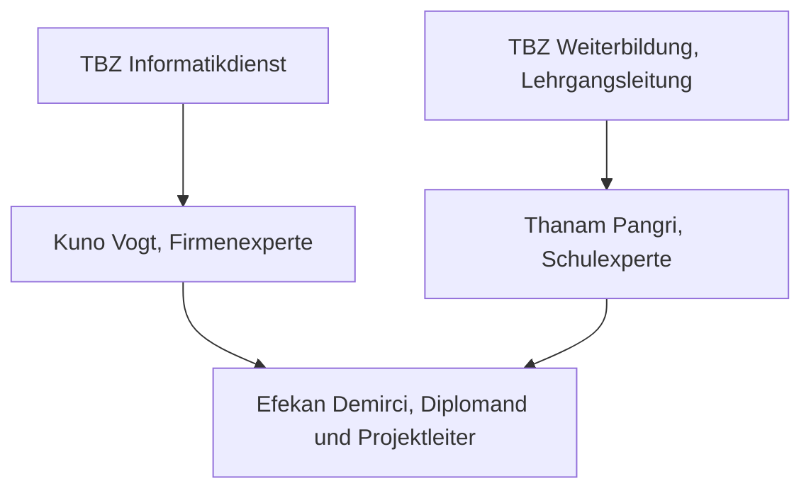
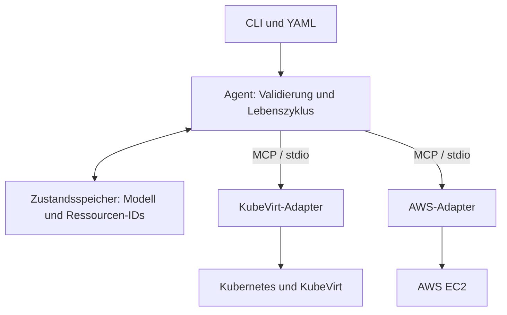

# Diplomarbeit: Agentenbasierte Hybrid-Cloud-Bereitstellung von Lernumgebungen mit Kubernetes, KubeVirt und MCP

!!! info "Lesehinweis"
    Arbeitsstand vom 07.10.2026. Die Infrastrukturaufnahme, der manuelle KubeVirt-Referenzlauf und drei technisch erfolgreiche LernMAAS-Basisläufe mit HTTP, SSH und geprüftem MAAS-Ressourcenabschluss liegen vor. Die Basisserie ist in Kapitel 5.3 dokumentiert. Die Bedienzeit von b01 wurde für b02 und b03 übernommen; die Anzahl der Bedienhandlungen bleibt offen. Der Versuch vom 30.09.2026 ist separat ausgewiesen. Das plattformneutrale Modell und seine lokale Validierung sind implementiert; ihr Prüfstand steht in Kapitel 4.2. Agent, Adapter und die sechs formalen PoC-Läufe sind noch offen. Planung und Entwürfe sind als solche gekennzeichnet.

| | |
| --- | --- |
| Diplomand | Efekan Demirci, ITCNE24, TBZ Höhere Fachschule |
| Auftraggeber | Technische Berufsschule Zürich, Informatikdienst |
| Firmenexperte | Kuno Vogt, Leiter Informatikdienst TBZ |
| Schulexperte | Thanam Pangri, HF-Lehrgangsleitung |
| Bewilligter Zeitraum | 11.09.2026 bis 18.12.2026 |
| Arbeitsplanung | 14.09.2026 bis 18.12.2026 |
| Version | 0.2, Arbeitsstand |
| Grundlage | Bewilligte Projektbeschreibung vom 10.09.2026; schulische Vorgaben gemäss gültigem Merkblatt |

---

## Management Summary

> Wird am Projektende verfasst und zusätzlich als separates Dokument mit unterschriebenem Ehrenwort abgegeben. Grundlage ist das Management Summary aus der bewilligten Projektbeschreibung vom 10.09.2026.

---

## 1 Einleitung

### 1.1 Ausgangslage

Die Technische Berufsschule Zürich stellt für den Unterricht digitale Übungsumgebungen bereit, in denen Lernende praktische technische Aufgaben durchführen. Diese Lernumgebungen werden heute auf einer lokalen Plattform mit MAAS, LernMAAS, Konfigurationsdateien und Shellskripten bereitgestellt. Das Verfahren ist im Betrieb etabliert und bleibt während der gesamten Diplomarbeit unverändert verfügbar.

Die fachliche Beschreibung einer Lernumgebung und ihre technische Bereitstellung sind dabei eng mit dieser Plattform verbunden. Soll dieselbe Lernumgebung auf einer anderen Infrastruktur entstehen, müssen Abläufe, Schnittstellen und Skripte separat angepasst oder neu entwickelt werden. Daraus ergeben sich zusätzlicher manueller Aufwand, eine stärkere Abhängigkeit von spezifischem Wissen einzelner Personen und eine eingeschränkte Wiederverwendbarkeit der bestehenden Beschreibungen.

### 1.2 Problemstellung

Es fehlt ein einheitliches Modell, mit dem eine Lernumgebung unabhängig von der gewählten Plattform beschrieben und über einen gemeinsamen Ablauf verwaltet werden kann. Ohne ein solches Modell bleibt die fachliche Beschreibung an eine einzelne technische Umsetzung gebunden.

Vor einer möglichen späteren Weiterentwicklung der lokalen Lernplattform soll deshalb geklärt werden, ob ein plattformübergreifender Ansatz technisch machbar ist und gegenüber dem heutigen Vorgehen einen nachvollziehbaren Mehrwert bietet.

### 1.3 Zielbild

Eine Lernumgebung wird einmal fachlich beschrieben und über denselben Lebenszyklus entweder lokal oder in der Public Cloud verwaltet. Die Bedienlogik bleibt auf beiden Zielplattformen gleich, während die plattformspezifische Umsetzung davon getrennt ist. Der Ablauf soll reproduzierbar und messbar sein und ohne manuelle technische Entscheidungen auskommen.

Der Proof of Concept liefert damit eine Entscheidungsgrundlage für eine mögliche spätere Weiterentwicklung, ohne die bestehende produktive Umgebung zu verändern.

### 1.4 Zielsetzungen und Erfolgskriterien

Die fünf Teilziele aus der bewilligten Projektbeschreibung bestimmen den Umfang. Im Review wird ihr Nachweisstand geprüft.

| ID | Ziel | Messkriterium | Zielwert | Nachweis | Status |
| --- | --- | --- | --- | --- | --- |
| Z1 | Plattformneutrales Modell für Lernumgebungen | Versioniertes YAML-Modell mit JSON-Schema, gültige Definition wird akzeptiert, ungültige abgewiesen | 1 Modell, 1 Schema, je 1 positiver und 1 negativer Testfall bestehen | Repository, Testprotokoll | Lokal umgesetzt und geprüft; Commit und Push offen |
| Z2 | Zentraler Agent mit Zustandsführung | create, status, reset und delete laufen über festgelegte Zustandsübergänge, Zustand ist persistent | 4 Operationen funktionsfähig, reset erzeugt aus derselben Definition neu | Quellcode, Zustandsdiagramm, Testprotokoll | Offen |
| Z3 | On-Prem-Backend mit Kubernetes und KubeVirt | Test-Lernumgebung wird automatisiert bereitgestellt und vollständig entfernt | 3 vollständige Durchläufe ohne manuelle Korrektur | Laufprotokolle, Screenshots | Offen |
| Z4 | Bewertung der MCP-basierten Adapterarchitektur | Dieselbe Definition läuft lokal und auf genau einer Public Cloud, Bewertung gegen direkte API-Anbindung | 3 vollständige Durchläufe in der Cloud, Bewertung nach 5 Kriterien dokumentiert | Laufprotokolle, Bewertungstabelle | Offen |
| Z5 | Messbarer Vergleich mit dem heutigen Vorgehen | Bereitstellungszeit, manuelle Eingriffe, Reproduzierbarkeit, vollständiger Abbau | Vorher- und Nachher-Werte für denselben Testfall protokolliert | Messprotokoll, Vergleichstabelle | Offen |

Die vorhandenen Machbarkeitsversuche erfüllen diese Ziele noch nicht vollständig.

### 1.5 Erfolgskriterien des Proof of Concept

Der Proof of Concept gilt als erfolgreich, wenn die folgenden Kriterien des verbindlichen Kernumfangs nachgewiesen sind. Sie stammen unverändert aus der bewilligten Projektbeschreibung und bilden zugleich die projektweite Definition of Done.

- Das YAML-Modell und das zugehörige JSON-Schema sind versioniert. Das Modell deckt die ausgewählten Konfigurationsmerkmale der LernMAAS-Profile m239, m254 und m426 ab. Eine gültige Definition wird akzeptiert, eine bewusst ungültige wird abgewiesen, und die technisch reduzierte Test-Lernumgebung ist festgelegt.
- Der Agent validiert die Definition, speichert den Zustand persistent und führt create, status, reset und delete über festgelegte Zustandsübergänge aus. reset löscht die Umgebung und erstellt sie aus derselben Definition neu.
- Die gemeinsame Definition wird über die MCP-basierten Adapter lokal auf einem Kubernetes-Cluster mit KubeVirt und auf genau einer Public-Cloud-Plattform bereitgestellt. Auf beiden Zielplattformen erreicht die VM den festgelegten Zustand und der definierte Testdienst besteht den Readiness-Check.
- Auf jeder Zielplattform werden drei aufeinanderfolgende vollständige Durchläufe durchgeführt, insgesamt sechs. Alle Durchläufe funktionieren ohne manuelle Korrektur.
- Nach jedem delete sind keine dem Testlauf zugeordneten Ressourcen mehr vorhanden.
- Bereitstellungszeit und manuelle Eingriffe sind für das heutige Vorgehen und den Proof of Concept protokolliert. Der Vorher-Nachher-Vergleich sowie die Bewertung der MCP-basierten Architektur gegenüber einer direkten API-Anbindung sind dokumentiert.
- Die gewonnenen Erkenntnisse und die erarbeiteten technischen Komponenten sind hinsichtlich ihrer Übertragbarkeit auf eine mögliche zukünftige produktive Umgebung beurteilt und dokumentiert.

### 1.6 Abgrenzung

Der Umfang ist bewusst so festgelegt, dass der vollständige und messbare Nachweis innerhalb der verfügbaren Projektzeit möglich bleibt. Nicht Teil dieser Arbeit sind:

| Nicht im Umfang | Begründung |
| --- | --- |
| Migration oder Abschaltung der bestehenden MAAS-Umgebung | Die produktive Umgebung bleibt unverändert in Betrieb und dient als Vergleichsbasis |
| Produktiver Betrieb der neuen Infrastruktur | Der Nachweis erfolgt als Proof of Concept, nicht als Einführung |
| Vollständige Umsetzung aller Unterrichtsmodule | Eine technisch reduzierte Test-Lernumgebung genügt für den Nachweis des Lebenszyklus |
| Sprachmodellbasierte Entscheidungslogik | Der Agent arbeitet nach festgelegten Regeln, um Abläufe und Fehlerfälle eindeutig prüfen zu können |
| Bedienoberfläche | Der Nachweis erfolgt über die Kommandozeile, eine Oberfläche liefert für die Fragestellung keinen zusätzlichen Erkenntnisgewinn |
| Zweite Public Cloud | Eine Plattform genügt, um die Austauschbarkeit über die Adapterschicht zu zeigen |
| GitOps oder Argo CD | Wird in dieser Arbeit nicht behandelt |
| Hochverfügbarkeit, verteilter Storage, produktive Skalierung | Betriebsthemen, die erst bei einer produktiven Einführung relevant werden |
| Hardwarebeschaffung und betriebliche Netzwerkumstellungen | Es wird ausschliesslich vorhandene, freigegebene Hardware verwendet |

Diese Punkte werden im Ausblick behandelt.

### 1.7 Zielgruppe und Lesehinweise

Die Dokumentation richtet sich an die beiden Experten, an den Informatikdienst der TBZ und an die HF-Lehrgangsleitung. Sie ist so geschrieben, dass ein fachlich versierter Leser ohne Vorwissen über die TBZ-Umgebung folgen kann. Fachbegriffe werden beim ersten Vorkommen kurz erläutert und zusätzlich im Glossar am Ende der Arbeit erklärt.

### 1.8 Themenfeldabdeckung

Der Schwerpunkt liegt auf Cloud Engineering und Automatisierung. Das Fachmodell und die Adapterschicht betreffen das Schnittstellendesign, KubeVirt die cloud-native Virtualisierung. Projektführung, Wirtschaftlichkeit und Runbook ergänzen die technische Umsetzung. Die Bewertung verbindet diese Bereiche mit der Frage, ob sich der Ansatz für eine spätere Weiterentwicklung der Lernplattform eignet.

## 2 Projektmanagement

### 2.1 Vorgehensmodell

Ich arbeite in drei Iterationen, die in der Planung als Sprints bezeichnet werden. Am Ende steht jeweils ein vorführbarer Zwischenstand. Neue Erkenntnisse aus den Tests fliessen in den nächsten Sprint ein. Ziele, Abgabetermin und Kostenrahmen bleiben durch den bewilligten Antrag vorgegeben.

Das Vorgehen übernimmt Backlog, Review und Retrospektive aus Scrum. Es ist kein vollständiger Scrum-Prozess: Ich arbeite allein, die Abschnitte dauern vier beziehungsweise fünf Wochen, und die Abstimmung mit den Experten findet an vereinbarten Terminen statt. Der Scrum Guide sieht dagegen Sprints von höchstens einem Monat vor. [Scrum Guide](https://scrumguides.org/scrum-guide.html)

Bei Zeitdruck kürze ich zusätzliche Ausarbeitung und Grafiken. Die sechs PoC-Läufe, beide Plattformen, MCP-Bewertung und die vier Inhalte des Runbooks bleiben verbindlich. Änderungen an diesen Zusagen werden mit beiden Experten abgestimmt.

### 2.2 Organisation und Zusammenarbeit


```mermaid
flowchart TD
    Auftraggeber["TBZ Informatikdienst"] --> Firmenexperte["Kuno Vogt, Firmenexperte"]
    Lehrgang["TBZ Weiterbildung, Lehrgangsleitung"] --> Schulexperte["Thanam Pangri, Schulexperte"]
    Firmenexperte --> Diplomand["Efekan Demirci, Diplomand und Projektleiter"]
    Schulexperte --> Diplomand
```

<small><em>Abbildung 1: Projektorganisation und Berichtswege</em></small>

Ich übernehme Planung, Umsetzung, Tests und Dokumentation. Kuno Vogt vertritt den Auftraggeber und wird bei Priorisierung und betrieblichen Fragen einbezogen. Thanam Pangri begleitet die Arbeit als Schulexperte. Beide Experten beurteilen die Ergebnisse und werden bei Änderungen an Zielen oder Fokus einbezogen.

Kuno Vogt ist mein direkter Vorgesetzter im Informatikdienst. Dieses Verhältnis ist offengelegt. Die technische Umsetzung und die Begründung der Entscheidungen bleiben meine Aufgabe. Zu Thanam Pangri besteht das schulische Verhältnis. Weitere Verbindungen ausserhalb der Arbeit sind nicht angegeben.

Dozierende sind die späteren Nutzenden der Lernumgebungen, Lernende deren indirekte Nutzende. Ihr Interesse betrifft vor allem einen verständlichen Ablauf und eine zuverlässig nutzbare Umgebung. Der PoC liefert noch keine produktive Einführung.

Die laufende Abstimmung ist über den vereinbarten Teams-Kanal vorgesehen. Beschlüsse und Rückmeldungen werden mit Datum und Bezug zum betroffenen Issue dokumentiert. Ein geplanter Termin oder ein vorbereitetes Dokument gilt noch nicht als durchgeführtes Gespräch.

### 2.3 Termine und Meilensteine

Der bewilligte Projektzeitraum beginnt am 11.09.2026. Die operative Wochenplanung beginnt am Montag, 14.09.2026, und umfasst 14 Wochen bis zur Abgabe am 18.12.2026. Die Reviewwochen sind Plantermine; konkrete Uhrzeiten und der Kolloquiumstermin werden mit den Experten bestätigt.

| Abschnitt | Zeitraum | Ergebnis am Ende |
| --- | --- | --- |
| Sprint 1 | 14.09. bis 18.10.2026 | Ausgangsmessungen, lokaler Referenzlauf, AWS-Smoke-Test und Architekturentwurf |
| Sprint 2 | 19.10. bis 15.11.2026 | Modell und Agent, vollständiger lokaler Lebenszyklus sowie automatisiertes create, status und delete auf AWS |
| Sprint 3 | 16.11. bis 18.12.2026 | AWS-Reset und Wiederaufnahme, sechs formale PoC-Läufe, Bewertung und Abgabe |

| ID | Meilenstein | Plantermin | Erforderlicher Stand |
| --- | --- | --- | --- |
| M0 | Arbeitsbeginn | 14.09.2026 | Die Experten haben den Antrag geprüft; Projektstart ohne separates Kickoff-Meeting |
| M1 | Erstes Review | Woche vom 19.10.2026 | Vergleichsbasis, lokale Machbarkeit, AWS-Smoke-Test und Architektur liegen vor |
| M2 | Zweites Review | Woche vom 16.11.2026 | Vollständiger lokaler Durchlauf und automatisierter AWS-Durchstich demonstrierbar |
| M3 | Scope-Freeze | 04.12.2026 | Kernfunktionen stehen; danach Fehlerkorrekturen, Messungen und Abschluss |
| M4 | Drittes Review | Woche vom 14.12.2026 | Sechs erfolgreiche PoC-Läufe und Bewertung dokumentiert |
| M5 | Abgabe | 18.12.2026 | Dokumentation, Management Summary, Ehrenwort und vereinbarte Abgabeunterlagen fertig |
| M6 | Kolloquium | Mit Schule bestätigen | Präsentation, kurze Demo und vorbereitete Ersatznachweise verfügbar |

Diese sieben Meilensteine sind Planung. Erreichte Termine werden erst mit einem Nachweis als abgeschlossen geführt. Die Abschlussphase ab 04.12.2026 ist für Tests und Dokumentation vorgesehen und daher kein freier Zeitpuffer.

Für das Kolloquium war auf der bisherigen Einstiegsseite die Woche vom 04.01.2027 vorgemerkt. Diese Angabe ist eine Planannahme; ein verbindlicher Termin ist in den vorliegenden Nachweisen noch nicht belegt.

### 2.4 Backlog und Prioritäten

Der Backlog enthält 38 Stories mit 111 Story Points. Der AWS-Durchstich US39 umfasst drei Punkte in Sprint 2, die Vervollständigung US25 fünf Punkte in Sprint 3. Readiness und Abbauprüfung entstehen bereits mit dem ersten lokalen Durchlauf; US26 und US29 prüfen sie später auf beiden Plattformen formal.

Die versionierte Quelle liegt in `scripts/backlog.json`. Die Skripte erstellen daraus Issue-Vorschläge. Ein abgeglichener lokaler Backlog bedeutet noch nicht, dass das öffentliche Board bereits aktualisiert ist. Das Skript `scripts/sync-project.py` gleicht die Project-Felder für Story Points, Sprint, Epic, Priority und Plantermine mit dem Backlog ab. Ein Tabellenwert im Issue allein setzt diese Project-Felder nicht.

Die Epics bündeln Initialisierung (E1), IST-Aufnahme (E2), lokale Plattform (E3), AWS-Vorbereitung (E4), Fachmodell (E5), Agent (E6), Adapter (E7), Validierung (E8), Bewertung (E9), Betrieb und Schulung (E10) sowie Architektur und Abschluss (E11).

#### Sprint 1

16 Stories, 38 Story Points.

| ID | Aufgabe | Epic | SP | Priorität |
| --- | --- | --- | --- | --- |
| US01 | Repository mit klarer Struktur | E1 | 2 | Must |
| US02 | Öffentlich einsehbares Project Board | E1 | 2 | Must |
| US03 | Vorlagen, Labels, Milestones und Regeln | E1 | 1 | Must |
| US04 | Dokumentation über GitHub Pages | E1 | 2 | Must |
| US05 | Wöchentlicher Statusbericht am Wochenende | E1 | 1 | Must |
| US07 | IST-Analyse der heutigen Bereitstellung | E2 | 2 | Must |
| US08 | Test-Lernumgebung aus m239, m254 und m426 ableiten | E2 | 3 | Must |
| US09 | Messkonzept mit identischen Start- und Endkriterien | E2 | 3 | Must |
| US10 | Ausgangsmessung am heutigen Vorgehen | E2 | 5 | Must |
| US11 | Hardware betriebsbereit und dokumentiert | E3 | 2 | Must |
| US12 | Kubernetes-Cluster verifizieren und dokumentieren | E3 | 2 | Must |
| US13 | KubeVirt verifizieren und Storage klären | E3 | 2 | Must |
| US38 | Referenz-VM manuell erstellen und wieder abbauen | E3 | 3 | Must |
| US14 | AWS-Entscheid und Kontobedingungen begründen | E4 | 2 | Must |
| US15 | Cloud-Smoke-Test mit Budgetwarnung und Quotas | E4 | 3 | Must |
| US16 | Zielarchitektur, ADRs und Zwischenpräsentation 1 | E11 | 3 | Must |

#### Sprint 2

9 Stories, 35 Story Points.

| ID | Aufgabe | Epic | SP | Priorität |
| --- | --- | --- | --- | --- |
| US17 | Plattformneutrales YAML-Modell für Lernumgebungen | E5 | 5 | Must |
| US18 | JSON-Schema mit positiver und negativer Validierung | E5 | 3 | Must |
| US19 | Agent-Grundgerüst mit Kommandozeilenschnittstelle | E6 | 3 | Must |
| US20 | Persistenter Zustandsspeicher mit Zustandsübergängen | E6 | 5 | Must |
| US21 | create und status | E6 | 5 | Must |
| US22 | reset und delete | E6 | 3 | Must |
| US23 | Einheitliches Funktionsset über MCP | E7 | 3 | Must |
| US24 | MCP-Adapter für KubeVirt, erster End-to-End-Durchlauf | E7 | 5 | Must |
| US39 | Automatisierter AWS-Durchstich create, status und delete | E7 | 3 | Must |

#### Sprint 3

13 Stories, 38 Story Points.

| ID | Aufgabe | Epic | SP | Priorität |
| --- | --- | --- | --- | --- |
| US25 | AWS-Adapter um Reset und Wiederaufnahme vervollständigen | E7 | 5 | Must |
| US26 | Readiness auf beiden Plattformen validieren | E8 | 2 | Must |
| US27 | Drei vollständige Durchläufe auf der lokalen Plattform | E8 | 2 | Must |
| US28 | Drei vollständige Durchläufe in der Public Cloud | E8 | 3 | Must |
| US29 | Nachweis des vollständigen Abbaus | E8 | 3 | Must |
| US30 | Vorher-Nachher-Vergleich | E9 | 3 | Must |
| US31 | Bewertung der MCP-Architektur gegen eine direkte API-Anbindung | E9 | 3 | Must |
| US32 | Wirtschaftlichkeitsbetrachtung | E9 | 3 | Must |
| US33 | Beurteilung der Übertragbarkeit in den Produktivbetrieb | E9 | 3 | Must |
| US34 | Runbook für Aufbau, Bedienung, Fehleranalyse und Abbau | E10 | 2 | Must |
| US35 | Schulungsunterlage und Einführung | E10 | 3 | Should |
| US36 | Dokumentation finalisieren, Management Summary, Ehrenwort | E11 | 3 | Must |
| US37 | Kolloquiumspräsentation und Demo-Skript | E11 | 3 | Must |


Must bezeichnet die verbindlichen Ergebnisse und ihre notwendigen Arbeitsschritte. US35 ist als ergänzende Einführung ein Should. Das Runbook bleibt auch bei Zeitdruck vollständig und enthält Aufbau, Bedienung, Fehleranalyse und Abbau. Eine knappe Beurteilung der Produktivübertragbarkeit bleibt ebenfalls bestehen. Zusätzliche Workshops, doppelte Grafiken und ausführliche Wiederholungen werden zuerst gekürzt. Änderungen an verbindlichen Ergebnissen werden mit den Experten abgestimmt.

### 2.5 Aufwand und Kapazität

Die Planung nimmt etwa 14 Stunden pro Woche neben Beruf und Unterricht an. Über 14 Wochen ergeben sich rund 196 Stunden. Das ist eine Kapazitätsannahme, kein gemessener Aufwand. Story Points beschreiben relativ Aufwand und Unsicherheit; sie werden nicht fest in Stunden umgerechnet.

Als erste Orientierung dienen acht Story Points pro Woche. Sprint 2 umfasst den lokalen Lebenszyklus und den AWS-Durchstich und liegt mit 35 Story Points über dem Richtwert von 32.

| Sprint | Wochen | Orientierungsbudget | Backlog | Differenz |
| --- | --- | --- | --- | --- |
| 1 | 5 | 40 SP | 38 SP | -2 SP |
| 2 | 4 | 32 SP | 35 SP | +3 SP |
| 3 | 5 | 40 SP | 38 SP | -2 SP |
| Gesamt | 14 | 112 SP | 111 SP | -1 SP |

Sprint 2 ist überplant. Vor seinem Beginn wird anhand der tatsächlichen Ergebnisse entschieden, welche Vorbereitung vorgezogen werden kann. Priorität haben Modellvalidierung, der lokale Lebenszyklus und der AWS-Durchstich. Die zusätzliche Einführung aus US35 ist die erste verzichtbare Ausarbeitung. Die Schätzung wird anhand der Umsetzungserfahrungen überprüft.

Für die Schätzung verwende ich 1, 2, 3, 5 und 8 Punkte. US01 dient mit zwei Punkten als Bezug. Grössere Stories werden in überprüfbare Ergebnisse zerlegt. Nach jedem Sprint werden abgeschlossene Punkte und tatsächliche Stunden gegenübergestellt. Offene Stories zählen nicht anteilig als fertig. Bisher liegen keine abgeschlossenen Sprintwerte vor.

### 2.6 Arbeitsweise und Qualität

#### Ablagestruktur {#ordner}

Diese Datei ist die einzige fachliche Dokumentation. Sie enthält Projektstand, Entscheidungen, Erklärungen, vollständige Beispiele, Bedienungsanleitungen, Tests, Ergebnisse und später das Runbook. README und Einstiegsseite sind nur Wegweiser hierher. Zum Lesen und Nachvollziehen der Arbeit ist kein Wechsel auf weitere Dokumentationsseiten nötig. Separate Dateien bleiben für ausführbaren Code, Schemata, Testdaten und unveränderte Rohbelege erforderlich.

Fachliche Ordner und neue zugehörige Dateien werden deutsch und ohne Umlaute benannt, etwa `modell/beispiele` und `referenz.yaml`. `docs`, `scripts`, `tests`, `.github`, `stylesheets` und `javascripts` bleiben als etablierte technische Namen bestehen. Bereits veröffentlichte Rohbelege behalten ihre Namen, damit Verweise, Prüfsummen und historische Protokolle nachvollziehbar bleiben. Feldnamen im maschinenlesbaren Modell bleiben einheitlich englisch.

```text
diplomarbeit/
  docs/
    dokumentation.md
    index.md
    messungen/
      laeufe/
    nachweise/
    stylesheets/
    javascripts/
  modell/
    lernumgebung-v1.schema.json
    validierung.py
    beispiele/
      referenz.yaml
      ungueltig-ram.yaml
  scripts/
    modell-pruefen.py
    backlog.json
  tests/
    test_modell.py
  .github/
    workflows/
    ISSUE_TEMPLATE/
  README.md
  requirements.txt
  requirements-docs.txt
  mkdocs.yml
```

Der Baum zeigt die wesentlichen Ablagen. Weitere bestehende Hilfsskripte, Testmodule und Rohdateien liegen in den jeweils bezeichneten Ordnern.

| Ablage | Inhalt und Stand |
| --- | --- |
| `docs/dokumentation.md` | Zentrale fachliche Dokumentation einschliesslich Architekturentscheiden, Messplan, Laufberichten, Statusberichten und späterem Runbook; Diagramme als Mermaid |
| `docs/nachweise/` und `docs/messungen/` | Rohprotokolle, ausgeführte Manifeste und weitere Nachweisdateien; Einordnung und Ergebnisse stehen in der zentralen Dokumentation |
| `docs/index.md`, `docs/stylesheets/` und `docs/javascripts/` | Einstiegsseite und Darstellung der veröffentlichten Dokumentation |
| `scripts/` | Backlog sowie Hilfswerkzeuge für Issues, Project Board, Repository-Prüfung und HTTP-Beobachtung |
| `modell/` | Schema der Modellversion 1.0, YAML-Beispiele und wiederverwendbare lokale Validierung |
| `requirements.txt` | Festgeschriebene direkte Abhängigkeiten der Modellvalidierung |
| `tests/` | Tests für Fachmodell und Hilfswerkzeuge; noch keine Tests einer implementierten Agentenlösung |
| `.github/`, `mkdocs.yml` und `requirements-docs.txt` | Issue-Vorlagen, Veröffentlichung und Build-Konfiguration |

README und Einstiegsseite verweisen direkt auf diese Dokumentation. Beteiligte, Zeitraum und verbindlicher Umfang stehen am Anfang dieser Datei.

Fachmodell und JSON-Schema liegen unter `modell/`. Agent, Zustandsspeicher und MCP-Adapter sind geplante Laufzeitkomponenten. Ihre Quellcodeablage wird mit der Implementierung festgelegt; sie sind noch nicht als vorhandene Lösung ausgewiesen.

#### Vorgehen und Prüfungen

Zu Sprintbeginn werden Ziel, Abhängigkeiten und verfügbare Zeit geprüft. Höchstens zwei Issues stehen gleichzeitig auf In Progress. Ich arbeite direkt auf main und halte zusammengehörige Änderungen in kleinen, nachvollziehbaren Commits fest. Vor dem Commit prüfe ich die Änderungen lokal. Die Commit-Nachricht beschreibt die Änderung und nennt bei Bedarf die zugehörige User Story.

Eine Story ist fertig, wenn ihre Akzeptanzkriterien erfüllt sind, die Änderung geprüft ist und der passende Nachweis vorliegt. Bei Infrastrukturarbeiten ist das ein Protokoll vom Zielsystem. Ein erfolgreicher Dokumentationsbuild beweist keine funktionierende Infrastruktur. Offene Nachweise werden ausdrücklich benannt.

Bei Änderungen an Dokumentation, Skripten, Tests oder Build-Konfiguration auf main prüft die Pipeline die Dateien und baut MkDocs im strikten Modus mit festgeschriebenen direkten Abhängigkeiten. Die Veröffentlichung erfolgt nur vom Hauptbranch. Tests für Modell, Zustandsspeicher und Adapterverhalten werden mit der Implementierung ergänzt. Ein Testadapter kann Fehler reproduzierbar auslösen. Auch direkte SDK-Aufrufe lassen sich isoliert testen, beispielsweise mit Botocore Stubber. [Botocore Stubber](https://docs.aws.amazon.com/botocore/latest/reference/stubber.html)

Die sechs vollständigen Lebenszyklen werden auf den Zielplattformen durchgeführt und separat protokolliert. Im Review zeige ich einen kurzen ausgewählten Ablauf und erkläre, was die Tests belegen und was offen bleibt. Dauer und Ablauf der Präsentation richten sich nach dem bestätigten Zeitrahmen. Vor jedem Review ist eine Generalprobe vorgesehen.

Nach dem Review werden die Rückmeldungen und höchstens drei Verbesserungen für den nächsten Sprint festgehalten. Eine Retrospektive beschreibt konkrete Erfahrungen; ein leeres Schema ersetzt keine Reflexion.

### 2.7 Wöchentlicher Statusbericht

Jeden Samstag oder Sonntag erstelle ich einen kurzen [Statusbericht](#statusberichte). Darin halte ich fest, was ich in der vergangenen Woche erledigt habe und was ich in der nächsten Woche angehen werde. Ergebnisse verlinke ich bei Bedarf direkt. Probleme, Verzögerungen oder benötigte Rückmeldungen ergänze ich, wenn sie den weiteren Verlauf beeinflussen.

Die Berichte begleiten das Projekt ab KW38 und werden direkt in Kapitel 8 geführt. Dafür verwende ich eine gemeinsame [Vorlage](#statusvorlage).

### 2.8 Änderungen und Risiken

Technische Details und die Reihenfolge innerhalb des bewilligten Umfangs werden im Statusbericht oder als Architekturentscheid festgehalten. Ein geänderter Projektfokus oder der Wegfall eines zugesagten Ergebnisses wird mit Anlass, Auswirkungen und Alternativen beiden Experten vorgelegt. Ein Entscheid gilt erst nach tatsächlicher Rückmeldung als abgestimmt.

Die folgende Risikobewertung ist eine Planungseinschätzung. Eintrittswahrscheinlichkeit (EW) und Auswirkung (AW) liegen auf einer Skala von 1 bis 5; ihr Produkt hilft bei der Priorisierung. Die Werte sind keine gemessenen Wahrscheinlichkeiten. Hohe Werte ab 12 werden wöchentlich besonders geprüft.

| ID | Risiko | EW | AW | Wert | Strategie | Frühwarnindikator | Massnahme |
| --- | --- | --- | --- | --- | --- | --- | --- |
| R01 | Technische Komplexität der Kombination aus Kubernetes, KubeVirt, Zustandsführung, MCP und Public Cloud | 4 | 4 | 16 | Vermindern | Eine Story aus E6 oder E7 überschreitet ihre Schätzung um mehr als das Doppelte | Frühe Smoke-Tests auf beiden Zielplattformen, Verzicht auf optionale Erweiterungen zugunsten des vollständigen Lebenszyklus, Zeitbox von zwei Arbeitseinheiten pro Blockade mit anschliessendem Entscheid über einen Alternativweg |
| R02 | Cloud-Ressourcen und Kosten: ungenügende Quotas, eingeschränkte Dienstverfügbarkeit oder unerwartete Kosten | 3 | 3 | 9 | Vermindern | Quota-Fehlermeldung beim Smoke-Test, Budgetwarnung über 50 Prozent | Quotas und Dienste im Cloud-Smoke-Test in Sprint 1 prüfen, Budgetwarnungen bei CHF 25 und CHF 40, Ressourcen minimal halten, nach jedem Test sofort löschen |
| R03 | Zeitmanagement: der Umfang überschreitet die verfügbare Projektzeit | 4 | 5 | 20 | Vermindern | Kritischer Durchstich bleibt offen oder die nächste Meilensteinprognose verschiebt sich | Verbindlich begrenzter Kernumfang, eine technisch reduzierte Test-Lernumgebung, Scope-Freeze am 04.12.2026, festgelegte Reihenfolge der Umfangsreduktion, Abschlusszeit ab Scope-Freeze, deren tatsächliche Verfügbarkeit wöchentlich geprüft wird |
| R05 | Unvollständiger Teardown und Zustandsabweichungen: nach delete bleiben Ressourcen zurück oder der gespeicherte Zustand weicht vom tatsächlichen ab | 3 | 3 | 9 | Vermindern | Ein Lauf findet nach delete noch zugeordnete Ressourcen | Wiederholbare Operationen, Statusprüfung vor und nach jeder Aktion, Ressourceninventar mit IDs und ergänzender Laufkennzeichnung, automatisierter Cleanup-Test mit Warten auf den Endzustand |
| R06 | Hardwareausfall im HF-Labor | 2 | 3 | 6 | Vermindern | Ein Knoten erscheint nach einem Neustart nicht mehr | Clusteraufbau und Konfiguration reproduzierbar dokumentiert, kvcontrol als möglicher Ersatz; Referenztest vor Nutzung erforderlich |
| R07 | Verfügbarkeit der Experten: Termine für Zwischenpräsentationen lassen sich nicht rechtzeitig vereinbaren | 2 | 3 | 6 | Vermindern | Keine Terminbestätigung 10 Arbeitstage vor dem geplanten Termin | Alle drei Termine direkt mit den Experten abstimmen und in die Kalender legen, Ersatztermin in derselben Woche vorschlagen |
| R08 | Dokumentationsrückstand: die Dokumentation wird erst am Projektende nachgezogen | 3 | 4 | 12 | Vermeiden | Ein Issue erreicht Done ohne zugehörigen Dokumentationsabschnitt | Dokumentationsabschnitt ist Teil der Definition of Done, Dokumentationsnachweise in der Qualitätsampel, Doku-Stand ist fester Punkt jeder Retrospektive |
| R09 | Reifegrad und Änderungen im MCP-Umfeld | 3 | 3 | 9 | Vermindern | Ein verwendetes Werkzeug meldet inkompatible Änderungen | Verwendete Versionen früh festschreiben, Adapterschnittstelle schmal halten, direkte API-Anbindung als Vergleich verwenden; ein Wegfall von MCP wäre eine Änderung des bewilligten Kerns |
| R10 | Persönliche Kapazität: Krankheit oder beruflicher Engpass reduziert die verfügbare Zeit | 3 | 4 | 12 | Vermindern | Zwei aufeinanderfolgende Wochen unter 8 Stunden Projektzeit | Verfügbare Wochenkapazität prüfen; bei Unterschreitung optionale Ausarbeitung kürzen, Planung aktualisieren und den Firmenexperten informieren |
| R11 | Verlust des Remote-Zugangs zu den Zielsystemen nach Neustart oder Netzwerkänderung | 3 | 4 | 12 | Vermeiden | Eine Maschine ist nach einem Neustart über WireGuard nicht mehr erreichbar | Netzwerk- und WireGuard-Konfiguration vor Änderungen sichern und die Erreichbarkeit nach Neustarts prüfen |

Der mögliche Ersatz auf kvcontrol senkt das Ausfallrisiko erst dann wirksam, wenn ein eigener Referenzlauf bestanden ist. Änderungen der Risikobewertung werden mit Datum und Anlass im Statusbericht geführt.

### 2.9 Wirtschaftlichkeit und frühere Erfahrungen

Die spätere Kosten-Nutzen-Betrachtung verwendet aktive Bedienzeit, Zahl manueller Handlungen, Cloud-Verbrauch und tatsächlich erfassten Projektaufwand. Wartezeit wird separat ausgewiesen. Eine Semesterhochrechnung nennt die angenommene Zahl von Umgebungen und bleibt ein Szenario, solange kein belegter Nutzungswert vorliegt. Aus dem Einzel-VM-PoC werden keine Energieeinsparung oder Produktivskalierung abgeleitet.

Aus den Semesterarbeiten übernehme ich vor allem drei Verbesserungen: Demos früh vorbereiten, Tests verständlich erklären und tatsächliche Rückmeldungen sichtbar verarbeiten. Dazu kommen ein früh zugängliches Board und eine laufende Dokumentation. Ob diese Massnahmen geholfen haben, wird am Projektende anhand des tatsächlichen Verlaufs beurteilt.

## 3 Analyse und Konzept

### 3.1 Ausgangslage der Infrastruktur

Vor der Umsetzung wurde erhoben, welche Infrastruktur tatsächlich zur Verfügung steht. Die Erhebung erfolgte am 14.09.2026, dem ersten Projekttag, mit einem rein lesenden Auditlauf über beide freigegebenen Systeme. Die verfügbaren Ausgaben liegen unter [Nachweise](#nachweise). Für die zusammenfassende MAAS-Aufnahme fehlen noch der vollständige Auditexport und ein Snapshot der ausgeführten Hilfsskripte.

#### 3.1.1 Freigegebene Hardware

Für die Diplomarbeit habe ich vollen Zugang zur Hardware und darf den DL380 sowie die Terra-Rechner vollumfänglich nutzen. Es besteht keine ausstehende Nutzungsfreigabe für diese Maschinen.

Die folgenden technischen Werte sind durch die Systemaufnahme der Hosts `dl380-01` und `kvcontrol` belegt. Hostnamen und Messwerte werden entsprechend den Rohprotokollen angegeben.

| System | Hostname | CPU | Arbeitsspeicher | Datenträger | Rolle im Projekt |
| --- | --- | --- | --- | --- | --- |
| HP DL380 | `dl380-01` | Intel Xeon E5-2620 v3, 24 logische Kerne | 125 GB, davon 121 GB frei | 1,7 TB, davon 1,6 TB frei | Zielplattform für die Umsetzung |
| Terra | `kvcontrol` | Intel Core i7-9700T, 8 Kerne | 15 GB, davon 12 GB frei | 238 GB NVMe, davon 184 GB frei | Zweitsystem und Ausweichumgebung |
| Terra, vier weitere | noch nicht in Betrieb genommen | | | | Reserve, im Proof of Concept nicht benötigt |

Beide Systeme liefen bei der Erhebung unter Ubuntu 24.04.4 LTS. Die Werte beschreiben diesen Zeitpunkt. Für die reduzierte einzelne VM sind die Ressourcen beider Systeme grundsätzlich plausibel; der praktische Nachweis erfolgt auf dl380-01.

#### 3.1.2 Zugang und Netzwerk

Der Zugriff erfolgt über eine WireGuard-Verbindung in das HF-Labor-Netz und anschliessend über SSH mit dem lerncloud-Schlüssel. Beide Systeme sind WireGuard-Clients mit je einem Peer, dem Gateway. Die drei Interfaces bilden die drei Klassennetze des HF-Labors ab.

```text
--- Netzwerk dl380-01 ---
eno1             UP             10.0.21.197/24
wg1.24           UNKNOWN        10.1.24.5/24
wg2.24           UNKNOWN        10.2.24.5/24
wg3.24           UNKNOWN        10.3.24.5/24
default via 10.0.21.1 dev eno1 proto dhcp src 10.0.21.197
```

Die Haupt-Netzwerkkarte hängt im allgemeinen Netz 10.0.21.0/24, die Verwaltung erfolgt über 10.1.24.5. Die Schnittstellen `eno2` bis `eno4` sind vorhanden, aber nicht aktiv. Der freigegebene Switch im Netz 10.0.26.0/24 ist zum Zeitpunkt der Erhebung noch nicht angebunden.

Daraus ergibt sich ein Risiko: Der Fernzugriff auf beide Systeme hängt an der WireGuard-Verbindung, die auf denselben Maschinen terminiert. Ein Neustart oder eine Änderung der Netzwerkkonfiguration kann den eigenen Zugang unterbrechen. Dieser Sachverhalt ist als Risiko R11 erfasst.

#### 3.1.3 Vorgefundener Zustand auf dl380-01

Auf dem Zielsystem lief bei Projektbeginn bereits eine vollständige Plattform.

```text
NAME       STATUS   ROLES                  AGE   VERSION   INTERNAL-IP    CONTAINER-RUNTIME
dl380-01   Ready    control-plane,master   20d   v1.35.6   10.0.21.197    containerd://2.1.6
```

| Komponente | Zustand |
| --- | --- |
| MicroK8s | v1.35.6, Einzelknoten, nicht hochverfügbar, eingerichtet am 25.08.2026 |
| Netzwerk im Cluster | Calico |
| Aktivierte Erweiterungen | dns, ha-cluster, helm, helm3, hostpath-storage, metrics-server, rbac, cert-manager |
| KubeVirt | v1.9.0, Zustand `Deployed`, inklusive Export-Proxy und Vorlagenverwaltung |
| CDI, Containerized Data Importer | vorhanden, vier Komponenten aktiv |
| Kommandozeilenwerkzeug | `virtctl` unter `/usr/local/bin/virtctl` |
| Virtualisierung auf dem Host | `vmx` vorhanden, Kernelmodul `kvm_intel` geladen, keine aktive Nutzung |
| Laufende virtuelle Maschinen | keine |
| Fachliche Arbeitslasten | keine Test-VMs; die bestehende PVC `default/data-claim` mit PV `rwm-volume` gehört zur Basis und wird nicht entfernt |

```text
--- KubeVirt Phase ---
Deployed  Version: v1.9.0

--- StorageClasses ---
NAME                          PROVISIONER                    RECLAIMPOLICY   VOLUMEBINDINGMODE
local-storage                 kubernetes.io/no-provisioner   Delete          Immediate
microk8s-hostpath (default)   microk8s.io/hostpath           Delete          WaitForFirstConsumer
```

Nicht vorhanden sind ein Ingress-Controller und ein Load-Balancer. Die Erreichbarkeit von Diensten muss deshalb über andere Mechanismen gelöst werden, siehe ADR-002.

#### 3.1.4 Zweitsystem kvcontrol

Auf `kvcontrol` läuft ein eigenständiges, vom Zielsystem getrenntes MicroK8s derselben Version, eingerichtet am 28.07.2026, ebenfalls mit KubeVirt und CDI, jedoch ohne cert-manager, Export-Proxy und Vorlagenverwaltung. Es wurden keine Test-VMs erfasst. Vorhandene Infrastrukturressourcen sind dadurch nicht ausgeschlossen.

Der Name des Hosts legt nahe, dass er ursprünglich als Steuerknoten für eine KubeVirt-Umgebung vorgesehen war. Für diese Arbeit ist er als möglicher Ersatz vorgesehen. Vor einer Nutzung muss derselbe Referenzlauf einschliesslich Abbau bestanden werden. Ein fertiger Ausweichweg ist bisher nicht nachgewiesen.

#### 3.1.5 Einordnung der übernommenen Vorarbeit

Der Kubernetes-Cluster und die KubeVirt-Installation auf beiden Systemen waren bei Projektbeginn bereits vorhanden und sind nicht Eigenleistung dieser Arbeit. Die Einrichtungsdaten, 28.07.2026 und 25.08.2026, liegen vor dem Projektstart am 14.09.2026 und sind im Cluster nachvollziehbar.

Die bewilligte Projektbeschreibung verlangt, dass übernommene Vorarbeiten nachvollziehbar dokumentiert werden. Diese Kennzeichnung erfüllt diese Anforderung.

Die Eigenleistung dieser Arbeit beginnt oberhalb dieser Plattform und umfasst:

- die Verifikation und Dokumentation des vorgefundenen Zustands
- das plattformneutrale Fachmodell und dessen Validierung
- den Agenten mit Zustandsführung
- die MCP-basierte Adapterschicht für beide Zielplattformen
- die Messung, den Vergleich und die Bewertung

Der Umstand, dass die Plattform bereitstand, verändert den Umfang der Arbeit gegenüber der bewilligten Projektbeschreibung nicht. Er verschiebt lediglich Aufwand von der Einrichtung zur Verifikation. US12 und US13 umfassen jeweils zwei Story Points für Verifikation und Dokumentation. US38 deckt den vollständigen Referenzlauf ab.

#### 3.1.6 Architekturentscheide aus der Erhebung

Aus dem vorgefundenen Zustand ergeben sich drei Entscheide, die vor der Umsetzung getroffen werden mussten.

**ADR-001: dl380-01 als Zielplattform**

| | |
| --- | --- |
| Status | Entschieden am 14.09.2026 |
| Kontext | Zwei gleichwertig eingerichtete KubeVirt-Umgebungen stehen zur Verfügung |
| Entscheid | Die Umsetzung erfolgt auf `dl380-01`, `kvcontrol` dient als Ausweichumgebung |

Begründung: Auf dl380-01 steht die benötigte Plattform bereits bereit und der erste VM-Versuch wurde dort durchgeführt. Die vorhandenen Reserven sind ausreichend. Die sechs PoC-Läufe erfolgen nacheinander mit vollständigem Abbau; ihr Speicherbedarf summiert sich deshalb nicht über alle Läufe. Für die Auswahl ist kein Mehrmaschinenbetrieb erforderlich.

Verworfene Alternative: Zusammenschluss beider Systeme zu einem Cluster mit zwei Knoten. Ein Mehrknoten-Cluster ist in der bewilligten Projektbeschreibung ausdrücklich dem Ausblick zugeordnet und nicht Teil des Umfangs. Zudem würde der Zusammenschluss Eingriffe in die Netzwerkkonfiguration erfordern, die den Fernzugriff gefährden.

**ADR-002: NodePort für die Erreichbarkeit des Testdienstes**

| | |
| --- | --- |
| Status | Entschieden am 14.09.2026 |
| Kontext | Der Readiness-Check muss den Testdienst in der virtuellen Maschine automatisiert erreichen. Auf dem Cluster sind weder ein Ingress-Controller noch ein Load-Balancer vorhanden |
| Entscheid | Der Testdienst wird über einen Service vom Typ NodePort erreichbar gemacht |

Geprüfte Alternativen:

| Weg | Bewertung |
| --- | --- |
| NodePort | Gewählt. Standardmittel von Kubernetes, keine Änderung an der Plattform nötig, aus dem Verwaltungsnetz direkt erreichbar, vom Adapter mit wenigen Zeilen erzeugbar |
| Weiterleitung über `virtctl port-forward` | Verworfen. Für manuelle Arbeit geeignet, für einen automatisierten Check jedoch umständlich, weil der Agent einen Prozess offen halten müsste |
| Multus mit Netzwerkbrücke, Maschine erhält eine Adresse im Labornetz | Verworfen für den Proof of Concept. Am nächsten an einer produktiven Lernumgebung, erfordert aber Eingriffe in die Netzwerkkonfiguration des Systems, das den Fernzugriff trägt. Wird im Ausblick als produktionsnaher Weg behandelt |

**ADR-003: microk8s-hostpath als Speicherklasse**

| | |
| --- | --- |
| Status | Entschieden am 14.09.2026 |
| Kontext | Zwei Speicherklassen stehen zur Verfügung |
| Entscheid | Virtuelle Maschinen verwenden `microk8s-hostpath` |

Begründung: `local-storage` verwendet den Provisioner `kubernetes.io/no-provisioner` und legt keine Datenträger selbst an. Jede virtuelle Maschine würde damit ein von Hand erstelltes PersistentVolume benötigen. Solche manuellen Schritte sollen durch diese Arbeit entfallen. `microk8s-hostpath` ist die Standardklasse des Clusters, legt Datenträger bei Bedarf an. Die beobachtete Speicherklasse hat die Reclaim Policy Delete; ob der zugehörige PV tatsächlich entfernt wird, muss nach jedem Lauf geprüft werden.

Einschränkung, die bewusst in Kauf genommen wird: `microk8s-hostpath` bindet Daten an einen einzelnen Knoten. Auch im Einzelknotenbetrieb bleiben Hostausfall und lokaler Datenverlust relevant. In einem Mehrknotenbetrieb wäre lokaler Storage weiterhin möglich, würde aber Platzierung und Ausfallsicherheit begrenzen. Ein verteilter Speicher wäre eine mögliche spätere Lösung.

#### 3.1.7 Umgebung der Ausgangsmessung

Die heutige Bereitstellung über LernMAAS läuft nicht auf `dl380-01`, sondern auf einer eigenen, davon vollständig getrennten Anlage. Diese wurde am 14.09.2026 lesend erhoben.

**Aufbau der Anlage**

Fünf Racks, je ein eigenes Netz und ein eigener MAAS-Controller:

| Rack | Netz | MAAS-Controller | KVM-Hosts |
| --- | --- | --- | --- |
| rack-au-01 | 10.0.41.0/24 | `cloud-au-2` | `cloud-au-03` bis `cloud-au-08` |
| rack-au-02 | 10.0.42.0/24 | `cloud-au-09` | `cloud-au-10` bis `cloud-au-15` |
| rack-au-03 | 10.0.43.0/24 | `cloud-au-16` | `cloud-au-17` bis `cloud-au-22` |
| rack-au-04 | 10.0.44.0/24 | `cloud-au-23` | `cloud-au-24` bis `cloud-au-29` |
| rack-au-05 | 10.0.45.0/24 | `cloud-au-30` | `cloud-au-31` bis `cloud-au-36` |

Je Rack sieben Maschinen, ein Controller und sechs Virtualisierungshosts. Die Controller-Namen wurden auf allen fünf Racks direkt abgefragt, die Zuordnung der Hosts ist für Rack 5 geprüft und für die übrigen aus dem durchgehenden Siebenerabstand abgeleitet.

Insgesamt bestehen damit fünf eigenständige MAAS-Installationen, 30 Virtualisierungshosts und 20 VPN-Umgebungen. In der Aufnahme wurde keine übergeordnete Steuerung über die Racks dokumentiert.

**Hardware**

Stellvertretend `cloud-au-31`:

| Merkmal | Wert |
| --- | --- |
| Modell | HP ProDesk 600 G1 SFF |
| CPU | Intel Core i7-4790, 8 logische Kerne |
| Arbeitsspeicher | 32 GiB |
| Datenträger | 1 TB, ein Datenträger |
| Betriebssystem | Ubuntu 22.04 LTS |
| Firmware | L01 v02.77 vom 17.04.2019, Boot-Modus PXE |
| Stromsteuerung in MAAS | Manual |

Der letzte Punkt ist für die Bewertung des heutigen Verfahrens wesentlich: MAAS kann diese Maschinen nicht selbst ein- und ausschalten. Für die virtuellen Maschinen gilt das nicht, sie werden über `Virsh` gesteuert. Automatisiert steuerbar sind damit die virtuellen Maschinen, nicht aber die physischen Systeme, auf denen sie laufen.

**Netz- und Zonenmodell**

Je Rack existiert in MAAS genau ein Subnetz, für Rack 5 also `10.0.45.0/24` mit MAAS-eigenem DHCP und 62 Prozent freien Adressen. Die vier VPN-Umgebungen eines Racks sind keine eigenen Subnetze, sondern Availability Zones nach dem Namensschema `10-<VPN>-<Rack>-0`. Alle Maschinen liegen im selben Subnetz; die Trennung nach VPN erfolgt ausserhalb von MAAS auf dem Gateway.

Belegung in Rack 5 zum Erhebungszeitpunkt:

| Zone | Maschinen |
| --- | --- |
| `10-1-45-0` | 0 |
| `10-2-45-0` | 0 |
| `10-3-45-0` | 0 |
| `10-4-45-0` | 24 |
| `default` | 6 Hosts, 1 Controller |

Für die Ausgangsmessung ist die Zone `10-1-45-0` vorgesehen. Bei der Aufnahme war sie ohne Testmaschinen. Vor jedem neuen Lauf wird der Bestand erneut geprüft und die Zuordnung der eigenen Ressourcen gesichert.

**Abweichung zwischen Reservationsliste und Systemzustand**

Die zentrale Reservationsliste weist für Rack 5 alle vier Umgebungen als frei aus. In MAAS stehen jedoch 24 bereitgestellte Maschinen des Moduls m437 mit dem Merkmal `m437-ICT23d` in der Zone `10-4-45-0`, die meisten davon eingeschaltet, mit Ubuntu 24.04 LTS und Adressen von 10.0.45.75 aufwärts.

Ob diese Umgebung derzeit im Unterricht verwendet wird, ist für diesen Befund nicht massgeblich. Massgeblich ist, dass die Liste sie in keinem der beiden Fälle führt: weder als belegt noch als abgeräumt. Die Belegung der Umgebungen wird damit ausserhalb des Systems geführt, und der geführte Stand weicht vom tatsächlichen ab. Die vollständige Aufnahme ist vor der abschliessenden Bewertung als Rohbeleg zu ergänzen.

**Umgang mit Zugangsdaten**

Die WireGuard-Konfigurationen der Umgebungen liegen als base64-kodiertes Archiv im Beschreibungsfeld der jeweiligen Availability Zone und enthalten private Schlüssel. Diese Dokumentation beschreibt den Mechanismus, gibt aber keine Inhalte wieder. Gleiches gilt für Anmeldedaten der Oberfläche und für die Klartextangaben in den cloud-init-Vorlagen des öffentlichen lerncloud-Projekts.

**Gegenüberstellung**

| Merkmal | LernMAAS-Umgebung | Zielplattform dieser Arbeit |
| --- | --- | --- |
| Hardware | HP ProDesk 600 G1, i7-4790, 8 logische Kerne, 32 GiB | HP DL380, Xeon E5-2620 v3, 24 Kerne, 125 GB |
| Bereitstellung | MAAS mit `createvms`, Konfigurationsdatei, Shellskripte, Oberfläche | Kubernetes mit KubeVirt |
| Steuerung | fünf getrennte Controller | ein Cluster |
| Netzzuordnung | Availability Zones je VPN | Namensraum und Label |

Der Unterschied in der Hardware ist erheblich und begründet die Trennung der Messgrössen im Messkonzept.

### 3.2 IST-Analyse der heutigen Bereitstellung

#### 3.2.1 Beteiligte Komponenten

| Komponente | Aufgabe |
| --- | --- |
| MAAS | Verwaltung der Maschinen, DHCP, PXE, Installation des Betriebssystems |
| `config.yaml` | Zentrale Beschreibung aller Modulprofile, Grösse und Dienste der virtuellen Maschinen |
| `createvms` | Legt Resource Pool und virtuelle Maschinen anhand eines Profils an |
| `updateaz` | Erzeugt WireGuard-Schlüssel und legt sie in der Availability Zone ab |
| cloud-init | Erstkonfiguration beim ersten Start, bindet Dienste und Modul-Repositories ein |
| Modul-Repositories | Je Modul ein eigenes Repository mit Installationsskripten und Anleitung |
| Reservationsliste | Tabelle, in der die Belegung der VPN-Umgebungen von Hand geführt wird |

#### 3.2.2 Die zentrale Konfigurationsdatei

Laut Analyse beschreibt die `config.yaml` 28 Modulprofile. Der zugehörige Originalsnapshot ist noch zu ergänzen. Sie ist die fachliche Beschreibung der heutigen Lernumgebungen und wird laut ihrem eigenen Kopfkommentar sowohl von cloud-init als auch von allen Hilfsskripten verwendet.

Die drei für diese Arbeit massgeblichen Profile:

| Feld | m239 | m254 | m426 |
| --- | --- | --- | --- |
| `vm.storage` | 8 | 12 | 8 |
| `vm.memory` | 2048 | 2048 | 3584 |
| `vm.cores` | 2 | 2 | 2 |
| `vm.count` | 24 | 20 | 6 |
| `services.nfs` | true | true | true |
| `services.docker` | false | false | true |
| `services.k8s` | leer | k3s | minimal |
| `services.wireguard` | use | use | use |
| `services.ssh` | generate | generate | generate |
| `services.samba` | true | false | false |
| `services.firewall` | false | false | false |
| `repositories` | tbz-it/M239 | tbz-it/M254 | tbz-it/M426 |

Daraus lässt sich die fachliche Struktur der heutigen Beschreibung ablesen: Grösse der Maschine, Anzahl, ein Satz von Diensten als Schalter und ein Verweis auf ein Modul-Repository.

Für die Einordnung ist wesentlich, dass eine deklarative Beschreibung der Lernumgebungen heute bereits existiert. Die vorliegende Arbeit erfindet sie nicht, sondern setzt an ihren Grenzen an. Diese sind:

| Merkmal | heutige `config.yaml`, vorläufige Analyse | Fachmodell, geplant |
| --- | --- | --- |
| Deklarativ | ja | ja |
| Schema-Validierung | In den vorliegenden Läufen nicht nachgewiesen; Skriptstand noch sichern | JSON Schema |
| Plattformneutral | nein, die Felder zielen auf `maas pod compose` | ja |
| Dienste | boolesche Schalter, umgesetzt in Shellskripten | fachlich beschriebener Zielzustand mit prüfbarem Readiness-Kriterium |
| Gemeinsamer Lebenszyklus | Im beobachteten Hilfsskript nicht vollständig enthalten; MAAS besitzt eigene Maschinenzustände | create, status, reset, delete über festgelegte Zustandsübergänge |
| Abbau | nicht Teil der Beschreibung | Teil des Lebenszyklus, mit Nachweis |

#### 3.2.3 Verteilung der Konfiguration

Laut Aufnahme liegt die `config.yaml` auf fünf Controllern in getrennten Git-Arbeitsverzeichnissen. Notiert wurden dieselbe gekürzte Prüfsumme `965e401d…` und der Commit `1f105a7` vom 31.12.2025. Der vollständige Vergleichsoutput liegt im Repository nicht vor und muss vor einer endgültigen Aussage ergänzt werden.

Mehrere lokale Kopien erfordern einen geregelten Aktualisierungsablauf. Aus unterschiedlichen Dateizeitstempeln allein lässt sich jedoch weder eine inhaltliche Abweichung noch das Fehlen jeglicher zentraler Steuerung beweisen.

#### 3.2.4 Das Skript `createvms`

Der beobachtete Aufruf lautet `createvms <config.yaml> <Modul> <Anzahl> <Suffix> <Offset>`. Er legt Maschinen anhand eines Profils an. In den vorhandenen Läufen folgten Commissioning und anschliessend eine getrennte Bereitstellung über die MAAS-Oberfläche. Ein erfolgreicher Skriptaufruf bedeutete somit noch keine nutzbare Lernumgebung.

Die genaue Verteilung der angeforderten Maschinen auf die Hosts ist noch zu prüfen. Dafür wird ein Snapshot der tatsächlich ausgeführten Skriptversion benötigt. Die vorhandenen Laufprotokolle allein erklären die Verteilungslogik nicht.

Der Teilfehler im Parallelversuch zeigt dagegen unmittelbar, warum eine zusammenfassende Ergebnisprüfung nötig ist: Von zwei angeforderten Maschinen entstand nur eine. Der neue Agent soll angeforderte und tatsächlich erzeugte Ressourcen abgleichen und einen Teilaufbau als Fehler ausweisen.

#### 3.2.5 Ablauf und Zählung der manuellen Schritte

Die folgende Aufstellung ist nicht aus der Anleitung abgeleitet, sondern an einem vollständigen Durchlauf beobachtet. Dieser Lernlauf wurde am 16.09.2026 auf `cloud-au-30` in der Zone `10-1-45-0` durchgeführt, mit dem Profil m254 und einer Maschine. Er diente ausdrücklich der Ermittlung des Ablaufs und ist nicht Teil der Ausgangsmessung. Das Protokoll liegt als `docs/nachweise/lernlauf-lernmaas-00-20260916.txt` im Repository.

| Nr | Schritt | Art |
| --- | --- | --- |
| 1 | WireGuard-Verbindung zum Rack aufbauen | manuell |
| 2 | Per SSH auf den MAAS-Controller verbinden | manuell |
| 3 | `createvms` mit Profil und Anzahl aufrufen | manuell |
| 4 | Commissioning abwarten | automatisch |
| 5 | Zone in der Oberfläche setzen | manuell |
| 6 | Deploy-Dialog öffnen | manuell |
| 7 | Betriebssystem wählen | manuell |
| 8 | Erstkonfiguration in das Textfeld einfügen | manuell |
| 9 | Bereitstellung bestätigen | manuell |
| 10 | Bereitstellung abwarten | automatisch |
| 11 | Adresse der Maschine ermitteln | manuell |
| 12 | Testdienst prüfen | manuell |
| 13 | Maschine freigeben | manuell |
| 14 | Maschine löschen | manuell |
| 15 | Resource Pool löschen | manuell |

Die Liste enthält zehn manuelle Schritte für Zugang, Aufbau und Prüfung sowie drei für den Abbau. Zwei technische Wartephasen sind keine Bedienhandlungen. Die Aufstellung umfasst auch VPN und SSH. Im Plattformvergleich gelten diese beiden Schritte als vorbereiteter Zugang und liegen ausserhalb der Messgrenze. Für den Vergleich werden die Bedienhandlungen innerhalb derselben Phasen gezählt.

Im Lernlauf vergingen 569 Sekunden vom Start von `createvms` bis zum MAAS-Zustand `Deployed`. Für die erste erfolgreiche HTTP-Antwort fehlt ein Zeitstempel. Die aktive Bedienzeit wurde in diesem Lernlauf nicht separat erfasst. Sie lässt sich weder aus der Befehlsdauer noch aus der verstrichenen Zeit in der Oberfläche ableiten.

Drei Beobachtungen aus diesem Lauf waren in der Anleitung nicht beschrieben:

Das Commissioning läuft nach `createvms` selbsttätig an und dauerte 157 Sekunden. Der Zustand `Ready` wird also nicht unmittelbar erreicht, und die Bereitstellung kann erst danach ausgelöst werden.

Die Adresse der Maschine wechselt. Während des Commissionings lautete sie `10.0.45.250`, nach der Bereitstellung `10.0.45.56`. Eine automatisierte Prüfung darf die Adresse deshalb nicht annehmen, sondern muss sie aus der Plattform auslesen.

Die Erstkonfiguration wird bei jedem Lauf von Hand eingefügt. Der Bereitstellungsdialog enthält ein Textfeld für cloud-init. Der im beobachteten Dialog eingefügte Inhalt wird dadurch nicht automatisch zusammen mit dem Modulprofil versioniert oder geprüft. Ein Tippfehler wird deshalb erst erkennbar, wenn die Maschine später nicht das erwartete Verhalten zeigt.

Der Lauf belegt zugleich, dass sich über dieses Textfeld derselbe prüfbare Dienst einrichten lässt wie auf der Zielplattform dieser Arbeit. Damit ist das einheitliche Endkriterium des Messkonzepts auf beiden Seiten herstellbar. Die Prüfung ergab die erwartete Antwort des Testdienstes über Port 8080. Für die Vergleichsläufe ist `lernumgebung bereit` als gemeinsamer Antwortinhalt festgelegt. Der erste KubeVirt-Versuch vom 14.09.2026 verwendete `testvm bereit`; der Referenzlauf vom 22.09.2026 lieferte bereits `lernumgebung bereit`.

#### 3.2.6 Abbau

Ein dem Aufbau entsprechender Abbaubefehl existiert nicht. Der Abbau wurde im selben Lauf beobachtet und besteht aus drei getrennten Vorgängen.

| Vorgang | Wirkung | Dauer |
| --- | --- | --- |
| Freigeben | Die Maschine wechselt zurück nach `Ready`. Sie bleibt bestehen | 5 s |
| Maschine löschen | Die Maschine verschwindet, die Ressourcen des Hosts werden freigegeben | 6 s |
| Resource Pool löschen | Der beim Aufbau angelegte Pool wird entfernt | eigener Vorgang |

Der wesentliche Befund lautet, dass das Freigeben keinen Abbau darstellt. Nach dem Freigeben war die Maschine weiterhin vorhanden, die Gesamtzahl unverändert bei 31, und der beim Aufbau angelegte Resource Pool `m254-da01` bestand weiter. Erst das Löschen der Maschine gab die Ressourcen des Virtualisierungshosts zurück, nachweisbar an den Werten von 10 auf 8 Kernen, von 10240 auf 8192 MB und von 60 auf 48 GB. Der Resource Pool blieb auch danach bestehen und musste getrennt entfernt werden.

Im protokollierten Ablauf wurde der Abbau über getrennte Aktionen vorgenommen. Ein abschliessender automatisierter Ressourcenabgleich ist darin nicht nachgewiesen.

Eine weitere Beobachtung betrifft die Nachweisführung selbst: Die Ereignisabfrage von MAAS löst über den Hostnamen auf. Nach dem Löschen der Maschine lieferte sie keine Daten mehr. Nachweise müssen deshalb erhoben werden, solange die Objekte bestehen. Diese Regel wurde in die Messprotokollvorlage übernommen.

#### 3.2.7 Zusammenfassung der Befunde

| Befund | Grundlage | Konsequenz für den PoC |
| --- | --- | --- |
| Eine deklarative Profilbeschreibung besteht bereits | Analysierte `config.yaml`; Originalsnapshot noch zu ergänzen | Ausgewählte Felder übernehmen und formal validieren |
| Zwischen Maschinenanlage und nutzbarem Dienst liegen weitere Schritte | Lernlauf und mess01 | Lebenszyklus bis zur tatsächlichen Readiness steuern |
| Die IP-Adresse kann sich zwischen Commissioning und Deployment ändern | Lernlauf | Endpunkt von der Plattform auslesen |
| Freigeben, Maschine löschen und Pool löschen sind getrennte Schritte | Lernlauf | Abbau vollständig ausführen und prüfen |
| Eine Umgebung kann teilweise entstehen | parallel01 | Ressourcen sofort erfassen und Teilfehler bereinigbar halten |
| Die manuelle Reservationsliste und der erfasste Bestand wichen voneinander ab | Eigene Aufnahme, vollständiger Auditexport offen | Grenzen der bestehenden Organisation benennen |

Die Aussagen zur Eingabevalidierung und zur Verteilung auf Hosts bleiben bis zur Sicherung der ausgeführten Skriptversion offen. Ein Infrastrukturfehler belegt keine fehlende Eingabevalidierung.

#### 3.2.8 Quellen und Umgang mit internen Unterlagen

| Quelle | Art | Verwendung |
| --- | --- | --- |
| `mc-b/lernmaas`, insbesondere `helper/README.md` und `config.yaml` | öffentlich, GitHub | Ablauf, Aufrufsyntax, Einschränkungen der Hilfsskripte |
| `mc-b/lerncloud` | öffentlich, GitHub | Dienste und Erstkonfiguration der Lernumgebungen |
| Kurzanleitung TBZ-Cloud, Marcel Bernet, V1.0 | intern | Aufbau der Netze und des WireGuard-Zugangs |
| Erhebung auf den fünf MAAS-Controllern am 14.09.2026 | eigene Aufnahme | Zustand, Profile, Prüfsummen, Zonenbelegung |
| Reservationsliste LernMAAS TBZ | intern | Belegung der VPN-Umgebungen |
| Betriebsunterlagen in Teams, SharePoint und dem internen GitLab | intern | Hintergrund zu Betrieb und Upgrade-Planung |

Die Nutzung der Umgebung und die Veröffentlichung der Erhebung sind über die bewilligte Projektbeschreibung vom 10.09.2026 abgedeckt, die von beiden Experten geprüft wurde. Die Freigabe der LernMAAS-Umgebung für diese Arbeit erfolgte durch deren Betreiber.

Zur Einordnung dieser Befunde: Das heutige Verfahren ist seit Jahren im Einsatz und erfüllt den Zweck, für den es gebaut wurde, nämlich die wiederkehrende Bereitstellung von Übungsumgebungen auf einer bekannten Anlage durch Personen, die diese Anlage kennen. Die Befunde beschreiben Grenzen dieses Verfahrens gemessen an einer anderen Anforderung, der plattformübergreifenden und nachvollziehbaren Bereitstellung, und nicht Mängel in dessen Umsetzung.

Für interne Unterlagen gilt in dieser Arbeit eine feste Regel: Sie werden benannt und mit Ablageort referenziert, aber nicht wiedergegeben. Weder Bildschirmfotos ihrer Inhalte noch kopierte Adress- oder Schlüsseltabellen sind Teil dieser Dokumentation. Grund ist, dass das Repository dieser Arbeit öffentlich ist. Aussagen aus internen Quellen werden in eigenen Worten formuliert und, wo möglich, durch eine eigene Erhebung belegt.

### 3.3 Ableitung der Test-Lernumgebung

Die Testumgebung übernimmt ausgewählte Merkmale aus m239, m254 und m426. Sie bildet keine vollständigen Unterrichtsmodule nach. Eine einzelne VM genügt, um den gemeinsamen Lebenszyklus auf beiden Plattformen zu prüfen.

| Merkmal | Festlegung für neue Läufe | Herleitung und Grenze |
| --- | --- | --- |
| Anzahl und Rolle | 1 Server | Gemeinsamer reduzierter Testfall |
| CPU | mindestens 2 vCPU | An den zwei Kernen der drei Profile orientiert |
| Arbeitsspeicher | mindestens 2048 MiB | Explizite Einheit; Profilwerte ohne Einheit werden nicht stillschweigend umgedeutet |
| Systemdatenträger | mindestens 12 GiB | Bewusst vereinheitlichte Zielgrösse; MAAS-Eingabe in Bytes beziehungsweise GB passend aufrunden und tatsächliche Grösse protokollieren |
| Betriebssystem | Ubuntu 24.04, x86_64 | Konkrete Abbildversion, URL beziehungsweise AMI-ID je Plattform festhalten |
| Zugang | SSH mit öffentlichem Schlüssel | Anmeldung getrennt vom HTTP-Check nachweisen |
| Dienst | HTTP, Gastport 8080 | Status 200 und Antwort `lernumgebung bereit`, abschliessender Zeilenumbruch zulässig |
| Nutzbarkeit | VM läuft und Dienstprüfung erfolgreich | Externe Adresse und Port sind plattformspezifisch |

Der erste KubeVirt-Versuch vom 14.09.2026 verwendete 2 GiB RAM und 10 GiB Datenträger. Der erfolgreiche Referenzlauf vom 22.09.2026 verwendete bereits 12 GiB und den gemeinsamen HTTP-Antwortinhalt `lernumgebung bereit`. Die Vergleichsläufe verwenden ebenfalls den festgelegten Systemdatenträger von 12 GiB. Bei EC2 sind CPU und RAM an Instanztypen gebunden. Der Adapter ordnet die Mindestanforderung einem unterstützten Typ zu und protokolliert dessen tatsächliche Kapazitäten. Für MAAS werden die Einheiten des verwendeten API-Aufrufs vor der Messung geprüft. Ungültige oder nicht unterstützte Anforderungen werden vor der Bereitstellung abgewiesen.

NFS, Samba, Docker, Kubernetes innerhalb der Gast-VM und die Modul-Repositories werden nicht übernommen. Ihre bestehende Einbindung würde zusätzlichen Konfigurationsaufwand erzeugen, der für den Lebenszyklusnachweis nicht nötig ist. Diese Dienste wären grundsätzlich auch in der Cloud möglich.

Die festgelegte Spezifikation bildet die Grundlage der Basis- und PoC-Läufe. Für jede Messserie werden die verwendete Definition und der Abbildstand versioniert und unverändert verwendet.

### 3.4 Messkonzept

Das Messkonzept legt die gemeinsamen Bedingungen für den Plattformvergleich fest. Der [Messplan](#messplan) beschreibt Vorbereitung, Ablauf und erforderliche Nachweise.

#### 3.4.1 Vergleich und Messgrenzen

LernMAAS, KubeVirt und AWS verwenden unterschiedliche Hardware und teilweise unterschiedliche Abbildwege. Verglichen werden deshalb vor allem die notwendigen Bedienhandlungen und die aktive Bedienzeit. Gesamtdauer, technische Wartezeit, Fehler und Ressourcenreste werden zusätzlich ausgewiesen. Laufzeiten erlauben keine isolierte Aussage über den Nutzen der Automatisierung.

Vor einem Lauf sind Zugang, Werkzeuge, Berechtigungen und die dokumentierte Basisinfrastruktur vorbereitet. Die nötige Reservation ist erledigt. Einmaliger Einrichtungsaufwand und Reservation werden separat erfasst und auf keiner Seite in die Laufzeit eingerechnet. Es bestehen noch keine Ressourcen der konkreten Lernumgebung. Abbildcache und Hintergrundlast werden notiert und während einer Serie möglichst gleich gehalten.

Die Zeitnahme beginnt unmittelbar vor der ersten wiederkehrenden Bedienhandlung zur Bereitstellung, also gegebenenfalls bereits vor dem Eingeben des Befehls. Sie endet bei der ersten automatisch protokollierten erfolgreichen Dienstprüfung. Der Beobachter prüft alle zwei Sekunden; Verbindungs- und HTTP-Timeouts sind begrenzt. Erfasst wird der Zeitpunkt der Antwort. Tatsächliche Dienstbereitschaft kann bis zum nächsten Prüfversuch früher eingetreten sein.

Gastport 8080 und erreichbarer Endpunkt werden getrennt geführt. KubeVirt kann beispielsweise NodePort 30080 verwenden. Gleich ist das fachliche Endkriterium: Die VM läuft, HTTP liefert Status 200 und den vereinbarten Inhalt.

#### 3.4.2 Bedienhandlungen und Zeit

Eine Bedienhandlung ist eine bewusste Aktion der Person: einen vollständigen Befehl eingeben und ausführen, einen Dialog öffnen, ein Feld beziehungsweise zusammengehörige Werte setzen, eine Auswahl bestätigen oder eine manuelle Prüfung starten. Automatische API-Aufrufe, Polling und interne Skriptschritte zählen nicht als menschliche Handlungen. Ein Befehlsblock wird nicht künstlich in einzelne Tastendrücke zerlegt. Zusammengefasste GUI-Aktionen werden nach derselben Regel gezählt.

Jede Handlung erhält Beginn, Ende, Zweck und Lifecycle-Phase. Aktive Bedienzeit wird mit einem eigenen Zeitmesser oder anhand einer zeitgestempelten Aufzeichnung erfasst. Warten nach einem Befehl zählt nicht als aktive Arbeit. Überlappende technische Phasen werden nicht addiert. Aufbau, Reset und Abbau werden getrennt ausgewertet. Zusätzliche Eingriffe zur Fehlerkorrektur erhalten eine eigene Kennzeichnung.

Die Handlungsliste ist weitgehend unabhängig von der Rechenleistung. Erfolg, Readiness und Abbau können durch Hardware, Netzwerk und Berechtigungen beeinflusst werden. Diese Einflüsse werden als Kontext erfasst.

**Abweichende Erfassung in der Basisserie vom 07.10.2026:** Für b01 wurden Stoppuhrwerte vom Diplomanden gemeldet. Bei b02 und b03 wurde derselbe Bedienzeitansatz von insgesamt 55 s übernommen und in den CSV-Dateien als solcher gekennzeichnet. Die Anzahl der Bedienhandlungen und eine zeitgestempelte Handlungsliste fehlen. Die übernommenen Werte werden bei der Auswertung nicht als unabhängige Messungen behandelt; die verstrichenen Aufbau- und Abbauzeiten stammen für jeden Lauf aus eigenen UTC-Zeitstempeln.

#### 3.4.3 Umfang der Serien

Drei LernMAAS-Basisläufe mit Aufbau, Dienstprüfung und geprüftem MAAS-Ressourcenabschluss wurden am 07.10.2026 durchgeführt, siehe [Basisserie](#lernmaas-basisserie-20261007). Die Bedienzeit von b01 wurde bei b02 und b03 übernommen; die Handlungszahl ist offen. Hinzu kommen die sechs im Antrag geforderten PoC-Läufe: drei auf KubeVirt und drei auf AWS. Ein PoC-Lauf umfasst create, status, Readiness, reset, status, erneute Readiness, delete und Ressourcenprüfung. Reset enthält einen vollständigen Abbau und eine Neuerstellung aus demselben gespeicherten Modell.

Die drei aufeinanderfolgenden PoC-Läufe pro Plattform müssen ohne korrigierenden manuellen Eingriff bestehen. Ein fehlgeschlagener Versuch bleibt dokumentiert. Nach einer Fehlerkorrektur beginnt die Serie für die betroffene Plattform erneut; Fehlversuche werden nicht gelöscht. Smoke-Tests, Referenzversuche und Lernläufe zählen nicht zu diesen neun Vergleichsläufen.

Für den Vorher-Nachher-Vergleich werden die gemeinsamen Phasen Aufbau bis Readiness und endgültiger Abbau verwendet. Der PoC-Reset wird zusätzlich als Funktionsnachweis ausgewertet und nicht mit einer fehlenden MAAS-Reset-Messung verrechnet. Bei drei Läufen sind Minimum, Median und Maximum sinnvoll. Allgemeine Zuverlässigkeit oder statistische Signifikanz lassen sich daraus nicht ableiten.

#### 3.4.4 Vollständiger Abbau

Vor dem Löschen wird ein Inventar der erzeugten Ressourcen gesichert. Es enthält Typ, Name oder ID, Plattform, Laufkennung, Besitz und gegebenenfalls abhängige Ressourcen. Gemeinsame Basisressourcen werden ausdrücklich getrennt ausgewiesen.

Auf KubeVirt werden VM, VMI, DataVolume, PVC, Service und laufbezogene Folgeobjekte geprüft. Der Name des gebundenen PV wird vor dem PVC-Abbau aus `spec.volumeName` gesichert. PVs sind clusterweit und brauchen eine getrennte Abfrage. `kubectl get all` und eine Labelabfrage erfassen nicht automatisch alles. [Kubernetes Persistent Volumes](https://kubernetes.io/docs/concepts/storage/persistent-volumes/)

Auf AWS werden alle im Lauf erzeugten Ressourcentypen über die gespeicherten IDs und ergänzende Suchabfragen geprüft. Eine terminierte EC2-Instanz kann noch in API-Antworten erscheinen; der dokumentierte Endzustand ist dort `terminated`. Zugeordnete laufbezogene Volumes, Adressen und weitere erzeugte Objekte müssen entfernt beziehungsweise freigegeben sein. Tags helfen bei der Zuordnung, ersetzen das Inventar aber nicht. Die Tagging API erfasst keine ungetaggten Ressourcen. [AWS GetResources](https://docs.aws.amazon.com/resourcegroupstagging/latest/APIReference/API_GetResources.html)

Auf MAAS werden Maschine und laufbezogener Resource Pool geprüft. Bei allen Plattformen gilt: Eine fehlgeschlagene Abfrage, fehlende Berechtigung oder ein Timeout ist kein Nachweis für Abwesenheit. Die konkrete Zeitgrenze wird vor der Messserie festgelegt. Nach Überschreitung werden Restressourcen protokolliert und der Lauf als fehlgeschlagen gewertet.

### 3.5 Ausgangsaufnahme des heutigen Verfahrens

Die vorhandenen Protokolle dienen der Ablaufanalyse. Für einen Zeitvergleich fehlen durchgängige HTTP-Prüfungen, separat erfasste Bedienzeiten und vollständige Abbaunachweise.

| Versuch | Was belegt ist | Was fehlt |
| --- | --- | --- |
| LernMAAS `lernmaas-00`, 16.09.2026 | Ablauf und 569 Sekunden bis `Deployed` | Zeitstempel der ersten HTTP-Bereitschaft, gemessene aktive Arbeit, vollständiger Ressourcenabschluss |
| LernMAAS `mess01`, 16.09.2026 | 673 Sekunden bis `Deployed`; erfolgreiche HTTP-Prüfung nach 797 Sekunden dokumentiert | Laufendes Polling; damit kein genauer Zeitpunkt der ersten Bereitschaft, aktive Bedienzeit und vollständiger Abbaunachweis |
| LernMAAS `parallel01`, 16.09.2026 | Teilaufbau: eine von zwei Maschinen, I/O-Fehler auf cloud-au-36 | Abschliessendes Ressourceninventar und Bereinigungsnachweis |
| KubeVirt `testlauf-01`, 14.09.2026 | Laufende VM und erreichbarer HTTP-Dienst | Eindeutige Zeitgrenzen, unveränderte Laufdefinition, SSH-Nachweis und vollständiger Abbaunachweis |

Bei `mess01` liegt der Start bei 14:52:11, `Deployed` bei 15:03:24 und die protokollierte HTTP-Prüfung bei 15:05:28. Die 797 Sekunden bezeichnen den Abstand bis zu dieser Prüfung. Der Dienst kann früher bereit gewesen sein. Beim Lernlauf fehlt der entsprechende HTTP-Zeitstempel ganz.

Die Dauer von `createvms` ist keine aktive Bedienzeit. Commissioning begann in beiden Versuchen vor dem Ende des Befehls, weshalb eine Summe der technischen Phasen die Gesamtdauer überschreitet. Die Phasen lassen sich deshalb nicht als unabhängige Anteile der Gesamtdauer auswerten. Aus den einzelnen Versuchen lässt sich auch keine stabile Laufzeit ableiten.

Der Parallelversuch zeigt einen teilweise erfolgreichen Aufbau. Im Protokoll steht beim zweiten Host ein I/O-Fehler während der Anlage eines Datenträgers. Daraus folgt die Anforderung, Teilressourcen zu erfassen, einen Fehler zurückzugeben und einen erneuten Abbau zu ermöglichen. Der Versuch belegt weder einen Fehler der Eingabevalidierung noch eine erfolgreiche Bereinigung.

Eine unveränderte Zahl manueller Schritte bei 24 Maschinen ist bisher nur eine Vermutung aus dem Sammelablauf. Einzelprüfungen und Teilfehler können zusätzlichen Aufwand verursachen. Ein Klassengrössenversuch wird für den vereinbarten Einzel-VM-PoC nicht zusätzlich eingeplant.

Die Rohprotokolle dokumentieren die beobachteten Versuche. Ihre Aussagegrenzen sind im [Nachweisverzeichnis](#nachweise) und im [Messplan](#messplan) festgehalten.

### 3.6 Auswahl der Public-Cloud-Plattform

#### 3.6.1 Entscheid für AWS

AWS ist die zweite Zielplattform. Ausschlaggebend sind die vorhandenen Kenntnisse aus dem Lehrgang und der vorgesehene Zugang. Der Adapter soll EC2 über Boto3 ansprechen. Der erste praktische Test muss zeigen, dass der konkrete Account die nötigen Operationen, Quotas und Ressourcen erlaubt.

**ADR-004: AWS als zweite Zielplattform**

| Aspekt | Entscheidungsgrundlage | Noch zu prüfen |
| --- | --- | --- |
| Technische Umsetzung | EC2-Adapter mit Boto3, gleicher Modellinput und Lebenszyklus | Unterstützter Instanztyp, Abbild und benötigte API-Berechtigungen |
| Einarbeitung | Eigene AWS-Vorkenntnisse | Tatsächlicher Aufwand des Durchstichs |
| Kosten | Höchstens CHF 50 privat, keine Kosten für die TBZ | Kontoplan, Budgetwährung, Guthabenlaufzeit und erwartete Bruttokosten |
| Vollständiger Abbau | Ressourceninventar und typspezifische API-Prüfungen | Endzustände und Abhängigkeiten im Smoke-Test |

Der Antrag sieht einen Student-Account vor. Als Zugang ist das AWS Academy Learner Lab vorgesehen. Dessen tatsächliche Berechtigungen und Kostenbedingungen sind noch nicht geprüft. Beim Smoke-Test werden das konkret verwendete Angebot und seine Bedingungen dokumentiert. Eine allfällige Abweichung vom Antrag wird mit den Experten geklärt.

#### 3.6.2 Kostenkontrolle und Smoke-Test

Vor dem ersten Aufbau werden Region, Kontoplan, Quotas, API-Rechte, Instanztyp, AMI-ID, Datenträger und Netzwerkressourcen protokolliert. Die geschätzten Kosten enthalten alle geplanten kostenpflichtigen Bestandteile, beispielsweise auch öffentliche IPv4-Adressen. Preise und Umrechnung werden zum Testdatum festgehalten; pauschale Gratisannahmen reichen nicht.

Warnschwellen sollen bei einem Gegenwert von CHF 25 und CHF 40 liegen. Eine Warnung ist keine harte Kostensperre. Für das Learner Lab werden Guthaben, Währung, Laufzeit, Verbrauchsanzeige und verfügbare Warnmöglichkeiten im konkreten Angebot geprüft. Allgemeine Angaben zu regulären AWS-Kontoplänen gelten nicht als Nachweis für die Lab-Bedingungen. Verbrauch vor Anrechnung von Credits und effektiv belastete Kosten werden getrennt ausgewiesen; nicht verfügbare Angaben oder Warnfunktionen bleiben ausdrücklich als solche dokumentiert.

Vor dem ersten Aufbau werden ausserdem die Sitzungsdauer, die Erneuerung temporärer Zugangsdaten, erlaubte Regionen und Ressourcen, benötigte API-Rechte sowie Quotas geprüft. Der vorbereitete Ablauf umfasst eine VM nach der Referenzspezifikation, HTTP und SSH, ein Ressourceninventar vor dem Löschen sowie typspezifische Abbaukontrollen.

Der Smoke-Test erzeugt eine einzelne VM, prüft SSH und HTTP und entfernt anschliessend sämtliche erzeugten Ressourcen. Das Inventar enthält auch Nebenressourcen wie eigene Security Groups, Volumes oder Adressen, soweit sie tatsächlich angelegt wurden. Geteilte Basisressourcen bleiben dokumentiert bestehen. Der Smoke-Test ist noch offen und ersetzt weder den automatisierten Durchstich in Sprint 2 noch die drei formalen AWS-Läufe.

### 3.7 Zielarchitektur

Der folgende Entwurf konkretisiert die geplante Umsetzung. Das Fachmodell und seine Schema-Validierung sind lokal implementiert. Agent und Adapter sind noch offen.


```mermaid
flowchart TD
    Eingabe["CLI und YAML"] --> Agent["Agent: Validierung und Lebenszyklus"]
    Agent <--> Zustand["Zustandsspeicher: Modell und Ressourcen-IDs"]
    Agent -->|MCP / stdio| KubeVirtAdapter["KubeVirt-Adapter"]
    Agent -->|MCP / stdio| AWSAdapter["AWS-Adapter"]
    KubeVirtAdapter --> KubeVirt["Kubernetes und KubeVirt"]
    AWSAdapter --> AWS["AWS EC2"]
```

<small><em>Abbildung 2: Geplanter Aufbau von CLI, Agent und Adaptern</em></small>

Die CLI nimmt eine versionierte YAML-Definition und die Zielplattform entgegen. Der Agent validiert das Modell, erzeugt eine Laufkennung und speichert einen unveränderlichen Snapshot mit Hash. Er steuert create, status, reset und delete. Der Adapter übersetzt die gemeinsamen Operationen in die Aufrufe seiner Plattform.

Für den PoC sind Python und eine lokale SQLite-Datei als überschaubarer Entwurf vorgesehen. Pro Umgebung ist nur eine schreibende Operation gleichzeitig erlaubt. Eine Operationskennung unterscheidet die Wiederaufnahme nach einem Abbruch von einem neuen Auftrag. Nach jedem erfolgreichen API-Schritt werden IDs gespeichert. Für das Fenster zwischen API-Erfolg und lokalem Speichern muss der Adapter Ressourcen über eine vorher festgelegte Kennung wiederfinden können.

| Zustand | Bedeutung | Nächster Schritt |
| --- | --- | --- |
| Nicht vorhanden | Keine laufbezogenen Ressourcen vorhanden | create |
| Wird erstellt | Aufbau begonnen, Readiness noch nicht erreicht | status, fortsetzen oder delete |
| Bereit | Plattformzustand und Dienstprüfung erfolgreich | status, reset oder delete |
| Wird gelöscht | Abbau begonnen, Ressourcenprüfung noch offen | status oder Abbau fortsetzen |
| Fehler | Aufbau, Readiness oder Abbau fehlgeschlagen | Ursache und Restressourcen anzeigen, gezielt fortsetzen oder löschen |

create darf bei Wiederholung keine zweite Umgebung erzeugen. delete auf einer bereits entfernten Umgebung bleibt erfolgreich ohne weitere Wirkung. reset verwendet denselben gespeicherten Modell-Snapshot und besteht aus vollständigem Löschen und erneutem Erstellen. Scheitert der Abbau, wird die Neuerstellung nicht begonnen.

Für lokal gestartete MCP-Adapter ist stdio vorgesehen. Protokollnachrichten gehen über stdout, Diagnoseausgaben über stderr. Der genaue SDK- und Protokollstand wird mit dem ersten Durchstich festgeschrieben. [MCP-Transporte](https://modelcontextprotocol.io/specification/2025-06-18/basic/transports)

Die spätere MCP-Bewertung vergleicht denselben Provider-Code einmal über eine direkte Schnittstelle und einmal über MCP. Untersucht werden Kopplung, Aufwand, Testbarkeit, Fehlerbehandlung und Erweiterbarkeit. Die Adaptertrennung allein wird nicht als Protokollvorteil gezählt. Für diesen kleinen PoC kann der zusätzliche MCP-Aufwand den Nutzen überwiegen; die Bewertung bleibt ergebnisoffen.

## 4 Umsetzung

### 4.1 Referenz-Lernumgebung auf KubeVirt

Am 22.09.2026 habe ich auf `dl380-01` den Referenzlauf `kv-ref-20260922-01` durchgeführt. Die VM erreichte den Zustand `Running/Ready`, der HTTP-Testdienst lieferte den erwarteten Inhalt und die SSH-Anmeldung mit einem eigenen Schlüssel war erfolgreich. Nach dem Abbau waren die laufbezogenen Kubernetes-Ressourcen, der zugehörige PersistentVolume und sein Datenverzeichnis entfernt. Das [Laufprotokoll](#kv-ref-20260922-01) enthält die Zeitstempel und Nachweise.

Das [ausgeführte Manifest](messungen/laeufe/kv-ref-20260922-01/manifest.yaml) beschreibt einen eigenen Namespace, eine VirtualMachine mit DataVolume-Vorlage und einen NodePort-Service für SSH und HTTP. Es verwendet zwei vCPU, 2 GiB RAM, einen Systemdatenträger von 12 GiB und das Ubuntu-24.04-Abbild vom 11.09.2026. cloud-init hinterlegt den öffentlichen SSH-Schlüssel, deaktiviert die Passwortanmeldung und startet den HTTP-Testdienst. Der private Schlüssel liegt ausserhalb der Nachweisdateien.

Der Speicher wird über `microk8s-hostpath` mit `WaitForFirstConsumer` und der Reclaim-Policy `Delete` bereitgestellt. Die Zuordnung vom PVC zum clusterweiten PV wird vor dem Abbau gesichert. Im Lauf wechselte der PV nach der Namespace-Löschung zunächst auf `Released`; erst die Nachkontrolle bestätigte seine Entfernung sowie das fehlende Datenverzeichnis. Der spätere Adapter muss deshalb die Ressourcenprüfung bis zum tatsächlichen Endzustand fortsetzen.

Für das Fachmodell werden Name, VM-Rolle, Mindestkapazitäten, Betriebssystem, Testdienst und öffentliche Zugangsschlüssel von den Plattformdetails getrennt. Abbild-URL, StorageClass, NodePorts, Namespace und Ressourcen-IDs gehören zur Umsetzung im Adapter. Der Referenzlauf wurde manuell über das Manifest gesteuert. Agent, MCP und Reset sind noch nicht Bestandteil dieses Nachweises.

### 4.2 Plattformneutrales Fachmodell

Für US17 und US18 liegen die Modellversion `1.0`, das zugehörige JSON-Schema und eine lokale Validierung vor. Eine erfolgreiche Modellprüfung erzeugt keine VM und belegt noch keine Bereitstellung.

#### Dateien und Beispiel

| Datei | Aufgabe |
| --- | --- |
| `modell/lernumgebung-v1.schema.json` | JSON-Schema nach Draft 2020-12 für Modellversion 1.0 |
| `modell/beispiele/referenz.yaml` | Vollständige fachliche Definition der reduzierten Referenzumgebung |
| `modell/beispiele/ungueltig-ram.yaml` | Bewusst ungültige Variante mit 1024 statt mindestens 2048 MiB RAM |
| `modell/validierung.py` | YAML einlesen und gegen das lokale Schema prüfen; später vom Agenten wiederverwendbar |
| `scripts/modell-pruefen.py` | Eigenständiger Aufruf der Modellprüfung |
| `tests/test_modell.py` | Automatisierte positive und negative Validierungsfälle |

Die folgende Definition ist vollständig hier abgedruckt und entspricht der ausführbaren Datei `modell/beispiele/referenz.yaml`:

```yaml
modelVersion: "1.0"
name: referenzumgebung
vm:
  role: server
  resources:
    minVcpus: 2
    minMemoryMiB: 2048
    minDiskGiB: 12
  os:
    distribution: ubuntu
    release: "24.04"
    architecture: x86_64
  ssh:
    username: ubuntu
    publicKeys:
      - ssh-ed25519 AAAAC3NzaC1lZDI1NTE5AAAAICDeni6OPrsYaCfeayWMiGPRKbpcOZf+4Q6T+lFv9tAz diplomarbeit-referenz
  testService:
    protocol: http
    port: 8080
    path: /
    expectedStatus: 200
    expectedBody: lernumgebung bereit
```

Der öffentliche Ed25519-Schlüssel im Beispiel stammt aus dem versionierten Referenzmanifest vom 22.09.2026. Er enthält keinen privaten Schlüssel. Vor einem neuen Infrastrukturversuch muss ein öffentlicher Schlüssel verwendet werden, dessen zugehöriger privater Schlüssel auf dem vorgesehenen Zugangsrechner verfügbar ist. Die lokale Modellprüfung weist weder den Schlüsselbesitz noch eine erfolgreiche SSH-Anmeldung nach.

#### Fachliche Festlegungen

| Feld | Bedeutung und Grenze |
| --- | --- |
| `modelVersion` | Zeichenkette `1.0`; unbekannte Modellversionen werden abgewiesen |
| `name` | Name der Lernumgebung aus Kleinbuchstaben, Ziffern und einzelnen Bindestrichen, beginnend mit einem Buchstaben; höchstens 63 Zeichen |
| `vm.role` | `server`; Version 1.0 beschreibt genau eine VM |
| `vm.resources` | Ganzzahlige Mindestkapazitäten: mindestens 2 vCPU, 2048 MiB RAM und 12 GiB Systemdatenträger |
| `vm.os` | Ubuntu `24.04` auf `x86_64`; die Release-Angabe bleibt eine Zeichenkette |
| `vm.ssh` | Benutzer `ubuntu` und mindestens ein öffentlicher Ed25519-Schlüssel im OpenSSH-Format |
| `vm.testService` | HTTP auf Gastport 8080, Pfad `/`, Status 200 und Antwort `lernumgebung bereit` |

Ein abschliessender Zeilenumbruch in der tatsächlichen HTTP-Antwort bleibt gemäss Messkonzept zulässig. Der spätere Readiness-Check muss zusätzlich den laufenden VM-Zustand prüfen. Externe Adresse und Port werden vom Adapter ermittelt und stehen nicht in der fachlichen Definition.

Die Mindestwerte übernehmen die Festlegung aus Kapitel 3.3. Höhere Werte sind im Modell zulässig; der spätere Adapter muss vor einer Bereitstellung prüfen, ob er sie erfüllen kann, und die tatsächlich zugeteilte Kapazität protokollieren. Die Freigabe einer Definition durch das Schema ist noch kein Nachweis für Kontorechte, Quotas oder verfügbare Instanztypen.

AMI-ID, Abbild-URL und Abbild-Prüfsumme, Namespace, StorageClass, NodePorts sowie Ressourcen-IDs gehören zur Plattformkonfiguration beziehungsweise zum späteren Ressourceninventar. Das Schema erlaubt an keiner Ebene unbekannte Felder. Damit werden auch plattformspezifische Ergänzungen und Schreibfehler zurückgewiesen. Änderungen des Testfalls, weitere Betriebssysteme oder mehrere VMs erfordern eine bewusste Weiterentwicklung des Modells und seiner Tests.

#### Lokale Validierung

Die direkten Abhängigkeiten sind in `requirements.txt` festgeschrieben: PyYAML 6.0.3 und jsonschema 4.26.0. Die Validierung verwendet ein lokales Schema und benötigt nach der Installation keinen Netzwerkzugriff. Die explizite Auswahl von `Draft202012Validator` und die zusätzliche Formatprüfung folgen der [jsonschema-Dokumentation](https://python-jsonschema.readthedocs.io/en/stable/validate/).

Im aktivierten Python-Umfeld, aus dem Repository-Verzeichnis:

```bash
python -m pip install -r requirements.txt
python scripts/modell-pruefen.py modell/beispiele/referenz.yaml
python scripts/modell-pruefen.py modell/beispiele/ungueltig-ram.yaml
```

Die gültige Definition liefert Exitcode 0 und `Gueltig: referenzumgebung (Modellversion 1.0)`. Die ungültige Definition muss Exitcode 1 und `Ungueltig: $.vm.resources.minMemoryMiB: Muss mindestens 2048 sein.` liefern. Die Angabe bezeichnet den betroffenen Feldpfad und die verletzte Mindestanforderung.

Der YAML-Lader weist doppelte oder nicht textuelle Feldnamen, Alias-Verweise, mehrere YAML-Dokumente und nicht JSON-kompatible Werte zurück. Die Schlüsselprüfung kontrolliert zusätzlich zum Textformat den Aufbau des öffentlichen Ed25519-Schlüssels. Fehlermeldungen geben keine eingegebenen Feldwerte oder YAML-Zeilen wieder. Das Prüfskript unterstützt weder create, status, reset noch delete und ist deshalb noch kein Agent im Sinn von US19.

Die bestehende Pipeline ist um Modellpfade und `requirements.txt` ergänzt. Dadurch laufen die Modelltests nach einem Push auch bei Änderungen ausschliesslich am Schema oder den Beispielen. Ein Pipeline-Ergebnis für diese Erweiterung liegt noch nicht vor.

**Prüfstand vom 23.09.2026:** Alle 35 lokalen Tests bestanden, darunter zehn Testmethoden für das Fachmodell mit zusätzlichen Unterfällen. Der Lauf erfolgte unter Windows mit Python 3.14; die Pipeline bleibt auf Python 3.12 und wird erst nach dem Push für diesen Stand ausgeführt. Beide CLI-Beispiele wurden in den Tests als eigene Prozesse aus einem anderen Arbeitsverzeichnis geprüft: gültige Referenz mit Exitcode 0, ungültiger RAM-Wert mit Exitcode 1 und dem oben genannten Feldpfad. Auch unbekannte Modellversionen und Plattformfelder, fehlende Angaben, unzulässige Ressourcentypen, fehlerhafte SSH-Schlüssel sowie ungültige YAML-Eingaben wurden abgewiesen. Konsistenzprüfung und strikter Dokumentationsbuild waren ebenfalls erfolgreich. Es gab keinen Zugriff auf DL380, Terra oder AWS.

Der lokale Testaufruf lautet `python -m unittest discover -s tests -v`. Die Konsistenzprüfung erfolgt mit `python scripts/check-repository.py`; für den Dokumentationsbuild werden zusätzlich die Abhängigkeiten aus `requirements-docs.txt` benötigt. Der Build-Aufruf lautet `python -m mkdocs build --strict`. Die lokalen Ergebnisse belegen die Modellvalidierung; der versionsgebundene Abschluss von US17 und US18 bleibt bis zum Commit und Push offen.

### 4.3 Agent mit Zustandsführung

Noch offen, US19 bis US22. Umzusetzen sind CLI, persistenter Modell-Snapshot, Zustandsübergänge, erste Readiness-Prüfung, Reset, Abbau und Wiederaufnahme. Der Architekturentwurf beschreibt das geplante Verhalten; ein Funktionsnachweis liegt noch nicht vor.

### 4.4 MCP-Schnittstelle

Noch offen, US23. Zu erstellen sind gemeinsamer Werkzeugvertrag, Fehlerantworten und ein Testadapter für kontrollierte Erfolgs- und Fehlerfälle. Die Schnittstelle muss Ressourcen-IDs und erreichte Zustände nachvollziehbar zurückgeben.

### 4.5 Adapter für KubeVirt

Noch offen, US24. Der Adapter setzt das Modell auf der bestehenden Plattform um. Zum ersten vollständigen Durchlauf gehören bereits Readiness, Reset und inventargestützter Abbau.

### 4.6 Adapter für die Public Cloud

Noch offen, US39 in Sprint 2 und US25 in Sprint 3. Zuerst wird der automatisierte AWS-Durchstich für create, status und delete umgesetzt. Danach folgen Reset, Fehlerbehandlung und Wiederaufnahme für die formalen Messläufe.

### 4.7 Protokollierung und Nachvollziehbarkeit

Noch offen als Bestandteil von US20 bis US25 sowie US39. Protokolle müssen Zeitstempel, Lauf- und Operationskennung, Plattform, aufgerufene Operation, Ergebnis und bekannte Ressourcen enthalten. Geheimnisse gehören nicht in die Ausgabe. US27 und US28 liefern später die tatsächlichen Laufprotokolle.

## 5 Tests und Messungen

Die formalen Vergleichsläufe auf den Zielplattformen sind noch nicht durchgeführt. Der lokale Prüfstand des Fachmodells ist in Kapitel 4.2 ausgewiesen. Der [Messplan](#messplan) legt Reihenfolge, Voraussetzungen und Abnahmekriterien fest. Für jeden Infrastrukturversuch wird die [Messprotokollvorlage](#messprotokollvorlage) unter [Messläufe](#messlaeufe) ausgefüllt und mit Rohdaten belegt.

Die lokale Modellvalidierung prüft gültige und ungültige Definitionen. Zustandsübergänge und Fehlerfälle der späteren Agentenlösung, etwa nicht erreichbarer Dienst, falscher Antwortinhalt, unterbrochener Aufbau und verbleibende Ressource beim Abbau, sind noch offen. Die sechs erfolgreichen PoC-Läufe erfolgen erst auf einer festgeschriebenen Version. Ergebnisse werden hier nachgetragen, sobald die entsprechenden Protokolle vorliegen.

### 5.1 Messplan {#messplan}

Der Messplan beschreibt die Vorbereitung und Durchführung der Vergleichsläufe auf LernMAAS, KubeVirt und AWS. Die aufgeführten Schritte sind geplant; Ergebnisse werden im jeweiligen Laufprotokoll erfasst.

#### Reihenfolge

| Reihenfolge | Aufgabe | Warum nötig | Fertig, wenn |
| --- | --- | --- | --- |
| 1 | Referenzspezifikation und Skriptstand sichern | Einheitliche Kapazitäten, Einheiten und Dienstprüfungen ermöglichen einen nachvollziehbaren Vergleich | Spezifikation versioniert, Originalprofile und tatsächlich ausgeführtes `createvms` mit vollständigem Commit und SHA-256 archiviert |
| 2 | KubeVirt-Referenztest, US38 | Am 22.09.2026 erfolgreich durchgeführt; Grundlage für den lokalen Adapter | Aufbau, HTTP, SSH und vollständiger Abbau einschliesslich PV und Datenverzeichnis belegt; siehe [Referenzlauf](#kv-ref-20260922-01) |
| 3 | AWS-Smoke-Test, US15 | Konto, Rechte, Quotas, Kosten und technische Eignung sind noch nicht nachgewiesen | Eine passende VM erreichbar, Kontobedingungen dokumentiert, alle erzeugten Ressourcen entfernt |
| 4 | Drei LernMAAS-Basisläufe, US10 | Am 07.10.2026 technisch erfolgreich durchgeführt; aktive Bedienzeit bei b02/b03 übernommen, Handlungszahl offen | Drei Protokolle mit derselben Zeitgrenze, HTTP-Polling und MAAS-Ressourcenabschluss liegen vor; Einschränkung der Bedienzeiterfassung siehe [Basisserie](#lernmaas-basisserie-20261007) |
| 5 | Lokalen Lebenszyklus und AWS-Durchstich entwickeln, Sprint 2 | Früher Nachweis der Architektur und der Cloud-Anbindung | Lokal create/status/reset/status/delete mit Readiness; AWS automatisiert create/status/delete |
| 6 | Fehlerfälle und AWS-Reset ergänzen | Eine erfolgreiche Bereitstellung belegt keine Wiederaufnahme | Fehler, Timeouts, erneutes create/delete und abgebrochener Reset nachvollziehbar behandelt |
| 7 | Drei PoC-Läufe je Plattform | Verbindliches Erfolgskriterium des Antrags | Je drei aufeinanderfolgende vollständige Läufe ohne manuelle Korrektur |
| 8 | Auswerten | Erst jetzt sind die Werte vergleichbar | Gemeinsame Phasen getrennt von Reset, Aussagegrenzen und Rohdaten verlinkt |

Es sind neun Vergleichsläufe geplant: drei LernMAAS-Basisläufe und sechs PoC-Läufe. Smoke-Tests, Referenztests und Fehlversuche kommen als Entwicklungsschritte hinzu und werden nicht auf diese Zahl angerechnet. Nach einer Korrektur beginnt die Serie der betroffenen PoC-Plattform erneut. Fehlversuche bleiben erhalten.

#### Vor jeder Serie

1. Neue Laufkennung vergeben, zum Beispiel `maas-b01`, `kv-p01` oder `aws-p01`. Die [Protokollvorlage](#messprotokollvorlage) pro Versuch unter [Messläufe](#messlaeufe) in dieser Datei ausfüllen. Rohdateien im zugehörigen Verzeichnis unter `docs/messungen/laeufe/` ablegen.
2. Modell, cloud-init, Adaptercode und Werkzeuge versionieren. Vollständigen Git-Commit und SHA-256 der Eingabedateien notieren. Rohprotokolle unter `docs/nachweise/` pro Versuch unverändert aufbewahren.
3. Mindestkapazitäten prüfen: eine x86_64-VM, zwei vCPU, 2048 MiB RAM und 12 GiB Systemdatenträger. Tatsächlich zugeteilte Kapazitäten notieren. MAAS-Einheiten vorab prüfen und passend aufrunden. Einen unterstützten EC2-Typ dokumentieren.
4. Konkrete Ubuntu-Abbilder festhalten. Für eine ganze Serie denselben Abbildstand verwenden; `current` ohne Datum oder Prüfsumme reicht nicht. Cachezustand und Last notieren.
5. HTTP-Antwort auf `lernumgebung bereit` festlegen. Gastport ist 8080; den tatsächlichen externen Endpunkt separat notieren. SSH nutzt einen eigenen öffentlichen Schlüssel. Private Schlüssel gehören nicht ins Repository.
6. Zugang, Reservation und Werkzeuge vorab vorbereiten. Einmaligen Einrichtungsaufwand separat erfassen. Die Ressourcen der konkreten Lernumgebung dürfen noch nicht vorhanden sein.
7. Aufzeichnungsrechner auf korrekte Uhrzeit prüfen. Zeitstempel in UTC mit Zeitzone verwenden. Zeitgrenzen vor dem Lauf festlegen, zum Beispiel 900 Sekunden für Readiness und 300 Sekunden für Abbau. Diese Werte sind Startvorschläge und vor der formalen Serie anhand der Smoke-Tests festzuschreiben.
8. Vorhandene Ressourcen inventarisieren und auf Reste früherer eigener Versuche prüfen, insbesondere `parallel01`. Nur eindeutig zugeordnete eigene Testressourcen entfernen und den Endzustand protokollieren.

#### Zeitmessung

Der Beobachter startet vor der ersten Bedienhandlung. Er zählt nicht als Teil des bereitstellenden Systems. Sobald der Endpunkt bekannt ist, wird er übergeben. Wird er erst spät ausgelesen, ist die erste erfolgreiche Antwort nur eine obere Grenze für die tatsächliche Dienstbereitschaft; diese Verzögerung wird protokolliert.

Für einen bereits bekannten Endpunkt kann das mitgelieferte Hilfsskript laufen:

```bash
python3 scripts/probe-http.py http://HOST:PORT/ \
  --run-id kv-p01 --output docs/messungen/laeufe/kv-p01/http-create.jsonl \
  --timeout 900 --interval 2
```

`HOST:PORT` durch den tatsächlich freigegebenen Prüfendpunkt ersetzen. Das Skript prüft HTTP-Status und Inhalt, protokolliert jeden Versuch und überschreibt keine vorhandene Ausgabe. Seine interne Dauer ist die Beobachtungsdauer, nicht automatisch die Bereitstellungsdauer. Der Start der ersten Bedienhandlung wird separat mit UTC-Zeitstempel notiert. Die Differenz bis zur erfolgreichen HTTP-Antwort bildet die beobachtete Aufbaudauer.

Beginn und Ende jeder aktiven Bedienphase werden separat erfasst. Befehlslaufzeit und Wartezeit dürfen nicht als aktive Arbeit gelten. Der Beobachter fragt nur ab; er führt keine Bereitstellung oder Löschung aus. Für die formalen Agentenläufe muss der Agent ebenfalls einen automatisierten Readiness-Check besitzen. Dieses Hilfsskript ersetzt ihn nicht.

#### Ressourcen vor dem Abbau sichern

| Plattform | Inventar | Endprüfung |
| --- | --- | --- |
| KubeVirt | Namespace, VM, VMI, DataVolume, PVC, Service, laufbezogene Pods; zu jedem PVC das `spec.volumeName` vor dem Löschen sichern | Namespaced Objekte gezielt abfragen; PV anhand des gespeicherten Namens clusterweit prüfen; zusätzliche Suche nach Laufkennung und OwnerReferences |
| AWS | Instanz-ID und alle tatsächlich erzeugten Volumes, Adressen, Netzwerkobjekte und sonstigen Ressourcen; gemeinsam genutzte Basis ausweisen | Instanz terminal `terminated`; laufbezogene abhängige Ressourcen entfernt oder freigegeben; typspezifische Suchabfragen mit Pagination ergänzen |
| LernMAAS | Maschinen-ID, Name, Host, Resource Pool und weitere vom Lauf erzeugte Objekte | Maschine nicht mehr vorhanden, Pool entfernt und zugeordnete Ressourcen des Hosts freigegeben |

Beispiel für die Sicherung einer PV-Zuordnung, mit tatsächlichem Namespace und PVC-Namen ausführen:

```bash
kubectl get pvc PVC_NAME -n NAMESPACE -o json
kubectl get pv PV_NAME -o json
```

Beide Ausgaben gehören vor dem Löschen ins Laufverzeichnis. Dieselben IDs werden danach erneut abgefragt. `kubectl get all`, eine leere Namespace-Liste oder eine reine Tag-/Labelsuche reichen nicht aus. Bei API-Fehler oder fehlender Berechtigung lautet das Ergebnis offen beziehungsweise fehlgeschlagen, niemals automatisch sauber.

#### Abbruch und Fehler

Bei Timeout Rohdaten sichern, bekannte Restressourcen auflisten und den Versuch als fehlgeschlagen markieren. Erforderliche manuelle Korrekturen erfassen. Beim Reset keine neue VM erstellen, solange der vorherige Abbau nicht vollständig ist. Erst nach dokumentierter Bereinigung einen neuen Versuch beginnen.

#### Auswertung

Für Aufbau und endgültigen Abbau pro Plattform Minimum, Median und Maximum der beobachteten Dauer und der aktiven Bedienzeit nennen. Bedienhandlungen und korrigierende Eingriffe getrennt ausweisen. Reset separat bewerten. Unterschiede bei Hardware, Abbildimport und Cache benennen. Einsparungen nur aus vergleichbaren Messwerten berechnen. Drei erfolgreiche Läufe belegen die Wiederholbarkeit im Testumfang, aber keine allgemeine Zuverlässigkeit.

#### Durchführung der LernMAAS-Messserie {#lernmaas-messserie-anleitung}

**Ablauf vorbereitet am 30.09.2026, drei technische Läufe durchgeführt am 07.10.2026.** Die Ergebnisse und Abweichungen der Bedienzeiterfassung stehen unter [LernMAAS-Basisserie](#lernmaas-basisserie-20261007). Der Versuch `lernmaas-20260930-01` bleibt getrennt. Die verwendeten Kennungen lauten `maas-b01-20260930`, `maas-b02-20260930` und `maas-b03-20260930`. Die folgende Anleitung beschreibt die vorgesehene vollständige Erfassung; tatsächlich wurden die Bedienzeiten für b02 und b03 von b01 übernommen und die Handlungszahlen nicht gezählt.

Das Hilfsskript `scripts/maas-beobachten.py` führt nur lesende MAAS-Abfragen und HTTP-Prüfungen aus. Es speichert lokale Nachweise und Startmarken. Es erstellt, deployt oder löscht keine VM. Der Aufbau verwendet weiterhin das gesicherte Originalskript `createvms`; das Deployment erfolgt manuell in MAAS. Der Abbau verwendet den unten festgelegten MAAS-CLI-Block mit Identitätsprüfung. Diese Bedienweise gilt unverändert für alle drei Läufe und ist bei der späteren Zählung der Bedienhandlungen zu berücksichtigen.

**Einmalige Vorbereitung ausserhalb der Messung**

- Die vollständige Anleitung vor dem ersten Lauf lesen. Zwei SSH-Terminals zu `cloud-au-30` öffnen: Terminal A für Befehle, Terminal B für Beobachtung und Startmarken. MAAS im Browser öffnen.
- `scripts/maas-beobachten.py` vom PC in das vorhandene Verzeichnis `~/diplomarbeit-laeufe/lernmaas-basis-20260930/` des Controllers kopieren.
- Die vorhandene `cloud-init-referenz.yaml` auf den PC kopieren und unverändert in einem Texteditor öffnen. Nur diese Datei vollständig, einschliesslich `#cloud-config`, beim Deployment einfügen.
- Der passende private Schlüssel liegt auf dem Controller unter `~/.ssh/diplomarbeit-lernmaas-20260930`. Er bleibt dort. Das Skript prüft die Übereinstimmung mit `zugang.pub` und der vorbereiteten Cloud-init-Datei.
- Eine Stoppuhr mit Start/Pause bereitstellen. Aufbau, Prüfung und Abbau getrennt erfassen. Das Schreiben der Messnotizen und die Bedienung des Beobachters gehören zur Messführung; sie werden separat notiert und nicht als Bereitstellungsarbeit gezählt.
- Alle Befehlsblöcke vorab bereitlegen. Der Startmarker wird vor dem Ausführen des ersten Bereitstellungsbefehls gesetzt. Die Gesamtdauer umfasst danach auch den Wechsel zu Terminal A und das Einfügen des Befehls. Damit entfällt die beim ersten Versuch fehlende Eingabephase.

Dateiübertragung auf dem PC in Git Bash, vom Repository-Verzeichnis aus:

```bash
scp scripts/maas-beobachten.py \
  ubuntu@10.1.40.45:diplomarbeit-laeufe/lernmaas-basis-20260930/

scp ubuntu@10.1.40.45:diplomarbeit-laeufe/lernmaas-basis-20260930/cloud-init-referenz.yaml \
  "$HOME/Downloads/cloud-init-referenz-20260930.yaml"
```

**Lauf vorbereiten**

Die folgenden Blöcke zeigen `b01`. Für Lauf zwei wird an den ausdrücklich genannten Stellen `b02`, für Lauf drei `b03` verwendet. Die vorige Testmaschine und ihr Pool müssen vorher entfernt sein. Bei einem Fehlversuch bleibt das Protokoll erhalten; eine Wiederholung erhält eine neue Nummer ab `b04` und überschreibt keinen Lauf.

In Terminal A und B auf dem Controller dieselbe Laufnummer setzen:

```bash
da_num=b01
da_root="$HOME/diplomarbeit-laeufe/lernmaas-basis-20260930"
da_run="$da_root/maas-$da_num-20260930"
```

Nur einmal, in Terminal A:

```bash
python3 "$da_root/maas-beobachten.py" prepare "$da_num"
```

Die Vorbereitung prüft Eingabe-Prüfsummen, SSH-Schlüssel, Zeitsynchronisation, eindeutige Namen und den unveränderten MAAS-Abbildstand. Sie sichert bereinigte Inventare, Eingaben und Prüfsummen in einem neuen Laufordner. MAAS-Pod 7 muss weiterhin der zuerst vom Originalskript verwendete Host sein. Die Vorbereitung erzeugt keine Testressourcen. Bei einem Fehler den Lauf nicht starten.

**Aufbau und aktive Bedienzeit**

In Terminal B:

```bash
python3 "$da_root/maas-beobachten.py" observe "$da_num"
```

Das Skript wartet auf Enter. Erst wenn Terminal A, MAAS, Cloud-init-Datei und Stoppuhr bereitstehen, Enter drücken und die Stoppuhr für aktive Aufbauarbeit starten. Anschliessend in Terminal A den vorbereiteten Block einfügen und ausführen:

```bash
(
set -euo pipefail
cd "$da_run"
test -s start-utc.txt
test ! -e erstellen.txt
PROFILE=ubuntu bash ./createvms-original.sh \
  ./config-referenz.yaml daref 1 "da20260930$da_num" 0 \
  2>&1 | tee erstellen.txt
)
```

Nach Absenden des Befehls die aktive Stoppuhr pausieren. Ausgabe kontrollieren: genau die erwartete VM muss angelegt werden. Notwendige aktive Kontrolle ebenfalls zeitlich erfassen; technische Wartezeit auf Commissioning und Tests zählt nicht als aktive Arbeit. Terminal B meldet die beobachteten Statuswechsel.

Sobald die Maschine `Ready` ist, folgende GUI-Arbeit durchführen. Die Stoppuhr während der Bedienung laufen lassen und bei technischem Warten pausieren:

1. Die Maschine `daref-01-da20260930b01` auswählen. Bei den nächsten Läufen muss der Name entsprechend auf `b02` beziehungsweise `b03` enden.
2. Zone `10-1-45-0` setzen und bestätigen.
3. Deployment-Dialog öffnen und Ubuntu 24.04 LTS (`noble`), amd64 und Kernel-Auswahl `ga-24.04` verwenden. Keine zusätzliche Funktion als VM-Host aktivieren.
4. Den vollständigen Inhalt der vorbereiteten `cloud-init-referenz.yaml` einfügen. Der Text enthält den eigenen Ed25519-Schlüssel und `User=nobody` für den Testdienst.
5. Deployment bestätigen. Aktive Stoppuhr sofort pausieren und die bisher gemessenen Abschnitte notieren.

Der Beobachter beginnt mit HTTP-Polling, sobald die Zielmaschine im erwarteten Pool `Deploying` oder `Deployed` meldet und genau eine Adresse aus `10.0.45.0/24` besitzt. Anders als im ersten Versuch wartet er nicht ausdrücklich auf `Deployed`. Endpunkt-Erkennung, Antwortzeitpunkte und Fehler werden protokolliert. Die erste erfolgreiche Antwort mit Status 200 und dem Inhalt `lernumgebung bereit` bildet den beobachteten Endpunkt des Aufbaus. Ein erreichbarer Dienst der eindeutig zugeordneten Zielmaschine belegt zugleich, dass diese läuft.

Zeitgrenzen: maximal 1800 Sekunden ab Aufbaustart; HTTP-Prüfung maximal 900 Sekunden, begrenzt durch die verbleibende Gesamtzeit. Das HTTP-Intervall beträgt zwei Sekunden mit zwei Sekunden Request-Timeout. Auch bei laufendem Beobachter keine zweite Erstellung starten.

**SSH und Konfiguration prüfen**

Nach erfolgreicher HTTP-Meldung in Terminal A ausführen. Die aktive Zeit dieser nachgelagerten Prüfung separat unter `Prüfung` erfassen; sie gehört nicht zur bereits abgeschlossenen Aufbaudauer.

```bash
(
set -euo pipefail
cd "$da_run"
test ! -e ssh-pruefung.txt
da_ip="$(cat vm-ip.txt)"

ssh -i "$HOME/.ssh/diplomarbeit-lernmaas-20260930" \
  -o IdentitiesOnly=yes -o BatchMode=yes -o ConnectTimeout=10 \
  -o StrictHostKeyChecking=accept-new \
  -o UserKnownHostsFile="$PWD/known_hosts" \
  "ubuntu@$da_ip" \
  'set -e; date -u; hostname; id; systemctl is-active testdienst.service; test "$(systemctl show testdienst.service -p User --value)" = nobody; test "$(systemctl show testdienst.service -p Group --value)" = nogroup; systemctl cat testdienst.service; lsblk -b -o NAME,TYPE,SIZE' \
  2>&1 | tee ssh-pruefung.txt

echo "SSH und Dienstbenutzer erfolgreich geprüft."
)
```

Die Ausgabe muss zum Laufhost passen, den aktiven Testdienst und 13 000 000 000 Bytes für `vda` zeigen. Ein erfolgreicher HTTP-Test allein ersetzt diese SSH-Prüfung nicht. Bei einem Fehler Nachweise sichern und vor einer Korrektur die Ursache bestimmen; der Lauf gilt bis dahin nicht als vollständig bestanden.

**Abbau messen**

Den folgenden Abbaublock vorab bereitlegen. Er löscht nur die anhand von ID, Name und Pool geprüfte Testmaschine und anschliessend ihren leeren Testpool. In Terminal B zunächst die Startmarke vorbereiten:

```bash
python3 "$da_root/maas-beobachten.py" mark-delete "$da_num"
```

Bei der Enter-Abfrage die separate Stoppuhr für aktive Abbauarbeit bereitstellen. Mit Enter den Abbaustart markieren und die aktive Stoppuhr starten. Danach in Terminal A den folgenden Block einfügen und ausführen. Nach Absenden des Blocks aktive Zeit pausieren, technische Ausführung abwarten und die anschliessende aktive Ergebniskontrolle wieder separat erfassen.

```bash
(
set -euo pipefail
cd "$da_run"
test -s abbau-start-utc.txt
test -s ssh-pruefung.txt
test ! -e vm-loeschen.txt
da_id="$(cat system-id.txt)"
da_name="daref-01-da20260930$da_num"
da_poolname="daref-da20260930$da_num"

timeout 30s maas ubuntu machine read "$da_id" |
  jq '{system_id, hostname, status_name,
       pool: {id: .pool.id, name: .pool.name},
       pod: {id: .pod.id, name: .pod.name},
       cpu_count, memory}' > inventar-vor-abbau.json

jq -e --arg id "$da_id" --arg name "$da_name" --arg pool "$da_poolname" \
  '.system_id == $id and .hostname == $name and .pool.name == $pool and .pod.id == 7' \
  inventar-vor-abbau.json > /dev/null
da_poolid="$(jq -r '.pool.id' inventar-vor-abbau.json)"

date -u +'%Y-%m-%dT%H:%M:%S.%3NZ' > vm-loeschaufruf-start-utc.txt
timeout 300s maas ubuntu machine delete "$da_id" 2>&1 | tee vm-loeschen.txt
date -u +'%Y-%m-%dT%H:%M:%S.%3NZ' > vm-loeschaufruf-ende-utc.txt

timeout 30s maas ubuntu machines read |
  jq '[.[] | {system_id, hostname, pool: {id: .pool.id, name: .pool.name}}]' \
  > maschinen-nachher.json
jq -e --arg id "$da_id" --arg name "$da_name" --argjson pool "$da_poolid" \
  'all(.[]; .system_id != $id and .hostname != $name and .pool.id != $pool)' \
  maschinen-nachher.json > /dev/null
jq -e --slurpfile vorher maschinen-vorher.json \
  '(($vorher[0] | map(.system_id)) - map(.system_id)) == []' \
  maschinen-nachher.json > /dev/null

timeout 30s maas ubuntu resource-pool read "$da_poolid" |
  jq -e --arg name "$da_poolname" '.name == $name' > /dev/null
timeout 300s maas ubuntu resource-pool delete "$da_poolid" 2>&1 | tee pool-loeschen.txt
timeout 30s maas ubuntu resource-pools read |
  jq '[.[] | {id, name}]' > pools-nachher.json
jq -e --argjson id "$da_poolid" --arg name "$da_poolname" \
  'all(.[]; .id != $id and .name != $name)' pools-nachher.json > /dev/null

timeout 30s maas ubuntu pods read |
  jq '[.[] | {id, name, total, used, available}]' > hosts-nachher.json
date -u +'%Y-%m-%dT%H:%M:%S.%3NZ' > abbau-kontrolle-utc.txt

python3 - <<'PY'
import json
from pathlib import Path
before = json.loads(Path('hosts-vorher.json').read_text())
after = json.loads(Path('hosts-nachher.json').read_text())
old = next(h for h in before if h['id'] == 7)
new = next(h for h in after if h['id'] == 7)
if old['used'] != new['used']:
    raise SystemExit('Hostbelegung weicht ab. Abbau noch nicht abschliessend bestätigt.')
print('Testmaschine und Testpool entfernt; Hostbelegung auf Ausgangsstand.')
PY
)
```

Jeder Löschaufruf hat eine Zeitgrenze von 300 Sekunden, jede Inventarabfrage von 30 Sekunden. Bei einem Fehler oder Timeout stoppt der Block. Keine Force-Löschung ergänzen und die Messdateien nicht überschreiben. Eine abweichende Hostbelegung wird untersucht, da auch parallele Nutzung die Werte verändern kann. Die Ressourcenfreigabe ist hier über MAAS belegt; eine zusätzliche direkte Dateisystemprüfung auf dem KVM-Host ist nicht Teil dieser Messmethode.

**Bedienzeiten vor dem nächsten Lauf vervollständigen**

Die folgende Struktur gilt für jeden Lauf. Die tatsächlich gestoppten Sekunden und ausgeführten Handlungen in `bedienung.csv` im Laufordner erfassen. Leere Felder bedeuten fehlende Messwerte, nicht null Sekunden. Keine Zeit aus technischen Wartephasen als aktive Arbeit übernehmen und fehlende Werte nicht nachträglich schätzen.

Die vorbereitete Datei auf dem Controller mit `nano "$da_run/bedienung.csv"` bearbeiten. Mit Strg+O und Enter speichern, mit Strg+X schliessen. Die Stoppuhr für Bereitstellungsarbeit während des Schreibens der Messnotizen pausieren.

| Phase | Abschnitt | Erfassung |
| --- | --- | --- |
| Aufbau | `createvms` einfügen, ausführen und Ausgabe kontrollieren | Aktive Sekunden und tatsächliche Bedienhandlungen; Wartezeit pausieren |
| Aufbau | Zone setzen | Aktive Sekunden und tatsächliche GUI-Handlungen |
| Aufbau | Deployment konfigurieren und bestätigen | Aktive Sekunden und tatsächliche GUI-Handlungen einschliesslich Cloud-init |
| Prüfung | SSH-Prüfung auslösen und Ergebnis prüfen | Separat von der Aufbaudauer erfassen |
| Abbau | Löschblock einfügen, ausführen und Ergebnis kontrollieren | Aktive Sekunden; technische Wartezeit pausieren |
| Messführung | Beobachter bedienen und Messnotizen schreiben | Separater Aufwand, nicht in den Bereitstellungsvergleich einrechnen |

Ein vollständiger Befehl beziehungsweise Befehlsblock zählt als eine Bedienhandlung. GUI-Dialog öffnen, zusammengehörige Werte setzen und Bestätigung sind getrennte Handlungen gemäss Kapitel 3.4.2. Die automatische Beobachtung und interne API-Aufrufe erzeugen keine zusätzlichen menschlichen Handlungen. Zusätzliche Fehlerkorrekturen erhalten einen eigenen Eintrag mit Zweck, Phase und aktiver Dauer.

Der nächste Lauf startet erst nach erfolgreicher Prüfung von HTTP, SSH, Ressourcenabschluss und vollständiger Bedienzeitaufzeichnung. Für `b02` und `b03` die Laufnummer in beiden Terminals ändern, `prepare` einmal ausführen und denselben Ablauf unverändert wiederholen. Die Ergebnistabellen werden anschliessend anhand der gesicherten Protokolle unter [Messläufe](#messlaeufe) ergänzt.

### 5.2 Messprotokollvorlage {#messprotokollvorlage}

Status: vorbereitet, noch nicht durchgeführt. Leere Felder sind keine Ergebnisse. Die Vorlage je Versuch unter [Messläufe](#messlaeufe) in dieser Datei übernehmen, auch für Fehlversuche.

**Laufkennung:** LAUFKENNUNG

#### Identität und Voraussetzungen

| Feld | Wert |
| --- | --- |
| Laufkennung, Plattform, Person | |
| Datum und Zeitzone | UTC |
| Zweck | LernMAAS-Basislauf / KubeVirt-PoC / AWS-PoC / Referenz / Smoke-Test |
| Seriennummer und Wiederholungsnummer | |
| Git-Commit, uncommittete Änderungen | |
| Definition und SHA-256 | |
| Skript-/Agent-/Adapter-/SDK-Versionen | |
| Abbild-ID beziehungsweise URL, Version und Prüfsumme | |
| Tatsächliche vCPU, RAM in MiB, Speicher in GiB | |
| Standort, Host beziehungsweise AWS-Region/Instanztyp | |
| Reservierte Basisressourcen | |
| Bestätigung: keine Ressourcen dieses Laufs vorhanden | Nachweisdatei: |
| Vorbereiteter Zugang, Werkzeuge und Reservation | |
| Einmaliger Einrichtungsaufwand, separat | |
| Abbildcache und Hintergrundlast | |
| HTTP-Endpunkt und erwarteter Inhalt | `lernumgebung bereit`, HTTP 200 |
| Readiness-Intervall / Request-Timeout / Gesamtlimit | 2 s / 2 s / vor Serie festlegen |
| Abbau-Zeitgrenze | vor Serie festlegen |
| Zeitpunkt Endpunkt bekannt / Polling gestartet | |
| SSH-Prüfung und Nachweis | |

#### Ereignisse des Aufbaus

| Ereignis | UTC-Zeitstempel mit Zeitzone | Ergebnis / Rohdatei |
| --- | --- | --- |
| Erste wiederkehrende Bedienhandlung, Messbeginn | | |
| create angefordert | | |
| create zurückgekehrt | | |
| status und Plattformzustand | | |
| Erste erfolgreiche HTTP-Antwort | | |
| Aufbauprüfung abgeschlossen | | |

Die Aufbaudauer reicht von der ersten Bedienhandlung bis zur erfolgreichen HTTP-Antwort. Spät gestartetes Polling begrenzt die Aussage zur tatsächlichen Bereitschaft. Technische Phasen können sich überlappen.

#### Reset, nur PoC

Bei LernMAAS-Basisläufen ausdrücklich «nicht Teil dieses Laufs» eintragen.

| Ereignis | UTC-Zeitstempel | Ergebnis / Rohdatei |
| --- | --- | --- |
| Reset angefordert, Operationskennung | | |
| Hash des gespeicherten Modell-Snapshots vor Reset | | |
| Inventar vor internem Abbau gesichert | | |
| Interner Abbau vollständig geprüft | | |
| Neuerstellung begonnen | | |
| status nach Neuerstellung | | |
| Erste erfolgreiche HTTP-Antwort nach Reset | | |
| Hash nach Reset, identisch mit vorher | | |

#### Endgültiger Abbau

| Ereignis | UTC-Zeitstempel | Ergebnis / Rohdatei |
| --- | --- | --- |
| Inventar einschliesslich PV-Zuordnung gesichert | | |
| Erste Bedienhandlung für Abbau | | |
| delete angefordert | | |
| delete zurückgekehrt | | |
| Ressourcen-Endprüfung erfolgreich oder Timeout | | |

#### Ressourceninventar

Für die erste Erstellung und die Neuerstellung nach Reset getrennt führen. IDs vor dem Löschen sichern.

| Generation | Typ | Name/ID | Laufbezogen oder gemeinsam | Abhängigkeit/PV | Soll-Endzustand | Ergebnis und Nachweis |
| --- | --- | --- | --- | --- | --- | --- |
| | | | | | | |

Zusätzliche typspezifische Suchabfragen, Zeitstempel und Ausgaben verlinken. API-Fehler sind keine leere Ergebnismenge.

#### Aktive Bedienhandlungen

| Nr. | Phase | Handlung | Beginn UTC | Ende UTC | Aktive Sekunden | Korrigierender Eingriff? |
| --- | --- | --- | --- | --- | --- | --- |
| | | | | | | |

Automatische Prüfungen zählen nicht als menschliche Handlungen. Bedienzeit mit eigener Aufzeichnung messen, nicht aus Befehlsdauer schätzen. Nur tatsächlich gemessene Werte eintragen.

#### Ergebnis

| Messgrösse | Aufbau | Reset | Endgültiger Abbau |
| --- | --- | --- | --- |
| Verstrichene Dauer in Sekunden | | | |
| Aktive Bedienzeit in Sekunden | | | |
| Anzahl regulärer Bedienhandlungen | | | |
| Korrigierende Eingriffe | | | |
| Fachliches Endkriterium erfüllt? | | | |

Cloud-Verbrauch vor Credits, effektive Kosten, Währung, Preisstand und Umrechnung: noch offen beziehungsweise nicht zutreffend.

Gesamtergebnis: offen / bestanden / fehlgeschlagen.

Fehler, Restressourcen, Abweichungen und notwendige Wiederholung:

Verlinkte Rohdaten und unabhängiger Nachvollzug:

### 5.3 Messläufe {#messlaeufe}

Die drei LernMAAS-Basisläufe wurden am 07.10.2026 technisch erfolgreich durchgeführt. Aufbau- und Abbauzeiten sind je Lauf protokolliert; die Bedienzeit von b01 wurde für b02 und b03 übernommen, die Handlungszahl bleibt offen. Die sechs formalen PoC-Läufe auf KubeVirt und AWS stehen noch aus. Der KubeVirt-Referenzlauf belegt die lokale Machbarkeit. Der LernMAAS-Lauf vom 30.09.2026 bleibt als eigener Versuch mit seinen Messgrenzen und Abweichungen ausgewiesen.

#### KubeVirt-Referenzlauf vom 22.09.2026 {#kv-ref-20260922-01}

**Ergebnis:** Aufbau, HTTP-Prüfung, SSH-Zugang und vollständiger Abbau der erfassten Testressourcen bestanden.  
**Laufkennung:** `kv-ref-20260922-01`  
**Zweck:** Manueller Referenznachweis für US38.  
**Durchführung:** Efekan Demirci auf `dl380-01`; alle Zeitstempel in UTC.

**Definition und Umgebung**

| Merkmal | Wert |
| --- | --- |
| Host / Cluster | `dl380-01`, MicroK8s v1.35.6, Einzelknoten |
| Zustand vor dem Lauf | Node `Ready`, KubeVirt und CDI `Deployed` |
| Namespace | `da-kv-ref-20260922-01`, für diesen Lauf neu angelegt |
| VM / Service | `referenzvm` |
| DataVolume / PVC | `referenzvm-disk` |
| VM-Konfiguration | 2 vCPU, 2 GiB RAM, 12 GiB Systemdatenträger |
| Abbild | Ubuntu 24.04, amd64, Build `20260911`; genaue URL im Manifest |
| SHA-256 des ausgeführten Manifests | `a305121b22d02413cd5ed1747be4f1cde0a7f183e23e6afaa959e35c533cfaa4` |
| HTTP | `http://10.1.24.5:31946/`, Gastport 8080 |
| SSH | Benutzer `ubuntu`, NodePort 30526, eigener Ed25519-Schlüssel |
| Prüfrechner | `dl380-01`; HTTP und SSH wurden von dort gegen die NodePorts geprüft |
| HTTP-Beobachter | `probe-http.py`, Intervall 2 s, Gesamtlimit 900 s, Request-Timeout 2 s |
| StorageClass | `microk8s-hostpath`, `WaitForFirstConsumer`, Reclaim-Policy `Delete` |
| PV | `pvc-af106e61-e080-46c8-8b38-4ba46f59b092` |
| PV-UID | `704e15a1-ff36-4864-b1e1-d103dc740bc0` |
| Gastdatenträger | `vda`, 12 884 901 888 Bytes, entsprechend 12 GiB |
| Gemeldete PVC-Kapazität | 13 657 996 002 Bytes |
| Bestehender Speicher | `rwm-volume`, 50 GiB, `Retain`, an `default/data-claim` gebunden; blieb beim Abbau erhalten |

Die im Manifest vermerkte Abbild-Prüfsumme stammt aus der Veröffentlichung des Anbieters. Eine unabhängige Prüfsummenprüfung des tatsächlich von CDI heruntergeladenen Abbilds wurde in diesem Lauf nicht protokolliert. Das ausgeführte Manifest besitzt eine separat erfasste SHA-256-Prüfsumme.

**Ablauf und Ergebnisse**

| Zeitpunkt am 22.09.2026, UTC | Beobachtung |
| --- | --- |
| 18:22:35 | Startzeit unmittelbar vor `kubectl create -f manifest.yaml` protokolliert; Namespace, VM und Service erstellt |
| Direkt nach Erstellung | PVC `Pending`, DataVolume `WaitForFirstConsumer`; Ressourcenaufbau noch im Gang |
| 18:27:37.922 | HTTP-Prüfung erfolgreich: Status 200, erwarteter Inhalt `lernumgebung bereit`, 20 Bytes einschliesslich Zeilenumbruch |
| Nach der HTTP-Prüfung | VM und VMI `Running/Ready`, DataVolume `Succeeded` mit 100 %, PVC `Bound`, VM-Pod `2/2 Running`; VMI-IP `10.1.90.120` |
| 18:39:35 | SSH-Anmeldung erfolgreich; Hostname `referenzvm`, Benutzer `ubuntu`, Testdienst `active`, Gastdatenträger 12 GiB |
| Vor dem Abbau | VM, VMI, DataVolume, PVC, Service, Pods und der zugeordnete PV als JSON gesichert |
| 18:50:32 | Abbau mit gezielter Löschung des Lauf-Namespace begonnen |
| 18:51:14 | Wechsel des PV auf `Released`, gemäss `lastPhaseTransitionTime` |
| 18:51:20 | Namespace-Löschung beendet; Ressourcenabfrage liefert `items: []`; Test-PV noch `Released`, `rwm-volume` weiterhin `Bound` |
| 18:53:15 | Start der abschliessenden Nachkontrolle: gezielte PV-Abfrage ohne Ergebnis und Dateisystemprüfung mit Ergebnis «Datenverzeichnis entfernt» |

Die letzte Kontrolle bezog sich auf das im gesicherten PV hinterlegte Verzeichnis:

`/var/snap/microk8s/common/default-storage/da-kv-ref-20260922-01-referenzvm-disk-pvc-af106e61-e080-46c8-8b38-4ba46f59b092`

Eine erfolgreiche API-Abfrage mit `--ignore-not-found` lieferte keinen Test-PV mehr. Die anschliessende Prüfung des Pfads mit Administratorrechten bestätigte dessen Abwesenheit. Es wurden keine zusätzlichen manuellen Löschbefehle für den PV oder das Datenverzeichnis ausgeführt.

**Zeitmessung und Aussagegrenzen**

- Vom protokollierten Start bis zur erfolgreichen HTTP-Beobachtung vergingen 302,922 Sekunden. Der HTTP-Beobachter selbst lief 234,367 Sekunden und meldete Erfolg im 118. Versuch. Das Polling begann erst nach der Erstellung; die Werte belegen keine exakte Zeit bis zur erstmaligen Dienstbereitschaft.
- Die Namespace-Löschung war nach rund 48 Sekunden beendet. Der vollständige Storage-Abbau wurde erst mit der Nachkontrolle ab 18:53:15 UTC bestätigt, rund 163 Sekunden nach dem Abbaustart. Die genaue Löschzeit des PV und die Dauer der abschliessenden Abfragen sind nicht einzeln protokolliert.
- Aktive Bedienzeit und Anzahl der Bedienhandlungen wurden nicht systematisch gemessen. Der Lauf liefert deshalb keine vollständige Ausgangs- oder Vergleichsmessung.
- Der Zugriffsweg wurde vom Host zu seinen NodePorts geprüft. Ein separater Ende-zu-Ende-Test vom Laptop über WireGuard war nicht Teil dieses Laufs.
- Reset, Agentensteuerung, MCP-Adapter und die drei aufeinanderfolgenden formalen KubeVirt-PoC-Läufe sind noch offen.

**Rohdateien**

Die Nachweise sind gemeinsam mit dem ausgeführten Manifest unter `docs/messungen/laeufe/kv-ref-20260922-01/` im Commit `309ac4e` versioniert. Der zugehörige Dokumentationsstand liegt im Commit `533bafe` vor. US38 ist nach dem Abgleich am 23.09.2026 abgeschlossen.

| Nachweis | Dateien |
| --- | --- |
| Definition | [Manifest](messungen/laeufe/kv-ref-20260922-01/manifest.yaml), [SHA256SUMS](messungen/laeufe/kv-ref-20260922-01/SHA256SUMS) |
| Ausgangszustand | [Nodes](messungen/laeufe/kv-ref-20260922-01/nodes-vorher.txt), [PVs](messungen/laeufe/kv-ref-20260922-01/pv-vorher.json) |
| Erstellung | [Startzeit](messungen/laeufe/kv-ref-20260922-01/start-utc.txt), [Erstellung](messungen/laeufe/kv-ref-20260922-01/erstellen.txt) |
| HTTP | [Beobachtungsprotokoll](messungen/laeufe/kv-ref-20260922-01/http-create.jsonl), [verwendetes Prüfskript](messungen/laeufe/kv-ref-20260922-01/probe-http.py), [Skript-Prüfsumme](messungen/laeufe/kv-ref-20260922-01/probe-http.sha256) |
| SSH | [SSH-Prüfung](messungen/laeufe/kv-ref-20260922-01/ssh-pruefung.txt) |
| Inventar vor Abbau | [Namespace-Ressourcen](messungen/laeufe/kv-ref-20260922-01/inventar-vor-abbau.json), [PV](messungen/laeufe/kv-ref-20260922-01/pv-vor-abbau.json) |
| Abbau | [Startzeit](messungen/laeufe/kv-ref-20260922-01/abbau-start-utc.txt), [Löschprotokoll](messungen/laeufe/kv-ref-20260922-01/abbau.txt), [Namespace entfernt](messungen/laeufe/kv-ref-20260922-01/namespace-entfernt-utc.txt) |
| Erste Abbaukontrolle | [Leere Ressourcenliste](messungen/laeufe/kv-ref-20260922-01/inventar-nach-abbau.json), [PV noch Released](messungen/laeufe/kv-ref-20260922-01/pv-nach-abbau.yaml), [bestehender PV](messungen/laeufe/kv-ref-20260922-01/bestehendes-volume-nach-abbau.txt) |
| Abschliessende Kontrolle | [Zeitstempel](messungen/laeufe/kv-ref-20260922-01/nachkontrolle-utc.txt), [leere PV-Ausgabe](messungen/laeufe/kv-ref-20260922-01/pv-nachkontrolle.yaml), [Datenverzeichnis entfernt](messungen/laeufe/kv-ref-20260922-01/storage-nachkontrolle.txt) |

Die Datei `pv-nachkontrolle.yaml` ist wegen des entfernten PV leer. Ihr Ergebnis wird zusammen mit dem Zeitstempel, dem erfolgreichen Befehlsablauf und der Dateisystemprüfung beurteilt.

#### LernMAAS-Lauf vom 30.09.2026 {#lernmaas-20260930-01}

**Ergebnis:** Aufbau, HTTP und SSH erfolgreich; Testmaschine und Testpool nach dem Abbau in MAAS nicht mehr vorhanden. Die gemeldete Hostbelegung entspricht wieder dem Ausgangsstand.  
**Laufkennung:** `lernmaas-20260930-01`, Ablage `lernmaas-basis-20260930/lauf-01`.  
**Zweck:** Erprobung der Ausgangsmessung für US10. Wegen unvollständiger Bedienzeitmessung und abweichender Cloud-init-Eingabe wird dieser Lauf nicht auf die drei vollständigen Vergleichsläufe angerechnet.  
**Durchführung:** Efekan Demirci am 30.09.2026; Zeitstempel in UTC. Lokalzeit Zürich: UTC + 2 Stunden.

**Definition und Umgebung**

| Merkmal | Nachgewiesener Stand |
| --- | --- |
| Controller und Prüfrechner | `cloud-au-30`, Zugriff über `10.1.40.45`; `NTPSynchronized=yes` vor dem Lauf |
| KVM-Host | `cloud-au-32`, MAAS-Pod-ID `7` |
| VM | `daref-01-da20260930a`, System-ID `rf376m` |
| Resource Pool | `daref-da20260930a`, ID `16`, für den Lauf erstellt |
| Zone | Nach Erstellung `default`, beim Deployment `10-1-45-0` (ID `2`) |
| Kapazitäten | 2 vCPU, 2048 MiB RAM; `storage: 13`, im Gast 13 000 000 000 Bytes bestätigt |
| Mindestgrösse | 12 GiB = 12 884 901 888 Bytes; die zugeteilten 13 GB liegen darüber, sind aber nicht exakt gleich gross wie der KubeVirt-Datenträger |
| Betriebssystem | Ubuntu 24.04 (`noble`), `amd64/generic`, Kernel-Auswahl `ga-24.04` laut MAAS |
| Abbild | Boot-Ressource `11`, `ubuntu/noble`, `amd64/ga-24.04`, vollständiger Satz `20260223` vor dem Lauf verfügbar |
| HTTP-Endpunkt | `http://10.0.45.66:8080/`; Status 200 und Inhalt `lernumgebung bereit` |
| SSH-Prüfung | Vom Controller zur VM als `ubuntu`, Anmeldung mit dort vorhandenem Standardschlüssel erfolgreich |
| Abbild und Last | Abbild in MAAS bereits synchronisiert; tatsächliche Hostauslastung und weitere Cachezustände nicht gemessen |
| CPU-Zuteilung | Host mit 8 physischen Kernen und CPU-Overcommit-Faktor 10; vor dem Lauf 8, mit Test-VM 10 zugeteilte vCPU. Dies ist keine CPU-Auslastungsmessung. |

Der auf dem Controller erfasste LernMAAS-Repository-Stand lautet `1f105a74cd0684286379fe4dc539d58331bc62e8`; `git status --short` war leer. Das tatsächlich ausgeführte `/usr/local/bin/createvms` wurde zusätzlich als Datei gesichert. Der Repository-Commit allein beweist nicht die Herkunft dieser installierten Datei.

| Eingabe | SHA-256 |
| --- | --- |
| `createvms-original.sh` | `36996fbb2805facb85c86041abfce3a8caecb5b54b904b916532ce31c0468f04` |
| `config-original.yaml` | `6bcf07ad687f45f01b2f9eee7cafdf445359da40f4d1dc626e7896734171ece2` |

Die ausgeführte Referenzkonfiguration `config-referenz.yaml` enthält das Profil `daref` mit 2 vCPU, 2048 MiB RAM, Speicherwert 13 und einer VM. Der Aufruf lautete:

```bash
PROFILE=ubuntu bash ./createvms-original.sh \
  ./config-referenz.yaml daref 1 da20260930a 0
```

Die Abbilddatei-Prüfsummen stammen aus der vorab gesicherten MAAS-Boot-Ressource. Die tatsächlich auf den Gast übertragenen Abbildbytes wurden nicht separat gehasht. Der Abbildstand unterscheidet sich vom KubeVirt-Referenzlauf mit Build `20260911`.

**Beobachteter Ablauf**

| Zeitpunkt am 30.09.2026, UTC | Nachweis |
| --- | --- |
| 09:41:40.079 | Statusbeobachter gestartet, vor der Erstellung der Test-VM |
| 09:44:32.436 | Startzeit unmittelbar vor dem Aufruf von `createvms` gespeichert |
| 09:44:52.131 | Erstmals `Commissioning` beobachtet |
| 09:47:13.272 | Erstmals `Testing` beobachtet |
| 09:47:22.703 | Erstmals `Ready` beobachtet |
| 09:48:27.088 | Erstmals `Deploying` beobachtet; Zone, Deployment-Einstellungen und Cloud-init zuvor manuell gesetzt |
| 09:55:16.436 | Erstmals `Deployed` beobachtet; HTTP-Beobachter anschliessend gestartet |
| 09:55:24.497 | Fünfter HTTP-Versuch erfolgreich: Status 200, erwarteter Inhalt, 20 Bytes |
| 10:18:11 | SSH erfolgreich; Hostname, Benutzer, aktiver Dienst und Datenträgergrösse geprüft |
| 10:21:41.790 | Start des VM-Abbaus |
| 10:21:46.289 | `maas ubuntu machine delete rf376m` zurückgekehrt |
| 10:21:50.535 | Kontrolle der Maschinenliste und Hostbelegung abgeschlossen |
| 10:22:56.207 | Start der Entfernung des zuvor als leer geprüften Testpools |
| 10:22:59.386 | Testpool in der abschliessenden Poolliste nicht mehr vorhanden |

Die MAAS-Statuszeiten sind Beobachtungszeitpunkte und keine serverseitigen Übergangszeitpunkte. Zwischen zwei Statusabfragen liegt zusätzlich zum Warteintervall die Dauer des jeweiligen API-Aufrufs.

**Zeitmessung und Bedienaufwand**

| Messgrösse | Ergebnis und Bedeutung |
| --- | --- |
| Start bis beobachtete HTTP-Bereitschaft | 652,061 s, entsprechend 10 min 52,061 s |
| HTTP-Beobachter bis Erfolg | 8,019 s; nur die HTTP-Beobachtungsdauer nach `Deployed`, nicht die gesamte Bereitstellungsdauer |
| VM-Löschaufruf | 4,499 s bis zur Rückkehr des Befehls |
| VM-Abbau mit erster Nachkontrolle | 8,745 s ab Löschstart bis zum gespeicherten Kontrollende |
| Testpool entfernen und prüfen | 3,179 s |
| VM-Abbaustart bis bestätigte Poolentfernung | 77,596 s; enthält 65,672 s Abstand zwischen erster Nachkontrolle und Pool-Löschstart. Dieser Abstand ist keine nachgewiesene technische Wartezeit. |
| Aktive Bedienzeit | Für Zone, Deployment-Dialog, Einstellungen, Cloud-init und Deployment-Bestätigung ungefähr eine Minute vom Durchführenden angegeben; keine vollständige zeitgestempelte Handlungsliste |
| Fehlende Bedienzeitdaten | CLI-Aufbau, SSH-Fehlersuche, Prüfungen und Abbau nicht vollständig separat erfasst; Anzahl der Bedienhandlungen und Gesamtarbeitszeit deshalb offen |

Die 652,061 Sekunden beginnen beim gespeicherten Zeitstempel vor dem ausgeführten Befehl. Die Zeit zum Eingeben oder Einfügen dieses Befehls ist darin nicht enthalten; die Startgrenze ist deshalb noch nicht identisch mit der Vorgabe für die formale Vergleichsserie. Das HTTP-Polling begann erst nach `Deployed`. Seine ersten vier Prüfungen schlugen fehl, danach wurde Erfolg beobachtet. Der Wert beschreibt die beobachtete Bereitschaft und nicht deren exakten frühestmöglichen Zeitpunkt.

**Cloud-init und SSH-Zugang**

Vorbereitet wurde `cloud-init-referenz.yaml` mit eigenem Ed25519-Schlüssel, expliziter Benutzerkonfiguration und einem unter `nobody` laufenden Testdienst. Beim Deployment wurde gemäss Rückmeldung des Durchführenden stattdessen die kürzere HTTP-Vorlage eingefügt. Die Datei `cloud-init-referenz.yaml` ist deshalb eine vorbereitete, in diesem Lauf nicht eingesetzte Eingabe.

Die gemeldete Eingabe ist als `cloud-init-verwendet-rekonstruiert.yaml` nachträglich rekonstruiert. Sie ist kein vor Deployment gesicherter Eingabenachweis. Die nach dem Deployment ausgelesene Unit bestätigt `After=network-online.target`, `Restart=always` und den Python-HTTP-Dienst auf Port 8080. `User=` und `Group=` sind nicht gesetzt; die System-Unit verwendet damit standardmässig root. HTTP bestätigt den erwarteten Seiteninhalt. Diese Nachweise belegen nicht alle Details der ursprünglichen Cloud-init-Eingabe.

Der Laptop-Schlüssel `lerncloud` wurde bei der VM-Anmeldung abgewiesen und stimmt mit keinem der acht zu diesem Zeitpunkt ausgelesenen MAAS-Kontoschlüssel überein. Die Anmeldung vom Controller gelang mit einem vorhandenen Standardschlüssel. Dessen konkret akzeptierter Fingerabdruck wurde nicht protokolliert. An der VM wurde zur Behebung des Zugangsproblems keine nachträgliche Schlüsseländerung vorgenommen. Die fehlgeschlagenen Laptop-Versuche sind durch die Terminalausgaben der Durchführung belegt; ihre Ausgaben liegen nicht als separate Dateien im Laufarchiv vor.

**Abbau und Bestandsschutz**

Die Test-VM wurde gezielt anhand von System-ID, Hostname und Poolzuordnung geprüft und gelöscht. Die anschliessende erfolgreiche Maschinenabfrage enthält weder `rf376m` noch den Testhostnamen. Der Testpool wurde erst nach bestätigter Leerprüfung entfernt. Die Poolliste entspricht wieder dem Stand vor dem Lauf.

| MAAS-Zuteilung auf `cloud-au-32` | Vor dem Abbau | Nach dem Abbau |
| --- | ---: | ---: |
| vCPU | 10 | 8 |
| Arbeitsspeicher | 10 240 MiB | 8192 MiB |
| Lokaler Speicher | 61 000 000 000 Bytes | 48 000 000 000 Bytes |

Die Differenz entspricht genau der Test-VM mit 2 vCPU, 2048 MiB RAM und 13 GB Datenträger. Bei allen sechs erfassten KVM-Hosts entspricht die nachher gemeldete Belegung dem vorbereitend gesicherten Stand. Die System-IDs der 30 bestehenden Maschinen stimmen vor und nach dem Lauf überein. Dies belegt ihren fortbestehenden MAAS-Eintrag, nicht einen erneuten Funktionstest sämtlicher bestehender Maschinen.

Der Abbaunachweis beruht auf MAAS-Inventar und gemeldeter Ressourcenzuteilung. Eine zusätzliche direkte Prüfung von libvirt-Domänen und Datenträgerdateien auf dem KVM-Host wurde nicht durchgeführt. Die leeren Dateien `vm-loeschen.txt` und `pool-loeschen.txt` sind allein kein Löschbeleg; entscheidend sind die erfolgreichen Folgeabfragen und der Ressourcenvergleich.

**Nachweise und Aufbereitung**

Die Dateien liegen unter `docs/messungen/laeufe/lernmaas-basis-20260930/`. Alle neun in den vorbereitenden Prüfsummenlisten aufgeführten Dateien stimmen mit ihren erfassten SHA-256-Werten überein. Das privat aufzubewahrende Originalarchiv hat SHA-256 `b185e86a6fdd0004f35ad89975ddcf5b67d2777000be220b993f2f487267a786`.

Vier JSON-Dateien enthalten in den MAAS-Zonenbeschreibungen eingebettete VPN-Konfigurationen mit privaten Schlüsseln. Für die öffentliche Ablage wurden daraus ausdrücklich bezeichnete `.auszug.json`-Dateien erzeugt; die Zone enthält dort nur ID und Namen. Das Originalarchiv wird nicht veröffentlicht. Die Aufbereitung und die Prüfsummen von Originalen und Auszügen stehen in `aufbereitung.json`. Die weiteren Quelldateien bleiben unverändert. `SHA256SUMS-veroeffentlichung` schützt den aufbereiteten Nachweisstand.

| Nachweis | Dateien |
| --- | --- |
| Eingaben und Herkunft | [Referenzprofil](messungen/laeufe/lernmaas-basis-20260930/config-referenz.yaml), [ausgeführtes Skript](messungen/laeufe/lernmaas-basis-20260930/createvms-original.sh), [Repository-Commit](messungen/laeufe/lernmaas-basis-20260930/lernmaas-commit.txt), [Abbildstand](messungen/laeufe/lernmaas-basis-20260930/ubuntu-noble-ga24.04.json) |
| Erstellung und HTTP | [Startzeit](messungen/laeufe/lernmaas-basis-20260930/lauf-01/start-utc.txt), [Erstellung](messungen/laeufe/lernmaas-basis-20260930/lauf-01/erstellen.txt), [Statusbeobachtung](messungen/laeufe/lernmaas-basis-20260930/lauf-01/statusbeobachtung.jsonl), [HTTP-Prüfungen](messungen/laeufe/lernmaas-basis-20260930/lauf-01/http-create.jsonl) |
| SSH und Gastkonfiguration | [SSH-Prüfung](messungen/laeufe/lernmaas-basis-20260930/lauf-01/ssh-pruefung-02.txt), [ausgelesene Unit](messungen/laeufe/lernmaas-basis-20260930/lauf-01/testdienst-tatsaechlich.txt), [rekonstruierte Eingabe](messungen/laeufe/lernmaas-basis-20260930/lauf-01/cloud-init-verwendet-rekonstruiert.yaml) |
| Inventar | [Test-VM vor Abbau, Auszug](messungen/laeufe/lernmaas-basis-20260930/lauf-01/inventar-vor-abbau.auszug.json), [Maschinen vor dem Lauf, Auszug](messungen/laeufe/lernmaas-basis-20260930/lauf-01/maschinen-vorher.auszug.json), [Maschinen nach dem Lauf](messungen/laeufe/lernmaas-basis-20260930/lauf-01/maschinen-abschluss.json) |
| Abbauzeiten | [VM-Abbaustart](messungen/laeufe/lernmaas-basis-20260930/lauf-01/abbau-start-utc.txt), [erste Nachkontrolle](messungen/laeufe/lernmaas-basis-20260930/lauf-01/abbau-nachkontrolle-utc.txt), [Pool-Abbaustart](messungen/laeufe/lernmaas-basis-20260930/lauf-01/pool-abbau-start-utc.txt), [Pool entfernt](messungen/laeufe/lernmaas-basis-20260930/lauf-01/pool-entfernt-utc.txt) |
| Ressourcenabschluss | [Hostbelegung vor Abbau](messungen/laeufe/lernmaas-basis-20260930/lauf-01/hosts-vor-abbau.json), [Hostbelegung danach](messungen/laeufe/lernmaas-basis-20260930/lauf-01/hosts-nach-loeschaufruf.json), [Poolliste danach](messungen/laeufe/lernmaas-basis-20260930/lauf-01/pools-abschluss.json) |
| Integrität und Aufbereitung | [Aufbereitung](messungen/laeufe/lernmaas-basis-20260930/aufbereitung.json), [Prüfsummen des veröffentlichten Dateisatzes](messungen/laeufe/lernmaas-basis-20260930/SHA256SUMS-veroeffentlichung) |

**Folgerung für die Vergleichsserie**

Die aus diesem Versuch abgeleiteten Anforderungen wurden für die [Basisserie vom 07.10.2026](#lernmaas-basisserie-20261007) konkretisiert: identische vollständige Cloud-init-Eingaben, festgelegter SSH-Zugang, Startmarker vor `createvms`, HTTP-Polling und identische Abbaugrenzen. Drei technische Läufe sind inzwischen nachgewiesen. Die ursprünglich vorgesehene Bedienzeiterfassung wurde nur teilweise erfüllt: b02 und b03 verwenden die Werte von b01, die Handlungszahl ist offen. US10 hat damit einen technischen Nachweis, aber weiterhin eine Einschränkung für den quantitativen Arbeitsvergleich. Reset ist nicht Teil eines LernMAAS-Basislaufs; Agent, MCP und die sechs PoC-Läufe werden durch den Versuch vom 30.09.2026 nicht nachgewiesen.

#### LernMAAS-Basisserie vom 07.10.2026 {#lernmaas-basisserie-20261007}

Am 07.10.2026 wurden drei LernMAAS-Basisläufe mit derselben Referenzdefinition durchgeführt. Jeder Lauf umfasst das Erstellen einer VM, das manuelle Deployment, die HTTP- und SSH-Prüfung sowie das Löschen mit anschliessender MAAS-Ressourcenprüfung. Alle drei technischen Abläufe waren erfolgreich. Die aktive Bedienzeit wurde für b01 mit einer Stoppuhr erfasst und vom Diplomanden gemeldet. Für b02 und b03 wurden diese Werte übernommen. Die Zahl der Bedienhandlungen wurde nicht erfasst.

**Identität und gemeinsame Voraussetzungen**

Die Laufkennungen enden weiterhin auf `20260930`, weil die am 30.09.2026 vorbereitete Serie diese Namen festlegt. Das Durchführungsdatum ist bei allen drei Läufen der 07.10.2026. Die Rohdateien liegen unter `docs/messungen/laeufe/lernmaas-basis-20260930/maas-b01-20260930/` bis `maas-b03-20260930/`.

| Merkmal | Gemeinsamer Stand |
| --- | --- |
| Controller und MAAS-Profil | `cloud-au-30`, CLI-Profil `ubuntu` |
| KVM-Host | `cloud-au-32`, MAAS-Pod 7 |
| Referenzprofil | `daref`, eine VM, 2 vCPU, 2048 MiB RAM, 13 GB Datenträger |
| Gastabbild | Ubuntu 24.04 LTS, `noble`, amd64, Kernel `ga-24.04`; identischer gesicherter MAAS-Abbildstand |
| Zone | `10-1-45-0`; Deployment-Adresse im Netz `10.0.45.0/24` |
| Aufbau | Gesichertes `createvms-original.sh`, danach Zone und Deployment manuell in MAAS |
| Cloud-init | Identische vollständige `cloud-init-referenz.yaml` mit öffentlichem SSH-Schlüssel und HTTP-Testdienst |
| Readiness | HTTP 200 auf Gastport 8080 und Inhalt `lernumgebung bereit` |
| SSH | Benutzer `ubuntu`; Dienst aktiv, `User=nobody`, `Group=nogroup`, Datenträger `vda` mit 13 000 000 000 Bytes |
| Zeitführung | UTC mit Millisekunden; vor jedem Lauf `NTPSynchronized=yes` |
| Beobachtungsgrenzen | 1800 s ab Aufbaustart, HTTP-Polling maximal 900 s innerhalb dieser Gesamtgrenze; Sollintervall 2 s, Request-Timeout 2 s |
| Abbaugrenzen | Je Löschaufruf maximal 300 s, je MAAS-Inventarabfrage maximal 30 s |
| Reset | Nicht Teil eines LernMAAS-Basislaufs |

Cloud-init, Referenzprofil, ausgeführtes Erstellungsskript, öffentlicher Zugangsschlüssel, HTTP-Prüfer und MAAS-Beobachter sind über ihre SHA-256-Werte in allen drei Laufordnern identisch. Im gesicherten MAAS-Abbild stimmen Name, Architektur und die Abbildsätze (`sets`) überein. Das Nutzungsfeld `last_deployed` unterscheidet sich zwischen den Aufnahmen und wird nicht als Bestandteil der Abbildversion bewertet. Die Eingabe-Prüfsummen stimmen mit den archivierten Dateien überein. Ein identischer Abbildstand belegt keine identische Cache- oder Hintergrundlast auf dem Host; diese Einflüsse wurden während der Läufe nicht separat gemessen.

| Lauf | VM-Name | Maschinen-ID | Pool-ID | Deployment-IP |
| --- | --- | --- | ---: | --- |
| b01 | `daref-01-da20260930b01` | `ggnhct` | 17 | `10.0.45.52` |
| b02 | `daref-01-da20260930b02` | `83md8a` | 18 | `10.0.45.65` |
| b03 | `daref-01-da20260930b03` | `rbggst` | 19 | `10.0.45.73` |

Die Poolnamen lauten entsprechend `daref-da20260930b01`, `daref-da20260930b02` und `daref-da20260930b03`. Der Beobachter prüft vor dem Messstart, dass Zielmaschine und Testpool noch nicht vorhanden sind. Vor dem nächsten Lauf darf kein Testpool der Serie verbleiben.

**Zeitmessung und Ergebnisse**

Die Aufbaudauer reicht vom Startmarker in `start-utc.txt` vor dem Ausführen von `createvms` bis zum ersten Ereignis `ready_observed` in `http-create.jsonl`. Sie enthält die Zeit bis zur Anlage der Maschine, Commissioning, Tests, den manuellen Zonenwechsel und das Deployment sowie die Zeit bis zur erfolgreichen Dienstantwort. Der HTTP-Prüfer wird beim erkannten Deployment-Endpunkt gestartet; seine eigene Laufzeit ist deshalb nicht die gesamte Aufbaudauer.

Die Abbaudauer reicht von `abbau-start-utc.txt` bis `abbau-kontrolle-utc.txt`. Dazwischen liegen Identitätsprüfung, VM-Löschaufruf, Kontrolle der Maschinenliste, Pool-Löschaufruf und Kontrolle von Pools und Hostzuteilung. Die Auswertung verwendet dieselben Grenzen für alle drei Läufe.

| Lauf | Aufbau bis HTTP in s | Abbau mit Nachkontrolle in s | Dienstprüfung | Ressourcenabschluss |
| --- | ---: | ---: | --- | --- |
| [b01](messungen/laeufe/lernmaas-basis-20260930/maas-b01-20260930/http-create.jsonl) | 568,332 | 26,043 | HTTP 200 und Inhalt passend; SSH bestanden | Maschine und Pool entfernt; Hostzuteilung wiederhergestellt |
| [b02](messungen/laeufe/lernmaas-basis-20260930/maas-b02-20260930/http-create.jsonl) | 692,909 | 17,077 | HTTP 200 und Inhalt passend; SSH bestanden | Maschine und Pool entfernt; Hostzuteilung wiederhergestellt |
| [b03](messungen/laeufe/lernmaas-basis-20260930/maas-b03-20260930/http-create.jsonl) | 919,463 | 16,756 | HTTP 200 und Inhalt passend; SSH bestanden | Maschine und Pool entfernt; Hostzuteilung wiederhergestellt |

Alle folgenden Uhrzeiten sind UTC am 07.10.2026. Die Zustandswechsel geben den ersten protokollierten Beobachtungszeitpunkt an, nicht den exakten internen Zustandswechsel von MAAS. Die Vorbereitungszeit und die nachgelagerte SSH-Prüfung sind nicht Teil der Aufbaudauer.

| Ereignis | b01 | b02 | b03 |
| --- | --- | --- | --- |
| Aufbaustart | 09:42:22.468 | 10:01:21.946 | 11:05:38.523 |
| Commissioning erstmals beobachtet | 09:42:40.964 | 10:01:40.028 | 11:05:56.606 |
| Testing erstmals beobachtet | 09:45:01.370 | 10:04:04.701 | 11:08:19.148 |
| Ready erstmals beobachtet | 09:45:08.778 | 10:04:14.947 | 11:08:24.357 |
| Deploying erstmals beobachtet | 09:46:12.381 | 10:06:28.390 | 11:15:23.574 |
| HTTP-Polling gestartet | 09:46:12.429 | 10:06:28.432 | 11:15:23.620 |
| HTTP-Bereitschaft beobachtet | 09:51:50.800 | 10:12:54.855 | 11:20:57.986 |
| Abbaustartmarker | 09:56:39.450 | 10:17:33.867 | 11:25:01.290 |
| VM-Löschaufruf begonnen | 09:56:51.152 | 10:17:37.077 | 11:25:03.656 |
| VM-Löschaufruf beendet | 09:56:56.227 | 10:17:41.643 | 11:25:08.625 |
| MAAS-Nachkontrolle abgeschlossen | 09:57:05.493 | 10:17:50.944 | 11:25:18.046 |

Für den Abbau werden zusätzlich die Zeit vor dem eigentlichen Löschaufruf und die anschliessende Zeit bis zum MAAS-Abschluss ausgewiesen. Die Zeit vor dem Löschaufruf enthält auch die vorgelagerte Inventar- und Identitätsprüfung; sie ist keine reine Löschzeit und kein eigener Messwert für aktive Bedienung.

| Lauf | Startmarker bis VM-Löschaufruf in s | VM-Löschaufruf bis Nachkontrolle in s | Gesamter Abbau in s |
| --- | ---: | ---: | ---: |
| b01 | 11,702 | 14,341 | 26,043 |
| b02 | 3,210 | 13,867 | 17,077 |
| b03 | 2,366 | 14,390 | 16,756 |

**Bedienzeit und Aussagegrenzen**

Für b01 wurden folgende Stoppuhrwerte vom Diplomanden gemeldet. Die beiden Aufbauabschnitte wurden jeweils gemeinsam erfasst. Für b02 und b03 wurde auf Anweisung des Diplomanden derselbe Bedienzeitansatz verwendet; die jeweilige `bedienung.csv` kennzeichnet die Übernahme ausdrücklich.

| Abschnitt | b01 in s | b02 in s | b03 in s |
| --- | ---: | ---: | ---: |
| YAML kopieren und CLI bedienen | 15 | 15 | 15 |
| Zonenwechsel und Deployment | 25 | 25 | 25 |
| SSH-Prüfung | 5 | 5 | 5 |
| Löschen und Nachkontrolle | 10 | 10 | 10 |
| Gesamt | 55 | 55 | 55 |
| Herkunft | Stoppuhrwerte vom Diplomanden gemeldet | Von b01 übernommen | Von b01 übernommen |

Der gemeinsame Ansatz ergibt 40 s für den Aufbau, 5 s für die nachgelagerte SSH-Prüfung und 10 s für den Abbau. Beobachterbedienung und Messnotizen wurden nicht separat zeitlich erfasst. Eine zeitgestempelte Handlungsliste und die Anzahl der Bedienhandlungen fehlen für alle drei Läufe. Die gesicherte CSV-Vorlage bleibt neben den ergänzten Werten erhalten.

Die 55 s sind bei b02 und b03 keine unabhängigen Messwerte. Deshalb wird daraus keine Streuung oder Wiederholbarkeit der aktiven Bedienzeit abgeleitet. Im späteren Vergleich können sie als gekennzeichneter Bedienzeitansatz verwendet werden. Aussagen über eine gemessene Arbeitseinsparung müssen die abweichende Erfassung berücksichtigen. Die verstrichene Gesamtdauer abzüglich des Bedienzeitansatzes wird nicht als gemessene technische Wartezeit ausgewiesen.

Die drei technischen Läufe sind nachgewiesen. Die ursprünglich vorgesehene vollständige Erfassung von aktiver Arbeit und Handlungszahl ist nur teilweise erfüllt. Diese Abweichung wird im Messkonzept und in der Bewertung weitergeführt.

**Ressourcenabschluss**

Vor dem Abbau wurden Maschinen-ID, Host, Pool, CPU und RAM der Testmaschine gesichert und geprüft. Nach dem Abbau zeigen die MAAS-Abfragen, dass die jeweilige Maschinen-ID, der VM-Name und die Pool-ID nicht mehr vorhanden sind. Alle Maschinen aus dem Vorher-Inventar sind weiterhin in der Nachher-Liste enthalten. Der gesamte `used`-Wert von Pod 7 ist in allen drei Vorher-Nachher-Vergleichen identisch: 8 zugeteilte Kerne, 8192 MiB RAM und 48 000 000 000 Bytes lokaler Speicher.

Damit ist der Ressourcenabschluss über MAAS-Inventare und die gemeldete Hostzuteilung belegt. Eine direkte Prüfung der libvirt-Domänen oder Datenträgerdateien auf `cloud-au-32` wurde nicht durchgeführt. Die leeren Dateien der Löschaufrufe sind allein kein Löschbeleg; entscheidend sind die anschliessenden Inventarabfragen und der Ressourcenvergleich.

**Einordnung der Gesamtdauer**

Die längere Aufbaudauer von b03 wird unverändert übernommen. Zwischen dem erstmals beobachteten Zustand `Ready` und `Deploying` liegen folgende Zeiten:

| Lauf | Beobachtetes Ready bis Deploying in s |
| --- | ---: |
| b01 | 63,603 |
| b02 | 133,443 |
| b03 | 419,217 |

Dieser Abstand enthält den manuellen Deployment-Schritt sowie mögliche Zeit bis zu dessen Ausführung und zur erneuten Statusbeobachtung. Er ist nicht ausschliesslich technische Provisionierungszeit und nicht mit aktiver Bedienzeit gleichzusetzen. Der genaue Grund der unterschiedlichen Abstände wurde nicht separat protokolliert. Insbesondere bei b03 lässt sich die längere Gesamtdauer deshalb nicht allein der Plattformleistung zuschreiben. Der Lauf bleibt innerhalb der Gesamtgrenze von 1800 s; die 900-s-Grenze betrifft das später gestartete HTTP-Polling.

**Nachweise und Integrität**

Das übertragene Originalarchiv `lernmaas-basis-b01-b03-20261007-v2.tar.gz` hat SHA-256 `8a9937ebefff82c5f56403597fcab7ce60211cfacd9fc16b0caa0d58ca9074ff`. Die extrahierten Laufdateien werden bytegleich übernommen. Der MAAS-Beobachter speichert bei Zonen nur ID und Namen; private Zonenbeschreibungen sind nicht Bestandteil dieser Laufdateien. Die [abgeleitete Auswertung](messungen/laeufe/lernmaas-basis-20260930/auswertung-b01-b03-20261007.json) nennt Formeln, Eingabeherkunft, Zeiten und Prüfergebnisse. [SHA256SUMS-b01-b03](messungen/laeufe/lernmaas-basis-20260930/SHA256SUMS-b01-b03) erfasst die übernommenen Nachweise und die Auswertung.

| Lauf | Plan und Eingaben | Aufbau und Dienst | Ressourcen | Bedienzeit |
| --- | --- | --- | --- | --- |
| b01 | [Plan](messungen/laeufe/lernmaas-basis-20260930/maas-b01-20260930/plan.json), [Eingabe-Prüfsummen](messungen/laeufe/lernmaas-basis-20260930/maas-b01-20260930/SHA256SUMS-eingaben) | [Status](messungen/laeufe/lernmaas-basis-20260930/maas-b01-20260930/statusbeobachtung.jsonl), [HTTP](messungen/laeufe/lernmaas-basis-20260930/maas-b01-20260930/http-create.jsonl), [SSH](messungen/laeufe/lernmaas-basis-20260930/maas-b01-20260930/ssh-pruefung.txt) | [Vorher](messungen/laeufe/lernmaas-basis-20260930/maas-b01-20260930/maschinen-vorher.json), [VM-Inventar](messungen/laeufe/lernmaas-basis-20260930/maas-b01-20260930/inventar-vor-abbau.json), [Nachher](messungen/laeufe/lernmaas-basis-20260930/maas-b01-20260930/maschinen-nachher.json), [Pools danach](messungen/laeufe/lernmaas-basis-20260930/maas-b01-20260930/pools-nachher.json), [Host vorher](messungen/laeufe/lernmaas-basis-20260930/maas-b01-20260930/hosts-vorher.json), [Host danach](messungen/laeufe/lernmaas-basis-20260930/maas-b01-20260930/hosts-nachher.json) | [Bedienzeit](messungen/laeufe/lernmaas-basis-20260930/maas-b01-20260930/bedienung.csv), [ursprüngliche Vorlage](messungen/laeufe/lernmaas-basis-20260930/maas-b01-20260930/bedienung-vorlage.csv) |
| b02 | [Plan](messungen/laeufe/lernmaas-basis-20260930/maas-b02-20260930/plan.json), [Eingabe-Prüfsummen](messungen/laeufe/lernmaas-basis-20260930/maas-b02-20260930/SHA256SUMS-eingaben) | [Status](messungen/laeufe/lernmaas-basis-20260930/maas-b02-20260930/statusbeobachtung.jsonl), [HTTP](messungen/laeufe/lernmaas-basis-20260930/maas-b02-20260930/http-create.jsonl), [SSH](messungen/laeufe/lernmaas-basis-20260930/maas-b02-20260930/ssh-pruefung.txt) | [Vorher](messungen/laeufe/lernmaas-basis-20260930/maas-b02-20260930/maschinen-vorher.json), [VM-Inventar](messungen/laeufe/lernmaas-basis-20260930/maas-b02-20260930/inventar-vor-abbau.json), [Nachher](messungen/laeufe/lernmaas-basis-20260930/maas-b02-20260930/maschinen-nachher.json), [Pools danach](messungen/laeufe/lernmaas-basis-20260930/maas-b02-20260930/pools-nachher.json), [Host vorher](messungen/laeufe/lernmaas-basis-20260930/maas-b02-20260930/hosts-vorher.json), [Host danach](messungen/laeufe/lernmaas-basis-20260930/maas-b02-20260930/hosts-nachher.json) | [Bedienzeit](messungen/laeufe/lernmaas-basis-20260930/maas-b02-20260930/bedienung.csv), [ursprüngliche Vorlage](messungen/laeufe/lernmaas-basis-20260930/maas-b02-20260930/bedienung-vorlage.csv) |
| b03 | [Plan](messungen/laeufe/lernmaas-basis-20260930/maas-b03-20260930/plan.json), [Eingabe-Prüfsummen](messungen/laeufe/lernmaas-basis-20260930/maas-b03-20260930/SHA256SUMS-eingaben) | [Status](messungen/laeufe/lernmaas-basis-20260930/maas-b03-20260930/statusbeobachtung.jsonl), [HTTP](messungen/laeufe/lernmaas-basis-20260930/maas-b03-20260930/http-create.jsonl), [SSH](messungen/laeufe/lernmaas-basis-20260930/maas-b03-20260930/ssh-pruefung.txt) | [Vorher](messungen/laeufe/lernmaas-basis-20260930/maas-b03-20260930/maschinen-vorher.json), [VM-Inventar](messungen/laeufe/lernmaas-basis-20260930/maas-b03-20260930/inventar-vor-abbau.json), [Nachher](messungen/laeufe/lernmaas-basis-20260930/maas-b03-20260930/maschinen-nachher.json), [Pools danach](messungen/laeufe/lernmaas-basis-20260930/maas-b03-20260930/pools-nachher.json), [Host vorher](messungen/laeufe/lernmaas-basis-20260930/maas-b03-20260930/hosts-vorher.json), [Host danach](messungen/laeufe/lernmaas-basis-20260930/maas-b03-20260930/hosts-nachher.json) | [Bedienzeit](messungen/laeufe/lernmaas-basis-20260930/maas-b03-20260930/bedienung.csv), [ursprüngliche Vorlage](messungen/laeufe/lernmaas-basis-20260930/maas-b03-20260930/bedienung-vorlage.csv) |

Die Basisserie liefert die Ausgangswerte für den späteren Plattformvergleich. Sie weist noch keinen automatisierten Agenten, keinen Reset und keinen MCP-Adapter nach. Die sechs formalen PoC-Läufe auf KubeVirt und AWS bleiben offen.

## 6 Bewertung und Vergleich

Die [LernMAAS-Basisserie vom 07.10.2026](#lernmaas-basisserie-20261007) liefert die ersten protokollierten Ausgangswerte. Für die drei technisch erfolgreichen Läufe ergeben sich folgende verstrichene Zeiten:

| Phase | Minimum in s | Median in s | Maximum in s |
| --- | ---: | ---: | ---: |
| Aufbau bis HTTP-Bereitschaft | 568,332 | 692,909 | 919,463 |
| Endgültiger Abbau mit MAAS-Nachkontrolle | 16,756 | 17,077 | 26,043 |

Die Aufbaudauer umfasst den manuellen Bereitstellungsablauf ab Startmarker bis zur beobachteten HTTP-Bereitschaft. Insbesondere der Abstand zwischen `Ready` und `Deploying` unterscheidet sich; die Gesamtdauer misst damit nicht isoliert die technische Plattformleistung. Der Ressourcenabschluss ist für alle drei Läufe durch MAAS-Inventare und die wiederhergestellte Hostzuteilung belegt.

Für die Bedienzeit wird ein gemeinsamer Ansatz von 40 s Aufbau, 5 s SSH-Prüfung und 10 s Abbau, insgesamt 55 s, verwendet. Die Werte stammen aus der gemeldeten Stoppuhrmessung von b01 und wurden bei b02 und b03 übernommen. Daraus wird keine statistische Auswertung dreier unabhängiger Bedienzeitmessungen abgeleitet. Die Anzahl der Bedienhandlungen ist nicht erfasst.

Der Plattformvergleich bleibt offen, bis die drei vollständigen PoC-Läufe je Plattform vorliegen. Ausgewertet werden dann gemeinsame Aufbau- und endgültige Abbauphasen, ergänzt um Reset, Fehlerverhalten und Ressourcenabschluss. Ein Vergleich der aktiven Arbeit weist die abweichende Erfassung der Basisserie ausdrücklich aus. Die MCP-Bewertung und Wirtschaftlichkeitsbetrachtung folgen den festgelegten Grenzen. Aus diesen drei Basisläufen allein werden keine Automatisierungsersparnis, allgemeine Zuverlässigkeit oder statistische Signifikanz abgeleitet.

## 7 Betrieb und Schulung

Noch offen, Sprint 3. Verbindlich ist das Runbook für Aufbau, Bedienung, Fehleranalyse und vollständigen Abbau. Eine zusätzliche Schulungsunterlage und durchgeführte Einführung sind als ergänzende Ausarbeitung vorgesehen, soweit die Kapazität reicht.

## 8 Projektverlauf

Hier werden die tatsächlich durchgeführten Sprintplanungen, Reviews und Retrospektiven dokumentiert. Zu jedem Review gehören Datum, gezeigter Stand, Rückmeldungen und daraus abgeleitete Aufgaben. Bisher liegen in diesem Arbeitsstand keine abgeschlossenen Reviews vor. Wöchentliche Entwicklung: [Statusberichte](#statusberichte).

### 8.1 Wöchentliche Statusberichte {#statusberichte}

Jeden Samstag oder Sonntag halte ich fest, was ich in der vergangenen Woche erledigt habe und was ich für die nächste Woche plane. Offene Probleme oder benötigte Rückmeldungen ergänze ich bei Bedarf. Die Wochenberichte werden direkt in diesem Kapitel ergänzt. Für jeden Bericht verwende ich die [Vorlage](#statusvorlage).

| Kalenderwoche | Bericht |
| --- | --- |
| KW38 | [14.09. bis 19.09.2026: Projektstart und Grundlagen](#statusbericht-kw38) |
| KW39 | [Zwischenstand vom 23.09.2026](#statusbericht-kw39); Wochenabschluss noch offen |
| KW40 | Noch nicht erstellt |
| KW41 | Noch nicht erstellt |
| KW42 | Noch nicht erstellt |
| KW43 | Noch nicht erstellt |
| KW44 | Noch nicht erstellt |
| KW45 | Noch nicht erstellt |
| KW46 | Noch nicht erstellt |
| KW47 | Noch nicht erstellt |
| KW48 | Noch nicht erstellt |
| KW49 | Noch nicht erstellt |
| KW50 | Noch nicht erstellt |
| KW51 | Noch nicht erstellt |

#### KW 38: Projektstart und Grundlagen {#statusbericht-kw38}

**Datum:** 19.09.2026  
**Berichtszeitraum:** 14.09. bis 19.09.2026  
**Sprint:** 1, 14.09. bis 18.10.2026

**Aktueller Stand**

In der ersten Projektwoche habe ich die Projektorganisation eingerichtet, die vorhandene Infrastruktur untersucht und die Grundlagen für die Umsetzung und den späteren Vergleich ausgearbeitet. Erste Versuche mit LernMAAS und KubeVirt liegen vor. Der vollständige automatisierte Lebenszyklus mit Agent und Adaptern sowie die formalen Vergleichsmessungen sind noch offen.

**Vergangene Woche**

| Bereich | Erledigte Arbeiten und vorliegende Ergebnisse |
| --- | --- |
| Projektorganisation | Repository strukturiert und das öffentliche Project Board eingerichtet. User Stories, Akzeptanzkriterien, Prioritäten und Sprintzuordnung sind erfasst. Das Board zeigt Story Points sowie geplante Start- und Enddaten. |
| Dokumentation | Die zentrale Dokumentation mit Projektplanung, Analyse, Architekturentwurf und Messkonzept aufgebaut. Die Veröffentlichung über GitHub Pages ist eingerichtet; US04 steht weiterhin auf In Progress. Alle Wochenberichte werden direkt in dieser Datei geführt. |
| IST-Analyse | Die heutige Bereitstellung mit MAAS, LernMAAS, Profilen und Shellskripten untersucht. Aufbau, manuelle Bedienhandlungen, Abbau und mögliche Teilfehler sind beschrieben. |
| Lokale Infrastruktur | Voller Zugang zum DL380 und den Terra-Rechnern sowie deren vollumfängliche Nutzung für die Diplomarbeit sind bestätigt. Die vorhandenen Systeme sowie den Kubernetes-Cluster und KubeVirt untersucht und dokumentiert. Die Storage-Eigenschaften und die nötige gesonderte Prüfung der PersistentVolumes sind erfasst. |
| Erste praktische Versuche | LernMAAS-Abläufe protokolliert. Auf KubeVirt wurde eine Referenz-VM gestartet und eine erfolgreiche HTTP-Antwort nachgewiesen. Für einen vollständigen Referenznachweis fehlen noch der SSH-Nachweis und die lückenlose Prüfung des Abbaus. |
| Test-Lernumgebung | Eine reduzierte Testumgebung aus den Merkmalen von m239, m254 und m426 beschrieben. Die Spezifikation umfasst eine Ubuntu-VM, festgelegte Mindestressourcen, SSH-Zugang und einen HTTP-Testdienst. |
| Messkonzept | Gemeinsame Start- und Endkriterien, getrennte Erfassung von aktiver Bedienzeit und Wartezeit sowie die Ressourcenprüfung nach dem Abbau festgelegt. Messplan und Protokollvorlage sind vorbereitet. |
| Architektur und AWS | Den Entwurf für YAML-Modell, Agent, Zustandsführung und MCP-Adapter beschrieben. AWS ist als zweite Zielplattform vorgesehen; Kontobedingungen, Berechtigungen, Quotas und der praktische Smoke-Test sind noch zu prüfen. |
| Hilfswerkzeuge | Skripte für Repository-Prüfungen, HTTP-Beobachtung und den Abgleich von Issues und Project-Feldern ergänzt. Der Board-Abgleich übernimmt Sprinttermine und Story Points und berücksichtigt abgeschlossene Issues. |

Die ausführlichen Ergebnisse und ihre Nachweise stehen in der [Infrastrukturaufnahme](#31-ausgangslage-der-infrastruktur), der [IST-Analyse](#32-ist-analyse-der-heutigen-bereitstellung), dem [Messplan](#messplan) und dem [Nachweisverzeichnis](#nachweise).

**Stand der User Stories**

Der zuletzt abgeglichene Board-Stand umfasst 38 aktive Stories mit insgesamt 111 Story Points.

| Status | Anzahl |
| --- | ---: |
| Done | 7 |
| In Progress | 1 |
| Ready | 3 |
| Backlog | 27 |

Abgeschlossen sind US01 (Repository), US02 (Project Board), US03 (Vorlagen und Regeln), US07 (IST-Analyse), US09 (Messkonzept), US12 (Kubernetes-Prüfung) und US13 (KubeVirt und Storage). US04 ist in Bearbeitung. Die Anzahl abgeschlossener Stories beschreibt den Aufgabenstand und ist keine Aussage über den prozentualen Fertigstellungsgrad der Diplomarbeit.

**Nächste Woche, 21.09. bis 27.09.2026**

1. Die ausführbare Testdefinition auf Grundlage der dokumentierten Spezifikation vorbereiten und versionieren (US08).
2. Den vollständigen KubeVirt-Referenzlauf durchführen: VM erstellen, SSH und HTTP prüfen, Ressourcen inventarisieren und nach dem Löschen einschliesslich PersistentVolume kontrollieren (US38).
3. Die drei LernMAAS-Basisläufe mit der versionierten Testdefinition durchführen. Dabei aktive Bedienzeit, Aufbaudauer, Bedienhandlungen und vollständigen Abbau getrennt protokollieren (US10).
4. Die AWS-Kontobedingungen, Berechtigungen, Quotas und Kostenkontrolle prüfen und den Smoke-Test vorbereiten (US14, US15).
5. Ergebnisse und Rückmeldungen direkt in dieser Dokumentation ergänzen und die betroffenen Issues aktualisieren.

**Offene Punkte und Abhängigkeiten**

- Die bisherigen Versuche liefern noch keine vollständige Vergleichsserie. Insbesondere fehlen durchgängige Readiness-Zeitpunkte, belastbar gemessene aktive Bedienzeiten und vollständige Abbaunachweise.
- Agent, JSON-Schema und MCP-Adapter sind noch zu implementieren. Die drei formalen PoC-Läufe je Zielplattform folgen nach der Umsetzung.
- Die Roadmap-Ansicht benötigt noch die Zuordnung der vorhandenen Datumsfelder, damit die geplanten Zeiträume als Balken angezeigt werden.

#### KW 39: Zwischenstand und Abgleich vom 23.09.2026 {#statusbericht-kw39}

**Datum:** 23.09.2026

**Berichtszeitraum:** 21.09. bis 23.09.2026

**Sprint:** 1, 14.09. bis 18.10.2026

**Stand:** Zwischenbericht; der Wochenabschluss folgt am Wochenende.

**Belegte Ergebnisse**

Der manuelle KubeVirt-Referenzlauf `kv-ref-20260922-01` vom 22.09.2026 ist erfolgreich abgeschlossen. HTTP, SSH und der vollständige Abbau einschliesslich PersistentVolume und Datenverzeichnis sind belegt. Die Dokumentation und Rohdateien liegen in den Commits `533bafe` und `309ac4e` vor. Der Nachweis ersetzt weder Reset noch Agent, MCP-Adapter oder formale Vergleichsläufe.

Am 23.09.2026 wurden die GitHub-Issues mit `scripts/backlog.json`, der Dokumentation und den vorhandenen Nachweisen abgeglichen. Alle 38 aktiven Stories sind vorhanden; Titel, Anforderungen, Story Points im Issue, Sprintzuordnung, Epic und Priorität stimmen überein. US06 bleibt als nicht geplant geschlossen und ausserhalb des aktiven Boards. Die belegten Teilkriterien von US04, US05, US08, US11, US14 und US16 wurden nachgeführt. US38 ist geschlossen und im öffentlichen Board auf Done.

| Board-Status am 23.09.2026 nach dem Abgleich | Anzahl |
| --- | ---: |
| Done | 8 |
| In Progress | 2 |
| Ready | 5 |
| Backlog | 23 |

Abgeschlossen sind US01, US02, US03, US07, US09, US12, US13 und US38. US04 und US05 stehen auf In Progress. Die Zahlen aus KW38 bleiben als damaliger Stand erhalten.

Die Veröffentlichung der Dokumentation ist erreichbar. Der [Dokumentationslauf vom 22.09.2026](https://github.com/Cancani/diplomarbeit/actions/runs/35772702901) für Commit `309ac4e` war erfolgreich. Der Versand des Links an beide Experten und der geforderte negative Build-Nachweis sind noch nicht abschliessend belegt; US04 bleibt offen.

**Offene Arbeiten und nächste Schritte**

- US08: Die reduzierte Testumgebung ist beschrieben; die Abstimmung mit dem Firmenexperten ist noch zu dokumentieren. Originalprofile und ausgeführten LernMAAS-Skriptstand für die Vergleichsläufe sichern.
- US11: Voller Zugriff auf DL380 und Terra ist bestätigt. Die ausdrückliche Aussage zur bestehenden Nutzung und zur fehlenden Unterrichtskollision bleibt als Nachweis offen. Ein Terra-Referenzlauf ist erst vor seiner Nutzung als nachgewiesener Ersatz nötig.
- US14 und US15: Die konkreten Bedingungen des AWS Academy Learner Labs prüfen und den Smoke-Test anhand der gemeinsamen Referenzspezifikation vorbereiten. Allgemeine AWS-Kontobedingungen ersetzen diesen Nachweis nicht.
- US17 und US18: Das plattformneutrale YAML-Modell, JSON-Schema und die lokale Validierung wurden nach dem Issue-Abgleich vorgezogen. Der in Kapitel 4.2 dokumentierte lokale Testlauf ist erfolgreich; Commit, Push und erster Pipeline-Lauf dieses Stands sind noch offen. Agent und Adapter sind weiterhin offen.
- US10 sowie US27 und US28: Drei LernMAAS-Basisläufe und sechs vollständige PoC-Läufe bleiben offen.

Der Stand vor der Modellimplementierung ist in Commit `19ae849` festgehalten. Modell und Validierung sind lokal umgesetzt und geprüft; ihre Veröffentlichung ist noch offen.

### 8.2 Vorlage für den Statusbericht {#statusvorlage}

**Kalenderwoche:** KWXX

**Datum:** TT.MM.JJJJ (Samstag oder Sonntag)  
**Berichtszeitraum:** TT.MM. bis TT.MM.JJJJ

#### Vergangene Woche

- Erledigte Arbeiten und erreichte Ergebnisse
- Bei Bedarf: Link zum Ergebnis oder Nachweis

#### Nächste Woche

- Geplante Arbeiten und nächste Schritte

#### Offene Punkte (bei Bedarf)

- Probleme, Verzögerungen oder benötigte Rückmeldungen

## 9 Reflexion

> Wird am Projektende verfasst. Gliederung: fachliche Reflexion, methodische Reflexion zur Projektführung, persönliche Reflexion, Lessons Learned.

## 10 Fazit und Ausblick

> Wird am Projektende verfasst. Enthält: Zielerreichung im Detail gegen die Zieltabelle, Gesamtfazit, Ausblick auf mögliche Weiterentwicklungen.

---

## Verzeichnisse

### Glossar

| Begriff | Bedeutung |
| --- | --- |
| KubeVirt | Erweiterung für Kubernetes, die den Betrieb virtueller Maschinen als Kubernetes-Ressourcen ermöglicht |
| MCP | Model Context Protocol, hier als einheitliches Kommunikationsprotokoll zwischen Agent und plattformspezifischen Adaptern eingesetzt |
| MAAS | Metal as a Service, Grundlage der heutigen Bereitstellung von Lernumgebungen an der TBZ |
| LernMAAS | Die TBZ-eigene Umsetzung der Lernumgebungen auf Basis von MAAS |
| Readiness-Check | Automatisierte Prüfung, ob die virtuelle Maschine läuft und der festgelegte Testdienst erreichbar ist |
| Teardown | Vollständiges Entfernen aller einem Testlauf zugeordneten Ressourcen |
| Story Point | Relative Schätzgrösse für Aufwand, Komplexität und Unsicherheit einer User Story |
| Velocity | Anzahl der in einem Sprint tatsächlich abgeschlossenen Story Points |

### Quellenverzeichnis

| Quelle | Verwendung und Stand |
| --- | --- |
| Bewilligte Projektbeschreibung, Efekan Demirci, 10.09.2026 | Verbindlicher Umfang, Ziele, Lieferobjekte und Budget; als separate Originaldatei bereitgestellt |
| TBZ, Experteninformation 2026 | Hinweise zur Begleitung und Abgabe; konkrete Termine und gültiges Merkblatt mit der Schule abgleichen |
| Bewertungsblatt Semesterarbeit 5 | Rückmeldungen zu Demo, Testerklärung und Nachweisführung |
| [LernMAAS](https://github.com/mc-b/lernmaas) | Profilstruktur und Hilfsskripte; Repository-Commit, installiertes `createvms` und Konfigurationsdatei am 30.09.2026 gesichert, siehe [Laufnachweis](#lernmaas-20260930-01) |
| [Lerncloud](https://github.com/mc-b/lerncloud) | Bestehende Erstkonfiguration und Dienste |
| [Kubernetes: Persistent Volumes](https://kubernetes.io/docs/concepts/storage/persistent-volumes/) | Clusterweiter PV und Reclaim-Verhalten; geprüft am 18.09.2026 |
| [Botocore Stubber](https://docs.aws.amazon.com/botocore/latest/reference/stubber.html) | Isolierte Tests direkter API-Clients; geprüft am 18.09.2026 |
| [MCP: Transports, Version 2025-06-18](https://modelcontextprotocol.io/specification/2025-06-18/basic/transports) | stdio und Trennung von Protokoll und Diagnose; geprüft am 18.09.2026 |
| [AWS Free Tier FAQ](https://aws.amazon.com/free/free-tier-faqs/) | Unterschiedliche Kontopläne; konkrete Kontobedingungen beim Smoke-Test prüfen |
| [AWS: GetResources](https://docs.aws.amazon.com/resourcegroupstagging/latest/APIReference/API_GetResources.html) | Grenze der Tagging-Abfragen; geprüft am 18.09.2026 |
| [Scrum Guide](https://scrumguides.org/scrum-guide.html) | Abgrenzung des angepassten Vorgehens; geprüft am 18.09.2026 |

Interne Betriebsunterlagen und die Reservationsliste sind in der IST-Analyse benannt. Die Rohprotokolle sind eigene Erhebungen des Diplomanden.

### Nachweise und Aussagegrenzen {#nachweise}

Die Dateien dokumentieren die Infrastrukturaufnahme, die Versuche vom 14., 16., 22. und 30.09.2026 sowie die drei LernMAAS-Basisläufe vom 07.10.2026. Die Tabelle ordnet ein, welche Aussagen die jeweiligen Belege stützen und welche Nachweise noch fehlen.

| Datei | Nutzbarer Inhalt | Grenze |
| --- | --- | --- |
| [LernMAAS-Basisserie b01 bis b03, 07.10.2026](#lernmaas-basisserie-20261007) | Drei identische Laufdefinitionen; Aufbau- und Abbauzeiten je Lauf; HTTP und SSH erfolgreich; Maschine und Pool entfernt; MAAS-Hostzuteilung wiederhergestellt | Bedienzeit bei b01 vom Diplomanden gemeldet, bei b02/b03 übernommen; Handlungszahl offen; keine direkte libvirt- oder Datenträgerprüfung |
| [LernMAAS-Lauf lernmaas-20260930-01](#lernmaas-20260930-01) | HTTP nach 652,061 s beobachtet, SSH erfolgreich, Testmaschine und Pool entfernt, Hostbelegung auf Ausgangsstand | Bedienzeit unvollständig, Cloud-init abweichend, kein formaler Vergleichslauf; veröffentlichte Inventare um private Zoneninhalte bereinigt |
| [Referenzlauf kv-ref-20260922-01](#kv-ref-20260922-01) | VM läuft, HTTP und SSH erfolgreich, Namespace, PV und Datenverzeichnis entfernt | Manueller Referenzlauf; keine aktive Bedienzeit, kein Reset, keine formale Vergleichsserie |
| [Lernlauf](nachweise/lernlauf-lernmaas-00-20260916.txt) | Heutiger Ablauf, Commissioning, IP-Wechsel, einzelne Abbauaktionen | Kein Zeitstempel der ersten HTTP-Bereitschaft; aktive Zeiten sind nicht belastbar gemessen |
| [mess01](messungen/messprotokoll-mess01.txt) | Zeitpunkte bis Deployed und späterer HTTP-Check | 673 s endet bei Deployed, 797 s bei beobachtetem HTTP-Erfolg; kein lückenloser Vollnachweis |
| [parallel01](messungen/messprotokoll-parallel01.txt) | Teilaufbau und I/O-Fehler | Kein abschliessender Bereinigungsnachweis; keine Evidenz für fehlende Eingabevalidierung |
| [KubeVirt-Test](nachweise/nachweis-testvm-20260914.txt) | Laufende VM, Antwort `testvm bereit` | 324 s nicht eindeutig rekonstruierbar; Released/entfernter PV nicht protokolliert |
| [Manifest des Referenzversuchs](nachweise/testvm.yaml) | Aufbau des damaligen Referenzversuchs | Bearbeitet, Passwort entfernt, HTTP-Inhalt inzwischen geändert; kein durchgängiges Labeling und kein SSH-Schlüssel |
| [dl380-01](nachweise/recon-dl380-01-20260914.txt), [kvcontrol](nachweise/recon-kvcontrol-20260914.txt) | Systemaufnahme vom 14.09.2026 | Zustand zum Zeitpunkt der Aufnahme |
| [Kubernetes](nachweise/recon-k8s-20260914.txt), [Details](nachweise/recon-detail-20260914.txt), [Cluster](nachweise/recon-cluster-20260914.txt) | Vorgefundene Plattform | Übernommene Vorarbeit; bestehende Infrastrukturressourcen nicht als Testreste behandeln |
| [cloud-init des Referenzversuchs](messungen/cloud-init-messlauf.yaml) | Minimaler HTTP-Dienst | Kein vollständiges SSH-Setup, keine festgeschriebene Abbildversion; nicht allein als neue Laufdefinition verwenden |

Die Prüfsummen in [SHA256SUMS](nachweise/SHA256SUMS) dienen der Integritätsprüfung der Rohdateien. Für jeden Vergleichslauf werden eigene Dateien gemäss [Messplan](#messplan) angelegt.

### Abbildungsverzeichnis

| Nr. | Abbildung | Stand |
| --- | --- | --- |
| 1 | Projektorganisation und Berichtswege | Vorhanden |
| 2 | Geplanter Aufbau von CLI, Agent und Adaptern | Entwurf, noch keine implementierte Architektur |

Geplante Screenshots werden erst aufgenommen und nummeriert, wenn ein tatsächlicher Nachweis vorliegt.

## Ehrenwort

> Wird unterschrieben dem Management Summary beigelegt.

## Kontakt

Efekan Demirci, ITCNE24, TBZ Höhere Fachschule
efekan.demirci@tbz.ch


